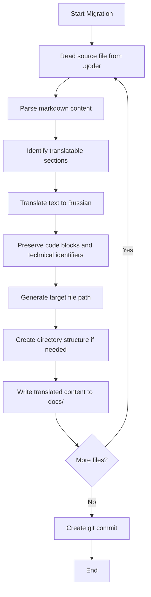

# Documentation Migration Design

## Overview

This design outlines the migration of project documentation from the internal `.qoder/repowiki/en/content/` directory to a user-facing `docs/` directory in the repository root, with translation from English to Russian.

## Objectives

- Relocate comprehensive project documentation to make it accessible to repository users
- Translate all documentation content from English to Russian
- Preserve the existing documentation structure and hierarchy
- Commit the changes with appropriate version control metadata

## Scope

### In Scope

- Migration of all markdown files from `.qoder/repowiki/en/content/` to `docs/`
- Translation of documentation content to Russian language
- Preservation of markdown formatting, structure, and code examples
- Creation of git commit with descriptive message

### Out of Scope

- Modification of documentation content beyond translation
- Migration of metadata files (repowiki-metadata.json)
- Migration of quest files from `.qoder/quests/`
- Updates to code references or links in other parts of the repository

## Current Documentation Structure

The documentation is currently organized in the following hierarchy:

```
.qoder/repowiki/en/content/
├── API Reference/
│   ├── API Reference.md
│   ├── Health Check Endpoint.md
│   ├── PDF Upload Endpoint.md
│   └── Text Processing Endpoint.md
├── Backend Architecture/
│   ├── API Endpoints.md
│   ├── Backend Architecture.md
│   ├── Error Handling Strategy.md
│   └── Model Processing/
│       ├── Model Client Implementation.md
│       ├── Model Processing.md
│       └── PDF Processing Module.md
├── Data Processing Pipeline/
│   ├── AI Model Abstraction Layer.md
│   ├── Data Processing Pipeline.md
│   ├── PDF Processing.md
│   └── Quiz Generation Pipeline.md
├── Frontend Architecture/
│   ├── API Integration.md
│   ├── Component Hierarchy.md
│   ├── Frontend Architecture.md
│   ├── State Management.md
│   └── UI Components/
│       ├── PDFUploader Component.md
│       ├── QuizCard Component.md
│       ├── QuizContainer Component.md
│       └── UI Components.md
├── Configuration Management.md
├── Contributing Guide.md
├── Deployment Workflow.md
├── Getting Started.md
├── System Overview.md
├── Technology Stack.md
├── Testing Strategy.md
└── Troubleshooting Guide.md
```

Total files to migrate: 30 markdown documents

## Target Documentation Structure

The documentation will be reorganized in the `docs/` directory with Russian naming:

```
docs/
├── api-reference/
│   ├── api-reference.md
│   ├── health-check-endpoint.md
│   ├── pdf-upload-endpoint.md
│   └── text-processing-endpoint.md
├── backend-architecture/
│   ├── api-endpoints.md
│   ├── backend-architecture.md
│   ├── error-handling-strategy.md
│   └── model-processing/
│       ├── model-client-implementation.md
│       ├── model-processing.md
│       └── pdf-processing-module.md
├── data-processing-pipeline/
│   ├── ai-model-abstraction-layer.md
│   ├── data-processing-pipeline.md
│   ├── pdf-processing.md
│   └── quiz-generation-pipeline.md
├── frontend-architecture/
│   ├── api-integration.md
│   ├── component-hierarchy.md
│   ├── frontend-architecture.md
│   ├── state-management.md
│   └── ui-components/
│       ├── pdfuploader-component.md
│       ├── quizcard-component.md
│       ├── quizcontainer-component.md
│       └── ui-components.md
├── configuration-management.md
├── contributing-guide.md
├── deployment-workflow.md
├── getting-started.md
├── system-overview.md
├── technology-stack.md
├── testing-strategy.md
└── troubleshooting-guide.md
```

## Migration Strategy

### Directory Structure Transformation

| Aspect | Approach |
|--------|----------|
| Directory names | Convert from Title Case with spaces to lowercase-with-hyphens |
| File names | Convert from Title Case with spaces to lowercase-with-hyphens |
| Hierarchy preservation | Maintain the same nesting levels and organizational structure |
| Character encoding | Use UTF-8 to support Cyrillic characters |

### Translation Approach

| Element | Translation Strategy |
|---------|---------------------|
| Headings | Translate to Russian, preserve markdown level |
| Body text | Full translation maintaining technical accuracy |
| Code blocks | Keep unchanged (code is language-agnostic) |
| Code comments | Translate if present |
| Technical terms | Use established Russian technical terminology where available |
| File paths | Keep unchanged (system paths remain in English) |
| Command examples | Keep unchanged (commands are syntax-specific) |
| API endpoints | Keep unchanged (URLs and endpoints are standardized) |
| Variable names | Keep unchanged (code identifiers remain in English) |
| Environment variables | Keep unchanged (standardized names) |
| Package names | Keep unchanged (ecosystem-specific identifiers) |

### Translation Quality Standards

- Maintain technical precision and accuracy
- Use consistent terminology across all documents
- Preserve markdown formatting and structure
- Keep code examples and technical identifiers unchanged
- Ensure proper Russian grammar and style
- Maintain professional documentation tone

### File Processing Workflow



## Git Commit Strategy

### Commit Message Structure

The commit should follow conventional commit format:

**Type**: `docs`

**Scope**: `migration`

**Subject**: Brief description in Russian

**Body**: Detailed description including:
- Source and destination paths
- Number of files migrated
- Translation language
- Structural changes if any

### Example Commit Message

```
docs(migration): переносить документацию в docs/ с переводом на русский

- Перенесено 30 файлов документации из .qoder/repowiki/en/content/ в docs/
- Выполнен полный перевод с английского на русский язык
- Сохранена иерархическая структура документации
- Названия директорий и файлов преобразованы в lowercase-with-hyphens
```

## File Naming Conventions

| Original Format | Target Format | Example |
|----------------|---------------|---------|
| Title Case with spaces | lowercase-with-hyphens | "System Overview.md" → "system-overview.md" |
| Spaces in directories | Hyphens in directories | "API Reference/" → "api-reference/" |
| Component names | Preserved but lowercase | "PDFUploader Component.md" → "pdfuploader-component.md" |

## Dependencies and Prerequisites

- Git repository must be initialized (already exists)
- Write permissions to repository root
- UTF-8 encoding support for Russian text
- Translation capability for English to Russian

## Risk Assessment

| Risk | Impact | Mitigation |
|------|--------|------------|
| Translation accuracy loss | Medium | Use consistent technical terminology dictionary |
| Markdown formatting breaks | Low | Preserve original structure, validate rendering |
| Code example corruption | Medium | Keep all code blocks unchanged |
| Directory name conflicts | Low | Use systematic lowercase-hyphen conversion |
| Commit message clarity | Low | Follow conventional commit format |
| Large commit size | Low | Single atomic commit is appropriate for documentation migration |

## Success Criteria

- All 30 markdown files successfully migrated to `docs/` directory
- Complete translation to Russian language
- Directory structure properly recreated in target location
- Markdown formatting preserved and validated
- Code examples remain unchanged and functional
- Git commit created with descriptive message
- Documentation accessible and readable in new location

## Post-Migration Considerations

### Potential Follow-up Actions

- Update README.md to reference new documentation location
- Add documentation index or table of contents in docs/README.md
- Configure documentation rendering (e.g., GitHub Pages, MkDocs)
- Update internal links between documentation files if needed
- Consider adding .qoder to .gitignore if not already present

### Documentation Maintenance

After migration, the `docs/` directory becomes the single source of truth for project documentation. The original `.qoder/repowiki/` directory can remain for internal tooling purposes but should not be manually edited for documentation updates.

## Technical Constraints

- Must maintain valid markdown syntax
- File names must be valid across different operating systems (Windows, macOS, Linux)
- Total documentation size approximately 350KB (estimated from current files)
- No binary files involved in migration
- All content is text-based markdown│       └── UI Components.md
├── Configuration Management.md
├── Contributing Guide.md
├── Deployment Workflow.md
├── Getting Started.md
├── System Overview.md
├── Technology Stack.md
├── Testing Strategy.md
└── Troubleshooting Guide.md
```

Total files to migrate: 30 markdown documents

## Target Documentation Structure

The documentation will be reorganized in the `docs/` directory with Russian naming:

```
docs/
├── api-reference/
│   ├── api-reference.md
│   ├── health-check-endpoint.md
│   ├── pdf-upload-endpoint.md
│   └── text-processing-endpoint.md
├── backend-architecture/
│   ├── api-endpoints.md
│   ├── backend-architecture.md
│   ├── error-handling-strategy.md
│   └── model-processing/
│       ├── model-client-implementation.md
│       ├── model-processing.md
│       └── pdf-processing-module.md
├── data-processing-pipeline/
│   ├── ai-model-abstraction-layer.md
│   ├── data-processing-pipeline.md
│   ├── pdf-processing.md
│   └── quiz-generation-pipeline.md
├── frontend-architecture/
│   ├── api-integration.md
│   ├── component-hierarchy.md
│   ├── frontend-architecture.md
│   ├── state-management.md
│   └── ui-components/
│       ├── pdfuploader-component.md
│       ├── quizcard-component.md
│       ├── quizcontainer-component.md
│       └── ui-components.md
├── configuration-management.md
├── contributing-guide.md
├── deployment-workflow.md
├── getting-started.md
├── system-overview.md
├── technology-stack.md
├── testing-strategy.md
└── troubleshooting-guide.md
```

## Migration Strategy

### Directory Structure Transformation

| Aspect | Approach |
|--------|----------|
| Directory names | Convert from Title Case with spaces to lowercase-with-hyphens |
| File names | Convert from Title Case with spaces to lowercase-with-hyphens |
| Hierarchy preservation | Maintain the same nesting levels and organizational structure |
| Character encoding | Use UTF-8 to support Cyrillic characters |

### Translation Approach

| Element | Translation Strategy |
|---------|---------------------|
| Headings | Translate to Russian, preserve markdown level |
| Body text | Full translation maintaining technical accuracy |
| Code blocks | Keep unchanged (code is language-agnostic) |
| Code comments | Translate if present |
| Technical terms | Use established Russian technical terminology where available |
| File paths | Keep unchanged (system paths remain in English) |
| Command examples | Keep unchanged (commands are syntax-specific) |
| API endpoints | Keep unchanged (URLs and endpoints are standardized) |
| Variable names | Keep unchanged (code identifiers remain in English) |
| Environment variables | Keep unchanged (standardized names) |
| Package names | Keep unchanged (ecosystem-specific identifiers) |

### Translation Quality Standards

- Maintain technical precision and accuracy
- Use consistent terminology across all documents
- Preserve markdown formatting and structure
- Keep code examples and technical identifiers unchanged
- Ensure proper Russian grammar and style
- Maintain professional documentation tone

### File Processing Workflow


## Git Commit Strategy

### Commit Message Structure

The commit should follow conventional commit format:

**Type**: `docs`

**Scope**: `migration`

**Subject**: Brief description in Russian

**Body**: Detailed description including:
- Source and destination paths
- Number of files migrated
- Translation language
- Structural changes if any

### Example Commit Message

```
docs(migration): переносить документацию в docs/ с переводом на русский

- Перенесено 30 файлов документации из .qoder/repowiki/en/content/ в docs/
- Выполнен полный перевод с английского на русский язык
- Сохранена иерархическая структура документации
- Названия директорий и файлов преобразованы в lowercase-with-hyphens
```

## File Naming Conventions

| Original Format | Target Format | Example |
|----------------|---------------|---------|
| Title Case with spaces | lowercase-with-hyphens | "System Overview.md" → "system-overview.md" |
| Spaces in directories | Hyphens in directories | "API Reference/" → "api-reference/" |
| Component names | Preserved but lowercase | "PDFUploader Component.md" → "pdfuploader-component.md" |

## Dependencies and Prerequisites

- Git repository must be initialized (already exists)
- Write permissions to repository root
- UTF-8 encoding support for Russian text
- Translation capability for English to Russian

## Risk Assessment

| Risk | Impact | Mitigation |
|------|--------|------------|
| Translation accuracy loss | Medium | Use consistent technical terminology dictionary |
| Markdown formatting breaks | Low | Preserve original structure, validate rendering |
| Code example corruption | Medium | Keep all code blocks unchanged |
| Directory name conflicts | Low | Use systematic lowercase-hyphen conversion |
| Commit message clarity | Low | Follow conventional commit format |
| Large commit size | Low | Single atomic commit is appropriate for documentation migration |

## Success Criteria

- All 30 markdown files successfully migrated to `docs/` directory
- Complete translation to Russian language
- Directory structure properly recreated in target location
- Markdown formatting preserved and validated
- Code examples remain unchanged and functional
- Git commit created with descriptive message
- Documentation accessible and readable in new location

## Post-Migration Considerations

### Potential Follow-up Actions

- Update README.md to reference new documentation location
- Add documentation index or table of contents in docs/README.md
- Configure documentation rendering (e.g., GitHub Pages, MkDocs)
- Update internal links between documentation files if needed
- Consider adding .qoder to .gitignore if not already present

### Documentation Maintenance

After migration, the `docs/` directory becomes the single source of truth for project documentation. The original `.qoder/repowiki/` directory can remain for internal tooling purposes but should not be manually edited for documentation updates.

## Technical Constraints

- Must maintain valid markdown syntax
- File names must be valid across different operating systems (Windows, macOS, Linux)
- Total documentation size approximately 350KB (estimated from current files)
- No binary files involved in migration
- All content is text-based markdown├── Configuration Management.md
├── Contributing Guide.md
├── Deployment Workflow.md
├── Getting Started.md
├── System Overview.md
├── Technology Stack.md
├── Testing Strategy.md
└── Troubleshooting Guide.md
```

Total files to migrate: 30 markdown documents

## Target Documentation Structure

The documentation will be reorganized in the `docs/` directory with Russian naming:

```
docs/
├── api-reference/
│   ├── api-reference.md
│   ├── health-check-endpoint.md
│   ├── pdf-upload-endpoint.md
│   └── text-processing-endpoint.md
├── backend-architecture/
│   ├── api-endpoints.md
│   ├── backend-architecture.md
│   ├── error-handling-strategy.md
│   └── model-processing/
│       ├── model-client-implementation.md
│       ├── model-processing.md
│       └── pdf-processing-module.md
├── data-processing-pipeline/
│   ├── ai-model-abstraction-layer.md
│   ├── data-processing-pipeline.md
│   ├── pdf-processing.md
│   └── quiz-generation-pipeline.md
├── frontend-architecture/
│   ├── api-integration.md
│   ├── component-hierarchy.md
│   ├── frontend-architecture.md
│   ├── state-management.md
│   └── ui-components/
│       ├── pdfuploader-component.md
│       ├── quizcard-component.md
│       ├── quizcontainer-component.md
│       └── ui-components.md
├── configuration-management.md
├── contributing-guide.md
├── deployment-workflow.md
├── getting-started.md
├── system-overview.md
├── technology-stack.md
├── testing-strategy.md
└── troubleshooting-guide.md
```

## Migration Strategy

### Directory Structure Transformation

| Aspect | Approach |
|--------|----------|
| Directory names | Convert from Title Case with spaces to lowercase-with-hyphens |
| File names | Convert from Title Case with spaces to lowercase-with-hyphens |
| Hierarchy preservation | Maintain the same nesting levels and organizational structure |
| Character encoding | Use UTF-8 to support Cyrillic characters |

### Translation Approach

| Element | Translation Strategy |
|---------|---------------------|
| Headings | Translate to Russian, preserve markdown level |
| Body text | Full translation maintaining technical accuracy |
| Code blocks | Keep unchanged (code is language-agnostic) |
| Code comments | Translate if present |
| Technical terms | Use established Russian technical terminology where available |
| File paths | Keep unchanged (system paths remain in English) |
| Command examples | Keep unchanged (commands are syntax-specific) |
| API endpoints | Keep unchanged (URLs and endpoints are standardized) |
| Variable names | Keep unchanged (code identifiers remain in English) |
| Environment variables | Keep unchanged (standardized names) |
| Package names | Keep unchanged (ecosystem-specific identifiers) |

### Translation Quality Standards

- Maintain technical precision and accuracy
- Use consistent terminology across all documents
- Preserve markdown formatting and structure
- Keep code examples and technical identifiers unchanged
- Ensure proper Russian grammar and style
- Maintain professional documentation tone

### File Processing Workflow


## Git Commit Strategy

### Commit Message Structure

The commit should follow conventional commit format:

**Type**: `docs`

**Scope**: `migration`

**Subject**: Brief description in Russian

**Body**: Detailed description including:
- Source and destination paths
- Number of files migrated
- Translation language
- Structural changes if any

### Example Commit Message

```
docs(migration): переносить документацию в docs/ с переводом на русский

- Перенесено 30 файлов документации из .qoder/repowiki/en/content/ в docs/
- Выполнен полный перевод с английского на русский язык
- Сохранена иерархическая структура документации
- Названия директорий и файлов преобразованы в lowercase-with-hyphens
```

## File Naming Conventions

| Original Format | Target Format | Example |
|----------------|---------------|---------|
| Title Case with spaces | lowercase-with-hyphens | "System Overview.md" → "system-overview.md" |
| Spaces in directories | Hyphens in directories | "API Reference/" → "api-reference/" |
| Component names | Preserved but lowercase | "PDFUploader Component.md" → "pdfuploader-component.md" |

## Dependencies and Prerequisites

- Git repository must be initialized (already exists)
- Write permissions to repository root
- UTF-8 encoding support for Russian text
- Translation capability for English to Russian

## Risk Assessment

| Risk | Impact | Mitigation |
|------|--------|------------|
| Translation accuracy loss | Medium | Use consistent technical terminology dictionary |
| Markdown formatting breaks | Low | Preserve original structure, validate rendering |
| Code example corruption | Medium | Keep all code blocks unchanged |
| Directory name conflicts | Low | Use systematic lowercase-hyphen conversion |
| Commit message clarity | Low | Follow conventional commit format |
| Large commit size | Low | Single atomic commit is appropriate for documentation migration |

## Success Criteria

- All 30 markdown files successfully migrated to `docs/` directory
- Complete translation to Russian language
- Directory structure properly recreated in target location
- Markdown formatting preserved and validated
- Code examples remain unchanged and functional
- Git commit created with descriptive message
- Documentation accessible and readable in new location

## Post-Migration Considerations

### Potential Follow-up Actions

- Update README.md to reference new documentation location
- Add documentation index or table of contents in docs/README.md
- Configure documentation rendering (e.g., GitHub Pages, MkDocs)
- Update internal links between documentation files if needed
- Consider adding .qoder to .gitignore if not already present

### Documentation Maintenance

After migration, the `docs/` directory becomes the single source of truth for project documentation. The original `.qoder/repowiki/` directory can remain for internal tooling purposes but should not be manually edited for documentation updates.

## Technical Constraints

- Must maintain valid markdown syntax
- File names must be valid across different operating systems (Windows, macOS, Linux)
- Total documentation size approximately 350KB (estimated from current files)
- No binary files involved in migration
