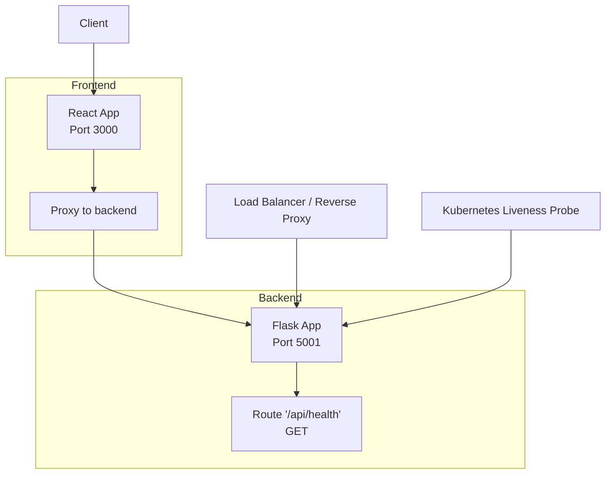
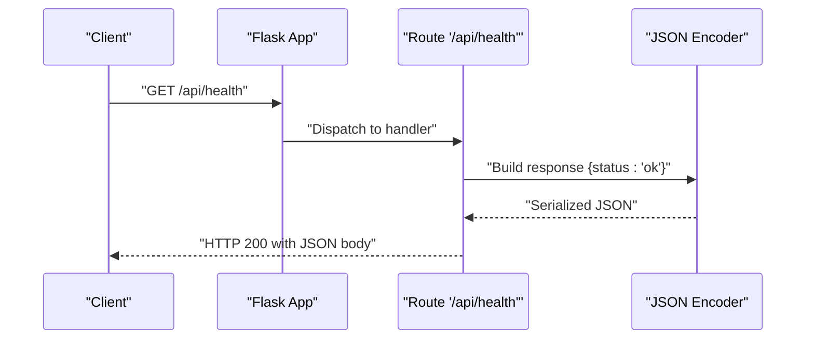
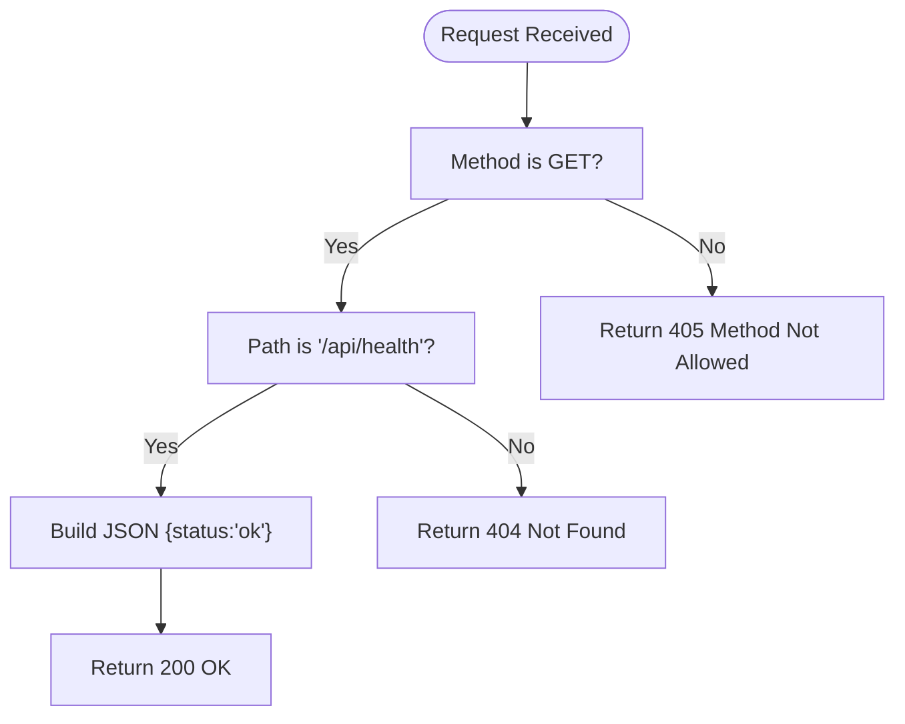
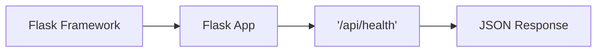

# Health Check Endpoint

<cite>
**Referenced Files in This Document**
- [app.py](file://backend/app.py)
- [README.md](file://README.md)
- [start.sh](file://start.sh)
</cite>

## Table of Contents
1. [Introduction](#introduction)
2. [Project Structure](#project-structure)
3. [Core Components](#core-components)
4. [Architecture Overview](#architecture-overview)
5. [Detailed Component Analysis](#detailed-component-analysis)
6. [Dependency Analysis](#dependency-analysis)
7. [Performance Considerations](#performance-considerations)
8. [Troubleshooting Guide](#troubleshooting-guide)
9. [Conclusion](#conclusion)

## Introduction
This document provides API documentation for the GET /api/health endpoint in the Quiz Generator application. The endpoint serves as a lightweight service availability check that returns a simple status response. It is designed to be used by system monitoring tools, load balancers, and container orchestration platforms (such as Kubernetes) to quickly verify that the backend service is reachable and responding.

Key facts:
- HTTP method: GET
- URL pattern: /api/health
- Response schema: JSON object containing a status field
- Authentication: Not required
- Request parameters: Not accepted

## Project Structure
The health endpoint is implemented in the backend Flask application. The backend runs on port 5001 and is started by the provided startup script. The frontend runs on port 3000 and proxies requests to the backend.

**Diagram sources**
- [start.sh](file://start.sh#L166-L189)
- [app.py](file://backend/app.py#L53-L57)

**Section sources**
- [start.sh](file://start.sh#L166-L189)
- [README.md](file://README.md#L59-L60)

## Core Components
- Endpoint definition: The GET /api/health route is defined in the backend application and returns a JSON object with a status field.
- Response format: The response is a simple JSON object with a single status property set to a success indicator.
- No authentication: The endpoint does not require any authentication or authorization.
- No request parameters: The endpoint does not accept any query parameters or body content.

Example cURL command:
- curl -s http://localhost:5001/api/health

Expected JSON response:
- {"status":"ok"}

How to use in deployments:
- Load balancer health checks: Configure the load balancer to probe this endpoint periodically. A successful HTTP 200 response indicates the service is healthy.
- Kubernetes liveness probes: Configure a liveness probe to call this endpoint. A 200 response signals that the pod is ready to receive traffic.
- Monitoring dashboards: Use the endpoint to populate uptime and availability metrics.

**Section sources**
- [app.py](file://backend/app.py#L53-L57)

## Architecture Overview
The health endpoint participates in the overall request flow of the backend. While it does not depend on external services, it still exercises the web server’s ability to handle HTTP requests and serialize JSON responses.

**Diagram sources**
- [app.py](file://backend/app.py#L53-L57)

## Detailed Component Analysis
### Endpoint Definition and Behavior
- Route registration: The endpoint is registered as a GET route at /api/health.
- Handler logic: The handler returns a JSON object with a status field. The handler does not perform any additional checks (e.g., database connectivity or external service health).
- Response semantics: A 200 OK response with the JSON payload indicates that the service is up and able to process requests.

**Diagram sources**
- [app.py](file://backend/app.py#L53-L57)

**Section sources**
- [app.py](file://backend/app.py#L53-L57)

### Example Usage Scenarios
- Local development: curl -s http://localhost:5001/api/health
- Containerized environments: Configure a health check against the backend container’s port 5001.
- Kubernetes: Use the endpoint in a readiness/liveness probe to ensure traffic is only sent to healthy pods.

**Section sources**
- [README.md](file://README.md#L59-L60)
- [start.sh](file://start.sh#L166-L189)

## Dependency Analysis
The health endpoint has minimal dependencies:
- It relies on the Flask framework for routing and response serialization.
- It does not depend on external services, environment variables, or model clients.

**Diagram sources**
- [app.py](file://backend/app.py#L53-L57)

**Section sources**
- [app.py](file://backend/app.py#L53-L57)

## Performance Considerations
- The endpoint performs no heavy computation or I/O operations. It is designed to be extremely fast and lightweight.
- Typical latency is low because it only serializes a small JSON object.
- Because it does not hit external services, it is unaffected by network latency or rate limits.

[No sources needed since this section provides general guidance]

## Troubleshooting Guide
Common issues and resolutions:
- Service not running: Ensure the backend is started and listening on port 5001. The provided startup script demonstrates how to launch the backend.
- Wrong host/port: Verify the target host and port match the backend configuration.
- Network/firewall: Confirm that the port is open and accessible from the client.
- Load balancer misconfiguration: Ensure the health check path is /api/health and the HTTP method is GET.

Operational verification steps:
- From the host machine, run: curl -s http://localhost:5001/api/health
- Expected output: {"status":"ok"}
- If you receive an error, confirm the backend is running and reachable.

**Section sources**
- [start.sh](file://start.sh#L166-L189)
- [app.py](file://backend/app.py#L53-L57)

## Conclusion
The GET /api/health endpoint provides a simple, reliable mechanism to verify service availability. It is suitable for use in load balancer health checks and Kubernetes probes. Its minimal overhead ensures it does not impact overall system performance while providing essential operational visibility.

[No sources needed since this section summarizes without analyzing specific files]