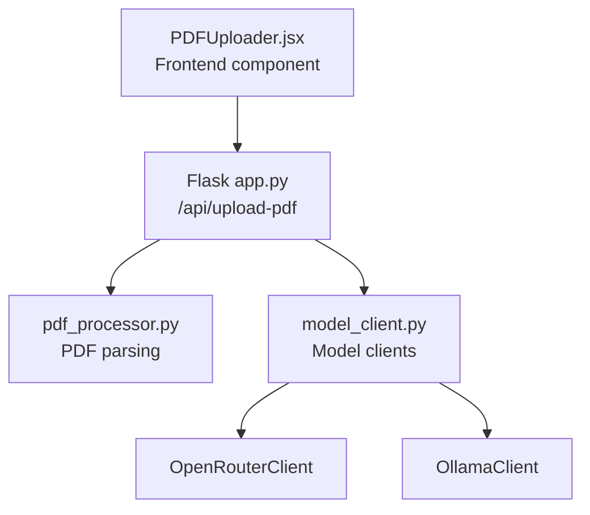
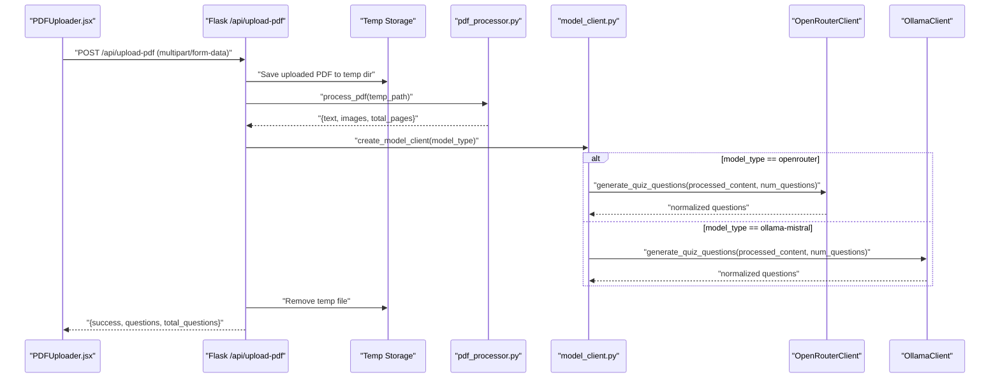
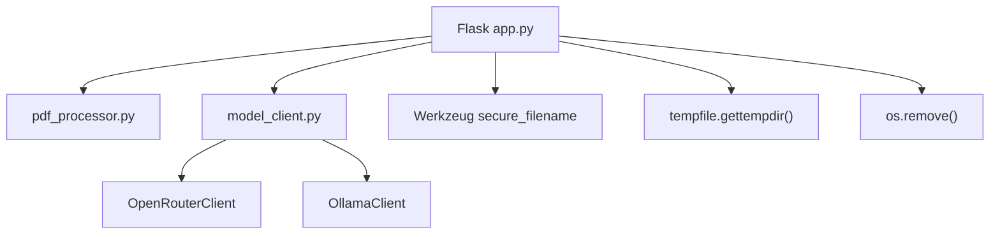

# PDF Upload Endpoint

<cite>
**Referenced Files in This Document**
- [app.py](file://backend/app.py)
- [pdf_processor.py](file://backend/pdf_processor.py)
- [model_client.py](file://backend/model_client.py)
- [PDFUploader.jsx](file://frontend/src/components/PDFUploader.jsx)
- [README.md](file://README.md)
- [requirements.txt](file://backend/requirements.txt)
- [.env.example](file://backend/.env.example)
</cite>

## Table of Contents
1. [Introduction](#introduction)
2. [Project Structure](#project-structure)
3. [Core Components](#core-components)
4. [Architecture Overview](#architecture-overview)
5. [Detailed Component Analysis](#detailed-component-analysis)
6. [Dependency Analysis](#dependency-analysis)
7. [Performance Considerations](#performance-considerations)
8. [Troubleshooting Guide](#troubleshooting-guide)
9. [Conclusion](#conclusion)
10. [Appendices](#appendices)

## Introduction
This document provides detailed API documentation for the POST /api/upload-pdf endpoint in the Quiz Generator application. It covers the HTTP method, URL pattern, request format, response schema, error handling, and client-side usage via the frontend PDFUploader component. It also addresses file size limits, temporary file storage, cleanup mechanisms, and troubleshooting guidance.

## Project Structure
The API endpoint is implemented in the backend Flask application and integrates with PDF processing and model clients. The frontend component uploads files using multipart/form-data and handles responses and errors.

**Diagram sources**
- [PDFUploader.jsx](file://frontend/src/components/PDFUploader.jsx#L70-L110)
- [app.py](file://backend/app.py#L59-L118)
- [pdf_processor.py](file://backend/pdf_processor.py#L64-L77)
- [model_client.py](file://backend/model_client.py#L263-L272)

**Section sources**
- [app.py](file://backend/app.py#L1-L176)
- [PDFUploader.jsx](file://frontend/src/components/PDFUploader.jsx#L1-L323)

## Core Components
- Backend Flask route: Handles multipart/form-data upload, validates inputs, saves a temporary file, processes PDF, generates quiz questions, and returns structured JSON.
- PDF processor: Extracts text and images from the uploaded PDF and returns a unified content object.
- Model clients: OpenRouterClient and OllamaClient generate quiz questions from the processed PDF content.

Key behaviors:
- Request validation: checks for presence of file, empty filename, allowed extension, and numeric range for questions.
- Temporary file handling: saves uploaded PDF to the OS temp directory and removes it after processing or on error.
- Response normalization: ensures consistent question schema with id, question, type, options, and correct_answer.

**Section sources**
- [app.py](file://backend/app.py#L59-L118)
- [pdf_processor.py](file://backend/pdf_processor.py#L64-L77)
- [model_client.py](file://backend/model_client.py#L13-L36)

## Architecture Overview
The upload flow involves the frontend sending a multipart/form-data request, the backend validating and saving the file, extracting content, delegating to a model client, and returning normalized questions.

**Diagram sources**
- [PDFUploader.jsx](file://frontend/src/components/PDFUploader.jsx#L70-L110)
- [app.py](file://backend/app.py#L59-L118)
- [pdf_processor.py](file://backend/pdf_processor.py#L64-L77)
- [model_client.py](file://backend/model_client.py#L263-L272)

## Detailed Component Analysis

### API Endpoint Definition
- Method: POST
- URL: /api/upload-pdf
- Content-Type: multipart/form-data
- Required form fields:
  - file: PDF document
  - num_questions: integer, range 1–20
  - model_type: string, allowed values "openrouter" or "ollama-mistral"

Validation and behavior:
- Missing file or empty filename returns 400 with an error message.
- Non-PDF files are rejected with 400.
- num_questions < 1 or > 20 triggers 400.
- Unknown model_type triggers 400.
- Empty or unprocessable PDF returns 400.
- Processing exceptions return 500.

Response schema:
- success: boolean
- questions: array of objects with fields:
  - id: integer
  - question: string
  - type: string (e.g., "multiple_choice")
  - options: array of strings
  - correct_answer: integer (index of correct option)
- total_questions: integer

Error responses:
- 400: validation or processing errors (e.g., missing file, invalid type, invalid num_questions, empty PDF)
- 500: internal processing failures

Example cURL command:
- curl -X POST "http://localhost:5001/api/upload-pdf" -F "file=@/path/to/document.pdf" -F "num_questions=10" -F "model_type=openrouter"

Notes:
- Replace localhost:5001 with your backend host/port.
- Ensure the file path points to a valid PDF.

**Section sources**
- [app.py](file://backend/app.py#L59-L118)
- [README.md](file://README.md#L150-L157)

### Frontend Integration (PDFUploader.jsx)
- Uses Axios to submit multipart/form-data to /api/upload-pdf.
- Builds FormData with keys: file, num_questions, model_type.
- Sets Content-Type header to multipart/form-data.
- Handles success and error responses:
  - On success: invokes onQuizGenerated with the server response.
  - On error: invokes onError with either response error or error message.
- Disables submission while loading and shows a loading indicator.

Progress and error handling:
- No explicit upload progress tracking is implemented in the frontend for this endpoint.
- Error handling catches network errors and server-provided error messages.

**Section sources**
- [PDFUploader.jsx](file://frontend/src/components/PDFUploader.jsx#L70-L110)

### PDF Processing Pipeline
- Extracts text from all pages with optional page markers.
- Converts PDF pages to images (PNG) and encodes them to base64.
- Returns a content object with:
  - text: combined text
  - images: array of {page, base64, format}
  - total_pages: integer count

Behavior:
- Raises exceptions on extraction errors, which propagate to the API handler.

**Section sources**
- [pdf_processor.py](file://backend/pdf_processor.py#L64-L77)

### Model Client Generation
- Normalizes questions to a consistent schema and converts letter-based correct answers to indices.
- OpenRouterClient:
  - Requires OPENROUTER_API_KEY.
  - Sends system prompt and user content (limited text and images).
  - Parses JSON from model response and validates structure.
- OllamaClient:
  - Validates local Ollama availability and model presence.
  - Sends prompt to local API with streaming disabled.
  - Parses JSON response and validates structure.

Constraints and limits:
- OpenRouter: up to ~4000 characters of text and up to 2 images.
- Mistral 7B: up to ~8000 characters of text.

**Section sources**
- [model_client.py](file://backend/model_client.py#L13-L36)
- [model_client.py](file://backend/model_client.py#L62-L152)
- [model_client.py](file://backend/model_client.py#L154-L261)
- [README.md](file://README.md#L150-L157)

## Dependency Analysis
- Backend dependencies include Flask, CORS, pdfplumber, pdf2image, OpenAI SDK, httpx, and python-dotenv.
- Environment configuration requires OPENROUTER_API_KEY for cloud models.

**Diagram sources**
- [app.py](file://backend/app.py#L1-L176)
- [pdf_processor.py](file://backend/pdf_processor.py#L1-L77)
- [model_client.py](file://backend/model_client.py#L1-L272)
- [requirements.txt](file://backend/requirements.txt#L1-L9)

**Section sources**
- [requirements.txt](file://backend/requirements.txt#L1-L9)
- [.env.example](file://backend/.env.example#L1-L5)

## Performance Considerations
- Large PDFs increase processing time and memory usage. The backend enforces a 50 MB file size limit.
- OpenRouterClient sends limited text and images to reduce token usage.
- OllamaClient increases timeouts and token limits for local generation.
- Network latency and model response times affect overall throughput.

[No sources needed since this section provides general guidance]

## Troubleshooting Guide
Common issues and resolutions:
- File type errors:
  - Cause: Non-PDF file uploaded.
  - Resolution: Ensure the file has a .pdf extension and MIME type application/pdf.
- Large file handling:
  - Cause: File exceeds 50 MB.
  - Resolution: Split the document or compress images before upload.
- Timeout scenarios:
  - Cause: Local Ollama slow response or long PDF processing.
  - Resolution: Reduce num_questions, ensure Ollama service is running, or switch to OpenRouter.
- Empty or unreadable PDF:
  - Cause: Scanned-only PDF or corrupted file.
  - Resolution: Provide a searchable PDF with text selectable by OCR tools.
- Model configuration:
  - OpenRouter: Ensure OPENROUTER_API_KEY is set in backend/.env.
  - Ollama: Confirm Ollama is running locally and the model is pulled.

**Section sources**
- [app.py](file://backend/app.py#L12-L19)
- [app.py](file://backend/app.py#L72-L74)
- [app.py](file://backend/app.py#L93-L94)
- [model_client.py](file://backend/model_client.py#L62-L75)
- [model_client.py](file://backend/model_client.py#L154-L179)
- [.env.example](file://backend/.env.example#L1-L5)

## Conclusion
The POST /api/upload-pdf endpoint provides a robust pipeline for converting PDF documents into quiz questions using either cloud or local AI models. The frontend component streamlines the upload experience, while the backend enforces validations, manages temporary files, and returns normalized results. Following the documented constraints and troubleshooting steps will improve reliability and user experience.

[No sources needed since this section summarizes without analyzing specific files]

## Appendices

### API Reference Summary
- Endpoint: POST /api/upload-pdf
- Content-Type: multipart/form-data
- Form fields:
  - file (required): PDF document
  - num_questions (required): integer 1–20
  - model_type (required): "openrouter" or "ollama-mistral"
- Success response: { success: boolean, questions: [...], total_questions: number }
- Error responses:
  - 400: validation or processing errors
  - 500: internal processing failures

**Section sources**
- [app.py](file://backend/app.py#L59-L118)
- [README.md](file://README.md#L150-L157)