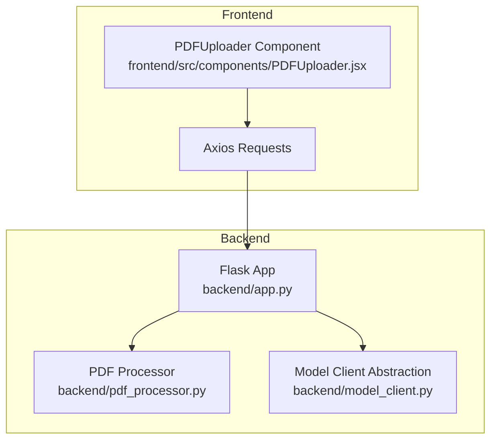
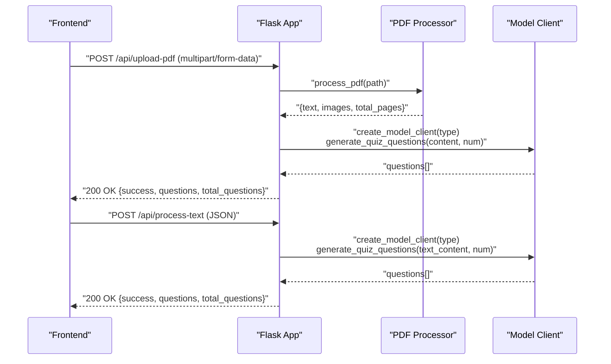
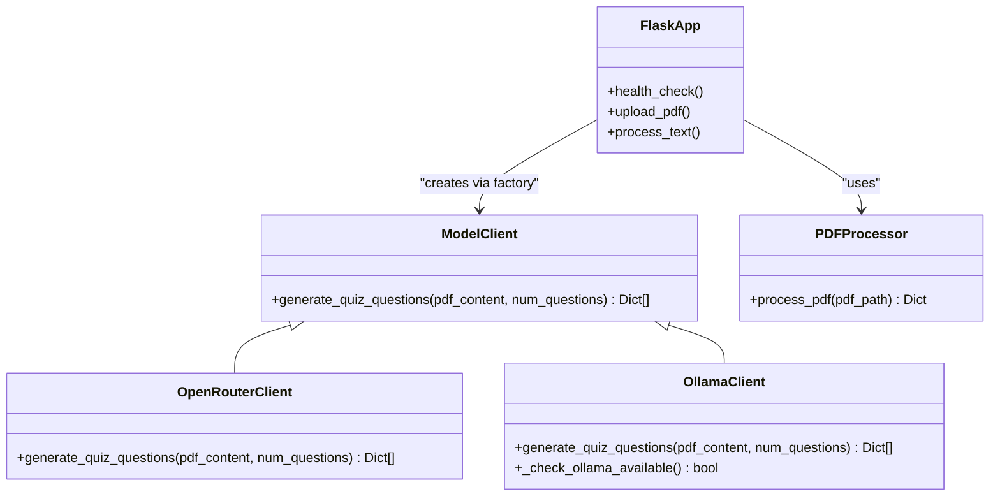
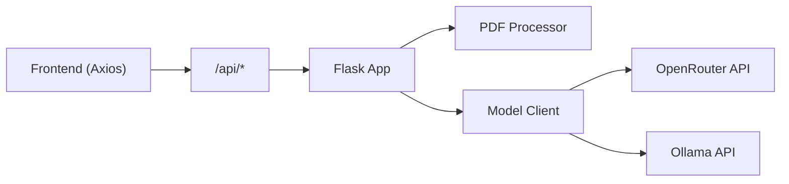

# API Endpoints

<cite>
**Referenced Files in This Document**
- [backend/app.py](file://backend/app.py)
- [backend/pdf_processor.py](file://backend/pdf_processor.py)
- [backend/model_client.py](file://backend/model_client.py)
- [backend/.env.example](file://backend/.env.example)
- [frontend/src/components/PDFUploader.jsx](file://frontend/src/components/PDFUploader.jsx)
- [frontend/package.json](file://frontend/package.json)
- [README.md](file://README.md)
</cite>

## Table of Contents
1. [Introduction](#introduction)
2. [Project Structure](#project-structure)
3. [Core Components](#core-components)
4. [Architecture Overview](#architecture-overview)
5. [Detailed Component Analysis](#detailed-component-analysis)
6. [Dependency Analysis](#dependency-analysis)
7. [Performance Considerations](#performance-considerations)
8. [Troubleshooting Guide](#troubleshooting-guide)
9. [Conclusion](#conclusion)

## Introduction
This document provides API documentation for the Quiz Generator backend. It covers three public endpoints:
- Health check
- PDF upload and quiz generation
- Text-based quiz generation

It specifies HTTP methods, URL patterns, request parameters (form data and JSON payloads), response schemas for success and error cases, authentication requirements, validation rules, error handling strategies, and practical guidance for frontend invocation.

## Project Structure
The backend is a Flask application that exposes REST endpoints. It integrates with:
- PDF processing utilities for extracting text and images
- A model client abstraction supporting two providers: OpenRouter and Ollama
- Frontend components that call these endpoints via Axios

**Diagram sources**
- [backend/app.py](file://backend/app.py#L53-L164)
- [backend/pdf_processor.py](file://backend/pdf_processor.py#L64-L77)
- [backend/model_client.py](file://backend/model_client.py#L263-L272)
- [frontend/src/components/PDFUploader.jsx](file://frontend/src/components/PDFUploader.jsx#L50-L110)

**Section sources**
- [backend/app.py](file://backend/app.py#L53-L164)
- [backend/pdf_processor.py](file://backend/pdf_processor.py#L64-L77)
- [backend/model_client.py](file://backend/model_client.py#L263-L272)
- [frontend/src/components/PDFUploader.jsx](file://frontend/src/components/PDFUploader.jsx#L50-L110)

## Core Components
- Flask application with CORS enabled
- PDF processing utilities for text extraction and image conversion
- Model client abstraction with OpenRouter and Ollama implementations
- Frontend Axios-based HTTP calls

Key behaviors:
- Health endpoint returns a simple status payload
- PDF endpoint accepts multipart form data and returns generated questions
- Text endpoint accepts JSON and returns generated questions
- Validation enforces question count bounds and model type selection
- Error responses use standard HTTP status codes with descriptive messages

**Section sources**
- [backend/app.py](file://backend/app.py#L53-L164)
- [backend/pdf_processor.py](file://backend/pdf_processor.py#L64-L77)
- [backend/model_client.py](file://backend/model_client.py#L263-L272)
- [frontend/src/components/PDFUploader.jsx](file://frontend/src/components/PDFUploader.jsx#L50-L110)

## Architecture Overview
The backend routes map to handler functions that orchestrate processing and model generation. The frontend invokes endpoints with appropriate content types and parameters.

**Diagram sources**
- [backend/app.py](file://backend/app.py#L59-L164)
- [backend/pdf_processor.py](file://backend/pdf_processor.py#L64-L77)
- [backend/model_client.py](file://backend/model_client.py#L263-L272)

## Detailed Component Analysis

### Endpoint: GET /api/health
- Method: GET
- URL: /api/health
- Authentication: Not required
- Request body: None
- Response:
  - Success: 200 OK with JSON payload containing a status field indicating operational status
- Notes:
  - Intended for health checks and readiness probes

Typical request:
- GET http://localhost:5001/api/health

Typical response:
- 200 OK
  - {
    - "status": "ok"
    - }

Validation and error handling:
- No validation or error conditions for this endpoint

**Section sources**
- [backend/app.py](file://backend/app.py#L53-L57)

### Endpoint: POST /api/upload-pdf
- Method: POST
- URL: /api/upload-pdf
- Authentication: Not required
- Content-Type: multipart/form-data
- Form fields:
  - file: PDF file (required)
  - num_questions: integer, range 1–20 (optional, default 10)
  - model_type: string, either "openrouter" or "ollama-mistral" (optional, default "openrouter")
- Response:
  - Success: 200 OK with JSON payload
    - {
      - "success": true
      - "questions": [ ...generated questions... ]
      - "total_questions": number
      - }
  - Client error (400): JSON with an error message for:
    - Missing file
    - Empty filename
    - Unsupported file type (only PDF)
    - Empty PDF content (no text/images)
    - Invalid num_questions (less than 1 or greater than 20)
    - Unknown model_type
  - Server error (500): JSON with an error message for internal failures
- Notes:
  - The backend validates num_questions and model_type before invoking the model client
  - The PDF is temporarily stored and removed after processing
  - The PDF processor extracts text and images; empty content triggers a 400 error

Typical request (multipart/form-data):
- POST http://localhost:5001/api/upload-pdf
- Fields:
  - file: [PDF file]
  - num_questions: 10
  - model_type: "openrouter"

Typical success response:
- 200 OK
  - {
    - "success": true
    - "questions": [ ... ]
    - "total_questions": 10
    - }

Typical error responses:
- 400 Bad Request
  - {
    - "error": "Файл не найден в запросе"
    - }
- 400 Bad Request
  - {
    - "error": "PDF документ пуст или не может быть обработан"
    - }
- 500 Internal Server Error
  - {
    - "error": "Ошибка при обработке запроса: ..."
    - }

Validation rules:
- num_questions must be an integer in the range [1, 20]; otherwise raises a validation error
- model_type must be one of ["openrouter", "ollama-mistral"]; otherwise raises a validation error

Error handling:
- Specific validation errors return 400 with a descriptive message
- General exceptions return 500 with a generic error message

**Section sources**
- [backend/app.py](file://backend/app.py#L59-L118)
- [backend/pdf_processor.py](file://backend/pdf_processor.py#L64-L77)
- [backend/model_client.py](file://backend/model_client.py#L263-L272)

### Endpoint: POST /api/process-text
- Method: POST
- URL: /api/process-text
- Authentication: Not required
- Content-Type: application/json
- JSON body:
  - text: string, required (non-empty)
  - num_questions: integer, range 1–20 (optional, default 10)
  - model_type: string, either "openrouter" or "ollama-mistral" (optional, default "openrouter")
- Response:
  - Success: 200 OK with JSON payload
    - {
      - "success": true
      - "questions": [ ...generated questions... ]
      - "total_questions": number
      - }
  - Client error (400): JSON with an error message for:
    - Missing text field
    - Empty text
    - Invalid num_questions (less than 1 or greater than 20)
    - Unknown model_type
  - Server error (500): JSON with an error message for internal failures

Typical request (JSON):
- POST http://localhost:5001/api/process-text
- Body:
  - {
    - "text": "Some content here...",
    - "num_questions": 10,
    - "model_type": "openrouter"
    - }

Typical success response:
- 200 OK
  - {
    - "success": true
    - "questions": [ ... ]
    - "total_questions": 10
    - }

Validation rules:
- num_questions must be an integer in the range [1, 20]; otherwise raises a validation error
- model_type must be one of ["openrouter", "ollama-mistral"]; otherwise raises a validation error
- text must be present and non-empty; otherwise returns 400

Error handling:
- Specific validation errors return 400 with a descriptive message
- General exceptions return 500 with a generic error message

**Section sources**
- [backend/app.py](file://backend/app.py#L120-L164)
- [backend/model_client.py](file://backend/model_client.py#L263-L272)

### Model Client Abstraction and Generation Flow
The backend delegates quiz generation to a model client based on model_type. Two implementations are supported:
- OpenRouter: requires an API key and uses cloud models
- Ollama: local inference via Mistral 7B

**Diagram sources**
- [backend/model_client.py](file://backend/model_client.py#L53-L272)
- [backend/pdf_processor.py](file://backend/pdf_processor.py#L64-L77)
- [backend/app.py](file://backend/app.py#L53-L164)

**Section sources**
- [backend/model_client.py](file://backend/model_client.py#L53-L272)
- [backend/pdf_processor.py](file://backend/pdf_processor.py#L64-L77)
- [backend/app.py](file://backend/app.py#L53-L164)

## Dependency Analysis
- Backend depends on:
  - Flask for routing and HTTP handling
  - pdfplumber and pdf2image for PDF parsing and image extraction
  - OpenAI client for OpenRouter integration
  - httpx for Ollama HTTP calls
- Frontend depends on:
  - Axios for HTTP requests
  - Proxy configured to forward API calls to the backend

**Diagram sources**
- [frontend/package.json](file://frontend/package.json#L45-L46)
- [backend/app.py](file://backend/app.py#L53-L164)
- [backend/pdf_processor.py](file://backend/pdf_processor.py#L64-L77)
- [backend/model_client.py](file://backend/model_client.py#L263-L272)

**Section sources**
- [frontend/package.json](file://frontend/package.json#L45-L46)
- [backend/app.py](file://backend/app.py#L53-L164)
- [backend/pdf_processor.py](file://backend/pdf_processor.py#L64-L77)
- [backend/model_client.py](file://backend/model_client.py#L263-L272)

## Performance Considerations
- PDF size limit: 50 MB enforced by Flask configuration
- Question count limits: 1–20 enforced by validation
- Token usage:
  - OpenRouter: reduces prompt size and limits images to improve cost and latency
  - Ollama: increases token budget for local model
- Timeout considerations:
  - Ollama client uses a longer timeout to accommodate local inference
- Environment variables:
  - OPENROUTER_API_KEY must be set for OpenRouter mode

Practical tips:
- Keep num_questions within the validated range to avoid extra processing overhead
- Prefer smaller PDFs when possible to reduce processing time
- Ensure Ollama is running locally for offline generation

**Section sources**
- [backend/app.py](file://backend/app.py#L12-L19)
- [backend/model_client.py](file://backend/model_client.py#L116-L141)
- [backend/model_client.py](file://backend/model_client.py#L198-L211)
- [backend/.env.example](file://backend/.env.example#L1-L5)
- [README.md](file://README.md#L150-L157)

## Troubleshooting Guide
Common issues and resolutions:
- Missing file or empty filename (400):
  - Ensure the multipart form includes a file field and a non-empty filename
- Unsupported file type (400):
  - Only PDF files are accepted
- Empty PDF content (400):
  - The PDF must contain text or images; otherwise processing fails
- Invalid num_questions (400):
  - Must be an integer between 1 and 20
- Unknown model_type (400):
  - Must be "openrouter" or "ollama-mistral"
- OpenRouter API key missing (500):
  - Set OPENROUTER_API_KEY in backend .env
- Ollama not reachable (500):
  - Ensure Ollama is running locally and the model is pulled
- Generic server error (500):
  - Inspect backend logs for stack traces

Frontend handling guidance:
- The frontend component posts either multipart/form-data (PDF) or JSON (text)
- It sets Content-Type appropriately for each endpoint
- It displays error messages returned by the backend and disables submission while loading

**Section sources**
- [backend/app.py](file://backend/app.py#L59-L164)
- [backend/model_client.py](file://backend/model_client.py#L62-L74)
- [backend/model_client.py](file://backend/model_client.py#L154-L178)
- [frontend/src/components/PDFUploader.jsx](file://frontend/src/components/PDFUploader.jsx#L50-L110)

## Conclusion
The Quiz Generator backend provides three straightforward endpoints for health checks and quiz generation from PDFs or raw text. Robust validation ensures predictable behavior, while clear error responses aid frontend handling. The model client abstraction enables flexible deployment choices between cloud and local inference.