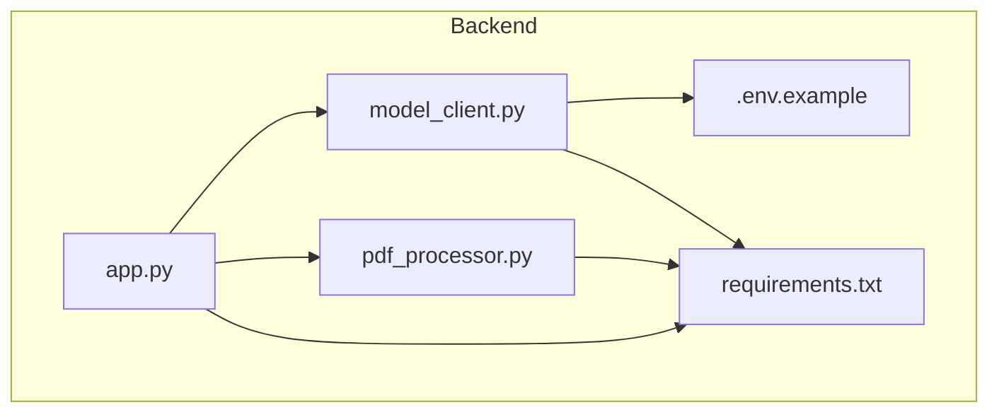
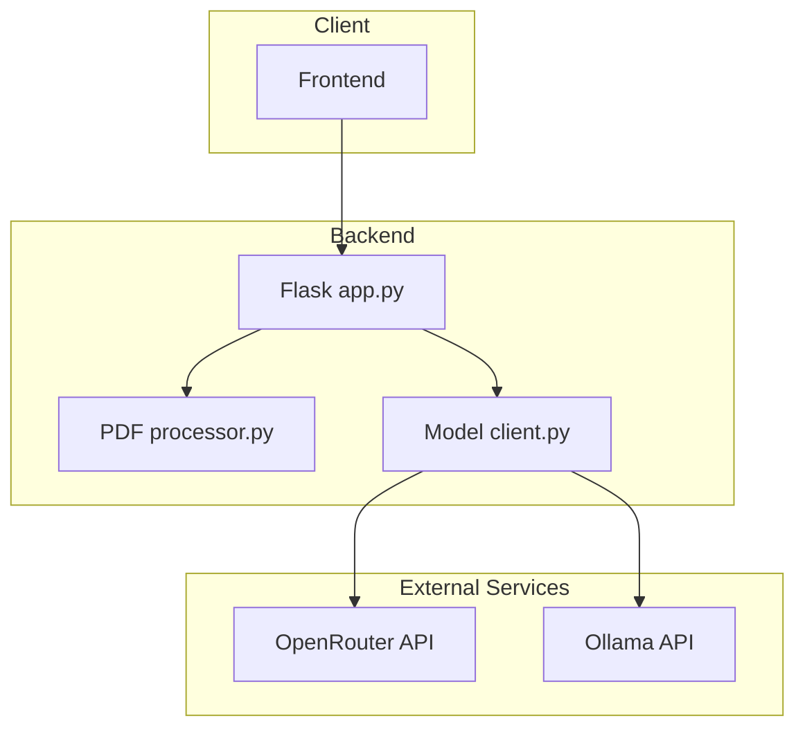
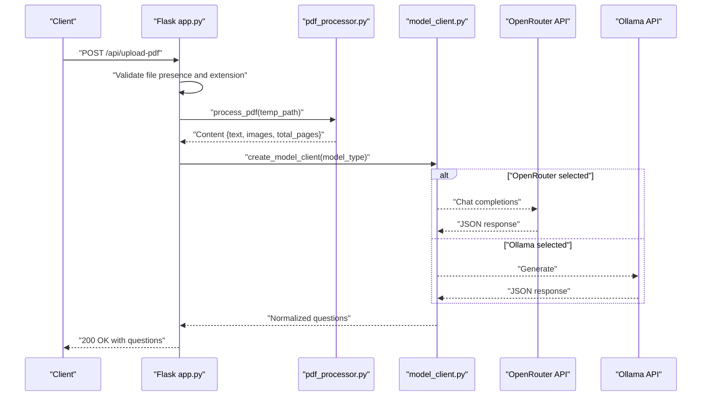
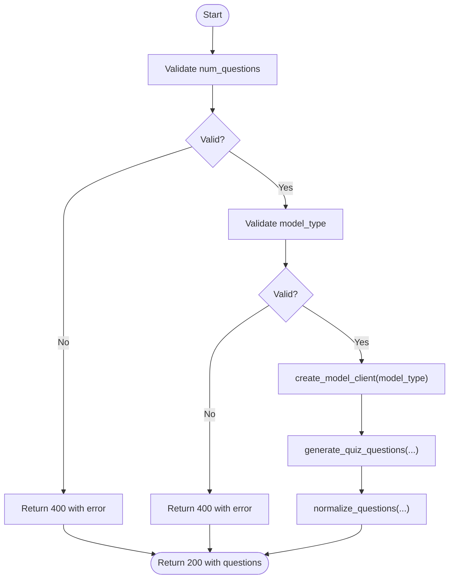
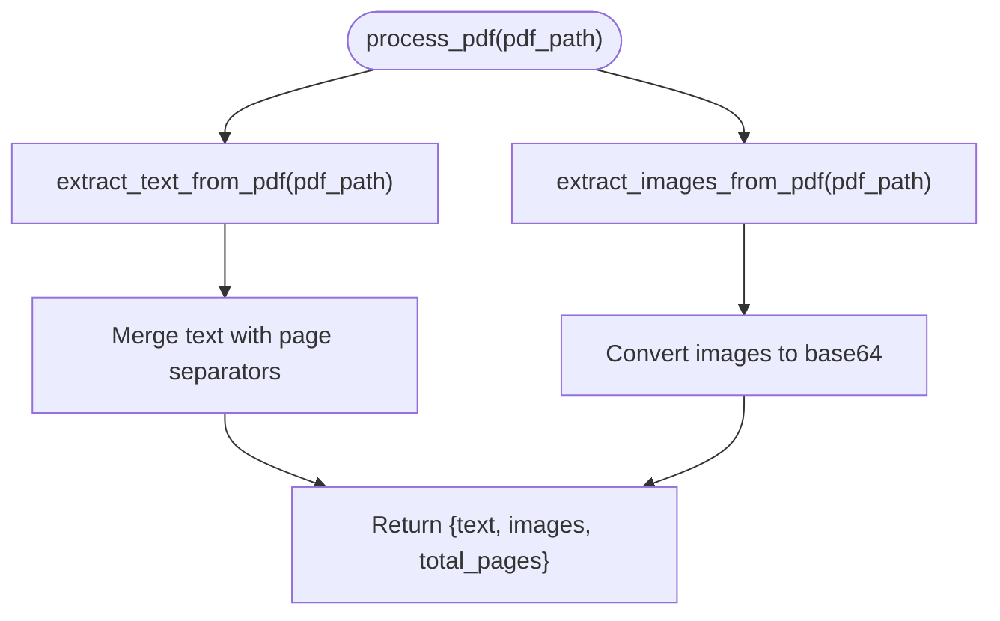
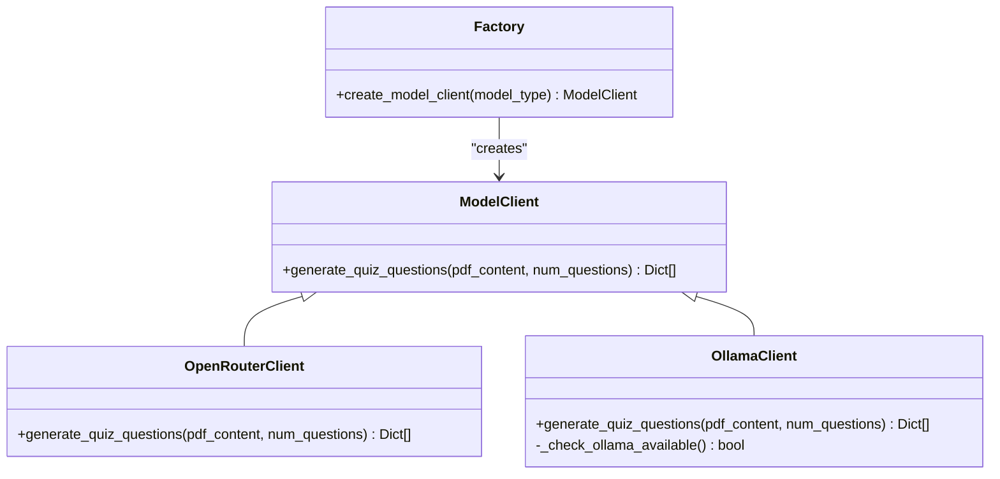
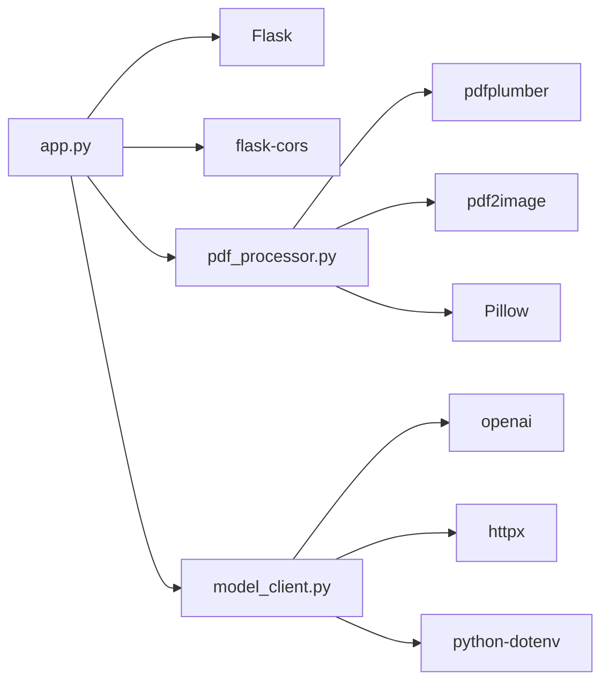

# Backend Architecture

<cite>
**Referenced Files in This Document**
- [README.md](file://README.md)
- [Makefile](file://Makefile)
- [start.sh](file://start.sh)
- [backend/app.py](file://backend/app.py)
- [backend/pdf_processor.py](file://backend/pdf_processor.py)
- [backend/model_client.py](file://backend/model_client.py)
- [backend/.env.example](file://backend/.env.example)
- [backend/requirements.txt](file://backend/requirements.txt)
</cite>

## Table of Contents
1. [Introduction](#introduction)
2. [Project Structure](#project-structure)
3. [Core Components](#core-components)
4. [Architecture Overview](#architecture-overview)
5. [Detailed Component Analysis](#detailed-component-analysis)
6. [Dependency Analysis](#dependency-analysis)
7. [Performance Considerations](#performance-considerations)
8. [Security and Input Validation](#security-and-input-validation)
9. [Scalability Considerations](#scalability-considerations)
10. [Troubleshooting Guide](#troubleshooting-guide)
11. [Conclusion](#conclusion)

## Introduction
This document describes the Backend Architecture of the Quiz Generator application. The backend is a Flask application that exposes two primary API endpoints: one for processing uploaded PDFs and another for processing raw text. The system integrates PDF parsing and image extraction, then delegates question generation to AI model clients via an abstract factory pattern. The architecture emphasizes modularity, clear request handling flows, and robust error handling.

## Project Structure
The backend module is organized around a small set of focused files:
- app.py: Flask application entry point and API endpoint handlers
- pdf_processor.py: PDF text and image extraction utilities
- model_client.py: Abstract factory and concrete clients for AI model integrations
- requirements.txt: Python dependencies
- .env.example: Example environment variables for configuration

**Diagram sources**
- [backend/app.py](file://backend/app.py#L1-L176)
- [backend/pdf_processor.py](file://backend/pdf_processor.py#L1-L77)
- [backend/model_client.py](file://backend/model_client.py#L1-L272)
- [backend/requirements.txt](file://backend/requirements.txt#L1-L9)
- [backend/.env.example](file://backend/.env.example#L1-L5)

**Section sources**
- [README.md](file://README.md#L97-L130)
- [backend/requirements.txt](file://backend/requirements.txt#L1-L9)

## Core Components
- Flask Application (app.py): Defines CORS, upload limits, and API endpoints for PDF upload and text processing. It validates inputs, orchestrates PDF processing, and delegates question generation to the model client factory.
- PDF Processor (pdf_processor.py): Extracts text and images from PDFs using pdfplumber and pdf2image, returning a unified content structure.
- Model Client Factory (model_client.py): Implements an abstract factory pattern with concrete clients for OpenRouter and Ollama. It normalizes and validates generated questions, and handles environment-driven configuration.

Key responsibilities:
- app.py: Endpoint orchestration, input validation, temporary file handling, and response formatting
- pdf_processor.py: Text and image extraction with error propagation
- model_client.py: Environment-driven client creation, prompt construction, token budgeting, and robust error handling

**Section sources**
- [backend/app.py](file://backend/app.py#L1-L176)
- [backend/pdf_processor.py](file://backend/pdf_processor.py#L1-L77)
- [backend/model_client.py](file://backend/model_client.py#L1-L272)

## Architecture Overview
The backend follows a layered architecture:
- Presentation Layer: Flask endpoints
- Domain Layer: Request validation and orchestration
- Integration Layer: PDF processing and AI model clients
- External Services: OpenRouter and Ollama APIs

**Diagram sources**
- [backend/app.py](file://backend/app.py#L53-L173)
- [backend/pdf_processor.py](file://backend/pdf_processor.py#L1-L77)
- [backend/model_client.py](file://backend/model_client.py#L1-L272)

## Detailed Component Analysis

### Flask Application (app.py)
Responsibilities:
- Configure CORS and upload constraints
- Define endpoints:
  - GET /api/health for service checks
  - POST /api/upload-pdf for PDF processing and question generation
  - POST /api/process-text for text-based question generation
- Validate inputs and enforce limits
- Orchestrate PDF processing and model client invocation
- Manage temporary file lifecycle and error responses

Request handling flow (PDF upload):

**Diagram sources**
- [backend/app.py](file://backend/app.py#L59-L118)
- [backend/pdf_processor.py](file://backend/pdf_processor.py#L64-L77)
- [backend/model_client.py](file://backend/model_client.py#L263-L272)

Validation and normalization flow:

**Diagram sources**
- [backend/app.py](file://backend/app.py#L26-L51)
- [backend/model_client.py](file://backend/model_client.py#L13-L36)
- [backend/model_client.py](file://backend/model_client.py#L263-L272)

**Section sources**
- [backend/app.py](file://backend/app.py#L1-L176)

### PDF Processor (pdf_processor.py)
Responsibilities:
- Extract text from PDF pages with optional page markers
- Convert PDF pages to images and encode them as base64
- Aggregate content into a unified dictionary with counts

Processing logic:

**Diagram sources**
- [backend/pdf_processor.py](file://backend/pdf_processor.py#L64-L77)
- [backend/pdf_processor.py](file://backend/pdf_processor.py#L8-L37)
- [backend/pdf_processor.py](file://backend/pdf_processor.py#L39-L62)

**Section sources**
- [backend/pdf_processor.py](file://backend/pdf_processor.py#L1-L77)

### Model Client Factory (model_client.py)
Design pattern:
- Abstract base class defines the contract for generating quiz questions
- Concrete implementations:
  - OpenRouterClient: Uses OpenRouter API with environment-driven configuration
  - OllamaClient: Uses local Ollama API with availability checks and timeouts
- Factory function creates the appropriate client based on type

Environment variables and configuration:
- OPENROUTER_API_KEY: Required for OpenRouterClient initialization
- Model selection and defaults:
  - model_type "openrouter" selects OpenRouterClient
  - model_type "ollama-mistral" selects OllamaClient with model "mistral"

Token budgeting and prompt construction:
- Limits input sizes to reduce token usage
- Builds structured prompts and extracts JSON from model responses
- Normalizes question formats and correct answers

Error handling:
- Propagates specific errors for credits, model not found, timeouts, and JSON parsing failures
- Provides actionable messages for troubleshooting

**Diagram sources**
- [backend/model_client.py](file://backend/model_client.py#L53-L61)
- [backend/model_client.py](file://backend/model_client.py#L62-L153)
- [backend/model_client.py](file://backend/model_client.py#L154-L261)
- [backend/model_client.py](file://backend/model_client.py#L263-L272)

**Section sources**
- [backend/model_client.py](file://backend/model_client.py#L1-L272)
- [backend/.env.example](file://backend/.env.example#L1-L5)

## Dependency Analysis
External dependencies and their roles:
- Flask: Web framework and routing
- Flask-CORS: Cross-origin support
- openai: OpenRouter API client
- httpx: HTTP client for Ollama API
- pdfplumber: PDF text extraction
- pdf2image + Pillow: PDF image extraction and encoding
- python-dotenv: Environment variable loading

**Diagram sources**
- [backend/requirements.txt](file://backend/requirements.txt#L1-L9)
- [backend/app.py](file://backend/app.py#L1-L12)
- [backend/pdf_processor.py](file://backend/pdf_processor.py#L1-L7)
- [backend/model_client.py](file://backend/model_client.py#L1-L12)

**Section sources**
- [backend/requirements.txt](file://backend/requirements.txt#L1-L9)

## Performance Considerations
- Token budgeting:
  - OpenRouterClient caps input text and limits images to reduce token usage
  - OllamaClient increases predict length proportionally to num_questions while bounding maximum tokens
- Prompt construction:
  - Structured prompts minimize ambiguity and improve reliability
- Temporary file handling:
  - Uploaded PDFs are saved to a temporary directory and removed after processing
- Concurrency:
  - Current implementation runs a single-threaded development server; production deployments should use a WSGI server and worker processes

[No sources needed since this section provides general guidance]

## Security and Input Validation
- CORS enabled for cross-origin requests
- File upload validation:
  - Extension whitelist for PDF
  - Max file size enforcement
- Input validation:
  - num_questions must be a positive integer and not exceed an upper bound
  - model_type must match supported values
- Error handling:
  - Specific error responses with 400/500 status codes
  - Environment checks for API keys and local service availability

Security considerations:
- Restrict allowed file types and enforce size limits
- Sanitize filenames and manage temporary files securely
- Validate and sanitize JSON responses from external APIs
- Use HTTPS in production and restrict CORS origins as needed

**Section sources**
- [backend/app.py](file://backend/app.py#L13-L24)
- [backend/app.py](file://backend/app.py#L26-L51)
- [backend/app.py](file://backend/app.py#L166-L173)

## Scalability Considerations
- Large PDF handling:
  - Input text and images are intentionally truncated to control token usage
  - Consider chunking or summarization for extremely large documents
- Concurrent requests:
  - Use a production WSGI server (e.g., Gunicorn) with multiple workers
  - Offload PDF processing to background tasks (e.g., Celery) for heavy workloads
- Resource limits:
  - Tune timeouts and token budgets per model
  - Monitor memory usage during image conversion and model inference
- Horizontal scaling:
  - Stateless design allows easy replication behind a load balancer
  - Externalize temporary storage if needed

[No sources needed since this section provides general guidance]

## Troubleshooting Guide
Common issues and resolutions:
- Missing environment variables:
  - OPENROUTER_API_KEY must be set for OpenRouterClient
  - Ensure .env file is present and loaded
- Ollama unavailability:
  - Verify Ollama server is reachable and model "mistral" is pulled
  - Increase timeouts or reduce num_questions if latency is high
- PDF processing errors:
  - Confirm poppler installation for image extraction
  - Validate PDF integrity and size limits
- API errors:
  - Insufficient credits or rate limits for OpenRouter
  - JSON parsing failures indicate malformed model responses

Operational tips:
- Use the health endpoint to verify service availability
- Review logs for detailed error messages
- Adjust num_questions to fit token budgets

**Section sources**
- [backend/app.py](file://backend/app.py#L166-L173)
- [backend/model_client.py](file://backend/model_client.py#L62-L153)
- [backend/model_client.py](file://backend/model_client.py#L154-L261)
- [README.md](file://README.md#L150-L157)

## Conclusion
The backend architecture cleanly separates concerns: Flask handles HTTP and orchestration, pdf_processor focuses on content extraction, and model_client encapsulates AI integrations behind a flexible factory. The design supports both cloud and local model execution, with robust validation, error handling, and environment-driven configuration. For production, pair this architecture with a WSGI server, background task processing, and careful resource tuning to handle larger PDFs and concurrent requests effectively.