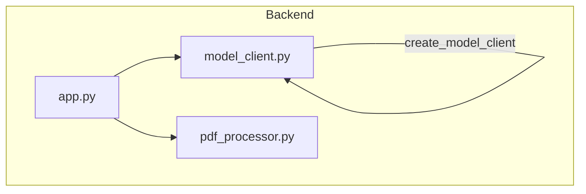
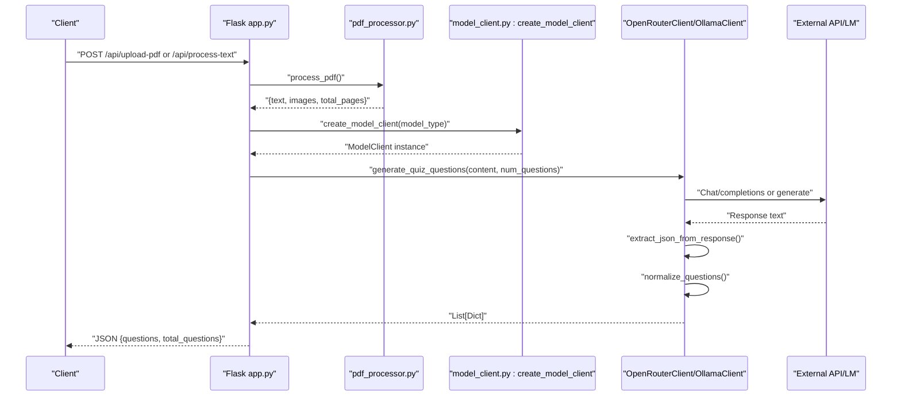
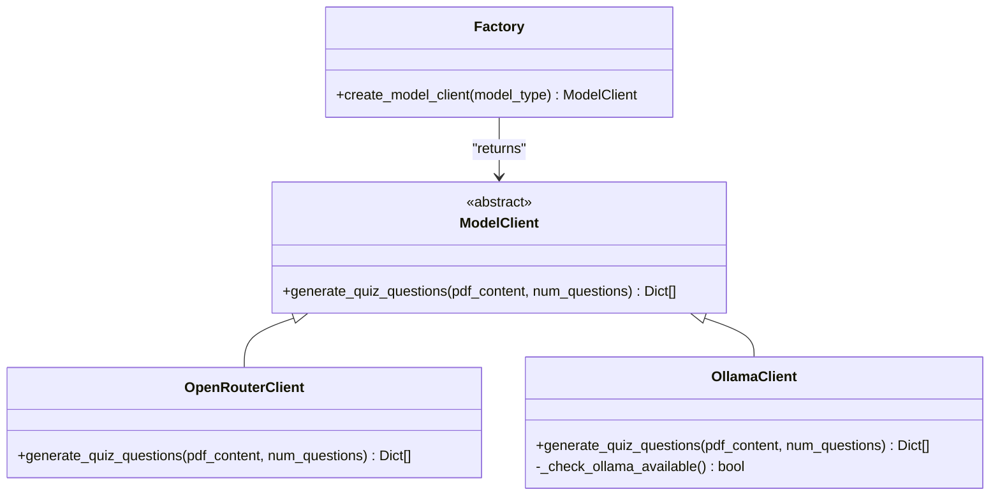
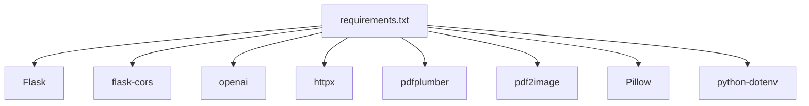

# Model Processing

<cite>
**Referenced Files in This Document**
- [model_client.py](file://backend/model_client.py)
- [pdf_processor.py](file://backend/pdf_processor.py)
- [app.py](file://backend/app.py)
- [requirements.txt](file://backend/requirements.txt)
- [README.md](file://README.md)
</cite>

## Table of Contents
1. [Introduction](#introduction)
2. [Project Structure](#project-structure)
3. [Core Components](#core-components)
4. [Architecture Overview](#architecture-overview)
5. [Detailed Component Analysis](#detailed-component-analysis)
6. [Dependency Analysis](#dependency-analysis)
7. [Performance Considerations](#performance-considerations)
8. [Troubleshooting Guide](#troubleshooting-guide)
9. [Conclusion](#conclusion)
10. [Appendices](#appendices)

## Introduction
This document explains the Model Processing subsystem of the Quiz Generator. It focuses on:
- The abstract factory pattern used to select and instantiate model clients.
- The abstract base class and client contracts for quiz generation.
- The OpenRouterClient implementation using GPT-4 via OpenRouter with robust error handling and token optimization.
- The OllamaClient implementation for local Mistral 7B inference with connection validation, timeouts, and model availability checks.
- Utility functions for response normalization and JSON extraction.
- The PDF processing pipeline that extracts text and images from PDFs and orchestrates content for model clients.

## Project Structure
The Model Processing subsystem spans two primary modules:
- backend/model_client.py: Defines the abstract base class, concrete clients, and the abstract factory.
- backend/pdf_processor.py: Provides PDF text and image extraction utilities and an orchestrator function.

**Diagram sources**
- [app.py](file://backend/app.py#L1-L176)
- [model_client.py](file://backend/model_client.py#L1-L272)
- [pdf_processor.py](file://backend/pdf_processor.py#L1-L77)

**Section sources**
- [app.py](file://backend/app.py#L1-L176)
- [model_client.py](file://backend/model_client.py#L1-L272)
- [pdf_processor.py](file://backend/pdf_processor.py#L1-L77)

## Core Components
- Abstract base class ModelClient defines the contract for quiz generation.
- Concrete implementations:
  - OpenRouterClient: Uses OpenRouter’s chat completions endpoint with GPT-4 variants.
  - OllamaClient: Uses a local Ollama server for Mistral 7B inference.
- Abstract factory create_model_client(model_type) selects the appropriate client based on model_type.
- Utilities:
  - normalize_questions(): Standardizes question dictionaries and ensures correct answer indices.
  - extract_json_from_response(): Removes markdown code blocks around JSON and trims whitespace.

These components are integrated into the backend API endpoints that accept PDF uploads or raw text, process the content, and return generated quizzes.

**Section sources**
- [model_client.py](file://backend/model_client.py#L53-L271)
- [pdf_processor.py](file://backend/pdf_processor.py#L1-L77)
- [app.py](file://backend/app.py#L1-L176)

## Architecture Overview
The system follows a layered architecture:
- Presentation/API layer: Flask endpoints handle requests and orchestrate processing.
- Processing layer: PDF processor extracts text and images; model client generates quiz questions.
- Integration layer: Abstract factory decouples selection of model client from the rest of the system.

**Diagram sources**
- [app.py](file://backend/app.py#L59-L164)
- [pdf_processor.py](file://backend/pdf_processor.py#L64-L77)
- [model_client.py](file://backend/model_client.py#L120-L271)

## Detailed Component Analysis

### Abstract Factory Pattern and ModelClient Contract
- Abstract base class ModelClient declares the generate_quiz_questions(pdf_content, num_questions) contract.
- Concrete clients implement the contract:
  - OpenRouterClient: Implements cloud-based generation via OpenRouter.
  - OllamaClient: Implements local generation via Ollama.
- Abstract factory create_model_client(model_type) returns:
  - OpenRouterClient for model_type "openrouter".
  - OllamaClient(model_name="mistral") for model_type "ollama-mistral".
  - Raises ValueError for unknown types.

**Diagram sources**
- [model_client.py](file://backend/model_client.py#L53-L271)

**Section sources**
- [model_client.py](file://backend/model_client.py#L53-L271)

### OpenRouterClient Implementation
Key behaviors:
- Initialization validates OPENROUTER_API_KEY and configures an OpenAI-compatible client pointing to OpenRouter.
- generate_quiz_questions():
  - Builds a compact system prompt and user prompt tailored for multiple-choice questions.
  - Limits input text length and image count to optimize token usage.
  - Chooses model variant based on whether images are present.
  - Sets max_tokens proportional to num_questions up to a cap.
  - Extracts and parses JSON from the model response.
  - Normalizes questions to a standard format.
  - Robust error handling:
    - Catches JSON parse errors.
    - Detects credit/tokens-related failures and raises a user-friendly message.
    - Wraps other exceptions with contextual messages.

Token optimization strategies:
- Caps max_tokens per question and applies an upper bound.
- Limits text length and number of images.
- Uses a smaller model when text-only to reduce cost and latency.

System prompt structure:
- Requests multiple-choice questions with four options.
- Requires Russian-language output.
- Enforces JSON-only responses with a strict schema.

**Section sources**
- [model_client.py](file://backend/model_client.py#L62-L152)

### OllamaClient Implementation
Key behaviors:
- Initialization accepts model_name and base_url; uses httpx client with a generous timeout.
- _check_ollama_available(): Validates connectivity to the Ollama server tags endpoint.
- generate_quiz_questions():
  - Ensures Ollama availability before proceeding.
  - Constructs a system prompt and user prompt similar to OpenRouterClient.
  - Allows larger text input compared to OpenRouterClient.
  - Calls Ollama generate endpoint with streaming disabled and token limits.
  - Parses the response, extracts JSON, and normalizes questions.
  - Robust error handling:
    - Handles timeouts with a clear message.
    - Detects missing model and suggests installation command.
    - Raises descriptive errors for non-200 responses and empty replies.

Connection validation and timeouts:
- Quick availability check for the Ollama server.
- Configurable client timeout for long-running local generations.

**Section sources**
- [model_client.py](file://backend/model_client.py#L154-L271)

### Utility Functions: normalize_questions() and extract_json_from_response()
- normalize_questions():
  - Ensures each question has required fields (id, question, type, correct_answer).
  - For multiple_choice, adds options and converts letter-based answers to numeric indices.
  - Returns a normalized list of questions.
- extract_json_from_response():
  - Strips markdown code blocks and surrounding whitespace.
  - Returns clean JSON text suitable for parsing.

These utilities standardize model outputs and improve resilience to varied response formats.

**Section sources**
- [model_client.py](file://backend/model_client.py#L12-L51)

### PDF Processing Pipeline: pdf_processor.py
Functions:
- extract_text_from_pdf(pdf_path, include_page_markers=True):
  - Uses pdfplumber to iterate pages and extract text.
  - Optionally inserts explicit page markers to aid structure.
  - Joins pages with controlled separators.
- extract_images_from_pdf(pdf_path):
  - Converts PDF pages to images using pdf2image at a fixed DPI.
  - Encodes each page as base64 PNG and records page number and format.
- process_pdf(pdf_path, include_page_markers=True):
  - Orchestrator that returns a dictionary containing:
    - text: combined text with optional page markers.
    - images: list of base64-encoded PNGs with metadata.
    - total_pages: number of extracted images/pages.

Integration with backend:
- The Flask endpoints call process_pdf() to build the content passed to model clients.

**Section sources**
- [pdf_processor.py](file://backend/pdf_processor.py#L1-L77)
- [app.py](file://backend/app.py#L88-L106)

### Backend API Integration and Content Types
Endpoints:
- GET /api/health: Health check.
- POST /api/upload-pdf:
  - Accepts multipart form data with file, num_questions, and model_type.
  - Validates file type and size, saves temporarily, processes PDF, and generates questions.
  - Returns success with questions and total count.
- POST /api/process-text:
  - Accepts JSON with text, num_questions, and model_type.
  - Generates questions from raw text (no images).
  - Returns success with questions and total count.

Validation and error handling:
- Validates num_questions range and model_type.
- Returns structured error responses for malformed requests or processing failures.

**Section sources**
- [app.py](file://backend/app.py#L53-L164)
- [README.md](file://README.md#L150-L157)

## Dependency Analysis
External libraries and their roles:
- Flask and flask-cors: Web framework and cross-origin support.
- openai: OpenRouter client for chat completions.
- httpx: HTTP client for Ollama API calls.
- pdfplumber: Text extraction from PDFs.
- pdf2image and Pillow: Image conversion and encoding.
- python-dotenv: Environment variable loading.

**Diagram sources**
- [requirements.txt](file://backend/requirements.txt#L1-L9)

**Section sources**
- [requirements.txt](file://backend/requirements.txt#L1-L9)

## Performance Considerations
- Token budgeting:
  - OpenRouterClient computes max_tokens proportional to num_questions with an upper bound.
  - Limits input text length and image count to keep prompts concise.
- Local inference:
  - OllamaClient allows larger text inputs and sets num_predict limits to manage token usage.
- Timeout tuning:
  - OllamaClient uses a higher client timeout to accommodate slower local models.
- Output parsing:
  - extract_json_from_response removes markdown wrappers to reduce parsing overhead.
- Image handling:
  - Limits number of images sent to OpenRouter and caps text length for both providers.

[No sources needed since this section provides general guidance]

## Troubleshooting Guide
Common issues and resolutions:
- Missing OPENROUTER_API_KEY:
  - Symptom: Client initialization fails.
  - Resolution: Set OPENROUTER_API_KEY in backend/.env.
- Insufficient credits or token limits on OpenRouter:
  - Symptom: Error mentioning 402, credits, or max_tokens.
  - Resolution: Reduce num_questions or top up credits.
- Ollama server unreachable:
  - Symptom: Availability check fails.
  - Resolution: Start Ollama and ensure the server is reachable at base URL.
- Model not found in Ollama:
  - Symptom: Error indicating model not found.
  - Resolution: Pull the model using the suggested command.
- Empty or malformed responses:
  - Symptom: JSON parse errors or empty replies.
  - Resolution: Verify provider responses and retry with reduced num_questions.

**Section sources**
- [model_client.py](file://backend/model_client.py#L62-L152)
- [model_client.py](file://backend/model_client.py#L154-L271)

## Conclusion
The Model Processing subsystem cleanly separates concerns:
- The abstract factory enables pluggable model backends.
- Concrete clients encapsulate provider-specific logic and error handling.
- Utilities ensure standardized, robust responses.
- The PDF processor provides a reliable content pipeline for both cloud and local models.
Together, these components deliver a flexible, maintainable quiz generation system.

[No sources needed since this section summarizes without analyzing specific files]

## Appendices

### Example API Workflows
- Upload PDF and generate quiz:
  - Client sends multipart/form-data with file, num_questions, and model_type.
  - Backend saves file, processes PDF, selects client via factory, and returns questions.
- Process raw text:
  - Client sends JSON with text, num_questions, and model_type.
  - Backend builds content dict and returns questions.

**Section sources**
- [app.py](file://backend/app.py#L59-L164)
- [pdf_processor.py](file://backend/pdf_processor.py#L64-L77)