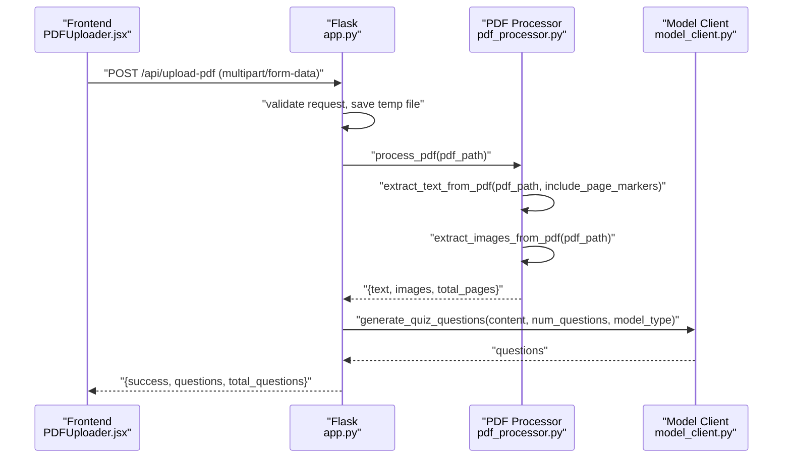
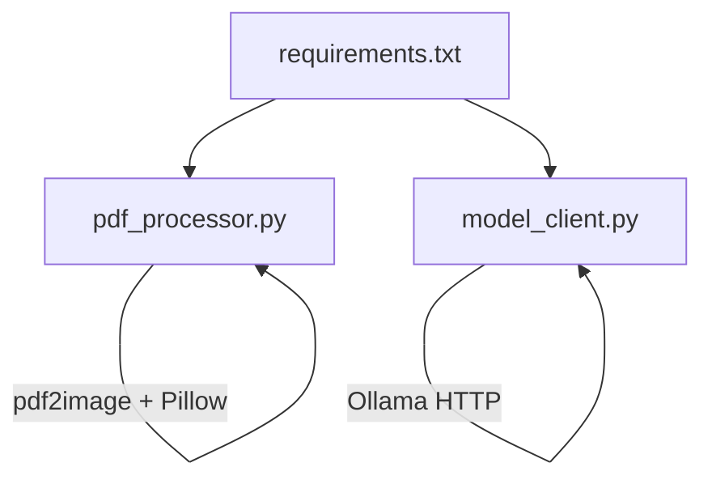

# PDF Processing Module

<cite>
**Referenced Files in This Document**
- [pdf_processor.py](file://backend/pdf_processor.py)
- [app.py](file://backend/app.py)
- [model_client.py](file://backend/model_client.py)
- [requirements.txt](file://backend/requirements.txt)
- [README.md](file://README.md)
- [PDFUploader.jsx](file://frontend/src/components/PDFUploader.jsx)
</cite>

## Table of Contents
1. [Introduction](#introduction)
2. [Project Structure](#project-structure)
3. [Core Components](#core-components)
4. [Architecture Overview](#architecture-overview)
5. [Detailed Component Analysis](#detailed-component-analysis)
6. [Dependency Analysis](#dependency-analysis)
7. [Performance Considerations](#performance-considerations)
8. [Troubleshooting Guide](#troubleshooting-guide)
9. [Conclusion](#conclusion)
10. [Appendices](#appendices)

## Introduction
This document explains the PDF Processing Module used in the Quiz Generator. It focuses on:
- Text extraction with optional page markers
- Image extraction to base64-encoded PNGs
- An orchestrator that unifies text and images into a single content object
- How page markers improve context for AI models
- How image extraction enables visual content processing
- Integration points with model clients and token/size optimizations
- Error handling for file access, malformed PDFs, and image conversion failures
- Backend API usage examples and performance implications for large PDFs

## Project Structure
The PDF processing module resides in the backend and integrates with the Flask API and model clients.

```mermaid
graph TB
subgraph "Backend"
A["app.py<br/>Flask API"]
B["pdf_processor.py<br/>PDF processing"]
C["model_client.py<br/>Model clients"]
end
subgraph "Frontend"
F["PDFUploader.jsx<br/>Upload & submit"]
end
F --> |POST /api/upload-pdf| A
A --> |process_pdf()| B
A --> |generate_quiz_questions()| C
B --> |extract_text_from_pdf()/extract_images_from_pdf()/process_pdf()| A
```

**Diagram sources**
- [app.py](file://backend/app.py#L59-L118)
- [pdf_processor.py](file://backend/pdf_processor.py#L8-L77)
- [model_client.py](file://backend/model_client.py#L53-L272)
- [PDFUploader.jsx](file://frontend/src/components/PDFUploader.jsx#L70-L110)

**Section sources**
- [app.py](file://backend/app.py#L59-L118)
- [pdf_processor.py](file://backend/pdf_processor.py#L8-L77)
- [model_client.py](file://backend/model_client.py#L53-L272)
- [README.md](file://README.md#L150-L157)

## Core Components
- extract_text_from_pdf(pdf_path, include_page_markers): Extracts text from a PDF and optionally adds explicit page markers for structural clarity.
- extract_images_from_pdf(pdf_path): Converts PDF pages to base64-encoded PNG images.
- process_pdf(pdf_path, include_page_markers): Orchestrates extraction and returns a unified content object with text, images, and total page count.

Key behaviors:
- Page markers: When enabled, a strong visual divider is inserted around each page’s text to aid AI models in understanding page boundaries.
- Image extraction: Uses pdf2image with PIL to convert pages to PNG and encode them to base64.
- Unified content: The orchestrator returns a dictionary containing text, images, and total_pages.

**Section sources**
- [pdf_processor.py](file://backend/pdf_processor.py#L8-L37)
- [pdf_processor.py](file://backend/pdf_processor.py#L39-L61)
- [pdf_processor.py](file://backend/pdf_processor.py#L64-L74)

## Architecture Overview
The PDF processing pipeline is invoked by the Flask endpoint /api/upload-pdf. It delegates to the orchestrator, which calls text and image extraction functions. The resulting content is passed to the model client for quiz generation.



**Diagram sources**
- [PDFUploader.jsx](file://frontend/src/components/PDFUploader.jsx#L70-L110)
- [app.py](file://backend/app.py#L59-L118)
- [pdf_processor.py](file://backend/pdf_processor.py#L64-L74)
- [model_client.py](file://backend/model_client.py#L53-L152)

## Detailed Component Analysis

### extract_text_from_pdf(pdf_path, include_page_markers)
Purpose:
- Extract all text from a PDF and optionally wrap each page’s text with explicit page markers.

Behavior:
- Iterates over pages and extracts text.
- If include_page_markers is true, inserts a strong divider with a page label before each page’s content.
- Joins pages with either a single newline (when markers are included) or two newlines (when markers are not included).

Error handling:
- Wraps exceptions during PDF parsing with a descriptive message.

Performance and correctness:
- Uses pdfplumber for reliable text extraction.
- Page markers improve context for downstream models by clearly separating page content.

**Section sources**
- [pdf_processor.py](file://backend/pdf_processor.py#L8-L37)

### extract_images_from_pdf(pdf_path)
Purpose:
- Convert each PDF page to a PNG and encode it to base64.

Behavior:
- Converts PDF pages to images using pdf2image at a fixed DPI.
- Saves each image to a buffer and encodes to base64.
- Returns a list of dictionaries with page number, base64 data, and format.

Error handling:
- Raises a descriptive exception if conversion fails.

Performance and correctness:
- Fixed DPI ensures consistent image quality and reduces payload size.
- Base64 encoding allows embedding images directly in the model prompt.

**Section sources**
- [pdf_processor.py](file://backend/pdf_processor.py#L39-L61)

### process_pdf(pdf_path, include_page_markers)
Purpose:
- Orchestrate extraction of text and images and return a unified content object.

Behavior:
- Calls extract_text_from_pdf and extract_images_from_pdf.
- Returns a dictionary with keys: text, images, total_pages.

Integration:
- Called by the Flask endpoint to prepare content for model clients.

**Section sources**
- [pdf_processor.py](file://backend/pdf_processor.py#L64-L74)
- [app.py](file://backend/app.py#L88-L106)

### Integration with Model Clients and Token/Size Optimizations
- OpenRouter client:
  - Limits text to approximately 4000 characters.
  - Sends up to 2 images (first pages) as multimodal content.
  - Adjusts model and max_tokens based on whether images are present.
- Ollama client:
  - Limits text to approximately 8000 characters for local inference.
  - No image sending in this implementation; text-only prompts are used.

These limits reduce token usage and cost while maintaining reasonable quality.

**Section sources**
- [model_client.py](file://backend/model_client.py#L92-L115)
- [model_client.py](file://backend/model_client.py#L190-L196)
- [README.md](file://README.md#L150-L157)

### Page Markers Enhancing Context for AI Models
- Explicit page markers delineate page boundaries in the extracted text.
- This helps AI models better understand document structure, especially when text is truncated to token limits.
- Example marker format: a long divider with a page label before each page’s content.

**Section sources**
- [pdf_processor.py](file://backend/pdf_processor.py#L20-L31)

### Image Extraction Supporting Visual Content Processing
- Extracted images are encoded as base64 PNGs.
- The OpenRouter client sends up to 2 images alongside text to enable multimodal question generation.
- Images are embedded as data URLs in the model prompt.

**Section sources**
- [pdf_processor.py](file://backend/pdf_processor.py#L39-L61)
- [model_client.py](file://backend/model_client.py#L96-L113)

## Dependency Analysis
External libraries and their roles:
- pdfplumber: Extracts text from PDFs reliably.
- pdf2image: Converts PDF pages to images.
- Pillow: Handles PNG encoding and in-memory buffers.
- OpenRouter API client: Sends multimodal prompts with text and images.
- Ollama HTTP client: Sends text prompts to a local model.



**Diagram sources**
- [requirements.txt](file://backend/requirements.txt#L1-L9)
- [pdf_processor.py](file://backend/pdf_processor.py#L1-L7)
- [model_client.py](file://backend/model_client.py#L1-L12)

**Section sources**
- [requirements.txt](file://backend/requirements.txt#L1-L9)
- [pdf_processor.py](file://backend/pdf_processor.py#L1-L7)
- [model_client.py](file://backend/model_client.py#L1-L12)

## Performance Considerations
- PDF size limits:
  - The backend enforces a maximum file size for uploads.
- Text truncation:
  - OpenRouter: ~4000 characters.
  - Ollama: ~8000 characters.
- Image limiting:
  - Up to 2 images are sent to balance token usage and visual context.
- Large PDFs:
  - Converting many pages to images increases memory and CPU usage.
  - Consider reducing DPI or limiting pages for very large documents.
- Network and model latency:
  - OpenRouter may incur latency and rate limits; Ollama runs locally but depends on system resources.

Practical tips:
- Prefer enabling page markers for better model comprehension.
- Limit num_questions to reduce token consumption.
- Use Ollama for larger texts when cloud credits are constrained.

**Section sources**
- [app.py](file://backend/app.py#L13-L16)
- [model_client.py](file://backend/model_client.py#L92-L115)
- [model_client.py](file://backend/model_client.py#L190-L196)
- [README.md](file://README.md#L150-L157)

## Troubleshooting Guide
Common issues and resolutions:
- File access errors:
  - Ensure the temporary file path is valid and readable.
  - Verify the uploaded file extension is PDF and not empty.
- Malformed PDFs:
  - The processor raises descriptive exceptions during text or image extraction.
  - Validate PDFs externally if repeated failures occur.
- Image conversion failures:
  - Confirm Poppler installation is available on the system.
  - Reduce DPI or limit pages to lower resource usage.
- API errors:
  - OpenRouter: Insufficient credits or token limits can cause errors; adjust num_questions or top-up credits.
  - Ollama: Ensure the server is reachable and the model is pulled.

Backend API endpoints:
- POST /api/upload-pdf:
  - Expects multipart/form-data with file, num_questions, model_type.
  - Returns success with generated questions or an error message.
- POST /api/process-text:
  - Expects JSON with text, num_questions, model_type.
  - Returns success with generated questions or an error message.

Frontend usage:
- The PDF uploader component posts to /api/upload-pdf with form data and handles responses.

**Section sources**
- [app.py](file://backend/app.py#L59-L118)
- [app.py](file://backend/app.py#L120-L164)
- [PDFUploader.jsx](file://frontend/src/components/PDFUploader.jsx#L70-L110)
- [pdf_processor.py](file://backend/pdf_processor.py#L20-L33)
- [pdf_processor.py](file://backend/pdf_processor.py#L53-L60)
- [model_client.py](file://backend/model_client.py#L141-L152)
- [model_client.py](file://backend/model_client.py#L174-L178)
- [model_client.py](file://backend/model_client.py#L245-L261)

## Conclusion
The PDF Processing Module provides robust text and image extraction with explicit page markers and base64-encoded PNGs. Its integration with model clients optimizes token usage through truncation and selective image sending. The Flask API exposes straightforward endpoints for PDF processing and quiz generation, while the frontend offers a user-friendly interface for uploading and submitting content.

## Appendices

### API Definitions
- POST /api/upload-pdf
  - Form fields:
    - file: PDF file
    - num_questions: integer (1–20)
    - model_type: "openrouter" or "ollama-mistral"
  - Success response: { success: true, questions, total_questions }
  - Error responses: { error: string }

- POST /api/process-text
  - JSON body:
    - text: string
    - num_questions: integer (1–20)
    - model_type: "openrouter" or "ollama-mistral"
  - Success response: { success: true, questions, total_questions }
  - Error responses: { error: string }

**Section sources**
- [app.py](file://backend/app.py#L59-L118)
- [app.py](file://backend/app.py#L120-L164)

### Data Model for Content Objects
- text: string
- images: array of objects with keys:
  - page: integer
  - base64: string
  - format: string ("png")
- total_pages: integer

**Section sources**
- [pdf_processor.py](file://backend/pdf_processor.py#L64-L74)