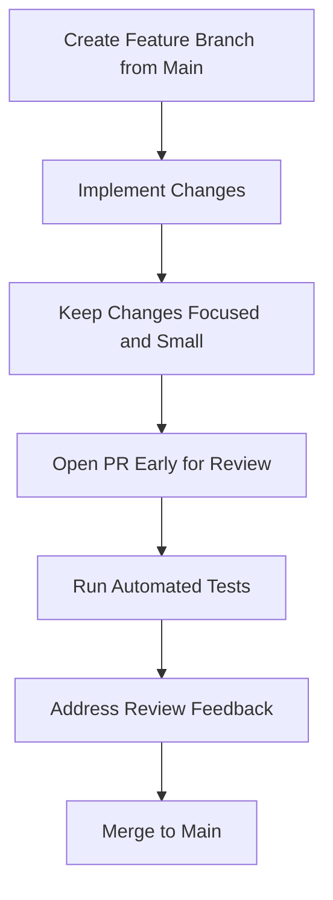
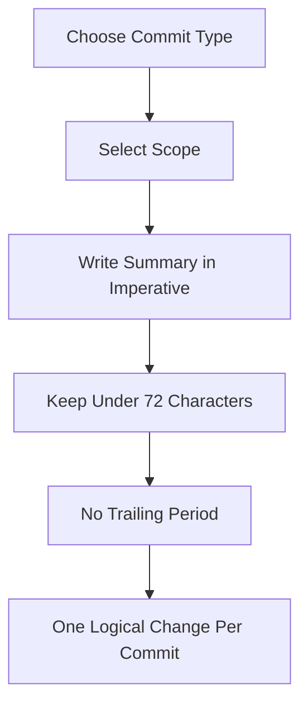
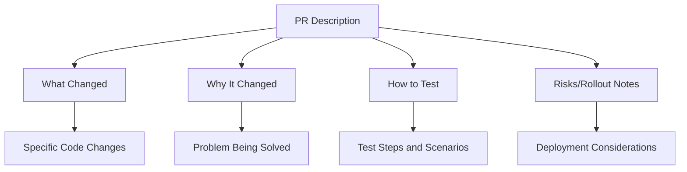
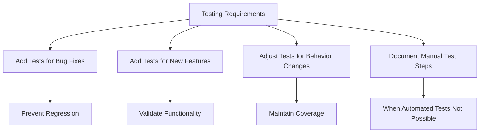
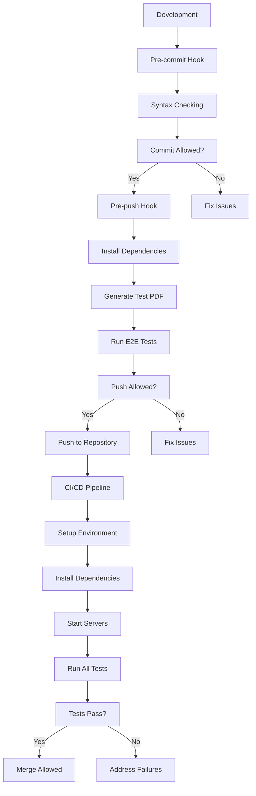

# Contributing Guide

<cite>
**Referenced Files in This Document**   
- [CONTRIBUTING.md](file://CONTRIBUTING.md)
- [README.md](file://README.md)
- [TESTING.md](file://TESTING.md)
- [Makefile](file://Makefile)
- [package.json](file://package.json)
- [.github/workflows/tests.yml](file://.github/workflows/tests.yml)
- [start.sh](file://start.sh)
- [backend/app.py](file://backend/app.py)
- [frontend/src/App.jsx](file://frontend/src/App.jsx)
- [e2e/tests/quiz-flow.spec.js](file://e2e/tests/quiz-flow.spec.js)
</cite>

## Table of Contents
1. [Introduction](#introduction)
2. [Contribution Workflow](#contribution-workflow)
3. [Commit Message Guidelines](#commit-message-guidelines)
4. [Pull Request Requirements](#pull-request-requirements)
5. [Code Review Expectations](#code-review-expectations)
6. [Testing Requirements](#testing-requirements)
7. [Style Guidelines](#style-guidelines)
8. [Development Environment Setup](#development-environment-setup)
9. [Automated Checks and CI/CD](#automated-checks-and-cicd)
10. [Troubleshooting](#troubleshooting)

## Introduction

This Contributing Guide provides comprehensive instructions for developers who want to contribute to the Quiz Generator application. The guide covers the complete contribution workflow from setting up the development environment to submitting code changes through pull requests. The application is a web-based tool that generates quizzes from PDF documents using AI models like GPT-4 via OpenRouter and Mistral 7B via Ollama.

The project follows lightweight, consistent conventions to maintain readable history and efficient code reviews. This document details the specific practices and requirements that contributors must follow to ensure their contributions align with the project's standards and can be seamlessly integrated.

**Section sources**
- [CONTRIBUTING.md](file://CONTRIBUTING.md#L1-L54)
- [README.md](file://README.md#L1-L161)

## Contribution Workflow

The contribution workflow for the Quiz Generator application follows a standardized process to ensure code quality and maintainability. Contributors should create feature branches from the `main` branch for all new work. This branching strategy isolates changes and prevents unstable code from entering the main codebase.

All changes should be kept focused and small, addressing a single issue or feature. This approach makes code reviews more effective and reduces the risk of introducing bugs. For non-trivial changes, contributors are encouraged to open pull requests early in the development process. This allows for early feedback and collaboration, ensuring that the implementation aligns with project requirements before significant time is invested.

The `main` branch is protected and should always remain in a deployable state. Before any merge, all automated tests and linting checks must pass. This ensures that the codebase maintains a high level of quality and stability. Contributors should ensure their feature branches are regularly updated with changes from the `main` branch to minimize merge conflicts.



**Diagram sources**
- [CONTRIBUTING.md](file://CONTRIBUTING.md#L6-L9)

**Section sources**
- [CONTRIBUTING.md](file://CONTRIBUTING.md#L6-L9)

## Commit Message Guidelines

The Quiz Generator application follows the Conventional Commits specification for all commit messages. This standardized format improves the readability of the commit history and enables automated tooling for generating changelogs and determining version bumps.

Commit messages must follow the format: `<type>(<scope>): <summary>`. The type indicates the nature of the change, while the scope specifies the module or component affected. The summary should be a concise description of the change using imperative verbs such as "add", "fix", "remove", or "update".

Valid examples of commit messages include:
- `feat(api): add endpoint for health check`
- `fix(parser): handle empty input`
- `refactor(db): extract repository layer`
- `docs(readme): update local setup`
- `chore(deps): bump numpy to 1.26`

The subject line should be no longer than 72 characters and should not end with a period. Each commit should represent a single logical change. If a commit message requires the word "and" to describe its changes, it should be split into multiple commits. For breaking changes, add an exclamation mark after the type or scope (e.g., `feat(api)!: remove v1 endpoints`) and include migration steps in the commit body.



**Diagram sources**
- [CONTRIBUTING.md](file://CONTRIBUTING.md#L16-L25)

**Section sources**
- [CONTRIBUTING.md](file://CONTRIBUTING.md#L11-L35)

## Pull Request Requirements

Pull requests for the Quiz Generator application must include specific information to facilitate effective code review and ensure all necessary context is provided. The PR description should clearly articulate what changed, why the change was made, and how to test the implementation.

The "What" section should describe the specific changes made to the codebase, including new features, bug fixes, or refactoring. The "Why" section should explain the motivation behind the changes, such as addressing a specific issue, improving performance, or enhancing user experience. The "How to test" section should provide step-by-step instructions for verifying the changes, including any specific test cases or scenarios that should be checked.

For changes that involve significant risks or require a specific rollout strategy, contributors should include relevant notes in the PR description. This might include backward compatibility considerations, performance implications, or deployment requirements.



**Diagram sources**
- [CONTRIBUTING.md](file://CONTRIBUTING.md#L41-L45)

**Section sources**
- [CONTRIBUTING.md](file://CONTRIBUTING.md#L40-L45)

## Code Review Expectations

Code reviews for the Quiz Generator application focus on maintaining code quality, consistency, and adherence to project standards. Reviewers evaluate contributions based on several key criteria, including code clarity, functionality, test coverage, and alignment with the project's architecture and design patterns.

Contributors should be prepared to address feedback on code structure, variable naming, error handling, and potential edge cases. Reviewers may request changes to improve code readability or suggest alternative approaches that better fit the existing codebase. The goal of the review process is collaborative improvement rather than criticism.

All feedback should be addressed promptly, and contributors are expected to engage in constructive discussions about suggested changes. If there is disagreement about an implementation approach, the conversation should focus on technical merits and project goals rather than personal preferences.

**Section sources**
- [CONTRIBUTING.md](file://CONTRIBUTING.md#L40-L45)

## Testing Requirements

Testing is a critical component of the contribution process for the Quiz Generator application. Contributors must ensure adequate test coverage for all changes, particularly for bug fixes and new functionality. The project includes comprehensive end-to-end tests using Playwright that cover the complete user flow.

For bug fixes, contributors should add or modify tests to verify that the issue is resolved and prevent regression. For new features, appropriate test cases should be implemented to validate the functionality under various conditions. When automated tests are not feasible, contributors should document manual test steps in the pull request description.

The testing framework includes both mocked API tests for fast, stable execution and smoke tests that use real API endpoints. Contributors working on backend changes should ensure their code is properly tested through the existing test suite. Frontend changes should maintain the application's responsive behavior and user interface consistency.



**Diagram sources**
- [CONTRIBUTING.md](file://CONTRIBUTING.md#L48-L49)
- [TESTING.md](file://TESTING.md#L7-L55)

**Section sources**
- [CONTRIBUTING.md](file://CONTRIBUTING.md#L47-L49)
- [TESTING.md](file://TESTING.md#L7-L55)

## Style Guidelines

The Quiz Generator application emphasizes code clarity and maintainability over clever or complex implementations. Contributors should prioritize writing code that is easy to understand and modify by other developers. This includes using descriptive variable and function names, writing clear comments for complex logic, and following consistent formatting patterns.

Refactoring is encouraged when it improves code quality, but refactors must be behavior-preserving unless explicitly stated otherwise in the pull request. Large refactoring changes should be separated from functional changes to make reviews more manageable.

The project follows standard style conventions for both Python (backend) and JavaScript/React (frontend) codebases. Contributors should ensure their code adheres to these conventions, which are enforced through automated linting tools. Code should be well-organized, with logical separation of concerns and appropriate modularization.

**Section sources**
- [CONTRIBUTING.md](file://CONTRIBUTING.md#L51-L53)

## Development Environment Setup

Setting up the development environment for the Quiz Generator application requires several prerequisites and configuration steps. The application has both backend and frontend components, each with specific requirements.

The backend is built with Python 3.8+ and requires Flask, pdfplumber, and pdf2image for PDF processing. The frontend uses React with Node.js 16+. For AI model integration, contributors can use either OpenRouter API (requiring an API key) or Ollama for local model execution (requiring Mistral 7B installation).

To install all dependencies, run `make install` from the project root. This command installs both backend and frontend dependencies. The `make setup-hooks` command configures Git hooks for automated checks. Before starting development, ensure all requirements are met by running `make check`.

The application can be started with `make start`, which launches both backend and frontend servers. The backend runs on port 5001, while the frontend is available at http://localhost:3000.

```mermaid
graph TD
A[Install Prerequisites] --> B[Python 3.8+]
A --> C[Node.js 16+]
A --> D[OpenRouter API Key (Optional)]
A --> E[Ollama (Optional)]
B --> F[Install Backend Dependencies]
C --> G[Install Frontend Dependencies]
F --> H[Run make install]
G --> H
H --> I[Configure Environment]
I --> J[Run make start]
J --> K[Access Application at localhost:3000]
```

**Diagram sources**
- [README.md](file://README.md#L15-L36)
- [Makefile](file://Makefile#L21-L23)

**Section sources**
- [README.md](file://README.md#L13-L36)
- [Makefile](file://Makefile#L21-L23)

## Automated Checks and CI/CD

The Quiz Generator application employs multiple layers of automated checks to maintain code quality and prevent regressions. These include Git hooks, continuous integration workflows, and comprehensive testing pipelines.

Git hooks are configured to run automatically during development. The pre-commit hook performs syntax checking on Python and JavaScript files, preventing commits with basic syntax errors. The pre-push hook runs a more comprehensive check, including dependency installation, test PDF generation, and execution of all end-to-end tests (excluding smoke tests).

The continuous integration pipeline, defined in `.github/workflows/tests.yml`, automatically runs on push and pull request events. It sets up the complete environment, installs dependencies, starts servers, and executes end-to-end tests. The pipeline runs on Ubuntu with specified versions of Node.js and Python to ensure consistency.

All automated checks must pass before code can be merged into the main branch. This ensures that the codebase remains stable and deployable at all times. Test results and logs are preserved for troubleshooting failed builds.



**Diagram sources**
- [TESTING.md](file://TESTING.md#L89-L123)
- [.github/workflows/tests.yml](file://.github/workflows/tests.yml#L1-L120)

**Section sources**
- [TESTING.md](file://TESTING.md#L89-L123)
- [.github/workflows/tests.yml](file://.github/workflows/tests.yml#L1-L120)

## Troubleshooting

When encountering issues during development or contribution, several troubleshooting steps can help resolve common problems. If Git hooks are not executing, ensure they have executable permissions by running `make setup-hooks` or manually executing `chmod +x .git/hooks/pre-commit .git/hooks/pre-push`.

For test failures, verify that both backend and frontend servers are running before executing tests. Ensure that ports 3000 and 5001 are available and not blocked by other applications. If tests fail due to missing test files, generate the test PDF by running `npm run generate-test-pdf` or `make generate-test-pdf`.

If the application fails to start, check the log files (backend.log, frontend.log, ollama.log) for specific error messages. Common issues include missing dependencies, incorrect environment variables, or problems with Ollama service startup.

For CI/CD pipeline failures, examine the workflow logs in GitHub Actions for detailed error information. The pipeline saves test reports and server logs as artifacts for debugging failed builds.

**Section sources**
- [TESTING.md](file://TESTING.md#L284-L310)
- [start.sh](file://start.sh#L1-L213)