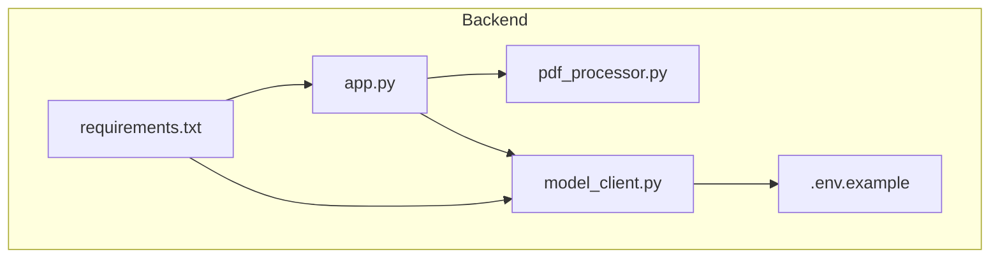
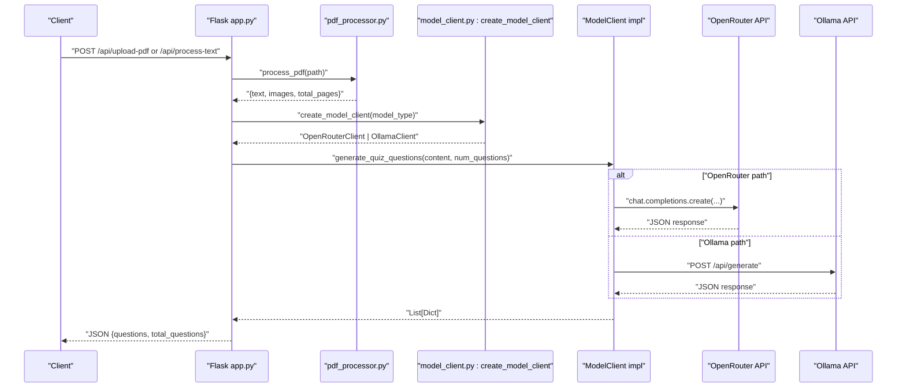
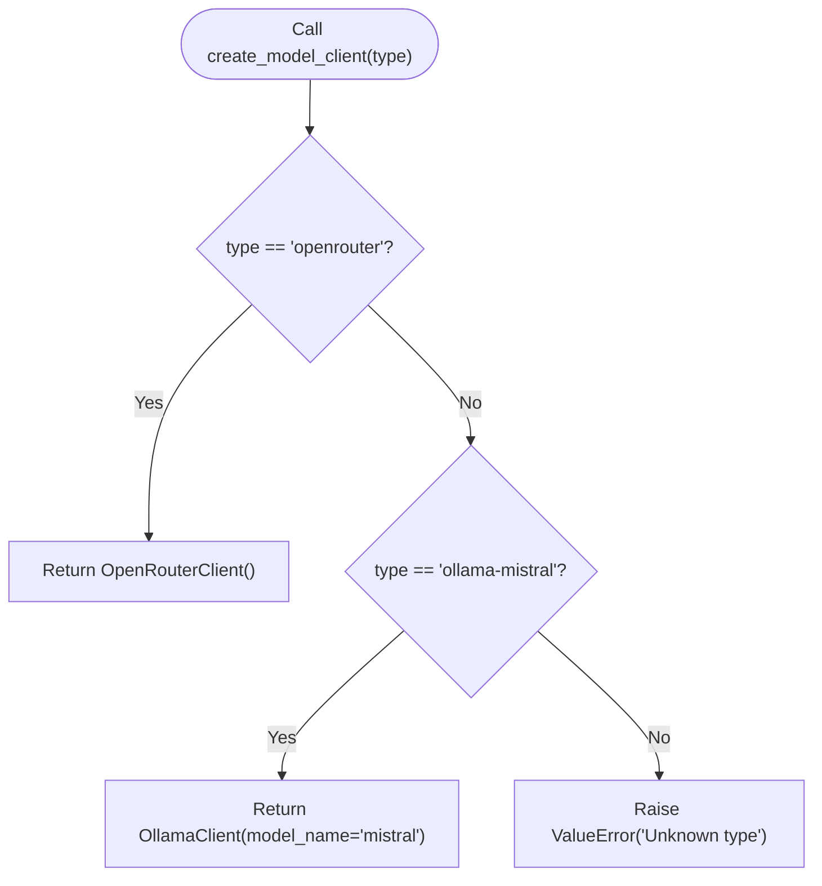
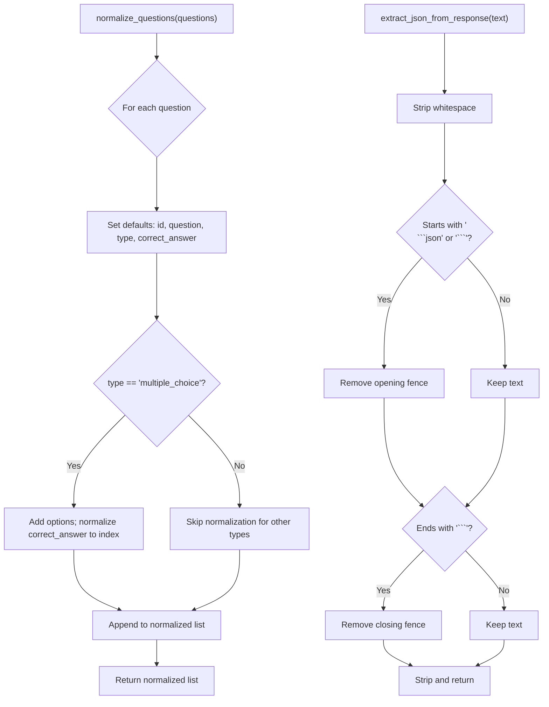
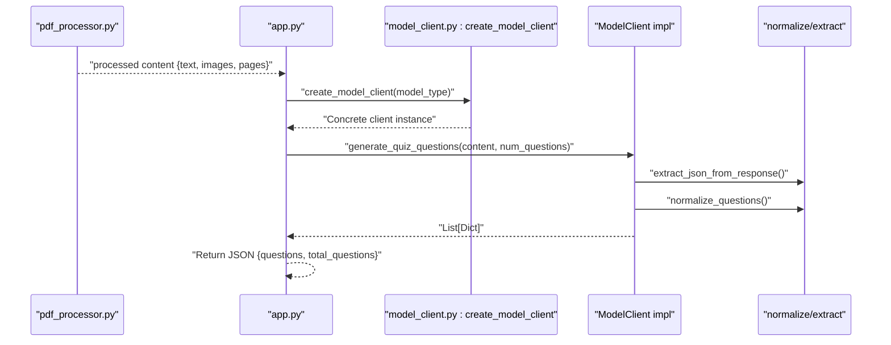
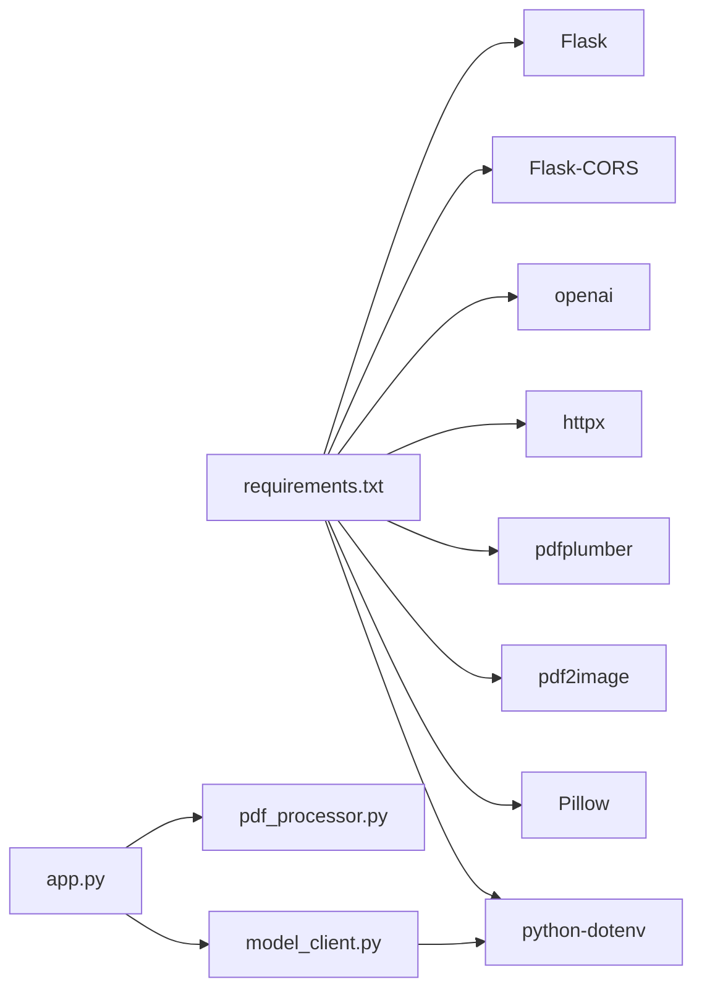

# AI Model Abstraction Layer

<cite>
**Referenced Files in This Document**
- [model_client.py](file://backend/model_client.py)
- [app.py](file://backend/app.py)
- [pdf_processor.py](file://backend/pdf_processor.py)
- [.env.example](file://backend/.env.example)
- [requirements.txt](file://backend/requirements.txt)
- [README.md](file://README.md)
- [TESTING.md](file://TESTING.md)
</cite>

## Table of Contents
1. [Introduction](#introduction)
2. [Project Structure](#project-structure)
3. [Core Components](#core-components)
4. [Architecture Overview](#architecture-overview)
5. [Detailed Component Analysis](#detailed-component-analysis)
6. [Dependency Analysis](#dependency-analysis)
7. [Performance Considerations](#performance-considerations)
8. [Troubleshooting Guide](#troubleshooting-guide)
9. [Conclusion](#conclusion)
10. [Appendices](#appendices)

## Introduction
This document explains the AI Model Abstraction Layer responsible for generating quiz questions from processed PDF content. It focuses on:
- The ModelClient abstract base class and its concrete implementations
- The Abstract Factory pattern used to select and instantiate clients
- OpenRouterClient behavior: API key management, dynamic model selection, and error handling for credit exhaustion
- OllamaClient behavior: health checks, timeouts, and local model fallback strategies
- Utility functions for consistent output formatting
- Example system prompts enforcing structured JSON output
- End-to-end data flow from PDF processing to AI-generated quiz questions
- Configuration requirements, error recovery strategies, and performance characteristics

## Project Structure
The AI abstraction layer resides in the backend module and integrates with the Flask application and PDF processor.

**Diagram sources**
- [app.py](file://backend/app.py#L1-L176)
- [model_client.py](file://backend/model_client.py#L1-L272)
- [pdf_processor.py](file://backend/pdf_processor.py#L1-L77)
- [.env.example](file://backend/.env.example#L1-L5)
- [requirements.txt](file://backend/requirements.txt#L1-L9)

**Section sources**
- [README.md](file://README.md#L1-L161)
- [app.py](file://backend/app.py#L1-L176)
- [model_client.py](file://backend/model_client.py#L1-L272)
- [pdf_processor.py](file://backend/pdf_processor.py#L1-L77)
- [.env.example](file://backend/.env.example#L1-L5)
- [requirements.txt](file://backend/requirements.txt#L1-L9)

## Core Components
- ModelClient (abstract base class): Defines the contract for generating quiz questions from processed content.
- OpenRouterClient: Cloud-based client using OpenRouter API with dynamic model selection and robust error handling.
- OllamaClient: Local client using Ollama API with health checks, timeouts, and model availability handling.
- Utility functions:
  - normalize_questions: Ensures consistent question structure and correct_answer indexing.
  - extract_json_from_response: Strips markdown code blocks and extracts JSON from model responses.
- Abstract factory: create_model_client selects and instantiates the appropriate client based on configuration.

Key responsibilities:
- Token optimization and prompt construction
- Structured JSON enforcement via system prompts
- Error recovery and user-friendly messaging
- Environment-driven configuration

**Section sources**
- [model_client.py](file://backend/model_client.py#L53-L272)
- [app.py](file://backend/app.py#L41-L51)

## Architecture Overview
The system orchestrates PDF processing and AI model generation through a clear separation of concerns.

**Diagram sources**
- [app.py](file://backend/app.py#L59-L118)
- [pdf_processor.py](file://backend/pdf_processor.py#L64-L77)
- [model_client.py](file://backend/model_client.py#L263-L272)
- [model_client.py](file://backend/model_client.py#L116-L152)
- [model_client.py](file://backend/model_client.py#L170-L261)

## Detailed Component Analysis

### Abstract Base Class: ModelClient
- Purpose: Define a uniform interface for model clients.
- Contract: generate_quiz_questions(pdf_content, num_questions) -> List[Dict].
- Enables polymorphism and easy substitution of implementations.

Implementation highlights:
- Abstract method declaration enforces consistent behavior across subclasses.

**Section sources**
- [model_client.py](file://backend/model_client.py#L53-L60)

### Concrete Implementation: OpenRouterClient
- Responsibilities:
  - Initialize OpenAI client with OpenRouter base URL and API key from environment.
  - Build compact system and user prompts to optimize tokens.
  - Dynamically select model:
    - Prefer gpt-4o-mini when no images are present.
    - Switch to gpt-4o when images are included.
  - Compute max_tokens proportional to num_questions up to a cap.
  - Extract and parse JSON from model response.
  - Normalize questions to a consistent format.
  - Robust error handling:
    - Detect credit exhaustion and suggest replenishing credits.
    - Raise actionable exceptions for invalid JSON and other failures.

Token optimization techniques:
- Limit text length sent to the model.
- Limit number of images sent.
- Adjust max_tokens based on num_questions.
- Use concise system prompts and JSON-only instructions.

Structured JSON enforcement:
- System prompt explicitly requires JSON output and defines the schema for questions.
- extract_json_from_response strips markdown code blocks before parsing.

Error handling:
- Catches JSON parsing errors and wraps them with context.
- Detects credit-related or token-related errors and raises user-friendly messages.
- Propagates other exceptions with clear context.

**Section sources**
- [model_client.py](file://backend/model_client.py#L62-L152)

### Concrete Implementation: OllamaClient
- Responsibilities:
  - Initialize HTTP client with a generous timeout suitable for local inference.
  - Health check: Verify Ollama availability by querying tags endpoint.
  - Build a system prompt and user prompt tailored for local models.
  - Send a single-shot generate request with temperature and token limits.
  - Robust error handling:
    - Raise if Ollama is unreachable.
    - Raise if response is empty or non-200.
    - Attempt to extract JSON from potentially malformed responses.
    - Detect missing local model and instruct installation.

Health check mechanism:
- GET /api/tags with short timeout to confirm service availability.

Timeout configuration:
- httpx.Client configured with a long timeout to accommodate local model latency.

Local model fallback strategy:
- If model not found, raise an exception with a clear instruction to pull the model.

**Section sources**
- [model_client.py](file://backend/model_client.py#L154-L261)

### Abstract Factory: create_model_client
- Pattern: Abstract Factory creates concrete instances based on configuration.
- Supported types:
  - "openrouter" -> OpenRouterClient
  - "ollama-mistral" -> OllamaClient(model_name="mistral")
- Raises ValueError for unknown types.

**Diagram sources**
- [model_client.py](file://backend/model_client.py#L263-L272)

**Section sources**
- [model_client.py](file://backend/model_client.py#L263-L272)

### Utility Functions: normalize_questions and extract_json_from_response
- normalize_questions:
  - Ensures presence of id, question, type, correct_answer.
  - Enforces type "multiple_choice".
  - Normalizes correct_answer from letter to numeric index.
  - Adds options for multiple choice.
- extract_json_from_response:
  - Removes markdown code fence markers.
  - Strips leading/trailing whitespace.
  - Returns sanitized JSON string for parsing.

**Diagram sources**
- [model_client.py](file://backend/model_client.py#L13-L36)
- [model_client.py](file://backend/model_client.py#L38-L51)

**Section sources**
- [model_client.py](file://backend/model_client.py#L13-L36)
- [model_client.py](file://backend/model_client.py#L38-L51)

### Data Flow: From PDF Content to Quiz Questions
- PDF processing:
  - Extract text and images from PDF.
  - Return unified content structure for downstream consumers.
- Application orchestration:
  - Validate parameters and model type.
  - Instantiate the selected model client via the factory.
  - Generate questions and return normalized results.
- Token optimization:
  - Cap text length and number of images.
  - Adjust max_tokens based on num_questions.
  - Use concise prompts and enforce JSON-only output.

**Diagram sources**
- [pdf_processor.py](file://backend/pdf_processor.py#L64-L77)
- [app.py](file://backend/app.py#L41-L51)
- [model_client.py](file://backend/model_client.py#L263-L272)
- [model_client.py](file://backend/model_client.py#L13-L36)
- [model_client.py](file://backend/model_client.py#L38-L51)

**Section sources**
- [pdf_processor.py](file://backend/pdf_processor.py#L1-L77)
- [app.py](file://backend/app.py#L41-L51)
- [model_client.py](file://backend/model_client.py#L116-L152)
- [model_client.py](file://backend/model_client.py#L170-L261)

### Example System Prompts for Quiz Generation
- Both OpenRouterClient and OllamaClient use a system prompt that:
  - Requires multiple-choice questions with four options.
  - Requests Russian-language output.
  - Enforces JSON-only responses with a specific schema for questions.
- These prompts are embedded in the respective client implementations and guide the model to produce structured, parseable output.

Note: The prompt text is intentionally not reproduced here; refer to the implementation files for the exact prompt content.

**Section sources**
- [model_client.py](file://backend/model_client.py#L80-L85)
- [model_client.py](file://backend/model_client.py#L181-L186)

## Dependency Analysis
- External libraries:
  - Flask and Flask-CORS for the web server
  - openai for OpenRouter API
  - httpx for Ollama HTTP requests
  - pdfplumber and pdf2image for PDF processing
  - Pillow for image handling
  - python-dotenv for environment loading
- Internal dependencies:
  - app.py depends on pdf_processor.py and model_client.py
  - model_client.py depends on environment variables (.env) and utility functions

**Diagram sources**
- [requirements.txt](file://backend/requirements.txt#L1-L9)
- [app.py](file://backend/app.py#L1-L176)
- [model_client.py](file://backend/model_client.py#L1-L272)

**Section sources**
- [requirements.txt](file://backend/requirements.txt#L1-L9)
- [app.py](file://backend/app.py#L1-L176)
- [model_client.py](file://backend/model_client.py#L1-L272)

## Performance Considerations
- Token budgeting:
  - OpenRouterClient caps text and images and scales max_tokens with num_questions.
  - OllamaClient increases num_predict proportionally with num_questions while capping it.
- Prompt efficiency:
  - Concise system prompts reduce overhead.
  - JSON-only instructions minimize ambiguity and parsing retries.
- Latency:
  - OllamaClient uses a longer timeout to handle local inference latency.
  - OpenRouterClient benefits from cloud throughput but may be constrained by rate limits and billing.
- Throughput:
  - Limiting num_questions reduces cost and latency.
  - Using gpt-4o-mini for text-only content reduces cost compared to gpt-4o.

[No sources needed since this section provides general guidance]

## Troubleshooting Guide
Common issues and resolutions:
- Missing environment variables:
  - OPENROUTER_API_KEY must be set for OpenRouterClient.
  - OllamaClient does not require an API key but expects Ollama running locally.
- Credit exhaustion (OpenRouter):
  - The client detects credit-related or token-related errors and suggests replenishing credits or reducing num_questions.
- Ollama unavailability:
  - Health check failure triggers an explicit error with guidance to start Ollama and ensure the model is pulled.
- Model not found (Ollama):
  - Clear error message instructs pulling the model.
- Empty or malformed responses:
  - extract_json_from_response removes fences; Ollama path attempts to locate JSON in the response body.
- Timeout exceeded (Ollama):
  - Long timeout is configured; if still exceeded, reduce num_questions or improve system performance.

Operational tips:
- Validate parameters (num_questions range and model_type) before invoking the generator.
- Ensure PDF processing succeeds and returns non-empty content.
- Use the health endpoint to verify API availability.

**Section sources**
- [app.py](file://backend/app.py#L26-L39)
- [app.py](file://backend/app.py#L166-L172)
- [model_client.py](file://backend/model_client.py#L66-L74)
- [model_client.py](file://backend/model_client.py#L170-L179)
- [model_client.py](file://backend/model_client.py#L246-L261)
- [model_client.py](file://backend/model_client.py#L141-L152)
- [README.md](file://README.md#L150-L161)
- [TESTING.md](file://TESTING.md#L268-L337)

## Conclusion
The AI Model Abstraction Layer cleanly separates concerns between PDF processing, model selection, and question generation. The Abstract Factory pattern enables seamless switching between OpenRouter and Ollama clients. Robust utilities ensure consistent, parseable output, while careful token management and error handling deliver reliable performance across cloud and local environments.

[No sources needed since this section summarizes without analyzing specific files]

## Appendices

### Configuration Requirements
- Environment:
  - OPENROUTER_API_KEY for cloud generation via OpenRouter.
  - Ollama must be installed and running locally; ensure the model is pulled.
- Limits:
  - Maximum number of questions is validated by the application.
  - PDF size and content limits are documented in the project README.

**Section sources**
- [.env.example](file://backend/.env.example#L1-L5)
- [README.md](file://README.md#L150-L161)
- [app.py](file://backend/app.py#L26-L39)

### Error Recovery Strategies
- Parameter validation prevents invalid requests.
- Client-side health checks and explicit error messages guide recovery.
- JSON extraction and normalization provide resilient parsing.
- Controlled timeouts and token budgets mitigate resource exhaustion.

**Section sources**
- [app.py](file://backend/app.py#L26-L39)
- [model_client.py](file://backend/model_client.py#L170-L179)
- [model_client.py](file://backend/model_client.py#L246-L261)
- [model_client.py](file://backend/model_client.py#L141-L152)