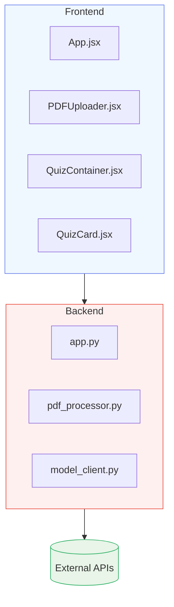
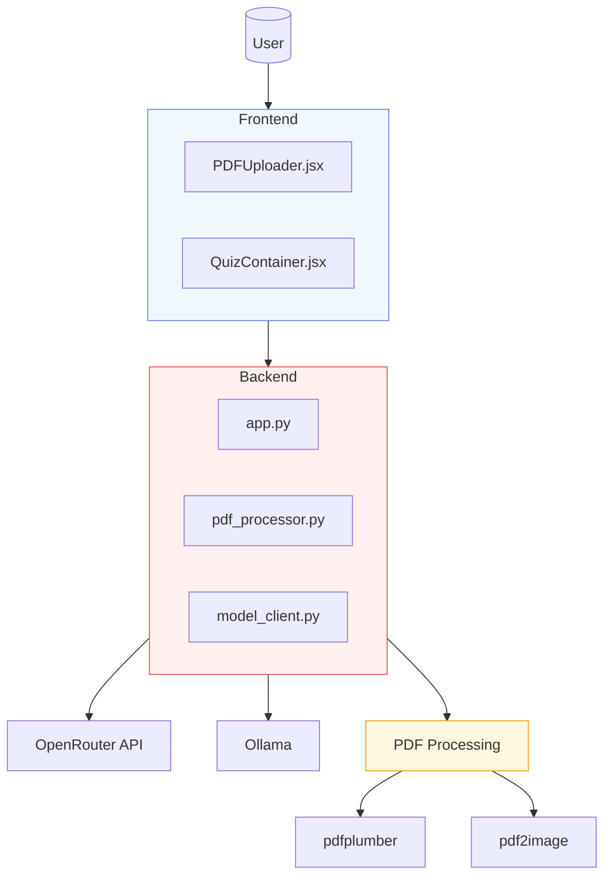
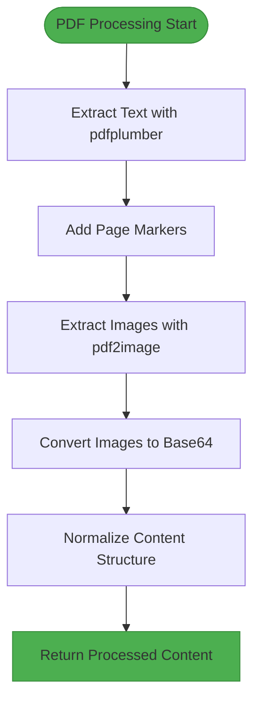
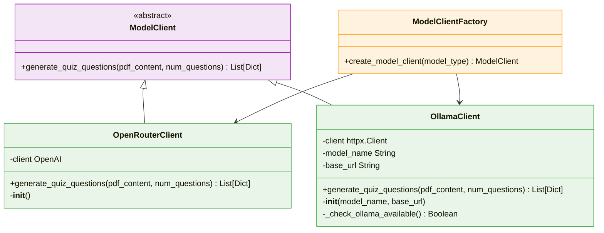
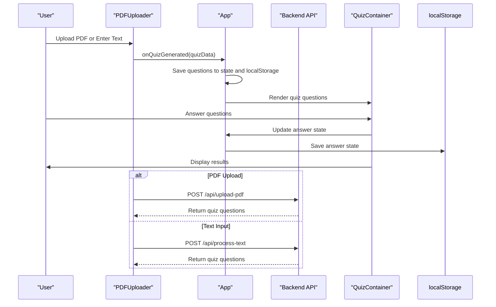
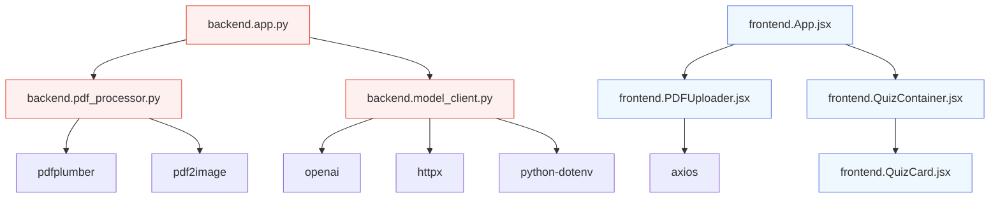

# Data Processing Pipeline

<cite>
**Referenced Files in This Document**   
- [app.py](file://backend/app.py)
- [pdf_processor.py](file://backend/pdf_processor.py)
- [model_client.py](file://backend/model_client.py)
- [PDFUploader.jsx](file://frontend/src/components/PDFUploader.jsx)
- [QuizContainer.jsx](file://frontend/src/components/QuizContainer.jsx)
- [App.jsx](file://frontend/src/App.jsx)
</cite>

## Table of Contents
1. [Introduction](#introduction)
2. [Project Structure](#project-structure)
3. [Core Components](#core-components)
4. [Architecture Overview](#architecture-overview)
5. [Detailed Component Analysis](#detailed-component-analysis)
6. [Dependency Analysis](#dependency-analysis)
7. [Performance Considerations](#performance-considerations)
8. [Troubleshooting Guide](#troubleshooting-guide)
9. [Conclusion](#conclusion)

## Introduction
The Quiz Generator application implements a comprehensive data processing pipeline that transforms user input (PDF documents or text) into interactive multiple-choice quizzes. The system features a robust backend built with Flask that handles document processing, AI model integration, and quiz generation, coupled with a React frontend that provides an intuitive user interface for interaction. The pipeline supports two AI model backends—OpenRouter (cloud-based GPT models) and Ollama (local Mistral 7B)—providing flexibility in deployment and usage. This document details the complete flow from user input through backend processing to quiz generation, including PDF processing, AI model abstraction, prompt engineering, data transformation, and error handling.

## Project Structure
The Quiz Generator application follows a clear separation between frontend and backend components, with well-defined responsibilities and interfaces. The backend directory contains the Flask application, PDF processing utilities, and AI model clients, while the frontend directory houses the React components and user interface elements. Configuration files and scripts support development, testing, and deployment workflows.

**Diagram sources**
- [App.jsx](file://frontend/src/App.jsx)
- [app.py](file://backend/app.py)

**Section sources**
- [app.py](file://backend/app.py)
- [PDFUploader.jsx](file://frontend/src/components/PDFUploader.jsx)

## Core Components
The core components of the Quiz Generator application include the Flask backend application, PDF processing module, AI model client abstraction, and React frontend components. These components work together to process user input, extract content, generate quizzes using AI models, and present the results in an interactive format. The system is designed with modularity in mind, allowing for easy extension and maintenance.

**Section sources**
- [app.py](file://backend/app.py)
- [pdf_processor.py](file://backend/pdf_processor.py)
- [model_client.py](file://backend/model_client.py)
- [PDFUploader.jsx](file://frontend/src/components/PDFUploader.jsx)

## Architecture Overview
The Quiz Generator application follows a client-server architecture with a React frontend communicating with a Flask backend via REST APIs. The backend processes user input through a series of well-defined stages: input validation, content extraction, AI model interaction, and response generation. The system supports multiple input methods (PDF upload and text entry) and multiple AI model backends (OpenRouter and Ollama), providing flexibility in usage and deployment.

**Diagram sources**
- [app.py](file://backend/app.py)
- [pdf_processor.py](file://backend/pdf_processor.py)
- [model_client.py](file://backend/model_client.py)
- [PDFUploader.jsx](file://frontend/src/components/PDFUploader.jsx)

## Detailed Component Analysis

### PDF Processing Component
The PDF processing component handles the extraction of text and images from uploaded PDF documents. It uses pdfplumber for text extraction and pdf2image for image extraction, converting the content into a structured format that can be used for quiz generation. The component normalizes the extracted content by adding page markers and converting images to base64 encoding for transmission to AI models.

**Diagram sources**
- [pdf_processor.py](file://backend/pdf_processor.py)

**Section sources**
- [pdf_processor.py](file://backend/pdf_processor.py)

### AI Model Client Abstraction
The AI model client abstraction provides a unified interface for interacting with different AI models, currently supporting OpenRouter (cloud-based GPT models) and Ollama (local Mistral 7B). The abstraction uses the Strategy pattern to route requests to the appropriate model based on configuration, with consistent error handling and response normalization across both implementations.

**Diagram sources**
- [model_client.py](file://backend/model_client.py)

**Section sources**
- [model_client.py](file://backend/model_client.py)

### Frontend Data Flow
The frontend data flow manages the user interaction from input submission through quiz presentation. The PDFUploader component collects user input and parameters, submits them to the backend, and handles the response. The QuizContainer component manages the quiz state, including user answers and progress, while the QuizCard component renders individual questions with interactive answer options.

**Diagram sources**
- [PDFUploader.jsx](file://frontend/src/components/PDFUploader.jsx)
- [App.jsx](file://frontend/src/App.jsx)
- [QuizContainer.jsx](file://frontend/src/components/QuizContainer.jsx)

**Section sources**
- [PDFUploader.jsx](file://frontend/src/components/PDFUploader.jsx)
- [App.jsx](file://frontend/src/App.jsx)
- [QuizContainer.jsx](file://frontend/src/components/QuizContainer.jsx)

## Dependency Analysis
The Quiz Generator application has a well-defined dependency structure with clear separation between frontend and backend components. The backend relies on several Python packages for PDF processing, AI model interaction, and web serving, while the frontend uses React and Axios for UI rendering and API communication. The system is designed to minimize coupling between components, allowing for independent development and testing.

**Diagram sources**
- [app.py](file://backend/app.py)
- [pdf_processor.py](file://backend/pdf_processor.py)
- [model_client.py](file://backend/model_client.py)
- [PDFUploader.jsx](file://frontend/src/components/PDFUploader.jsx)

**Section sources**
- [app.py](file://backend/app.py)
- [requirements.txt](file://backend/requirements.txt)
- [package.json](file://frontend/package.json)

## Performance Considerations
The Quiz Generator application includes several performance considerations to handle large documents and ensure responsive user experience. The system limits PDF file size to 50MB and restricts the number of questions to 20 to prevent excessive processing times. For large documents, the system truncates text content (4000 characters for OpenRouter, 8000 for Ollama) and limits image processing to the first two pages to manage token usage and processing time. The frontend displays a loading indicator during processing to provide user feedback.

**Section sources**
- [app.py](file://backend/app.py)
- [pdf_processor.py](file://backend/pdf_processor.py)
- [model_client.py](file://backend/model_client.py)

## Troubleshooting Guide
The Quiz Generator application includes comprehensive error handling and troubleshooting capabilities. Common issues include missing API keys, unavailable AI models, invalid input files, and processing errors. The system provides specific error messages for each scenario, guiding users toward resolution. For OpenRouter, users must provide a valid API key, while for Ollama, the local server must be running with the Mistral model loaded. The application validates input parameters and provides clear feedback for invalid inputs.

**Section sources**
- [app.py](file://backend/app.py)
- [model_client.py](file://backend/model_client.py)
- [PDFUploader.jsx](file://frontend/src/components/PDFUploader.jsx)

## Conclusion
The Quiz Generator application implements a robust data processing pipeline that transforms user input into interactive quizzes through a well-structured architecture. The system effectively separates concerns between frontend and backend components, provides flexibility in AI model selection, and includes comprehensive error handling and user feedback mechanisms. The modular design allows for easy extension and maintenance, making it a solid foundation for educational technology applications.