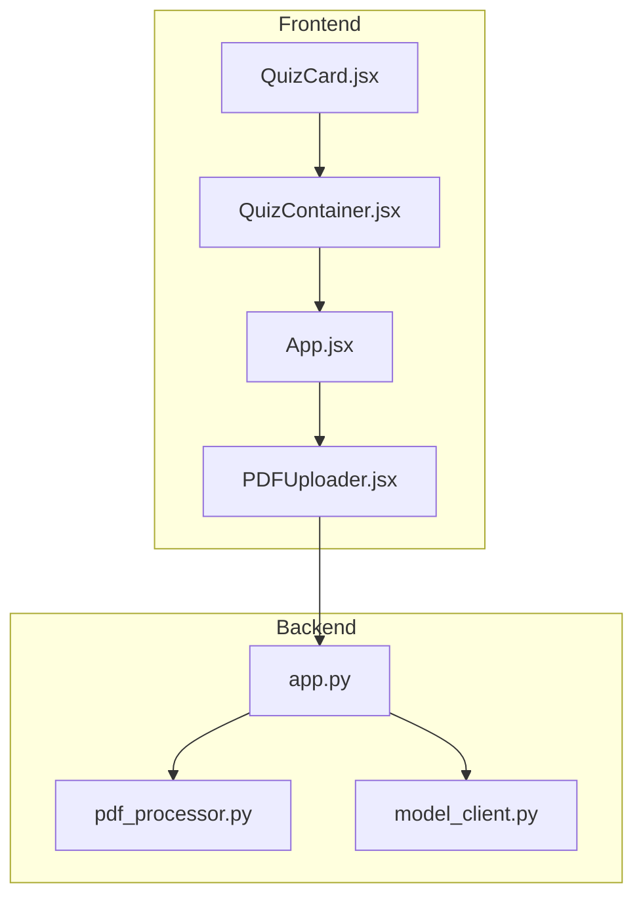
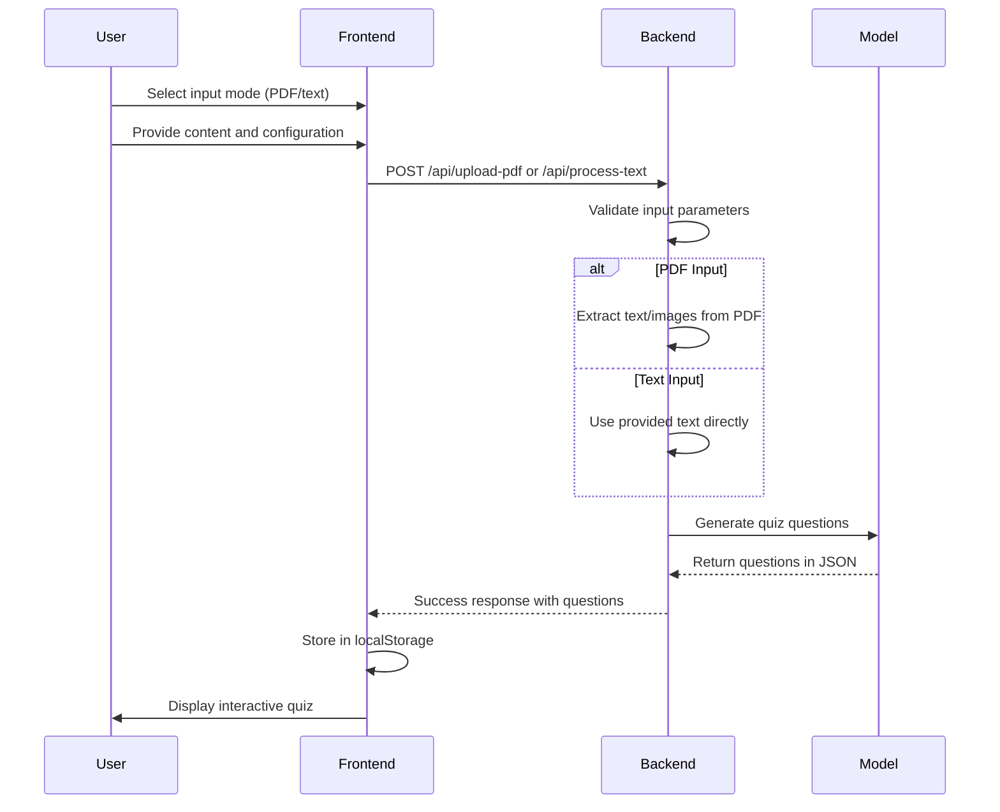
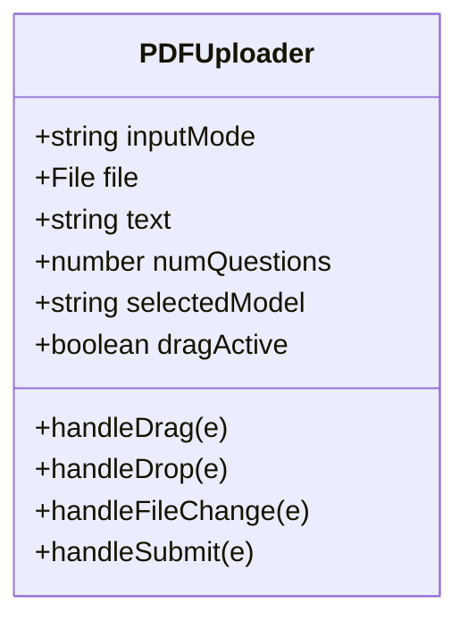
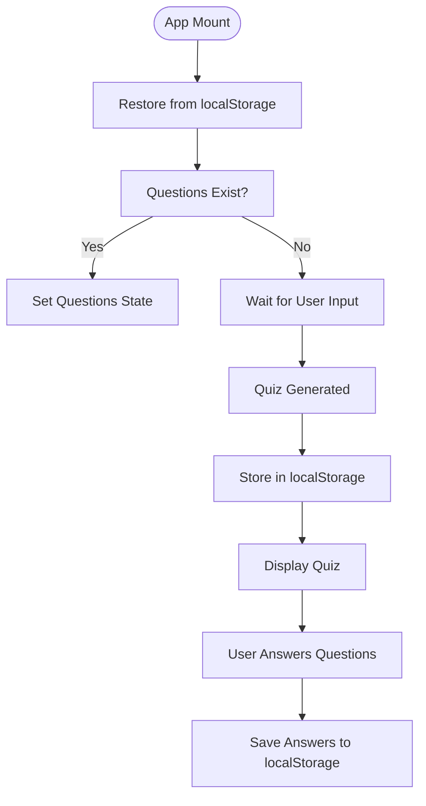
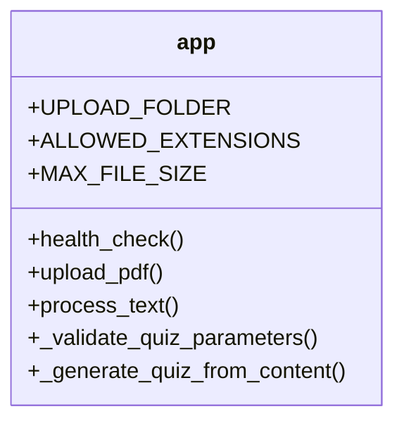
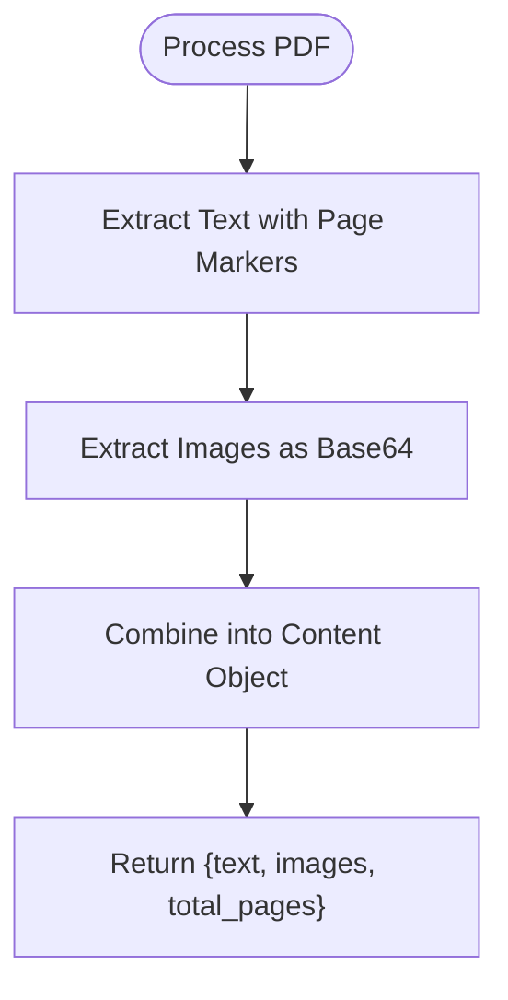
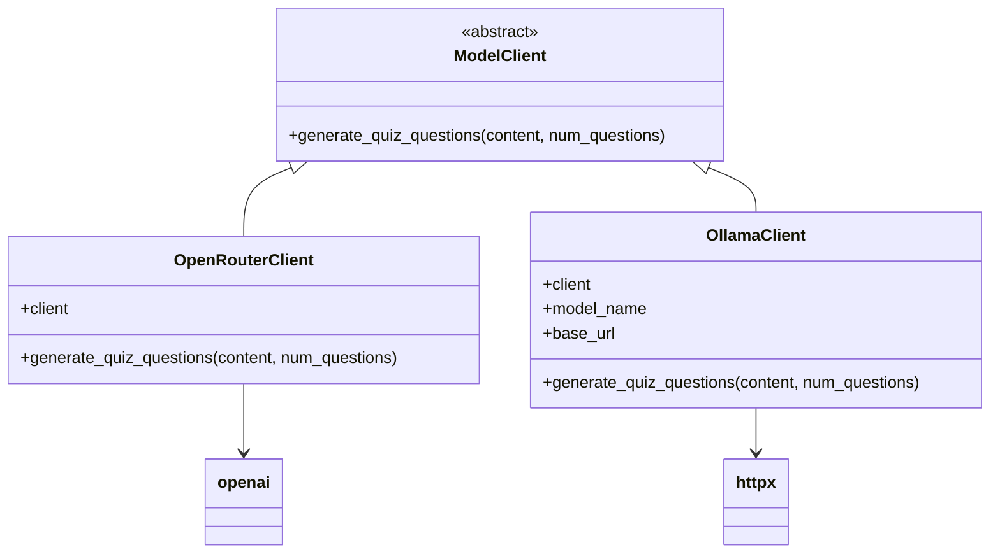
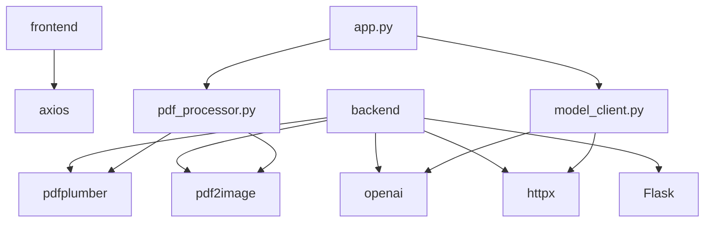

# Quiz Generation Pipeline

<cite>
**Referenced Files in This Document**   
- [PDFUploader.jsx](file://frontend/src/components/PDFUploader.jsx)
- [App.jsx](file://frontend/src/App.jsx)
- [QuizContainer.jsx](file://frontend/src/components/QuizContainer.jsx)
- [app.py](file://backend/app.py)
- [pdf_processor.py](file://backend/pdf_processor.py)
- [model_client.py](file://backend/model_client.py)
</cite>

## Table of Contents
1. [Introduction](#introduction)
2. [Project Structure](#project-structure)
3. [Core Components](#core-components)
4. [Architecture Overview](#architecture-overview)
5. [Detailed Component Analysis](#detailed-component-analysis)
6. [Dependency Analysis](#dependency-analysis)
7. [Performance Considerations](#performance-considerations)
8. [Troubleshooting Guide](#troubleshooting-guide)
9. [Conclusion](#conclusion)

## Introduction
The Quiz Generation Pipeline is a full-stack application that transforms user-provided content into interactive quizzes. The system supports two input modes: PDF document upload and direct text input. It leverages both cloud-based (OpenRouter) and local (Ollama) AI models to generate multiple-choice questions based on the provided content. The pipeline features a React frontend for user interaction and a Flask backend for processing, with comprehensive state management and error handling throughout the workflow.

## Project Structure
The project follows a standard full-stack architecture with separate frontend and backend directories. The frontend is built with React and includes components for PDF upload, quiz display, and user interaction. The backend uses Flask to expose REST APIs for processing content and generating quizzes. Key components include the PDF processor for extracting text and images, and the model client abstraction for interfacing with different AI models.



**Diagram sources**
- [PDFUploader.jsx](file://frontend/src/components/PDFUploader.jsx)
- [app.py](file://backend/app.py)
- [pdf_processor.py](file://backend/pdf_processor.py)
- [model_client.py](file://backend/model_client.py)

**Section sources**
- [PDFUploader.jsx](file://frontend/src/components/PDFUploader.jsx)
- [app.py](file://backend/app.py)

## Core Components
The core components of the Quiz Generation Pipeline include the PDFUploader component for handling user input, the App component for state management, and the backend services for content processing and quiz generation. The system orchestrates data flow from user interface through API requests to backend processing and back to the frontend for display.

**Section sources**
- [PDFUploader.jsx](file://frontend/src/components/PDFUploader.jsx)
- [App.jsx](file://frontend/src/App.jsx)
- [app.py](file://backend/app.py)

## Architecture Overview
The Quiz Generation Pipeline follows a client-server architecture where the React frontend communicates with the Flask backend via REST APIs. The system processes user content through a series of steps: input validation, content extraction, AI-based question generation, and quiz rendering. The architecture supports both PDF and text input modes, with different processing paths that converge on the same quiz generation logic.



**Diagram sources**
- [PDFUploader.jsx](file://frontend/src/components/PDFUploader.jsx)
- [app.py](file://backend/app.py)
- [pdf_processor.py](file://backend/pdf_processor.py)
- [model_client.py](file://backend/model_client.py)

## Detailed Component Analysis

### Frontend Input Handling
The PDFUploader component manages user input through a comprehensive interface that supports both file upload and text input modes. It maintains state for input mode, file selection, text content, number of questions, and model selection. The component provides drag-and-drop functionality for PDF files and real-time validation of user inputs.



**Diagram sources**
- [PDFUploader.jsx](file://frontend/src/components/PDFUploader.jsx)

**Section sources**
- [PDFUploader.jsx](file://frontend/src/components/PDFUploader.jsx)

### State Management and Persistence
The App component manages the global application state, including quiz questions, loading status, and error messages. It implements persistence using localStorage to maintain quiz state across page refreshes. The component handles callbacks from the PDFUploader for quiz generation, errors, and loading states.



**Diagram sources**
- [App.jsx](file://frontend/src/App.jsx)

**Section sources**
- [App.jsx](file://frontend/src/App.jsx)
- [QuizContainer.jsx](file://frontend/src/components/QuizContainer.jsx)

### Backend API Endpoints
The Flask application exposes two primary endpoints for quiz generation: `/api/upload-pdf` for PDF file processing and `/api/process-text` for direct text input. Both endpoints validate input parameters and delegate to shared quiz generation logic. The backend also includes a health check endpoint for monitoring.



**Diagram sources**
- [app.py](file://backend/app.py)

**Section sources**
- [app.py](file://backend/app.py)

### PDF Processing Pipeline
The pdf_processor module extracts both text and images from PDF documents. Text extraction includes page markers to preserve document structure, while image extraction converts pages to PNG format and encodes them in base64. The processor returns a unified content structure regardless of input type.



**Diagram sources**
- [pdf_processor.py](file://backend/pdf_processor.py)

**Section sources**
- [pdf_processor.py](file://backend/pdf_processor.py)

### Model Orchestration
The model_client module provides an abstraction layer for different AI models through the ModelClient interface. It supports OpenRouter (cloud-based) and Ollama (local) models, with factory methods to create appropriate clients based on configuration. The system normalizes responses from different models into a consistent quiz format.



**Diagram sources**
- [model_client.py](file://backend/model_client.py)

**Section sources**
- [model_client.py](file://backend/model_client.py)

## Dependency Analysis
The Quiz Generation Pipeline has a clear dependency hierarchy with well-defined interfaces between components. The frontend depends on axios for HTTP requests, while the backend uses Flask for web services and various libraries for PDF processing and AI integration. The model_client abstraction minimizes direct dependencies on specific AI providers.



**Diagram sources**
- [app.py](file://backend/app.py)
- [pdf_processor.py](file://backend/pdf_processor.py)
- [model_client.py](file://backend/model_client.py)
- [requirements.txt](file://backend/requirements.txt)

**Section sources**
- [app.py](file://backend/app.py)
- [pdf_processor.py](file://backend/pdf_processor.py)
- [model_client.py](file://backend/model_client.py)
- [requirements.txt](file://backend/requirements.txt)

## Performance Considerations
The system implements several performance optimizations, including content truncation for AI processing (4000 characters for OpenRouter, 8000 for Ollama), image sampling (first 2 pages only for OpenRouter), and token limit calculations based on question count. The frontend shows loading states during processing, and the backend uses temporary storage for uploaded files.

## Troubleshooting Guide
The Quiz Generation Pipeline includes comprehensive error handling for various edge cases:

**Section sources**
- [PDFUploader.jsx](file://frontend/src/components/PDFUploader.jsx)
- [app.py](file://backend/app.py)
- [model_client.py](file://backend/model_client.py)

### Common Issues and Solutions
| Issue | Cause | Solution |
|------|------|----------|
| Empty PDF error | Document has no extractable text or images | Verify PDF contains readable content |
| Invalid text input | Empty or whitespace-only text | Ensure text field contains content |
| Network failure | Backend unreachable or timeout | Check server status and network connection |
| Credit exhaustion | OpenRouter API key has insufficient credits | Purchase additional credits at openrouter.ai |
| Model not found | Ollama model not installed | Run `ollama pull mistral` to install model |
| File size exceeded | PDF larger than 50MB | Reduce file size before uploading |

### HTTP Request/Response Examples
**PDF Upload Request:**
```
POST /api/upload-pdf
Content-Type: multipart/form-data

Form Data:
- file: [PDF file]
- num_questions: 10
- model_type: openrouter
```

**PDF Upload Response (Success):**
```json
{
  "success": true,
  "questions": [
    {
      "id": 1,
      "question": "Sample question?",
      "type": "multiple_choice",
      "options": ["Option A", "Option B", "Option C", "Option D"],
      "correct_answer": 0
    }
  ],
  "total_questions": 1
}
```

**Text Input Request:**
```json
POST /api/process-text
Content-Type: application/json

{
  "text": "Sample text content",
  "num_questions": 10,
  "model_type": "ollama-mistral"
}
```

**Error Response:**
```json
{
  "error": "PDF документ пуст или не может быть обработан"
}
```

## Conclusion
The Quiz Generation Pipeline provides a robust solution for transforming document content into interactive quizzes. The system effectively connects frontend user interfaces with backend processing services through well-defined APIs. Key strengths include support for multiple input modes, flexible model selection, comprehensive error handling, and persistent state management. The architecture allows for easy extension to additional AI models or input formats in the future.