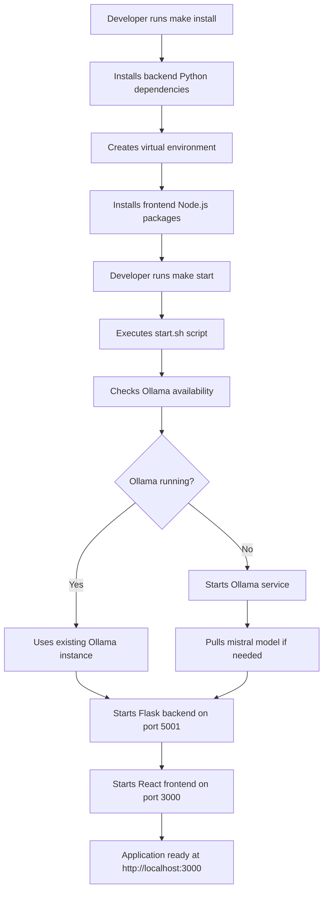
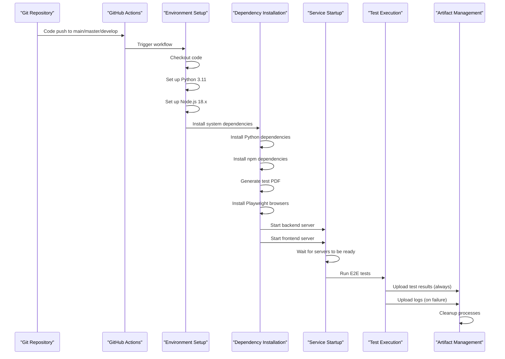
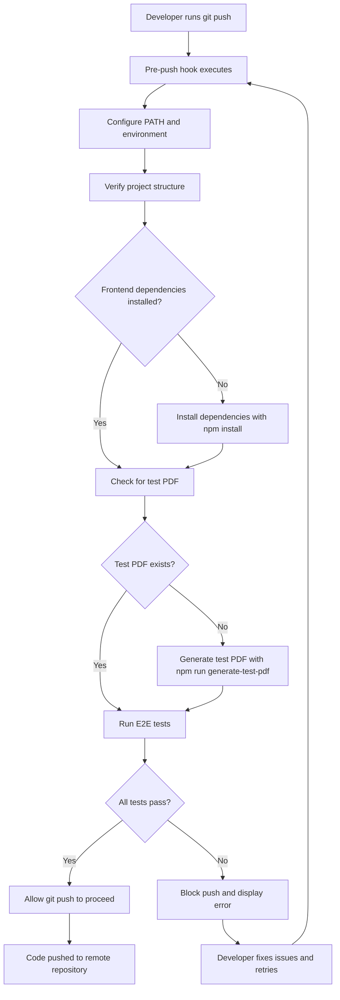

# Deployment Workflow

<cite>
**Referenced Files in This Document**   
- [start.sh](file://start.sh)
- [Makefile](file://Makefile)
- [README.md](file://README.md)
- [.github/workflows/tests.yml](file://.github/workflows/tests.yml)
- [backend/.env.example](file://backend/.env.example)
- [backend/app.py](file://backend/app.py)
- [.git/hooks/pre-commit](file://.git/hooks/pre-commit)
- [.git/hooks/pre-push](file://.git/hooks/pre-push)
</cite>

## Table of Contents
1. [Introduction](#introduction)
2. [Local Development Deployment](#local-development-deployment)
3. [Production Deployment Considerations](#production-deployment-considerations)
4. [CI/CD Pipeline Configuration](#cicd-pipeline-configuration)
5. [Environment Setup and Configuration](#environment-setup-and-configuration)
6. [Monitoring and Logging](#monitoring-and-logging)
7. [Rollback Procedures and Version Management](#rollback-procedures-and-version-management)
8. [Pre-Push Hook Workflow](#pre-push-hook-workflow)
9. [Deployment Commands and Expected Output](#deployment-commands-and-expected-output)
10. [Conclusion](#conclusion)

## Introduction
The Quiz Generator application is a full-stack web application that enables users to generate quizzes from PDF documents using AI models. This document provides comprehensive documentation for the deployment workflow, covering both local development and production scenarios. The deployment process is streamlined through automation tools including a start script, Makefile commands, Git hooks, and a GitHub Actions CI/CD pipeline. The application architecture consists of a Flask backend (running on port 5001) and a React frontend (running on port 3000), with optional integration with Ollama for local model processing. The deployment workflow emphasizes code quality through automated testing and validation at multiple stages.

**Section sources**
- [README.md](file://README.md#L1-L161)

## Local Development Deployment

The local development deployment process is designed to be simple and automated, allowing developers to quickly set up and run the entire application stack. The primary method for local deployment is through the `start.sh` script, which orchestrates the startup of all required services. The process begins with dependency installation using the `make install` command, which installs both backend Python dependencies (in a virtual environment) and frontend Node.js packages. The `start.sh` script performs several key functions: it checks for the existence of the backend virtual environment, installs frontend dependencies if missing, verifies and starts the Ollama service (if available), and launches both the Flask backend and React frontend servers. The script uses color-coded output to provide clear status information and handles process cleanup on termination. Alternative deployment methods include using the `make start` command, which leverages npm scripts to execute the start script, or running the services independently using direct Python and npm commands. The local development environment automatically configures the frontend to proxy API requests to the backend on port 5001.

**Diagram sources**
- [start.sh](file://start.sh#L1-L213)
- [Makefile](file://Makefile#L1-L94)
- [package.json](file://package.json#L1-L30)

**Section sources**
- [start.sh](file://start.sh#L1-L213)
- [Makefile](file://Makefile#L1-L94)
- [README.md](file://README.md#L38-L65)

## Production Deployment Considerations

While the current configuration is optimized for local development, several considerations must be addressed for production deployment. The application would require containerization using Docker to ensure consistent deployment across environments, with separate containers for the backend, frontend, and optionally Ollama. Service orchestration would be managed through Docker Compose or Kubernetes, with proper networking configuration to enable communication between services. Environment variables for production would be securely managed through a secrets management system rather than file-based .env configuration. The production deployment would require a reverse proxy (such as Nginx) to handle SSL termination, load balancing, and routing requests to the appropriate services. Database persistence would need to be implemented for user data and quiz history, which is currently not included in the application. The production environment would also require a production-grade WSGI server (such as Gunicorn) for the Flask application instead of the development server. Monitoring and alerting would be implemented using tools like Prometheus and Grafana, with health checks configured for both frontend and backend services. The deployment process would follow a blue-green or canary deployment strategy to minimize downtime and enable quick rollbacks if issues are detected.

**Section sources**
- [backend/app.py](file://backend/app.py#L1-L176)
- [start.sh](file://start.sh#L1-L213)
- [README.md](file://README.md#L13-L158)

## CI/CD Pipeline Configuration

The CI/CD pipeline is configured in `.github/workflows/tests.yml` and automates testing and validation on code pushes to specified branches. The pipeline runs on Ubuntu latest runners and uses a matrix strategy to test against specific Node.js (18.x) and Python (3.11) versions. The workflow is triggered on push events to the main, master, and develop branches, as well as on pull requests to these branches. The pipeline execution follows a structured sequence: it begins with code checkout, followed by the setup of Python and Node.js environments with dependency caching for improved performance. System dependencies, including poppler-utils for PDF processing, are installed before proceeding to application dependencies. The pipeline installs Python dependencies by creating a virtual environment and installing packages from requirements.txt, then installs root and frontend npm dependencies using npm ci for reproducible installations. A test PDF is generated using the generate-test-pdf script before the Playwright browsers are installed. The backend and frontend servers are started as background processes with appropriate environment variables, including the OPENROUTER_API_KEY secret. A wait step ensures both servers are responsive before executing the E2E tests. On completion, the pipeline uploads test reports as artifacts and server logs in case of failures, followed by a cleanup step to terminate running processes. This comprehensive pipeline ensures that all code changes are thoroughly tested in an environment that closely mirrors production.

**Diagram sources**
- [.github/workflows/tests.yml](file://.github/workflows/tests.yml#L1-L120)
- [package.json](file://package.json#L1-L30)
- [backend/requirements.txt](file://backend/requirements.txt#L1-L9)

**Section sources**
- [.github/workflows/tests.yml](file://.github/workflows/tests.yml#L1-L120)
- [TESTING.md](file://TESTING.md#L1-L337)

## Environment Setup and Configuration

Environment setup and configuration are critical components of the deployment workflow, ensuring that the application has access to necessary dependencies and credentials. The primary configuration file is `backend/.env`, with `backend/.env.example` providing a template that includes the OPENROUTER_API_KEY variable for accessing cloud-based models. For local development, developers must create the `.env` file and populate it with their API key from OpenRouter. The application also supports local model processing through Ollama, which requires installing the Ollama service and pulling the mistral model using `ollama pull mistral`. System dependencies include Python 3.8+, Node.js 16+, and poppler for PDF image extraction (installable via `brew install poppler` on macOS). The Makefile provides convenient commands for environment management: `make install` for dependency installation, `make check` for verifying the setup, and `make setup-hooks` for configuring Git hooks. The `make check` command validates the presence of node_modules directories and the backend virtual environment, ensuring all prerequisites are met before deployment. For testing environments, additional configuration is required for smoke tests, which can be enabled by setting `ENABLE_OLLAMA_TESTS=true` in the `.env` file or providing the OPENROUTER_API_KEY. The environment configuration is designed to be flexible, allowing developers to choose between cloud-based and local AI models based on their preferences and system capabilities.

**Section sources**
- [backend/.env.example](file://backend/.env.example#L1-L5)
- [Makefile](file://Makefile#L1-L94)
- [README.md](file://README.md#L13-L37)

## Monitoring and Logging

The application provides basic monitoring and logging capabilities for deployed instances, with logs written to files in the project root directory. The `start.sh` script configures logging for all major components: backend server output is redirected to `backend.log`, frontend server output to `frontend.log`, and Ollama service output to `ollama.log`. These log files capture startup information, runtime messages, and error details, providing visibility into the application's operation. The script displays the location of these log files in its output, making them easily accessible for troubleshooting. For monitoring, the backend exposes a health check endpoint at `/api/health` that returns a simple status response, which can be used for service availability monitoring. The GitHub Actions pipeline leverages this endpoint in its "Wait for servers to be ready" step, demonstrating its utility for automated health checks. While the current logging implementation is file-based and suitable for development, a production deployment would require more sophisticated monitoring with centralized log aggregation, structured logging, and real-time alerting. The application's error handling in the Flask backend includes detailed error responses with status codes, which are captured in the logs and can be used for diagnosing issues. For comprehensive monitoring in production, integration with services like Sentry for error tracking and Prometheus for metrics collection would be recommended.

**Section sources**
- [start.sh](file://start.sh#L1-L213)
- [backend/app.py](file://backend/app.py#L53-L57)
- [.github/workflows/tests.yml](file://.github/workflows/tests.yml#L1-L120)

## Rollback Procedures and Version Management

The deployment workflow incorporates version management and rollback procedures through Git-based practices and automated testing. The primary rollback mechanism is Git itself, with developers able to revert to previous commits or branches in case of deployment issues. The pre-push Git hook serves as a first line of defense by running E2E tests before allowing code to be pushed to the remote repository, preventing broken code from entering the codebase. If an issue is detected after deployment, the rollback process involves checking out a previous stable commit and redeploying. The GitHub Actions CI/CD pipeline provides an additional safety net by automatically testing all code changes, with failed builds preventing problematic code from being merged. Version management follows a conventional commits approach as outlined in CONTRIBUTING.md, with commit messages structured to indicate the type and scope of changes (e.g., `feat(api): add endpoint`, `fix(parser): handle empty input`). This practice enables automated changelog generation and helps maintain a clear history of changes. The application does not currently implement database migrations or state management, simplifying the rollback process as there is no persistent data to manage. For production scenarios, a more sophisticated version management strategy would be required, potentially including semantic versioning, release branches, and feature flags to enable gradual rollouts and easier rollbacks.

**Section sources**
- [.git/hooks/pre-push](file://.git/hooks/pre-push#L1-L84)
- [.github/workflows/tests.yml](file://.github/workflows/tests.yml#L1-L120)
- [CONTRIBUTING.md](file://CONTRIBUTING.md#L1-L54)

## Pre-Push Hook Workflow

The pre-push hook workflow is a critical component of the deployment process, ensuring code quality before changes are shared with the team. Implemented in `.git/hooks/pre-push`, this bash script automatically executes when a developer attempts to push code to the remote repository. The hook operates in a minimal environment, so it explicitly configures the PATH to locate npm and handles cases where nvm is used for Node.js version management. Before running tests, the hook verifies the project structure and ensures that frontend dependencies are installed, automatically installing them if missing. It also checks for the presence of the test PDF file, generating it if necessary to ensure tests can run successfully. The hook then executes E2E tests, specifically running the core test files (quiz-flow.spec.js, text-input-flow.spec.js, and navigation.spec.js) while excluding smoke tests that require external API keys. If all tests pass, the push proceeds; if any test fails, the push is blocked, and the developer must fix the issues before retrying. This workflow prevents broken code from entering the shared repository and ensures that all changes meet the quality standards. Developers can bypass the hook using `git push --no-verify`, but this is discouraged except in emergency situations. The pre-push hook works in conjunction with the pre-commit hook, which performs faster syntax checks, creating a multi-layered quality assurance process.

**Diagram sources**
- [.git/hooks/pre-push](file://.git/hooks/pre-push#L1-L84)
- [.git/hooks/pre-commit](file://.git/hooks/pre-commit#L1-L76)
- [TESTING.md](file://TESTING.md#L1-L337)

**Section sources**
- [.git/hooks/pre-push](file://.git/hooks/pre-push#L1-L84)
- [.git/hooks/pre-commit](file://.git/hooks/pre-commit#L1-L76)
- [TESTING.md](file://TESTING.md#L88-L123)

## Deployment Commands and Expected Output

The deployment workflow provides several commands for different scenarios, each with specific expected outputs. The `make install` command installs all dependencies and should output confirmation that Python and Node.js packages have been successfully installed. The `make check` command verifies the installation and displays a success message if all dependencies are present. The primary deployment command, `make start`, executes the `start.sh` script and produces color-coded output showing the startup sequence: checking Ollama availability, starting the backend server on port 5001, and starting the frontend server on port 3000. Upon successful startup, it displays the URLs for all services and instructions for stopping the servers. The `make test` command runs E2E tests and shows the test results, with a success message if all tests pass. The `make setup-hooks` command configures the Git hooks and confirms their installation. When the pre-push hook runs, it displays progress messages for dependency checks, PDF generation, and test execution, concluding with either a success message allowing the push to proceed or an error message blocking the push. The GitHub Actions pipeline output includes detailed logs of each workflow step, with clear indications of success or failure, and automatically uploads test reports and logs as artifacts for further analysis. These consistent outputs provide clear feedback at each stage of the deployment process, helping developers quickly identify and resolve issues.

**Section sources**
- [Makefile](file://Makefile#L1-L94)
- [start.sh](file://start.sh#L1-L213)
- [.github/workflows/tests.yml](file://.github/workflows/tests.yml#L1-L120)

## Conclusion

The Quiz Generator application features a comprehensive deployment workflow that balances ease of use with robust quality assurance. The local development setup is streamlined through the `start.sh` script and Makefile commands, allowing developers to quickly launch the full stack with minimal configuration. The CI/CD pipeline in GitHub Actions ensures that all code changes are automatically tested in a consistent environment, while Git hooks provide an additional layer of quality control at the developer's workstation. The pre-push hook workflow is particularly effective, preventing broken code from entering the repository by running comprehensive E2E tests before each push. For production deployment, the application would require enhancements including containerization, proper secrets management, and a production-grade server configuration. The current logging and monitoring capabilities are sufficient for development but would need to be expanded for production use. Overall, the deployment workflow demonstrates best practices in modern web application deployment, with automated testing, clear environment configuration, and effective rollback procedures. By following this documented workflow, developers can ensure reliable and consistent deployments while maintaining high code quality standards.