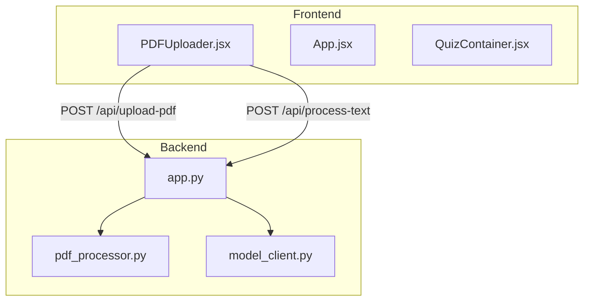
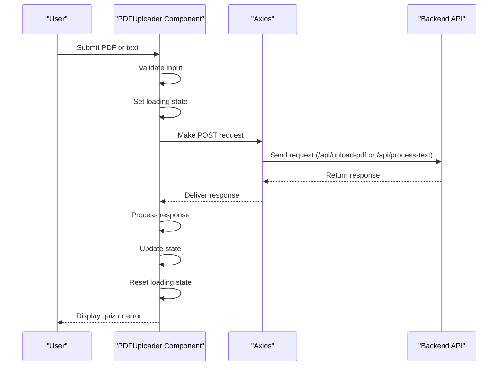
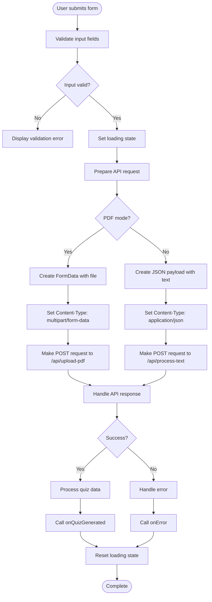
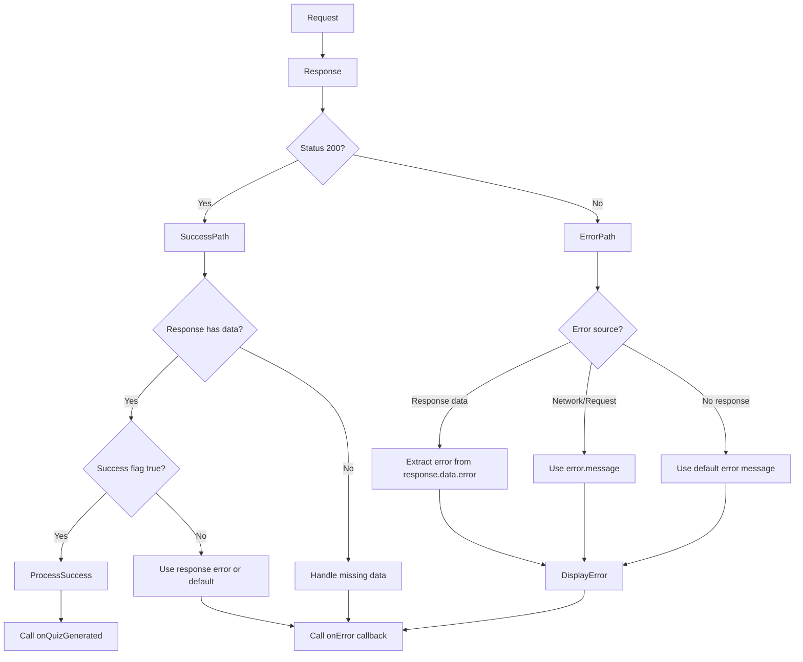
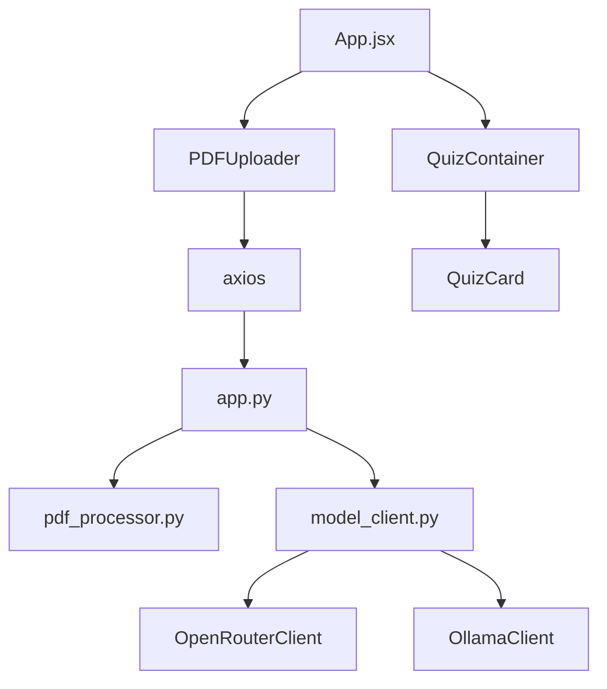

# API Integration

<cite>
**Referenced Files in This Document**   
- [PDFUploader.jsx](file://frontend/src/components/PDFUploader.jsx)
- [App.jsx](file://frontend/src/App.jsx)
- [app.py](file://backend/app.py)
- [pdf_processor.py](file://backend/pdf_processor.py)
- [model_client.py](file://backend/model_client.py)
- [QuizContainer.jsx](file://frontend/src/components/QuizContainer.jsx)
</cite>

## Table of Contents
1. [Introduction](#introduction)
2. [Project Structure](#project-structure)
3. [Core Components](#core-components)
4. [Architecture Overview](#architecture-overview)
5. [Detailed Component Analysis](#detailed-component-analysis)
6. [Dependency Analysis](#dependency-analysis)
7. [Performance Considerations](#performance-considerations)
8. [Troubleshooting Guide](#troubleshooting-guide)
9. [Conclusion](#conclusion)

## Introduction
This document provides comprehensive documentation for the frontend's API integration with the backend service in the Quiz application. It details how the PDFUploader component uses axios to communicate with backend endpoints for processing PDF files and text content. The documentation covers request construction, error handling, loading state management, and data transformation from API responses to application state. The system supports two modes of content input: PDF file uploads and direct text input, both processed through dedicated backend endpoints.

## Project Structure
The project follows a standard React frontend with a Flask backend architecture. The frontend is located in the `frontend/` directory with React components in `frontend/src/components/`, while the backend services are implemented in the `backend/` directory. The API integration primarily occurs between the PDFUploader component and the backend's `/api/upload-pdf` and `/api/process-text` endpoints.



**Diagram sources**
- [PDFUploader.jsx](file://frontend/src/components/PDFUploader.jsx)
- [app.py](file://backend/app.py)

**Section sources**
- [PDFUploader.jsx](file://frontend/src/components/PDFUploader.jsx)
- [app.py](file://backend/app.py)

## Core Components
The core API integration functionality is implemented in the PDFUploader component, which handles both file uploads and text processing requests. The component uses axios to make POST requests to the backend, manages loading states through callback functions, and processes API responses to generate quiz content. The integration supports two distinct workflows: uploading PDF files using multipart/form-data and submitting text content via JSON payloads.

**Section sources**
- [PDFUploader.jsx](file://frontend/src/components/PDFUploader.jsx)
- [app.py](file://backend/app.py)

## Architecture Overview
The API integration architecture follows a client-server model where the React frontend communicates with a Flask backend through RESTful endpoints. The PDFUploader component serves as the primary interface for API interactions, coordinating between user input and backend processing. When a user submits content (either a PDF file or text), the component constructs an appropriate HTTP request with the correct content type and payload format, sends it to the corresponding backend endpoint, and handles the response or any errors that occur during the request.



**Diagram sources**
- [PDFUploader.jsx](file://frontend/src/components/PDFUploader.jsx)
- [app.py](file://backend/app.py)

## Detailed Component Analysis

### PDFUploader Component Analysis
The PDFUploader component is responsible for managing the entire API integration workflow, from request construction to response handling. It supports two input modes (PDF and text) that determine which backend endpoint is called and how the request payload is structured.

#### API Request Flow


**Diagram sources**
- [PDFUploader.jsx](file://frontend/src/components/PDFUploader.jsx)
- [app.py](file://backend/app.py)

**Section sources**
- [PDFUploader.jsx](file://frontend/src/components/PDFUploader.jsx)

### Request Construction and Payload Handling
The PDFUploader component dynamically constructs API requests based on the input mode. For PDF uploads, it uses FormData to send files with the appropriate multipart/form-data content type. For text processing, it sends JSON payloads with application/json content type.

#### FormData Construction for PDF Uploads
When uploading a PDF file, the component creates a FormData object containing the file and associated parameters:

```mermaid
classDiagram
class FormData {
+append(key : string, value : any)
+append(file : File)
+append(num_questions : number)
+append(model_type : string)
}
class RequestConfig {
+headers : {
'Content-Type' : 'multipart/form-data'
}
}
PDFUploader --> FormData : "Constructs"
PDFUploader --> RequestConfig : "Uses"
FormData -->|POST| "/api/upload-pdf"
```

**Diagram sources**
- [PDFUploader.jsx](file://frontend/src/components/PDFUploader.jsx)

#### JSON Payload Construction for Text Processing
When processing text input, the component constructs a JSON payload with the text content and parameters:

```mermaid
classDiagram
class JSONPayload {
+text : string
+num_questions : number
+model_type : string
}
class RequestConfig {
+headers : {
'Content-Type' : 'application/json'
}
}
PDFUploader --> JSONPayload : "Constructs"
PDFUploader --> RequestConfig : "Uses"
JSONPayload -->|POST| "/api/process-text"
```

**Diagram sources**
- [PDFUploader.jsx](file://frontend/src/components/PDFUploader.jsx)

### Error Handling Strategies
The API integration implements comprehensive error handling for various failure scenarios, including network issues, validation errors, and server-side processing problems.



**Diagram sources**
- [PDFUploader.jsx](file://frontend/src/components/PDFUploader.jsx)
- [app.py](file://backend/app.py)

**Section sources**
- [PDFUploader.jsx](file://frontend/src/components/PDFUploader.jsx)

## Dependency Analysis
The API integration relies on several key dependencies between frontend and backend components. The axios library is used for HTTP requests, while the backend Flask application processes requests and generates quiz content through model clients.



**Diagram sources**
- [package.json](file://frontend/package.json)
- [app.py](file://backend/app.py)

**Section sources**
- [package.json](file://frontend/package.json)
- [app.py](file://backend/app.py)

## Performance Considerations
The API integration includes several performance considerations, particularly around request timeouts and payload size limitations. The backend limits PDF file sizes to 50MB and validates input parameters to prevent excessive processing demands. The frontend manages user experience during potentially long-running requests by implementing loading states and progress indicators.

## Troubleshooting Guide
Common API integration issues and their solutions:

1. **CORS Issues**: Ensure the backend Flask application has CORS enabled, which is handled by the flask_cors extension in app.py.

2. **File Upload Failures**: Verify the PDF file is under 50MB and has the correct .pdf extension. The backend validates file types and sizes.

3. **Model Client Errors**: For OpenRouter, ensure the OPENROUTER_API_KEY environment variable is set. For Ollama, verify the service is running on localhost:11434.

4. **Content-Type Mismatch**: Ensure FormData requests use multipart/form-data and JSON requests use application/json headers.

5. **Network Timeouts**: Large PDF files or complex text content may require longer processing times. The frontend should handle loading states appropriately.

6. **Validation Errors**: Input validation occurs on both frontend and backend. Ensure number of questions is between 1-20 and required fields are populated.

**Section sources**
- [PDFUploader.jsx](file://frontend/src/components/PDFUploader.jsx)
- [app.py](file://backend/app.py)
- [model_client.py](file://backend/model_client.py)

## Conclusion
The API integration between the frontend and backend services is robust and well-structured, using axios for HTTP communication with proper request formatting for different content types. The PDFUploader component effectively manages the entire request lifecycle, from input validation through response handling, with appropriate error management and loading state synchronization. The system supports both file uploads and text processing with consistent patterns, making it maintainable and extensible. The integration follows RESTful principles with clear separation of concerns between frontend presentation and backend processing.