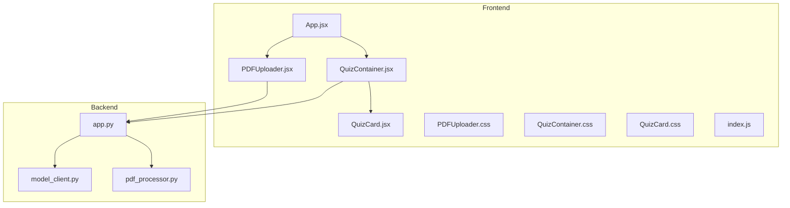
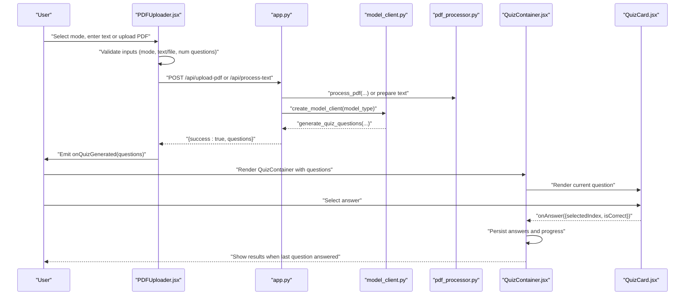
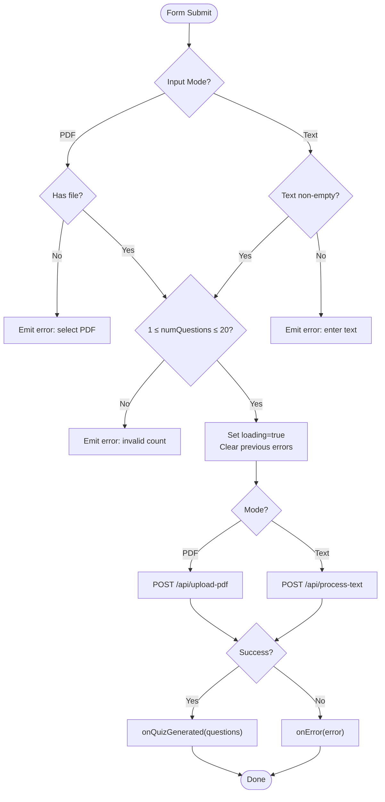
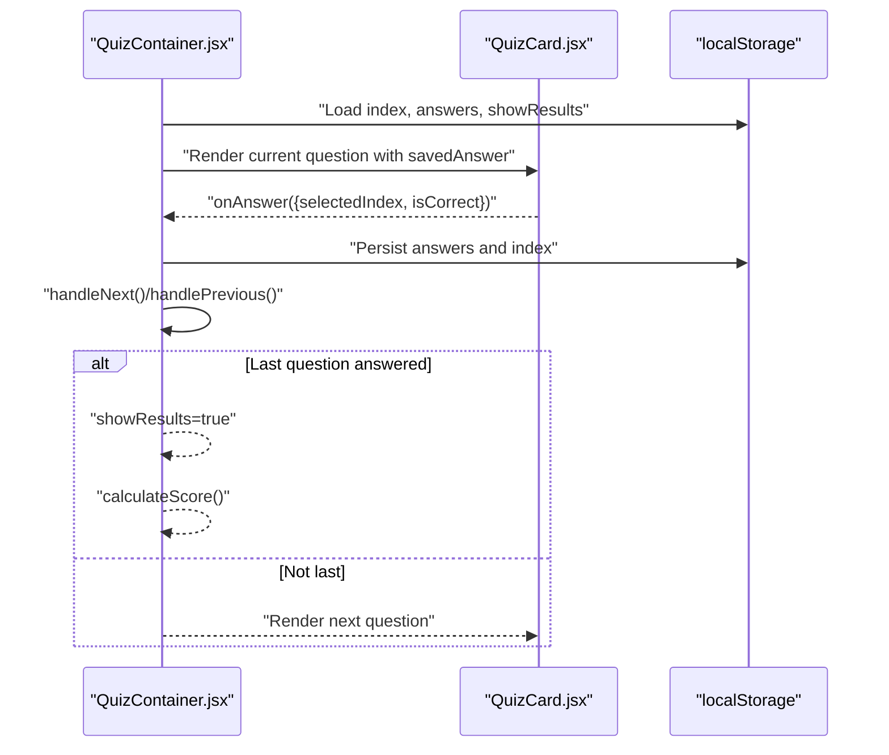
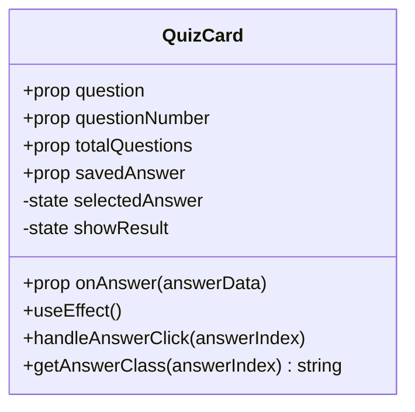
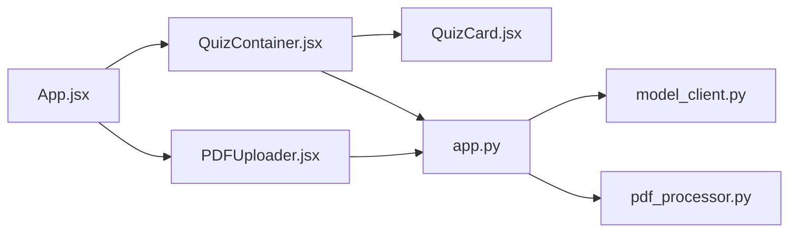

# UI Components

<cite>
**Referenced Files in This Document**
- [PDFUploader.jsx](file://frontend/src/components/PDFUploader.jsx)
- [PDFUploader.css](file://frontend/src/components/PDFUploader.css)
- [QuizContainer.jsx](file://frontend/src/components/QuizContainer.jsx)
- [QuizContainer.css](file://frontend/src/components/QuizContainer.css)
- [QuizCard.jsx](file://frontend/src/components/QuizCard.jsx)
- [QuizCard.css](file://frontend/src/components/QuizCard.css)
- [App.jsx](file://frontend/src/App.jsx)
- [index.js](file://frontend/src/index.js)
- [package.json](file://frontend/package.json)
- [app.py](file://backend/app.py)
- [model_client.py](file://backend/model_client.py)
- [pdf_processor.py](file://backend/pdf_processor.py)
</cite>

## Table of Contents
1. [Introduction](#introduction)
2. [Project Structure](#project-structure)
3. [Core Components](#core-components)
4. [Architecture Overview](#architecture-overview)
5. [Detailed Component Analysis](#detailed-component-analysis)
6. [Dependency Analysis](#dependency-analysis)
7. [Performance Considerations](#performance-considerations)
8. [Troubleshooting Guide](#troubleshooting-guide)
9. [Conclusion](#conclusion)
10. [Appendices](#appendices)

## Introduction
This document provides comprehensive documentation for the core UI components of the Quiz Generator application. It focuses on:
- PDFUploader.jsx: Dual-input interface supporting PDF drag-and-drop upload and direct text input, with controls for question count and AI model selection, including validation and error handling.
- QuizContainer.jsx: Manages quiz navigation, progress tracking, and results calculation, coordinating with QuizCard.jsx to render individual questions and answer options.
- QuizCard.jsx: Renders a single question with options, manages answer selection, correctness feedback, and persistence across navigation.

The documentation covers props, event handlers, CSS classes, accessibility features, responsive design, and customization guidance. It also explains integration points with the backend API and outlines testing and e2e considerations.

## Project Structure
The UI components reside under frontend/src/components and are orchestrated by App.jsx. The frontend depends on React and Axios for API communication, and the backend exposes two primary endpoints for quiz generation.

**Diagram sources**
- [App.jsx](file://frontend/src/App.jsx#L1-L90)
- [PDFUploader.jsx](file://frontend/src/components/PDFUploader.jsx#L1-L323)
- [QuizContainer.jsx](file://frontend/src/components/QuizContainer.jsx#L1-L164)
- [QuizCard.jsx](file://frontend/src/components/QuizCard.jsx#L1-L101)
- [app.py](file://backend/app.py#L1-L176)
- [model_client.py](file://backend/model_client.py#L1-L272)
- [pdf_processor.py](file://backend/pdf_processor.py#L1-L77)

**Section sources**
- [App.jsx](file://frontend/src/App.jsx#L1-L90)
- [index.js](file://frontend/src/index.js#L1-L12)
- [package.json](file://frontend/package.json#L1-L50)

## Core Components
This section introduces the three core UI components and their roles in the application.

- PDFUploader.jsx
  - Provides dual input modes: PDF file upload (drag-and-drop and file selector) and direct text input.
  - Controls for number of questions (1–20) and AI model selection (OpenRouter or Ollama Mistral).
  - Validation and error reporting, plus a loading indicator during generation.
  - Emits events to App.jsx for quiz data, errors, and loading state.

- QuizContainer.jsx
  - Orchestrates quiz lifecycle: navigation, progress bar, and results screen.
  - Persists current index, answers, and results visibility in localStorage.
  - Calculates scores and triggers reset flow.

- QuizCard.jsx
  - Renders a single question with options and manages answer selection.
  - Provides visual feedback for correctness and disables further interaction after submission.
  - Communicates selected answer and correctness to parent container.

**Section sources**
- [PDFUploader.jsx](file://frontend/src/components/PDFUploader.jsx#L1-L323)
- [QuizContainer.jsx](file://frontend/src/components/QuizContainer.jsx#L1-L164)
- [QuizCard.jsx](file://frontend/src/components/QuizCard.jsx#L1-L101)

## Architecture Overview
The UI components integrate with the backend via HTTP requests. App.jsx manages state transitions between the uploader and quiz screens, while PDFUploader.jsx and QuizContainer.jsx coordinate with backend endpoints to generate quizzes.

**Diagram sources**
- [PDFUploader.jsx](file://frontend/src/components/PDFUploader.jsx#L50-L110)
- [app.py](file://backend/app.py#L59-L164)
- [model_client.py](file://backend/model_client.py#L263-L272)
- [pdf_processor.py](file://backend/pdf_processor.py#L64-L77)
- [QuizContainer.jsx](file://frontend/src/components/QuizContainer.jsx#L54-L158)
- [QuizCard.jsx](file://frontend/src/components/QuizCard.jsx#L20-L34)

## Detailed Component Analysis

### PDFUploader.jsx
- Purpose
  - Dual-input quiz generator entry point supporting PDF upload and direct text input.
  - Validates inputs and communicates with backend to generate quiz questions.
- Props
  - onQuizGenerated(quizData): Receives generated questions from backend.
  - onError(message): Receives error messages for display.
  - onLoading(isLoading): Receives loading state updates.
  - loading: Boolean flag to disable controls during generation.
- State and Inputs
  - inputMode: 'pdf' or 'text'.
  - file: Selected PDF file.
  - text: Text content for direct input mode.
  - numQuestions: Numeric count clamped to 1–20.
  - selectedModel: 'openrouter' or 'ollama-mistral'.
  - dragActive: Tracks drag-and-drop hover state.
- Event Handlers
  - handleDrag(e): Updates dragActive on dragenter/dragleave.
  - handleDrop(e): Sets file if PDF and clears dragActive.
  - handleFileChange(e): Sets file if PDF.
  - handleSubmit(e): Validates inputs, sets loading, posts to backend, and emits results/errors.
- Validation and Error States
  - Mode-dependent checks: requires file for PDF mode and non-empty text for text mode.
  - Question count bounds validated (1–20).
  - Error messages emitted via onError prop.
- Backend Integration
  - PDF mode: multipart/form-data upload to /api/upload-pdf with num_questions and model_type.
  - Text mode: JSON payload to /api/process-text with text, num_questions, model_type.
- Accessibility and UX
  - Radio buttons for input mode and model selection with labels.
  - Disabled states during loading.
  - Test IDs for e2e automation.
- CSS Classes
  - Container and form groups, drop zone, input modes, model options, text area, counters, submit button, loading indicator.
- Responsive Design
  - Media queries adjust layout for smaller screens (e.g., stacked input modes, reduced spacing).
- Usage Example
  - Rendered by App.jsx when no questions are present; forwards onQuizGenerated, onError, onLoading, and loading props.
- Interaction Patterns
  - Drag-and-drop area toggles visual feedback and displays selected file metadata.
  - Submit button disabled until valid inputs are provided.

**Diagram sources**
- [PDFUploader.jsx](file://frontend/src/components/PDFUploader.jsx#L50-L110)
- [app.py](file://backend/app.py#L59-L164)

**Section sources**
- [PDFUploader.jsx](file://frontend/src/components/PDFUploader.jsx#L1-L323)
- [PDFUploader.css](file://frontend/src/components/PDFUploader.css#L1-L376)
- [App.jsx](file://frontend/src/App.jsx#L27-L52)
- [package.json](file://frontend/package.json#L45-L45)

### QuizContainer.jsx
- Purpose
  - Manages quiz navigation, progress tracking, and results calculation.
  - Persists state to localStorage for continuity across reloads.
- Props
  - questions: Array of quiz items passed from App.jsx.
  - onReset(): Callback to reset quiz state and clear localStorage.
- State and Persistence
  - currentQuestionIndex: Current position in questions array.
  - answers: Array of answer selections with correctness flags.
  - showResults: Flag to switch to results screen.
  - Uses localStorage keys for index, answers, and results visibility.
- Navigation and Progress
  - handleNext(): Moves to next question or shows results when last is reached.
  - handlePrevious(): Moves to previous question.
  - Progress bar reflects current index out of total questions.
- Results Calculation
  - calculateScore(): Counts correct answers and computes percentage.
- Rendering
  - Results screen displays score circle and details with a reset button.
  - Otherwise renders QuizCard for current question with saved answer state.
- Accessibility and UX
  - Back button to return to uploader.
  - Disabled navigation buttons when appropriate.
  - Test IDs for e2e automation.
- CSS Classes
  - Container, header, progress bar, navigation buttons, results screen, score display.
- Responsive Design
  - Navigation buttons stack vertically on small screens.
  - Results screen scales appropriately.

**Diagram sources**
- [QuizContainer.jsx](file://frontend/src/components/QuizContainer.jsx#L9-L158)
- [QuizCard.jsx](file://frontend/src/components/QuizCard.jsx#L20-L34)

**Section sources**
- [QuizContainer.jsx](file://frontend/src/components/QuizContainer.jsx#L1-L164)
- [QuizContainer.css](file://frontend/src/components/QuizContainer.css#L1-L177)
- [App.jsx](file://frontend/src/App.jsx#L44-L52)

### QuizCard.jsx
- Purpose
  - Renders a single quiz item with options and manages answer selection.
- Props
  - question: Current question object.
  - questionNumber: Index of current question (1-based).
  - totalQuestions: Total number of questions.
  - onAnswer(answerData): Callback with {selectedIndex, isCorrect}.
  - savedAnswer: Previously selected answer for continuity.
- Behavior
  - Restores savedAnswer on mount and when savedAnswer changes.
  - Disables further selection after result is shown.
  - Computes correctness and emits answer data to parent.
- Visual Feedback
  - Different styles for correct, incorrect, and not-selected correct options.
  - Correct mark displayed for the correct option.
- Accessibility and UX
  - Option buttons disabled after result to prevent changing answers.
  - Test IDs for each answer option.
- CSS Classes
  - Card container, question header, question text, answers container, answer options, result message.

**Diagram sources**
- [QuizCard.jsx](file://frontend/src/components/QuizCard.jsx#L1-L101)

**Section sources**
- [QuizCard.jsx](file://frontend/src/components/QuizCard.jsx#L1-L101)
- [QuizCard.css](file://frontend/src/components/QuizCard.css#L1-L162)

## Dependency Analysis
- Frontend Dependencies
  - React and axios for UI and HTTP requests.
  - LocalStorage for state persistence across sessions.
- Backend Dependencies
  - Flask with CORS for API endpoints.
  - pdf_processor.py for PDF text and image extraction.
  - model_client.py for OpenRouter and Ollama clients.
- Component Coupling
  - App.jsx orchestrates state and passes props down to child components.
  - PDFUploader.jsx and QuizContainer.jsx depend on backend endpoints.
  - QuizContainer.jsx composes QuizCard.jsx and manages shared state.

**Diagram sources**
- [App.jsx](file://frontend/src/App.jsx#L1-L90)
- [PDFUploader.jsx](file://frontend/src/components/PDFUploader.jsx#L1-L323)
- [QuizContainer.jsx](file://frontend/src/components/QuizContainer.jsx#L1-L164)
- [QuizCard.jsx](file://frontend/src/components/QuizCard.jsx#L1-L101)
- [app.py](file://backend/app.py#L1-L176)
- [model_client.py](file://backend/model_client.py#L1-L272)
- [pdf_processor.py](file://backend/pdf_processor.py#L1-L77)

**Section sources**
- [package.json](file://frontend/package.json#L1-L50)
- [app.py](file://backend/app.py#L1-L176)

## Performance Considerations
- Network Requests
  - PDF uploads use multipart/form-data; consider chunking for very large files if needed.
  - Text mode sends JSON payloads; keep text sizes reasonable to avoid timeouts.
- Rendering
  - QuizCard disables interaction after result to reduce unnecessary re-renders.
  - Persisting answers and index prevents recomputation overhead.
- Backend Limits
  - Backend enforces maximum questions (20) and validates model type.
  - OpenRouter and Ollama clients include timeouts and token limits; adjust question counts accordingly.

[No sources needed since this section provides general guidance]

## Troubleshooting Guide
- PDF Upload Issues
  - Ensure file type is PDF; otherwise, an error is emitted.
  - Verify backend health endpoint and CORS configuration.
- Text Input Problems
  - Text must be non-empty; otherwise, an error is emitted.
- Question Count Errors
  - Must be between 1 and 20; otherwise, an error is emitted.
- Model Selection
  - Unknown model type will cause validation errors.
  - OpenRouter requires an API key; absence will raise a configuration error.
  - Ollama must be reachable and have the required model pulled.
- LocalStorage Persistence
  - If quiz data becomes inconsistent, reset via onReset to clear persisted state.
- Error Messages
  - Errors are surfaced to the UI and cleared upon successful generation.

**Section sources**
- [PDFUploader.jsx](file://frontend/src/components/PDFUploader.jsx#L39-L110)
- [app.py](file://backend/app.py#L26-L39)
- [model_client.py](file://backend/model_client.py#L62-L152)
- [model_client.py](file://backend/model_client.py#L154-L261)
- [App.jsx](file://frontend/src/App.jsx#L34-L52)

## Conclusion
The Quiz Generator’s UI components provide a robust, accessible, and responsive foundation for quiz creation and delivery. PDFUploader.jsx offers flexible input modes with strong validation and clear feedback. QuizContainer.jsx and QuizCard.jsx collaborate to deliver an intuitive quiz experience with persistent state and immediate correctness feedback. Integration with backend endpoints enables scalable quiz generation using cloud or local AI models.

[No sources needed since this section summarizes without analyzing specific files]

## Appendices

### Props and Events Reference
- PDFUploader.jsx
  - Props: onQuizGenerated, onError, onLoading, loading
  - Events: emits onQuizGenerated(quizData), onError(message), onLoading(true/false)
- QuizContainer.jsx
  - Props: questions, onReset
  - Internal state: currentQuestionIndex, answers, showResults
- QuizCard.jsx
  - Props: question, questionNumber, totalQuestions, onAnswer, savedAnswer

**Section sources**
- [PDFUploader.jsx](file://frontend/src/components/PDFUploader.jsx#L5-L11)
- [QuizContainer.jsx](file://frontend/src/components/QuizContainer.jsx#L9-L11)
- [QuizCard.jsx](file://frontend/src/components/QuizCard.jsx#L4-L6)

### Accessibility Features
- Semantic labels and radio buttons for input modes and model selection.
- Disabled states during loading to prevent invalid interactions.
- Test IDs for automated testing and assistive technology support.
- Clear visual feedback for correct/incorrect answers.

**Section sources**
- [PDFUploader.jsx](file://frontend/src/components/PDFUploader.jsx#L112-L156)
- [QuizCard.jsx](file://frontend/src/components/QuizCard.jsx#L66-L94)
- [QuizContainer.jsx](file://frontend/src/components/QuizContainer.jsx#L115-L158)

### Responsive Design Notes
- PDFUploader.jsx: Stacks input modes on small screens.
- QuizContainer.jsx: Stacks navigation buttons on small screens.
- QuizCard.jsx: Adjusts typography and layout for smaller devices.

**Section sources**
- [PDFUploader.css](file://frontend/src/components/PDFUploader.css#L355-L376)
- [QuizContainer.css](file://frontend/src/components/QuizContainer.css#L157-L177)
- [QuizCard.css](file://frontend/src/components/QuizCard.css#L144-L162)

### Testing and E2E Considerations
- Frontend e2e tests are configured in the frontend directory.
- Backend e2e scripts are available via package.json scripts.
- Use test IDs from components to target elements in Playwright tests.

**Section sources**
- [package.json](file://frontend/package.json#L16-L27)