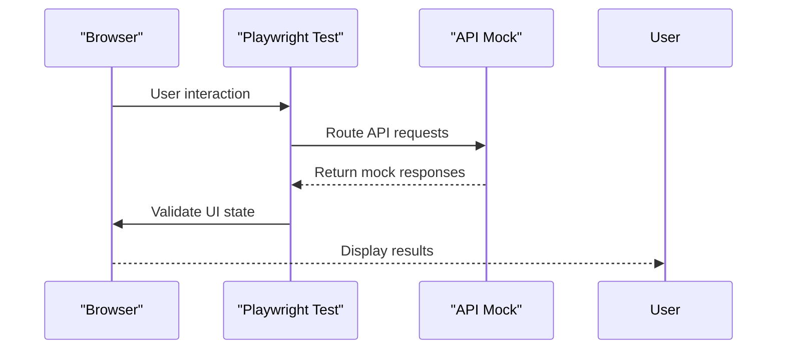
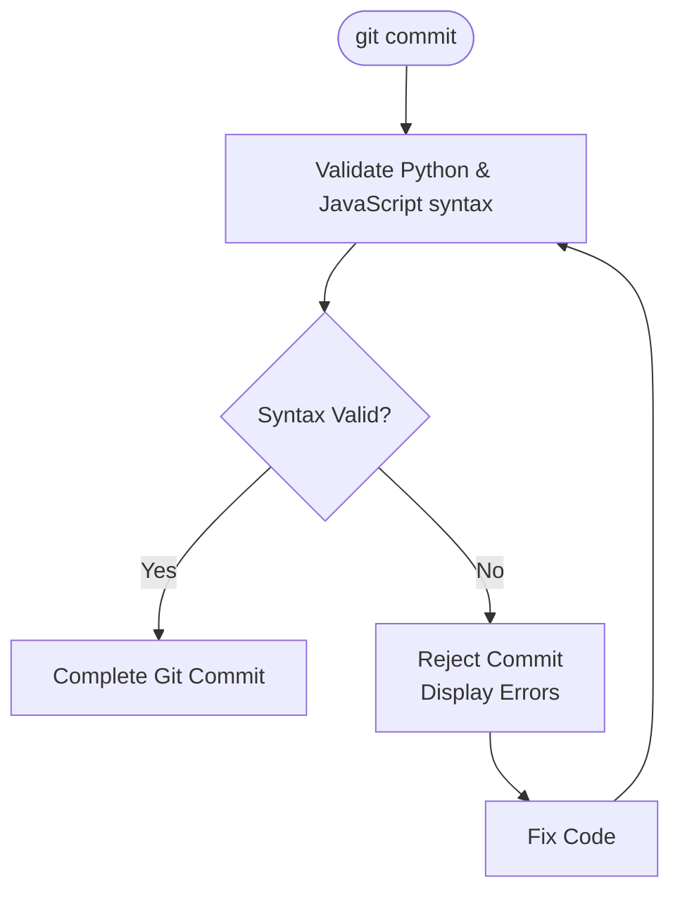

# Testing Strategy

<cite>
**Referenced Files in This Document**   
- [quiz-flow.spec.js](file://e2e/tests/quiz-flow.spec.js)
- [text-input-flow.spec.js](file://e2e/tests/text-input-flow.spec.js)
- [smoke.spec.js](file://e2e/tests/smoke.spec.js)
- [playwright.config.js](file://e2e/playwright.config.js)
- [mock-responses.js](file://e2e/fixtures/mock-responses.js)
- [api-mock.js](file://e2e/utils/api-mock.js)
- [test-helpers.js](file://e2e/utils/test-helpers.js)
- [Makefile](file://Makefile)
- [package.json](file://package.json)
- [TESTING.md](file://TESTING.md)
</cite>

## Table of Contents
1. [Introduction](#introduction)
2. [Test Types and Strategy](#test-types-and-strategy)
3. [Test Automation Workflow](#test-automation-workflow)
4. [CI/CD Pipeline Configuration](#cicd-pipeline-configuration)
5. [Running Tests Locally](#running-tests-locally)
6. [Test Scenarios and Coverage](#test-scenarios-and-coverage)
7. [Test Data Management](#test-data-management)
8. [Performance Metrics and Test Coverage Expectations](#performance-metrics-and-test-coverage-expectations)
9. [Troubleshooting and Best Practices](#troubleshooting-and-best-practices)

## Introduction

The Quiz Generator application employs a comprehensive end-to-end testing strategy using Playwright to ensure reliability and functionality across all user workflows. The testing framework is designed to validate the complete user journey from PDF upload or text input through quiz generation, question answering, and result tracking. This document outlines the testing approach, covering the distinction between mocked API tests and smoke tests with real API integrations, the automated test workflow with Git hooks, CI/CD pipeline configuration in GitHub Actions, local test execution methods, test scenarios, data management strategies, and performance expectations.

**Section sources**
- [TESTING.md](file://TESTING.md#L1-L337)

## Test Types and Strategy

The testing strategy for the Quiz Generator application is divided into two primary categories: mocked API tests and smoke tests with real API integrations. This dual approach ensures both rapid feedback during development and validation of real-world API interactions.

### Mocked API Tests

The mocked API tests, including `quiz-flow.spec.js` and `text-input-flow.spec.js`, utilize API mocking to provide fast, stable, and isolated testing environments. These tests do not require external API keys or services, making them ideal for pre-commit and pre-push validation.

The mocking strategy is implemented through the `api-mock.js` utility, which intercepts API requests to `/api/upload-pdf` and `/api/process-text` and returns predefined responses from `mock-responses.js`. This allows the tests to simulate various scenarios including successful quiz generation, validation errors, empty file errors, and API failures without making actual HTTP requests.

**Diagram sources**
- [api-mock.js](file://e2e/utils/api-mock.js#L7-L147)
- [mock-responses.js](file://e2e/fixtures/mock-responses.js#L1-L94)

### Smoke Tests with Real API Integrations

The smoke tests in `smoke.spec.js` validate the application's integration with real API services, specifically OpenRouter and Ollama. These tests are designed to run in environments where the necessary API keys and services are available, typically in the CI/CD pipeline or on developer machines with proper configuration.

Unlike the mocked tests, smoke tests disable API mocking using the `disableMocks()` function and make actual API calls to verify end-to-end functionality. These tests are conditional based on environment variables: `OPENROUTER_API_KEY` for OpenRouter integration and `ENABLE_OLLAMA_TESTS=true` for Ollama integration. When these environment variables are not set, the smoke tests are automatically skipped.

The smoke tests cover critical integration points including PDF upload processing, text content processing, and quiz generation through both API providers. They also include error handling scenarios to ensure the application gracefully handles API unavailability or authentication failures.

**Section sources**
- [smoke.spec.js](file://e2e/tests/smoke.spec.js#L1-L188)
- [api-mock.js](file://e2e/utils/api-mock.js#L128-L135)

## Test Automation Workflow

The Quiz Generator application implements a robust test automation workflow using Git hooks to enforce code quality and test coverage at key development milestones. This workflow ensures that tests are automatically executed before code is committed and pushed to the repository.

### Pre-commit Hook

The pre-commit hook performs syntax validation on Python and JavaScript/JSX files before each commit. This lightweight check provides immediate feedback to developers, preventing syntax errors from entering the codebase. The hook verifies the syntax of backend Python files and frontend JavaScript/JSX files, ensuring code quality at the earliest stage of development.

**Diagram sources**
- [Makefile](file://Makefile#L91-L93)

### Pre-push Hook

The pre-push hook executes a comprehensive test suite before code is pushed to the remote repository. This more extensive check includes dependency installation (if necessary), test PDF generation (if missing), and execution of all E2E tests except smoke tests. By running the full test suite before push, this hook prevents broken code from reaching the shared repository and CI/CD pipeline.

The pre-push hook is designed to be thorough but efficient, ensuring that only code that passes all tests can be pushed. This creates a strong quality gate that maintains the stability of the main development branches.

**Section sources**
- [Makefile](file://Makefile#L87-L93)
- [TESTING.md](file://TESTING.md#L108-L123)

## CI/CD Pipeline Configuration

The CI/CD pipeline for the Quiz Generator application is configured in GitHub Actions through the `.github/workflows/tests.yml` file. This automated pipeline ensures that tests are executed consistently across all code changes, providing reliable feedback on code quality and functionality.

The pipeline is triggered automatically on push events to the `main`, `master`, and `develop` branches, as well as on pull request creation. When triggered, the pipeline performs the following steps:
- Sets up the Node.js environment
- Installs all dependencies
- Starts the backend and frontend servers
- Executes all E2E tests
- Generates and stores test reports and logs

This comprehensive automation ensures that every code change is validated against the complete test suite in a clean, isolated environment. The pipeline configuration also includes artifact retention for test reports and logs, enabling detailed analysis of test results and failures.

The CI/CD pipeline complements the local Git hooks by providing an additional layer of validation in a standardized environment, catching issues that might be missed in local development.

**Section sources**
- [TESTING.md](file://TESTING.md#L192-L213)

## Running Tests Locally

Developers can run tests locally using multiple methods, with the primary approaches being Makefile commands and npm scripts. These local execution methods provide flexibility for different development workflows and testing requirements.

### Makefile Commands

The Makefile provides a convenient interface for common development tasks, including test execution. Key commands include:
- `make test` - Run all E2E tests
- `make test-pre-push` - Run tests as in pre-push hook
- `make test-smoke` - Run smoke tests with real API integrations
- `make setup-hooks` - Install Git hooks

These commands abstract the underlying npm scripts and provide a consistent interface across different development environments.

### NPM Scripts

The package.json file defines several npm scripts for test execution:
- `npm run test:all` - Run all E2E tests
- `npm run test:e2e:ui` - Run tests in interactive UI mode
- `npm run test:e2e:debug` - Run tests in debug mode
- `npm run test:e2e:smoke` - Run smoke tests

The npm scripts offer more granular control over test execution and are useful for debugging and development.

**Section sources**
- [Makefile](file://Makefile#L1-L94)
- [package.json](file://package.json#L1-L30)

## Test Scenarios and Coverage

The end-to-end test suite for the Quiz Generator application covers a comprehensive range of user scenarios, ensuring that all critical functionality is validated. The tests are organized to mirror the user journey through the application.

### PDF Upload and Processing

The `quiz-flow.spec.js` test file contains scenarios for PDF upload and processing, including:
- Successful PDF upload and quiz generation
- Navigation between questions and result tracking
- Form validation and error handling
- Model selection (OpenRouter vs. Ollama)
- Loading state visualization

These tests validate the complete workflow from PDF upload through quiz completion, ensuring that users can successfully generate and complete quizzes from PDF documents.

### Text Input and Processing

The `text-input-flow.spec.js` test file covers scenarios for text input and processing, including:
- Switching between PDF upload and text input modes
- Text entry and character counting
- Quiz generation from text input
- Form validation in text input mode
- Mode switching and form state management

These tests ensure that users can generate quizzes from directly entered text, providing an alternative to PDF upload.

### Navigation and State Management

Additional tests in `navigation.spec.js` validate application navigation and state persistence using localStorage. These tests ensure that users can navigate between questions, that their progress is saved, and that they can resume quizzes after navigating away.

**Section sources**
- [quiz-flow.spec.js](file://e2e/tests/quiz-flow.spec.js#L1-L229)
- [text-input-flow.spec.js](file://e2e/tests/text-input-flow.spec.js#L1-L174)

## Test Data Management

The testing strategy includes comprehensive test data management practices to ensure reliable and maintainable tests. This includes the use of fixtures, API mocking, and test helpers to manage test data and state.

### Fixtures and Test Data

The test suite uses fixtures to provide consistent test data. The primary fixture is `sample.pdf`, a test PDF file used in upload scenarios. This file is generated using the `generate-test-pdf` script, ensuring that all tests use the same consistent input data.

The `mock-responses.js` file contains predefined API responses for various scenarios, including success responses, validation errors, empty file errors, and API failures. These responses are used by the API mocking system to simulate different backend behaviors without making actual API calls.

### API Mocking Strategy

The API mocking strategy, implemented in `api-mock.js`, provides a flexible way to simulate different API responses. The mocking system supports:
- Success responses with configurable question counts
- Validation error responses
- Empty file error responses
- API error responses
- Delayed responses to test loading states

This comprehensive mocking strategy allows tests to cover a wide range of scenarios, including edge cases and error conditions, without relying on external services.

**Section sources**
- [mock-responses.js](file://e2e/fixtures/mock-responses.js#L1-L94)
- [api-mock.js](file://e2e/utils/api-mock.js#L1-L147)

## Performance Metrics and Test Coverage Expectations

The testing strategy includes specific performance metrics and coverage expectations to ensure the application meets quality standards.

### Performance Metrics

The Playwright configuration in `playwright.config.js` defines key performance metrics:
- Test timeout: 60 seconds per test
- Expect assertion timeout: 5 seconds
- Retry attempts: 2 in CI environment
- Parallel execution: Enabled for faster test runs

These metrics ensure that tests complete in a reasonable time while providing sufficient time for assertions and handling potential delays in test execution.

### Test Coverage Expectations

The test suite aims for comprehensive coverage of the application's functionality, including:
- PDF upload and processing
- Text input and processing
- Quiz generation and display
- Question navigation and answering
- Result tracking and display
- Form validation and error handling
- Model selection and configuration
- LocalStorage state management

The goal is to achieve 100% coverage of critical user workflows, with particular emphasis on the core quiz generation functionality.

**Section sources**
- [playwright.config.js](file://e2e/playwright.config.js#L1-L77)
- [TESTING.md](file://TESTING.md#L43-L54)

## Troubleshooting and Best Practices

When encountering issues with the test suite, developers should follow these troubleshooting steps and best practices:

1. Ensure all dependencies are installed using `make install`
2. Verify that the test PDF is generated using `npm run generate-test-pdf`
3. Check that ports 3000 (frontend) and 5001 (backend) are available
4. For smoke tests, ensure the required environment variables are set
5. Use `make clean` to remove temporary files and test artifacts

Best practices include:
- Always run tests before pushing code
- Use `make test-pre-push` to verify changes locally
- Avoid skipping Git hooks except in exceptional circumstances
- Monitor GitHub Actions results after pushing code
- Regularly clean temporary files with `make clean`

**Section sources**
- [TESTING.md](file://TESTING.md#L284-L310)
- [Makefile](file://Makefile#L80-L86)