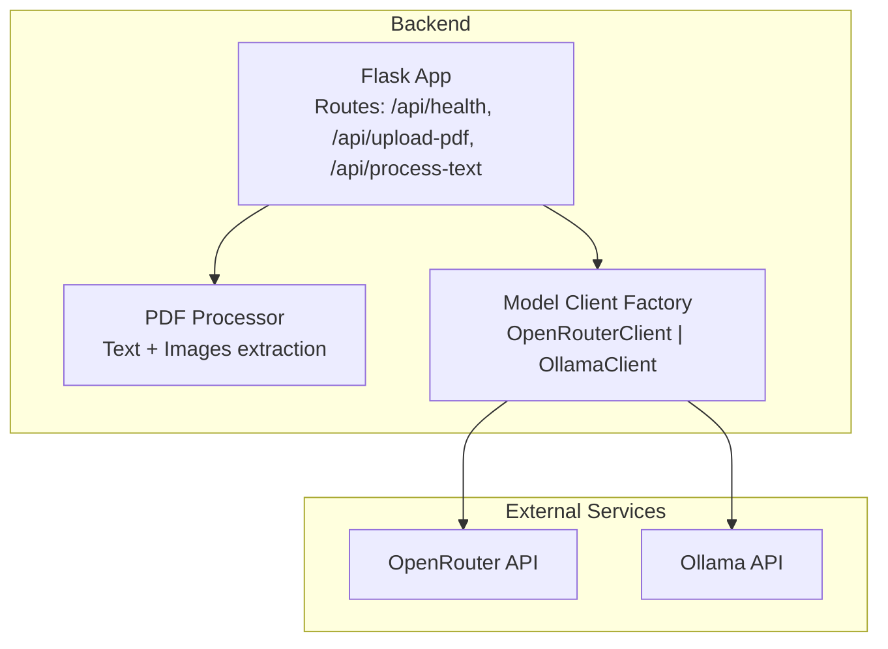
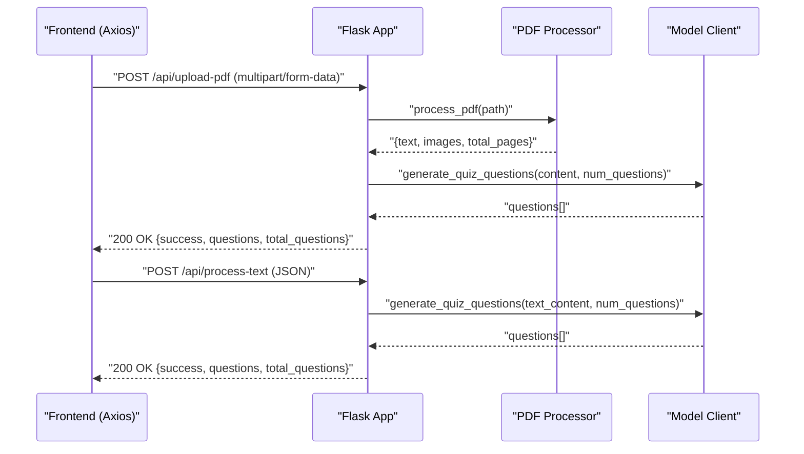
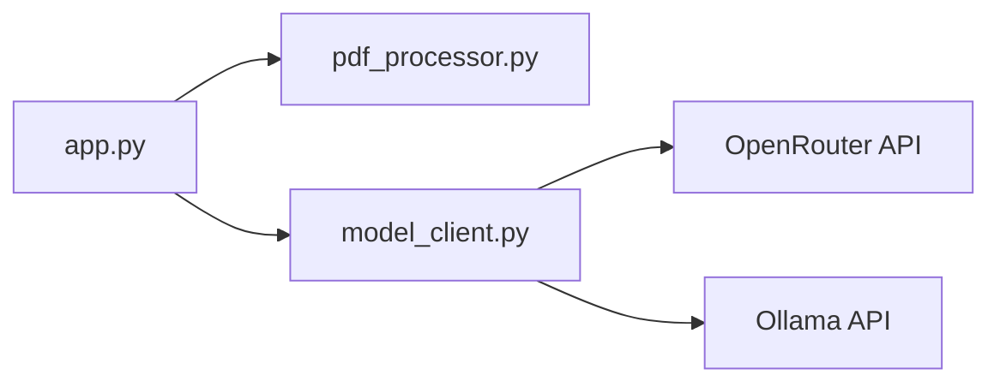

# API Reference

<cite>
**Referenced Files in This Document**
- [backend/app.py](file://backend/app.py)
- [backend/pdf_processor.py](file://backend/pdf_processor.py)
- [backend/model_client.py](file://backend/model_client.py)
- [backend/.env.example](file://backend/.env.example)
- [backend/requirements.txt](file://backend/requirements.txt)
- [frontend/src/components/PDFUploader.jsx](file://frontend/src/components/PDFUploader.jsx)
- [frontend/package.json](file://frontend/package.json)
- [README.md](file://README.md)
</cite>

## Table of Contents
1. [Introduction](#introduction)
2. [Project Structure](#project-structure)
3. [Core Components](#core-components)
4. [Architecture Overview](#architecture-overview)
5. [Detailed Component Analysis](#detailed-component-analysis)
6. [Dependency Analysis](#dependency-analysis)
7. [Performance Considerations](#performance-considerations)
8. [Troubleshooting Guide](#troubleshooting-guide)
9. [Conclusion](#conclusion)
10. [Appendices](#appendices)

## Introduction
This document provides a complete API reference for the Quiz Generator backend. It covers the HTTP endpoints, request/response schemas, error handling, authentication, rate limiting considerations, payload size limits, and practical usage examples for frontend integration with Axios.

## Project Structure
The backend is a Flask application that exposes three primary endpoints:
- Health check endpoint
- PDF upload and processing endpoint
- Text processing endpoint

It delegates model generation to two clients:
- OpenRouter client for cloud-based models
- Ollama client for local Mistral model

**Diagram sources**
- [backend/app.py](file://backend/app.py#L53-L164)
- [backend/pdf_processor.py](file://backend/pdf_processor.py#L64-L77)
- [backend/model_client.py](file://backend/model_client.py#L263-L272)

**Section sources**
- [backend/app.py](file://backend/app.py#L1-L176)
- [backend/pdf_processor.py](file://backend/pdf_processor.py#L1-L77)
- [backend/model_client.py](file://backend/model_client.py#L1-L272)

## Core Components
- Flask application with CORS enabled and temporary file upload folder configured
- PDF processor module extracting text and images from PDFs
- Model client abstraction with two implementations:
  - OpenRouter client requiring an API key
  - Ollama client for local inference

Key configuration and constraints:
- Maximum file size for uploads: 50 MB
- Maximum number of generated questions: 20
- Supported model types: openrouter, ollama-mistral

**Section sources**
- [backend/app.py](file://backend/app.py#L12-L19)
- [backend/app.py](file://backend/app.py#L26-L39)
- [backend/app.py](file://backend/app.py#L263-L272)
- [README.md](file://README.md#L150-L157)

## Architecture Overview
The backend orchestrates PDF/text ingestion, content normalization, and model generation. The frontend interacts via Axios with the backend endpoints.

**Diagram sources**
- [backend/app.py](file://backend/app.py#L59-L118)
- [backend/app.py](file://backend/app.py#L120-L164)
- [backend/pdf_processor.py](file://backend/pdf_processor.py#L64-L77)
- [backend/model_client.py](file://backend/model_client.py#L13-L36)
- [backend/model_client.py](file://backend/model_client.py#L263-L272)

## Detailed Component Analysis

### Endpoint: GET /api/health
- Method: GET
- URL: /api/health
- Purpose: Service health check
- Request: No body
- Response:
  - 200 OK: JSON object with a status field indicating service availability
- Example cURL:
  - curl -i http://localhost:5001/api/health

Response schema (JSON):
- status: string (expected value: ok)

Notes:
- This endpoint is useful for monitoring and readiness probes.

**Section sources**
- [backend/app.py](file://backend/app.py#L53-L57)

### Endpoint: POST /api/upload-pdf
- Method: POST
- URL: /api/upload-pdf
- Content Type: multipart/form-data
- Purpose: Upload a PDF, extract text and images, and generate quiz questions
- Request form fields:
  - file: PDF file (required)
  - num_questions: integer (optional, default 10; range 1–20)
  - model_type: string (optional, default openrouter; allowed values: openrouter, ollama-mistral)
- Validation and constraints:
  - Only PDF files are accepted
  - Maximum file size: 50 MB
  - num_questions must be between 1 and 20
  - model_type must be one of the supported values
- Response:
  - 200 OK: JSON with success flag, questions array, and total count
  - 400 Bad Request: Error message for invalid input or empty PDF
  - 500 Internal Server Error: General processing error
- Example cURL:
  - curl -i -X POST -F file=@sample.pdf -F num_questions=10 -F model_type=openrouter http://localhost:5001/api/upload-pdf

Request schema (multipart/form-data):
- file: binary (PDF)
- num_questions: integer (optional)
- model_type: string (optional)

Response schema (JSON):
- success: boolean
- questions: array of quiz items
  - id: integer
  - question: string
  - type: string (e.g., multiple_choice)
  - options: array of strings (present for multiple_choice)
  - correct_answer: integer (index of correct option)
- total_questions: integer

Notes:
- The backend saves the uploaded PDF temporarily and removes it after processing.
- PDF content is normalized to include text and images for model consumption.

**Section sources**
- [backend/app.py](file://backend/app.py#L59-L118)
- [backend/pdf_processor.py](file://backend/pdf_processor.py#L64-L77)
- [backend/app.py](file://backend/app.py#L26-L39)

### Endpoint: POST /api/process-text
- Method: POST
- URL: /api/process-text
- Content Type: application/json
- Purpose: Generate quiz questions from raw text input
- Request body:
  - text: string (required; non-empty)
  - num_questions: integer (optional, default 10; range 1–20)
  - model_type: string (optional, default openrouter; allowed values: openrouter, ollama-mistral)
- Validation and constraints:
  - text must be present and non-empty
  - num_questions must be between 1 and 20
  - model_type must be one of the supported values
- Response:
  - 200 OK: JSON with success flag, questions array, and total count
  - 400 Bad Request: Error message for missing or empty text
  - 500 Internal Server Error: General processing error
- Example cURL:
  - curl -i -X POST -H "Content-Type: application/json" -d '{"text":"Sample content","num_questions":10,"model_type":"openrouter"}' http://localhost:5001/api/process-text

Request schema (JSON):
- text: string
- num_questions: integer (optional)
- model_type: string (optional)

Response schema (JSON):
- success: boolean
- questions: array of quiz items
  - id: integer
  - question: string
  - type: string (e.g., multiple_choice)
  - options: array of strings (present for multiple_choice)
  - correct_answer: integer (index of correct option)
- total_questions: integer

Notes:
- The endpoint treats text input similarly to PDF content, preparing a normalized structure for the model client.

**Section sources**
- [backend/app.py](file://backend/app.py#L120-L164)
- [backend/app.py](file://backend/app.py#L26-L39)

### Authentication and Environment Variables
- OpenRouter API key:
  - Required when using model_type openrouter
  - Stored in environment variable OPENROUTER_API_KEY
  - The backend logs a warning if the key is missing
- Ollama:
  - No API key required
  - Requires a local Ollama server and the mistral model installed

Environment configuration:
- Backend .env file example is provided
- Frontend proxy is configured to forward API calls to the backend

**Section sources**
- [backend/app.py](file://backend/app.py#L166-L171)
- [backend/.env.example](file://backend/.env.example#L1-L5)
- [frontend/package.json](file://frontend/package.json#L45-L46)

### Payload Size and Limits
- Maximum upload file size: 50 MB
- Maximum number of questions: 20
- Cloud model (OpenRouter) receives reduced content sizes for cost and token efficiency
- Local model (Ollama) can handle larger content sizes

**Section sources**
- [backend/app.py](file://backend/app.py#L12-L19)
- [backend/app.py](file://backend/app.py#L26-L39)
- [backend/model_client.py](file://backend/model_client.py#L92-L115)
- [backend/model_client.py](file://backend/model_client.py#L188-L196)
- [README.md](file://README.md#L150-L157)

### Error Codes and Handling
Common HTTP status codes:
- 200 OK: Successful request and response
- 400 Bad Request: Invalid input (missing file, wrong extension, empty text, invalid num_questions, invalid model_type)
- 500 Internal Server Error: Unexpected server-side error during processing

Typical error responses:
- JSON object with an error field describing the issue

Frontend error handling guidance:
- Catch axios errors and inspect error.response?.data?.error for user-friendly messages
- Implement retry logic with exponential backoff for transient failures
- Validate inputs before sending requests to reduce 400 errors

**Section sources**
- [backend/app.py](file://backend/app.py#L64-L74)
- [backend/app.py](file://backend/app.py#L127-L134)
- [backend/app.py](file://backend/app.py#L114-L118)
- [backend/app.py](file://backend/app.py#L160-L164)

### Usage Examples (Frontend with Axios)
The frontend components demonstrate how to call the backend endpoints:

- PDF upload flow:
  - Build a FormData with file, num_questions, and model_type
  - Send POST to /api/upload-pdf with Content-Type multipart/form-data
  - Handle success and error callbacks

- Text processing flow:
  - Send POST to /api/process-text with JSON body containing text, num_questions, and model_type
  - Handle success and error callbacks

These flows are implemented in the frontend component that manages quiz generation.

**Section sources**
- [frontend/src/components/PDFUploader.jsx](file://frontend/src/components/PDFUploader.jsx#L73-L109)
- [frontend/src/components/PDFUploader.jsx](file://frontend/src/components/PDFUploader.jsx#L88-L97)
- [frontend/package.json](file://frontend/package.json#L45-L46)

## Dependency Analysis
The backend composes several modules and external services:

**Diagram sources**
- [backend/app.py](file://backend/app.py#L1-L20)
- [backend/pdf_processor.py](file://backend/pdf_processor.py#L1-L20)
- [backend/model_client.py](file://backend/model_client.py#L1-L20)

**Section sources**
- [backend/app.py](file://backend/app.py#L1-L20)
- [backend/pdf_processor.py](file://backend/pdf_processor.py#L1-L20)
- [backend/model_client.py](file://backend/model_client.py#L1-L20)

## Performance Considerations
- Token and content limits:
  - OpenRouter client reduces text and limits images to balance cost and token usage
  - Ollama client can process larger text content locally
- Timeout and throughput:
  - Ollama client uses a higher timeout for long-running local inference
- Payload size:
  - 50 MB maximum file size for PDF uploads
- Recommendations:
  - Keep num_questions within the documented range
  - Prefer smaller PDFs or shorter text for faster responses
  - Use local Ollama for repeated, low-latency operations

**Section sources**
- [backend/model_client.py](file://backend/model_client.py#L116-L139)
- [backend/model_client.py](file://backend/model_client.py#L197-L211)
- [backend/app.py](file://backend/app.py#L12-L19)
- [README.md](file://README.md#L150-L157)

## Troubleshooting Guide
Common issues and resolutions:
- Missing OpenRouter API key:
  - Symptom: Error indicating the key is not set
  - Resolution: Set OPENROUTER_API_KEY in backend .env
- Ollama server not available:
  - Symptom: Error indicating Ollama is unreachable or model not found
  - Resolution: Ensure Ollama is running and mistral model is pulled
- Invalid input errors:
  - Symptom: 400 Bad Request for missing file, wrong extension, empty text, or invalid parameters
  - Resolution: Validate inputs before sending requests
- Excessive request size:
  - Symptom: Upload rejected due to size limits
  - Resolution: Reduce PDF size or split content
- Rate limiting:
  - Symptom: Transient failures from external services
  - Resolution: Implement retry with exponential backoff and monitor quotas

**Section sources**
- [backend/app.py](file://backend/app.py#L166-L171)
- [backend/model_client.py](file://backend/model_client.py#L170-L179)
- [backend/model_client.py](file://backend/model_client.py#L254-L261)
- [backend/app.py](file://backend/app.py#L64-L74)
- [backend/app.py](file://backend/app.py#L127-L134)

## Conclusion
The Quiz Generator backend provides straightforward endpoints for PDF and text-based quiz generation. By adhering to the documented constraints and using the provided frontend patterns, you can reliably integrate with the backend and deliver a responsive quiz experience.

## Appendices

### Appendix A: Endpoint Summary
- GET /api/health
  - Purpose: Health check
  - Response: 200 OK with status field
- POST /api/upload-pdf
  - Purpose: Generate quiz from PDF
  - Body: multipart/form-data (file, num_questions, model_type)
  - Response: 200 OK with questions array and total count
- POST /api/process-text
  - Purpose: Generate quiz from text
  - Body: JSON (text, num_questions, model_type)
  - Response: 200 OK with questions array and total count

### Appendix B: Frontend Integration Notes
- The frontend proxies API calls to the backend using a local proxy setting
- The PDFUploader component demonstrates proper request construction and error handling

**Section sources**
- [frontend/package.json](file://frontend/package.json#L45-L46)
- [frontend/src/components/PDFUploader.jsx](file://frontend/src/components/PDFUploader.jsx#L73-L109)