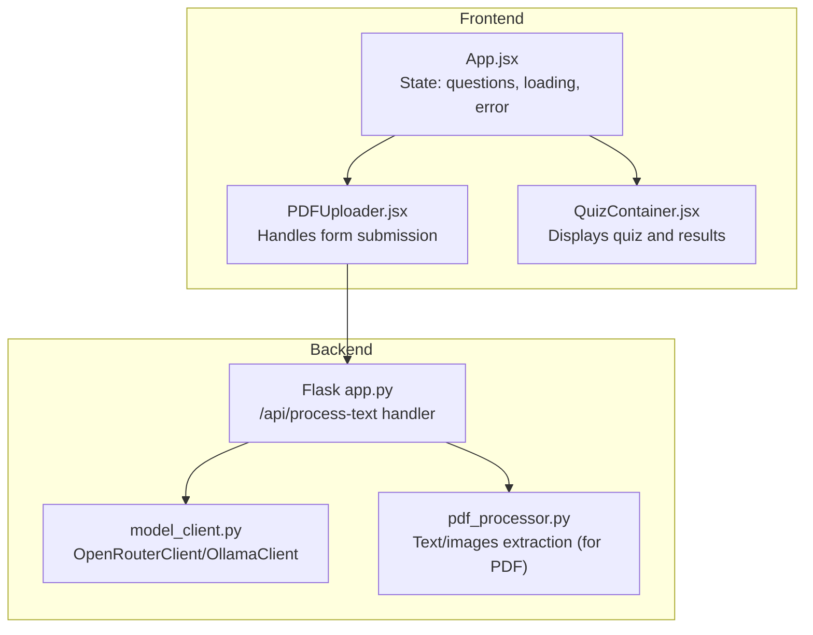
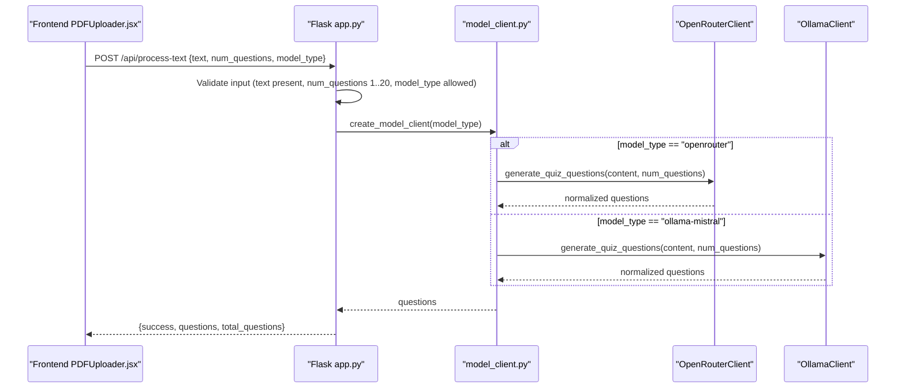
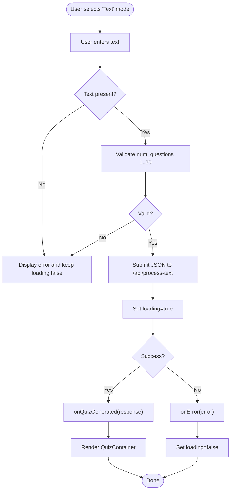
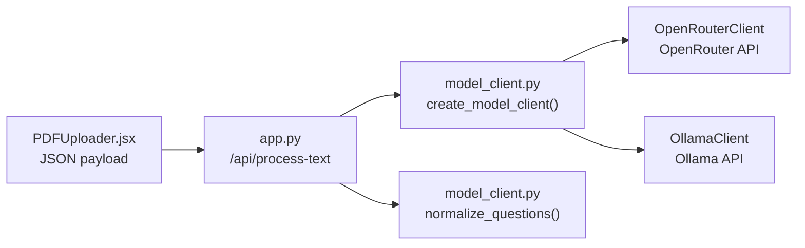

# Text Processing Endpoint

<cite>
**Referenced Files in This Document**
- [backend/app.py](file://backend/app.py)
- [backend/model_client.py](file://backend/model_client.py)
- [backend/pdf_processor.py](file://backend/pdf_processor.py)
- [frontend/src/components/PDFUploader.jsx](file://frontend/src/components/PDFUploader.jsx)
- [frontend/src/App.jsx](file://frontend/src/App.jsx)
- [frontend/src/components/QuizContainer.jsx](file://frontend/src/components/QuizContainer.jsx)
- [README.md](file://README.md)
</cite>

## Table of Contents
1. [Introduction](#introduction)
2. [Project Structure](#project-structure)
3. [Core Components](#core-components)
4. [Architecture Overview](#architecture-overview)
5. [Detailed Component Analysis](#detailed-component-analysis)
6. [Dependency Analysis](#dependency-analysis)
7. [Performance Considerations](#performance-considerations)
8. [Troubleshooting Guide](#troubleshooting-guide)
9. [Conclusion](#conclusion)
10. [Appendices](#appendices)

## Introduction
This document provides comprehensive API documentation for the POST /api/process-text endpoint in the Quiz Generator application. It covers the HTTP method, URL pattern, request format, response schema, error handling, and practical usage examples. It also explains how the frontend integrates with this endpoint, including state management, loading states, and client-side validation. Content validation rules, text normalization processes, and handling of empty content are documented, along with performance considerations for large text inputs and guidance on client-side validation.

## Project Structure
The Quiz Generator consists of:
- Backend (Flask): exposes the /api/process-text endpoint and delegates model-specific generation to a model abstraction layer.
- Frontend (React + Axios): provides a user interface to submit text, select model and question count, and display results.



**Diagram sources**
- [frontend/src/components/PDFUploader.jsx](file://frontend/src/components/PDFUploader.jsx#L50-L110)
- [backend/app.py](file://backend/app.py#L120-L164)
- [backend/model_client.py](file://backend/model_client.py#L263-L272)
- [backend/pdf_processor.py](file://backend/pdf_processor.py#L64-L77)

**Section sources**
- [README.md](file://README.md#L97-L130)

## Core Components
- Backend endpoint: POST /api/process-text validates JSON payload, normalizes text, and generates quiz questions via a model client.
- Model clients: OpenRouterClient and OllamaClient encapsulate generation logic and normalize responses.
- Frontend integration: PDFUploader.jsx submits JSON to /api/process-text and manages loading/error states.

Key responsibilities:
- Request validation: presence and non-empty text, numeric bounds for num_questions, and allowed model_type values.
- Response normalization: ensures consistent question schema with id, question, type, options, and correct_answer index.
- Error handling: returns 400 for missing/invalid input and 500 for processing failures.

**Section sources**
- [backend/app.py](file://backend/app.py#L120-L164)
- [backend/model_client.py](file://backend/model_client.py#L13-L36)
- [backend/model_client.py](file://backend/model_client.py#L263-L272)

## Architecture Overview
The POST /api/process-text flow:
1. Frontend sends JSON with text, num_questions, and model_type.
2. Backend validates input and constructs a content object similar to PDF processing.
3. Backend selects a model client based on model_type and delegates generation.
4. Model client normalizes and validates the generated questions.
5. Backend returns a success response with questions and total count.



**Diagram sources**
- [frontend/src/components/PDFUploader.jsx](file://frontend/src/components/PDFUploader.jsx#L88-L96)
- [backend/app.py](file://backend/app.py#L120-L164)
- [backend/model_client.py](file://backend/model_client.py#L263-L272)
- [backend/model_client.py](file://backend/model_client.py#L62-L152)
- [backend/model_client.py](file://backend/model_client.py#L154-L261)

## Detailed Component Analysis

### Endpoint Definition
- Method: POST
- URL: /api/process-text
- Content-Type: application/json
- Request body JSON fields:
  - text: string (required; must be present and non-empty)
  - num_questions: integer (required; must be 1..20)
  - model_type: string (required; allowed values: openrouter, ollama-mistral)

Validation rules enforced by backend:
- Missing text field or empty text returns 400 with an error message.
- num_questions less than 1 or greater than 20 returns 400 with an error message.
- Unknown model_type returns 400 with an error message.
- Any unexpected exception during processing returns 500 with an error message.

Response schema:
- success: boolean (true on successful generation)
- questions: array of objects with:
  - id: number or string (defaults to index-based if missing)
  - question: string
  - type: string (e.g., multiple_choice)
  - options: array of strings (present for multiple_choice)
  - correct_answer: number (index of correct option; normalized from letter if needed)
- total_questions: number (count of generated questions)

Empty content handling:
- If text is missing or empty, the endpoint returns 400 with an appropriate error message.

Normalization and validation:
- The model client normalizes questions to ensure consistent fields and correct_answer index.
- If correct_answer is provided as a letter (A/B/C/D/a/b/c/d), it is converted to a zero-based index.

**Section sources**
- [backend/app.py](file://backend/app.py#L120-L164)
- [backend/app.py](file://backend/app.py#L26-L39)
- [backend/model_client.py](file://backend/model_client.py#L13-L36)
- [backend/model_client.py](file://backend/model_client.py#L263-L272)

### Frontend Integration and State Management
Frontend behavior when users input text directly:
- Mode selection: The uploader supports two modes: PDF and text. When text mode is selected, the user enters text into a textarea.
- Validation: Before submission, the frontend checks:
  - Non-empty text in text mode.
  - num_questions within 1..20.
  - Selected model_type.
- Loading state: onLoading(true) is called before the API call; onLoading(false) is called in finally.
- Error handling: onError(message) displays errors; onQuizGenerated(response) updates state with questions and clears error.
- Quiz rendering: App.jsx stores questions in state and renders QuizContainer.jsx when questions exist.



**Diagram sources**
- [frontend/src/components/PDFUploader.jsx](file://frontend/src/components/PDFUploader.jsx#L50-L110)
- [frontend/src/App.jsx](file://frontend/src/App.jsx#L27-L52)
- [frontend/src/components/QuizContainer.jsx](file://frontend/src/components/QuizContainer.jsx#L1-L52)

**Section sources**
- [frontend/src/components/PDFUploader.jsx](file://frontend/src/components/PDFUploader.jsx#L50-L110)
- [frontend/src/App.jsx](file://frontend/src/App.jsx#L27-L52)
- [frontend/src/components/QuizContainer.jsx](file://frontend/src/components/QuizContainer.jsx#L1-L52)

### Example cURL Command
```bash
curl -X POST http://localhost:5001/api/process-text \
  -H "Content-Type: application/json" \
  -d '{
    "text": "Your input text here...",
    "num_questions": 5,
    "model_type": "openrouter"
  }'
```

Notes:
- Replace localhost:5001 with your backend host/port.
- Ensure model_type is either openrouter or ollama-mistral.
- Ensure num_questions is between 1 and 20.

**Section sources**
- [backend/app.py](file://backend/app.py#L120-L164)
- [frontend/src/components/PDFUploader.jsx](file://frontend/src/components/PDFUploader.jsx#L88-L96)

### Usage Examples
- Select model_type openrouter with num_questions 5 and a moderate-length text.
- Select model_type ollama-mistral with num_questions 10 and a larger text input.
- Reduce num_questions to 1 for quick testing or increase up to 20 for comprehensive quizzes.

Guidance:
- For OpenRouter, ensure OPENROUTER_API_KEY is configured in backend environment.
- For Ollama, ensure Ollama server is reachable and the mistral model is pulled.

**Section sources**
- [backend/model_client.py](file://backend/model_client.py#L263-L272)
- [README.md](file://README.md#L48-L57)

## Dependency Analysis
- Backend endpoint depends on:
  - Input validation helpers and content construction.
  - Model client factory to select OpenRouterClient or OllamaClient.
- Model clients depend on:
  - Environment variables for OpenRouter API key.
  - External APIs (OpenRouter or Ollama) for question generation.
  - Normalization utilities to ensure consistent response schema.



**Diagram sources**
- [frontend/src/components/PDFUploader.jsx](file://frontend/src/components/PDFUploader.jsx#L88-L96)
- [backend/app.py](file://backend/app.py#L120-L164)
- [backend/model_client.py](file://backend/model_client.py#L263-L272)
- [backend/model_client.py](file://backend/model_client.py#L13-L36)

**Section sources**
- [backend/app.py](file://backend/app.py#L120-L164)
- [backend/model_client.py](file://backend/model_client.py#L263-L272)

## Performance Considerations
- Token limits and timeouts:
  - OpenRouterClient adjusts max_tokens based on num_questions and uses gpt-4o-mini or gpt-4o depending on images.
  - OllamaClient sets num_predict proportional to num_questions and uses a higher timeout for local inference.
- Text length constraints:
  - OpenRouter: approximately 4000 characters of text are sent to reduce token usage.
  - Ollama: up to 8000 characters are processed locally.
- Recommendations:
  - Keep text concise for faster responses.
  - Reduce num_questions for very long texts to stay within token limits.
  - Prefer openrouter for shorter texts; use ollama-mistral for longer texts when offline/local processing is preferred.

**Section sources**
- [backend/model_client.py](file://backend/model_client.py#L116-L139)
- [backend/model_client.py](file://backend/model_client.py#L197-L211)
- [README.md](file://README.md#L150-L157)

## Troubleshooting Guide
Common issues and resolutions:
- 400 Bad Request:
  - Missing text or empty text.
  - num_questions out of range (1..20).
  - Unknown model_type.
- 500 Internal Server Error:
  - Processing failure (e.g., model API errors, parsing failures).
  - OpenRouter credits or rate limit issues.
  - Ollama server unreachable or model not found.
- Frontend error handling:
  - The frontend displays error messages and clears questions on failure.
  - Loading state is reset in finally blocks after API calls.

Actions:
- Verify OPENROUTER_API_KEY for cloud models.
- Confirm Ollama is running and mistral model is pulled.
- Ensure num_questions is within 1..20 and model_type is one of the allowed values.

**Section sources**
- [backend/app.py](file://backend/app.py#L120-L164)
- [backend/model_client.py](file://backend/model_client.py#L141-L151)
- [backend/model_client.py](file://backend/model_client.py#L174-L178)
- [backend/model_client.py](file://backend/model_client.py#L246-L260)
- [frontend/src/components/PDFUploader.jsx](file://frontend/src/components/PDFUploader.jsx#L104-L109)

## Conclusion
The POST /api/process-text endpoint provides a straightforward way to generate quiz questions from plain text using either OpenRouter or Ollama. The backend enforces strict validation and normalization, while the frontend offers robust state management and user feedback. By following the validation rules, selecting appropriate model and question counts, and considering performance constraints, users can reliably generate high-quality quizzes from textual content.

## Appendices

### API Reference: POST /api/process-text
- Method: POST
- URL: /api/process-text
- Content-Type: application/json
- Request JSON fields:
  - text: string (required; non-empty)
  - num_questions: integer (required; 1..20)
  - model_type: string (required; openrouter or ollama-mistral)
- Success response:
  - success: boolean
  - questions: array of normalized question objects
  - total_questions: number
- Error responses:
  - 400: validation or input errors
  - 500: processing failures

**Section sources**
- [backend/app.py](file://backend/app.py#L120-L164)
- [backend/model_client.py](file://backend/model_client.py#L13-L36)