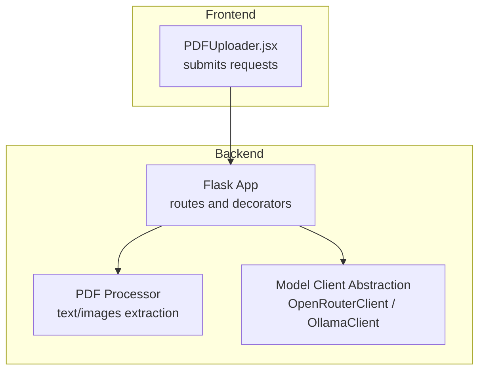
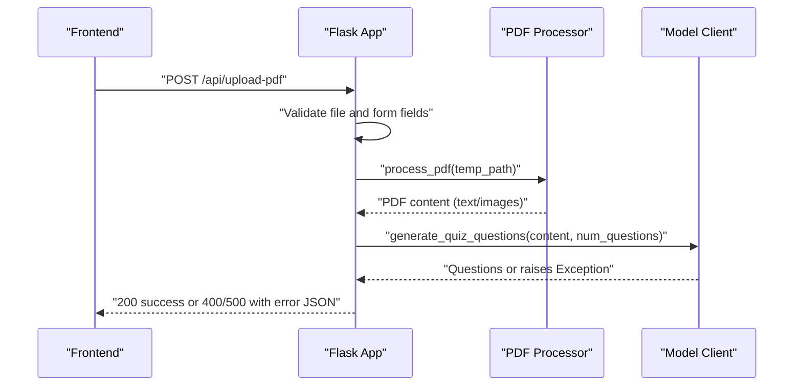
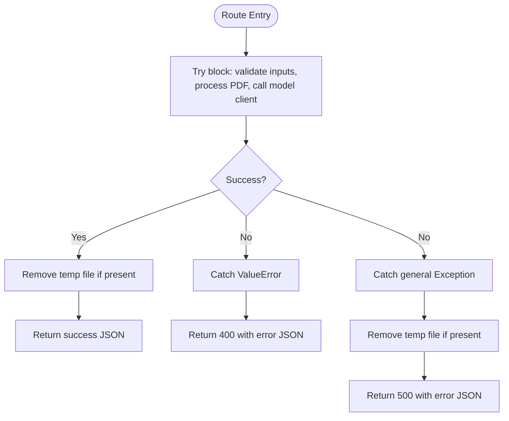
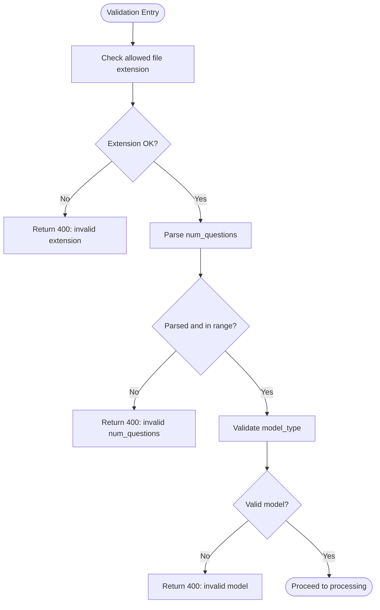
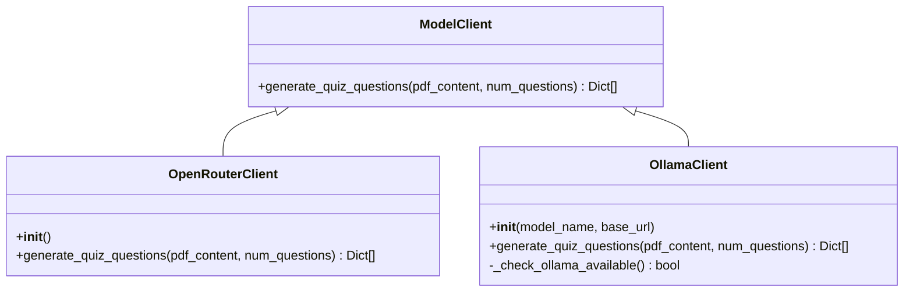
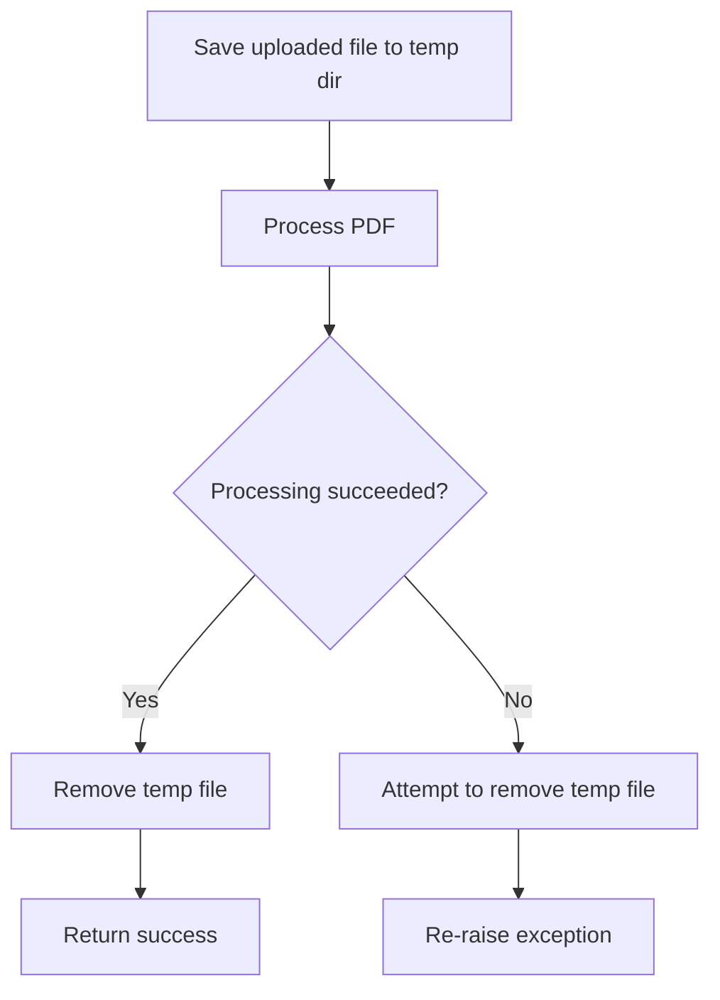
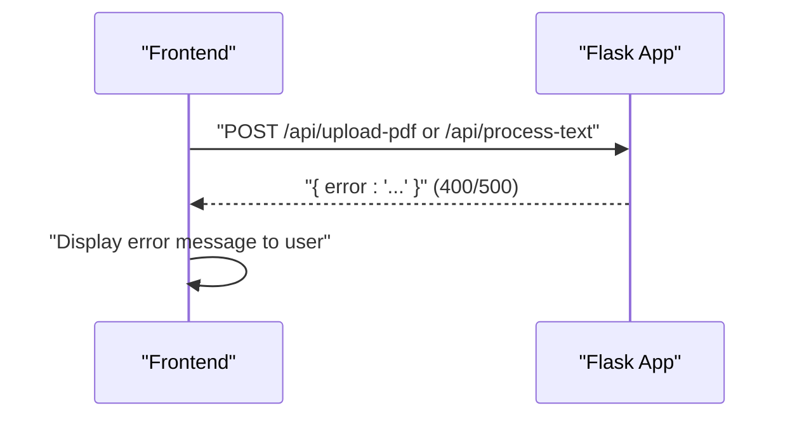
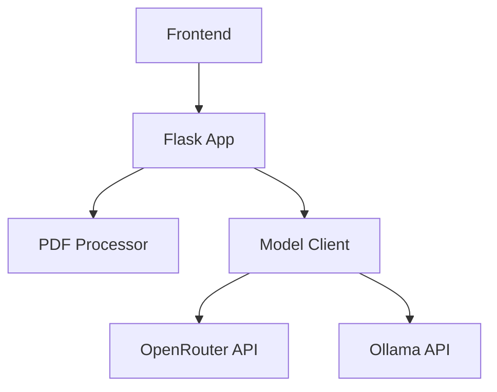

# Error Handling Strategy

<cite>
**Referenced Files in This Document**
- [backend/app.py](file://backend/app.py)
- [backend/model_client.py](file://backend/model_client.py)
- [backend/pdf_processor.py](file://backend/pdf_processor.py)
- [backend/requirements.txt](file://backend/requirements.txt)
- [backend/.env.example](file://backend/.env.example)
- [frontend/src/components/PDFUploader.jsx](file://frontend/src/components/PDFUploader.jsx)
- [README.md](file://README.md)
</cite>

## Table of Contents
1. [Introduction](#introduction)
2. [Project Structure](#project-structure)
3. [Core Components](#core-components)
4. [Architecture Overview](#architecture-overview)
5. [Detailed Component Analysis](#detailed-component-analysis)
6. [Dependency Analysis](#dependency-analysis)
7. [Performance Considerations](#performance-considerations)
8. [Troubleshooting Guide](#troubleshooting-guide)
9. [Conclusion](#conclusion)

## Introduction
This document explains the backend error handling strategy implemented in the Flask application. It covers centralized exception handling in route decorators, early input validation, error propagation from model clients, temporary file cleanup, and the error message structure returned to the frontend. It also provides troubleshooting guidance for common issues such as missing API keys, Ollama server availability, PDF processing failures, and JSON parsing errors.

## Project Structure
The backend consists of:
- A Flask application with two primary routes for PDF and text processing
- A model client abstraction with OpenRouter and Ollama implementations
- A PDF processor module for extracting text and images
- Frontend components that consume the API and display errors

**Diagram sources**
- [backend/app.py](file://backend/app.py#L59-L164)
- [backend/pdf_processor.py](file://backend/pdf_processor.py#L64-L77)
- [backend/model_client.py](file://backend/model_client.py#L263-L272)
- [frontend/src/components/PDFUploader.jsx](file://frontend/src/components/PDFUploader.jsx#L50-L110)

**Section sources**
- [backend/app.py](file://backend/app.py#L59-L164)
- [backend/pdf_processor.py](file://backend/pdf_processor.py#L64-L77)
- [backend/model_client.py](file://backend/model_client.py#L263-L272)
- [frontend/src/components/PDFUploader.jsx](file://frontend/src/components/PDFUploader.jsx#L50-L110)

## Core Components
- Centralized exception handling in Flask routes:
  - Routes return structured JSON error responses with appropriate HTTP status codes.
  - ValueError exceptions are mapped to 400 Bad Request; general exceptions to 500 Internal Server Error.
- Early input validation:
  - File extension checks and form field presence validation.
  - Parameter validation for number of questions and model type.
- Model client error propagation:
  - Specialized error messages for API key issues, credit limits, model availability, and timeouts.
- Temporary file cleanup:
  - PDF files are removed in both success and failure paths.
- Startup warning:
  - Warning printed when the OpenRouter API key is missing.

**Section sources**
- [backend/app.py](file://backend/app.py#L59-L118)
- [backend/app.py](file://backend/app.py#L120-L164)
- [backend/app.py](file://backend/app.py#L166-L173)
- [backend/model_client.py](file://backend/model_client.py#L62-L75)
- [backend/model_client.py](file://backend/model_client.py#L141-L152)
- [backend/model_client.py](file://backend/model_client.py#L170-L179)
- [backend/model_client.py](file://backend/model_client.py#L246-L261)
- [backend/pdf_processor.py](file://backend/pdf_processor.py#L31-L33)
- [backend/pdf_processor.py](file://backend/pdf_processor.py#L59-L60)

## Architecture Overview
The error handling architecture centers around the Flask routes that orchestrate PDF processing and model generation. Validation occurs early in the request lifecycle, and exceptions are caught centrally to return consistent JSON error responses.

**Diagram sources**
- [backend/app.py](file://backend/app.py#L59-L118)
- [backend/pdf_processor.py](file://backend/pdf_processor.py#L64-L77)
- [backend/model_client.py](file://backend/model_client.py#L263-L272)

## Detailed Component Analysis

### Centralized Exception Handling in Flask Routes
- Route decorators wrap request handling in try/except blocks.
- ValueError is handled specifically and returns a 400 with a JSON error object.
- General exceptions are caught and return a 500 with a generic error message.
- Temporary file cleanup is performed in the failure branch to prevent disk accumulation.

**Diagram sources**
- [backend/app.py](file://backend/app.py#L59-L118)
- [backend/app.py](file://backend/app.py#L120-L164)

**Section sources**
- [backend/app.py](file://backend/app.py#L59-L118)
- [backend/app.py](file://backend/app.py#L120-L164)

### Validation Functions: Early Input Checks
- allowed_file(): Ensures uploaded file has a PDF extension.
- _validate_quiz_parameters(): Validates number of questions and model type, raising ValueError on invalid inputs.
- Route-level validations:
  - Presence of file and filename.
  - PDF content emptiness check after processing.
  - num_questions conversion with fallback to zero on parse error.

**Diagram sources**
- [backend/app.py](file://backend/app.py#L21-L39)
- [backend/app.py](file://backend/app.py#L64-L95)
- [backend/app.py](file://backend/app.py#L127-L134)

**Section sources**
- [backend/app.py](file://backend/app.py#L21-L39)
- [backend/app.py](file://backend/app.py#L64-L95)
- [backend/app.py](file://backend/app.py#L127-L134)

### Error Propagation from Model Clients
- OpenRouterClient:
  - Raises ValueError if API key is missing.
  - Raises Exception with a specialized message for credit limits or token-related issues.
  - Raises Exception for JSON parsing errors and general API errors.
- OllamaClient:
  - Raises Exception if Ollama server is unreachable.
  - Raises Exception for model not found.
  - Raises Exception for timeouts and JSON parsing errors.
  - Raises Exception if the API returns an empty response or invalid JSON.

**Diagram sources**
- [backend/model_client.py](file://backend/model_client.py#L53-L61)
- [backend/model_client.py](file://backend/model_client.py#L62-L75)
- [backend/model_client.py](file://backend/model_client.py#L154-L179)
- [backend/model_client.py](file://backend/model_client.py#L170-L179)

**Section sources**
- [backend/model_client.py](file://backend/model_client.py#L62-L75)
- [backend/model_client.py](file://backend/model_client.py#L141-L152)
- [backend/model_client.py](file://backend/model_client.py#L170-L179)
- [backend/model_client.py](file://backend/model_client.py#L246-L261)

### File Cleanup Mechanism
- Temporary PDF files are stored under the configured upload folder.
- On success, the file is removed immediately after processing.
- On failure, the route attempts to remove the temporary file before re-raising the exception to ensure cleanup.

**Diagram sources**
- [backend/app.py](file://backend/app.py#L84-L113)

**Section sources**
- [backend/app.py](file://backend/app.py#L84-L113)

### Startup Warning for Missing OPENROUTER_API_KEY
- During startup, if the environment variable is not set, a warning is printed advising to configure the key for cloud models and noting that local models do not require it.

**Section sources**
- [backend/app.py](file://backend/app.py#L166-L171)
- [backend/.env.example](file://backend/.env.example#L1-L5)

### Error Message Structure Returned to the Frontend
- Routes return JSON with an "error" field on failure and a "success" field on success.
- Frontend components read the error message from the response and display it to the user.

**Diagram sources**
- [backend/app.py](file://backend/app.py#L64-L74)
- [backend/app.py](file://backend/app.py#L102-L106)
- [backend/app.py](file://backend/app.py#L127-L134)
- [backend/app.py](file://backend/app.py#L151-L158)
- [frontend/src/components/PDFUploader.jsx](file://frontend/src/components/PDFUploader.jsx#L99-L106)

**Section sources**
- [backend/app.py](file://backend/app.py#L64-L74)
- [backend/app.py](file://backend/app.py#L102-L106)
- [backend/app.py](file://backend/app.py#L127-L134)
- [backend/app.py](file://backend/app.py#L151-L158)
- [frontend/src/components/PDFUploader.jsx](file://frontend/src/components/PDFUploader.jsx#L99-L106)

## Dependency Analysis
- Flask application depends on:
  - PDF processor for content extraction
  - Model client abstraction for question generation
- Model client implementations depend on external services:
  - OpenRouter API (cloud)
  - Ollama API (local)
- Frontend depends on the backend API for quiz generation and error reporting.

**Diagram sources**
- [backend/app.py](file://backend/app.py#L59-L164)
- [backend/pdf_processor.py](file://backend/pdf_processor.py#L64-L77)
- [backend/model_client.py](file://backend/model_client.py#L263-L272)
- [frontend/src/components/PDFUploader.jsx](file://frontend/src/components/PDFUploader.jsx#L50-L110)

**Section sources**
- [backend/app.py](file://backend/app.py#L59-L164)
- [backend/pdf_processor.py](file://backend/pdf_processor.py#L64-L77)
- [backend/model_client.py](file://backend/model_client.py#L263-L272)
- [frontend/src/components/PDFUploader.jsx](file://frontend/src/components/PDFUploader.jsx#L50-L110)

## Performance Considerations
- Early validation reduces unnecessary downstream processing.
- Temporary file cleanup prevents disk growth and improves reliability.
- Model client timeouts and token limits are tuned to balance quality and responsiveness.

[No sources needed since this section provides general guidance]

## Troubleshooting Guide
- Ollama server not running:
  - Symptom: Exception indicating Ollama server is unreachable.
  - Action: Ensure Ollama is installed and running locally, and the model is pulled.
- Invalid API key (OpenRouter):
  - Symptom: ValueError raised during client initialization.
  - Action: Set OPENROUTER_API_KEY in the backend environment.
- Credit limits or token exhaustion (OpenRouter):
  - Symptom: Exception mentioning insufficient credits or token limits.
  - Action: Reduce number of questions or top up credits.
- Model not found (Ollama):
  - Symptom: Exception indicating the model was not found.
  - Action: Pull the required model locally.
- Timeout (Ollama):
  - Symptom: Exception indicating exceeded wait time.
  - Action: Reduce number of questions or improve system performance.
- PDF processing failures:
  - Symptom: Exceptions during text or image extraction.
  - Action: Verify the PDF is valid and readable; ensure required system packages are installed.
- JSON parsing errors:
  - Symptom: Exceptions parsing JSON from model responses.
  - Action: Retry with fewer questions or adjust model parameters.
- Frontend error display:
  - Symptom: Error message shown to the user.
  - Action: The frontend reads the error field from the response and displays it.

**Section sources**
- [backend/model_client.py](file://backend/model_client.py#L62-L75)
- [backend/model_client.py](file://backend/model_client.py#L141-L152)
- [backend/model_client.py](file://backend/model_client.py#L170-L179)
- [backend/model_client.py](file://backend/model_client.py#L246-L261)
- [backend/pdf_processor.py](file://backend/pdf_processor.py#L31-L33)
- [backend/pdf_processor.py](file://backend/pdf_processor.py#L59-L60)
- [frontend/src/components/PDFUploader.jsx](file://frontend/src/components/PDFUploader.jsx#L99-L106)
- [README.md](file://README.md#L48-L57)

## Conclusion
The backend implements a robust, centralized error handling strategy with early validation, explicit exception mapping to HTTP status codes, and specialized error messages from model clients. Temporary file cleanup ensures resource hygiene, while the frontend consistently displays error messages returned by the API. Together, these mechanisms provide a reliable and user-friendly error experience across cloud and local model usage.