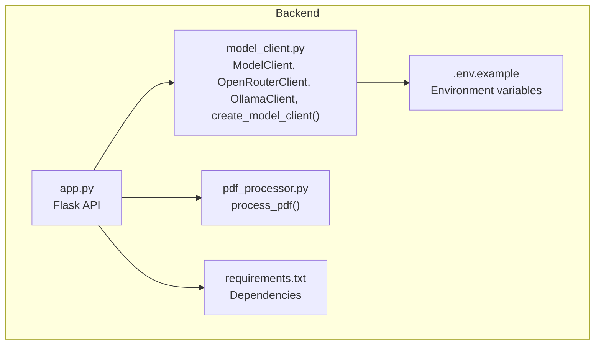
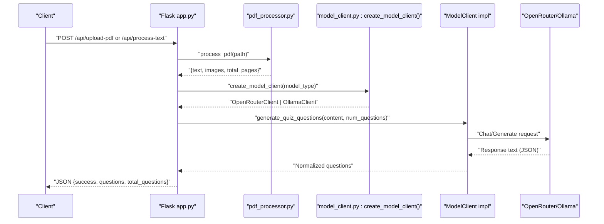
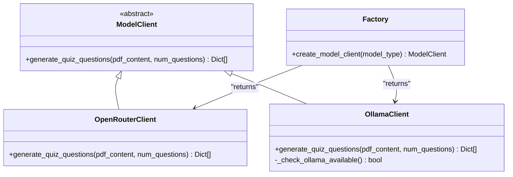
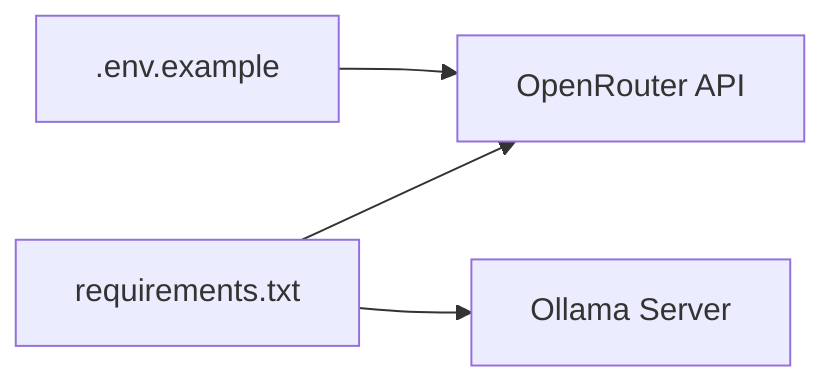

# Model Client Implementation

<cite>
**Referenced Files in This Document**
- [model_client.py](file://backend/model_client.py)
- [app.py](file://backend/app.py)
- [.env.example](file://backend/.env.example)
- [requirements.txt](file://backend/requirements.txt)
- [pdf_processor.py](file://backend/pdf_processor.py)
- [README.md](file://README.md)
</cite>

## Table of Contents
1. [Introduction](#introduction)
2. [Project Structure](#project-structure)
3. [Core Components](#core-components)
4. [Architecture Overview](#architecture-overview)
5. [Detailed Component Analysis](#detailed-component-analysis)
6. [Dependency Analysis](#dependency-analysis)
7. [Performance Considerations](#performance-considerations)
8. [Troubleshooting Guide](#troubleshooting-guide)
9. [Conclusion](#conclusion)

## Introduction
This document explains the Model Client Implementation used by the Quiz Generator backend to generate quiz questions from PDF content or raw text. It focuses on the abstract factory pattern used to instantiate the appropriate client, the abstract base class contract, and the concrete implementations for OpenRouter and Ollama. It also covers configuration, token optimization strategies, error handling, and practical usage within the backend API flow.

## Project Structure
The model client logic resides in the backend module and integrates with the Flask application and PDF processing pipeline.

**Diagram sources**
- [app.py](file://backend/app.py#L1-L176)
- [model_client.py](file://backend/model_client.py#L1-L272)
- [pdf_processor.py](file://backend/pdf_processor.py#L1-L77)
- [.env.example](file://backend/.env.example#L1-L5)
- [requirements.txt](file://backend/requirements.txt#L1-L9)

**Section sources**
- [app.py](file://backend/app.py#L1-L176)
- [model_client.py](file://backend/model_client.py#L1-L272)
- [pdf_processor.py](file://backend/pdf_processor.py#L1-L77)
- [.env.example](file://backend/.env.example#L1-L5)
- [requirements.txt](file://backend/requirements.txt#L1-L9)

## Core Components
- Abstract base class: ModelClient defines the contract for generating quiz questions.
- Concrete implementations:
  - OpenRouterClient: Uses OpenRouter API to call GPT-4 variants.
  - OllamaClient: Uses a local Ollama server to run Mistral 7B.
- Factory function: create_model_client(model_type) returns the appropriate client based on model_type.

Key responsibilities:
- Normalize and validate generated questions into a consistent format.
- Extract JSON from model responses robustly, including markdown-wrapped content.
- Apply token optimization strategies and safety limits.
- Provide meaningful error messages for common failure modes.

**Section sources**
- [model_client.py](file://backend/model_client.py#L53-L271)

## Architecture Overview
The backend API orchestrates PDF/text ingestion, passes content to the selected model client, and returns normalized quiz questions.

**Diagram sources**
- [app.py](file://backend/app.py#L59-L164)
- [pdf_processor.py](file://backend/pdf_processor.py#L64-L77)
- [model_client.py](file://backend/model_client.py#L263-L271)

## Detailed Component Analysis

### Abstract Base Class: ModelClient
- Contract: generate_quiz_questions(pdf_content, num_questions) -> List[Dict].
- Responsibilities:
  - Enforce a uniform interface for all model clients.
  - Allow the backend to swap providers without changing API logic.

Implementation note:
- The abstract method is declared in the base class and implemented by concrete subclasses.

**Section sources**
- [model_client.py](file://backend/model_client.py#L53-L60)

### Abstract Factory: create_model_client(model_type)
- Returns:
  - OpenRouterClient for model_type "openrouter".
  - OllamaClient(model_name="mistral") for model_type "ollama-mistral".
  - Raises ValueError for unknown types.

Usage in API:
- The backend validates parameters and calls create_model_client(model_type) before invoking generate_quiz_questions.

**Section sources**
- [model_client.py](file://backend/model_client.py#L263-L271)
- [app.py](file://backend/app.py#L41-L51)

### OpenRouterClient
Purpose:
- Generates quiz questions using OpenRouter’s hosted GPT-4 variants.

Key behaviors:
- Initialization:
  - Reads OPENROUTER_API_KEY from environment.
  - Creates an OpenAI-compatible client pointing to OpenRouter base URL.
- Prompt construction:
  - System prompt enforces Russian-language multiple-choice JSON output with 4 options.
  - User prompt includes a constrained text excerpt and up to two images.
- Token optimization:
  - Chooses model based on presence of images:
    - openai/gpt-4o-mini when no images.
    - openai/gpt-4o when images are present.
  - Calculates max_tokens proportional to num_questions, capped at 1500.
- JSON extraction and normalization:
  - Removes markdown code blocks from response.
  - Parses JSON and normalizes questions to a canonical format.
- Error handling:
  - Detects credit-related failures (e.g., 402-like conditions) and suggests replenishing credits or reducing questions.
  - Wraps other API errors with actionable messages.

Practical instantiation and usage:
- Called from the backend via create_model_client("openrouter").
- Used inside _generate_quiz_from_content(...) which is invoked by upload-pdf and process-text routes.

**Section sources**
- [model_client.py](file://backend/model_client.py#L62-L152)
- [app.py](file://backend/app.py#L41-L51)

### OllamaClient
Purpose:
- Generates quiz questions using a locally running Ollama server (default model mistral).

Key behaviors:
- Initialization:
  - Accepts model_name and base_url; defaults to "mistral" and "http://localhost:11434".
  - Uses httpx.Client with a generous timeout suitable for local inference.
- Availability check:
  - Validates connectivity by querying /api/tags with a short timeout.
- Prompt construction:
  - Same system prompt as OpenRouterClient.
  - Larger text window compared to OpenRouter (up to 8000 chars).
- Token optimization:
  - Limits num_predict proportionally to num_questions, capped at 2000.
- Robust JSON parsing:
  - Extracts JSON from response text, tolerating markdown wrappers.
  - If direct parse fails, attempts to extract a JSON substring.
  - Ensures non-empty response and presence of questions.
- Error handling:
  - TimeoutException mapped to a user-friendly message.
  - Model-not-found errors suggest pulling the model.
  - General API errors are wrapped with contextual messages.

Practical instantiation and usage:
- Called from the backend via create_model_client("ollama-mistral").
- Used inside _generate_quiz_from_content(...) similarly to OpenRouterClient.

**Section sources**
- [model_client.py](file://backend/model_client.py#L154-L261)
- [app.py](file://backend/app.py#L41-L51)

### Shared Utilities
- normalize_questions(questions): Normalizes fields and ensures correct_answer indices for multiple-choice questions.
- extract_json_from_response(text): Strips markdown code fences to isolate JSON.

These utilities are used by both clients to produce consistent output.

**Section sources**
- [model_client.py](file://backend/model_client.py#L13-L36)
- [model_client.py](file://backend/model_client.py#L38-L51)

### Class Diagram

**Diagram sources**
- [model_client.py](file://backend/model_client.py#L53-L271)

## Dependency Analysis
External libraries and environment:
- OpenRouterClient depends on the OpenAI SDK configured to use OpenRouter base URL.
- OllamaClient depends on httpx for HTTP requests.
- Environment variables:
  - OPENROUTER_API_KEY for cloud model access.
- PDF processing pipeline supplies content to the model clients.

**Diagram sources**
- [requirements.txt](file://backend/requirements.txt#L1-L9)
- [.env.example](file://backend/.env.example#L1-L5)

**Section sources**
- [requirements.txt](file://backend/requirements.txt#L1-L9)
- [.env.example](file://backend/.env.example#L1-L5)

## Performance Considerations
- Token budgeting:
  - OpenRouterClient computes max_tokens proportional to num_questions and caps at 1500; selects gpt-4o-mini when no images are present to reduce cost and latency.
  - OllamaClient sets num_predict proportionally to num_questions and caps at 2000.
- Content limits:
  - OpenRouterClient truncates text to approximately 4000 characters and sends up to two images.
  - OllamaClient allows up to 8000 characters of text.
- Timeouts:
  - OllamaClient uses a longer timeout suitable for local inference.
- Throughput:
  - Reducing num_questions reduces token usage and improves reliability.
  - Using gpt-4o-mini for text-only prompts lowers cost and speeds up responses.

[No sources needed since this section provides general guidance]

## Troubleshooting Guide
Common issues and resolutions:

- API key errors (OpenRouter):
  - Symptom: ValueError during client initialization or credit-related errors during generation.
  - Resolution: Set OPENROUTER_API_KEY in backend/.env and ensure sufficient credits. The client raises explicit messages guiding to replenish credits or reduce questions.

- Model not found (Ollama):
  - Symptom: Error indicating the model was not found.
  - Resolution: Pull the model using the suggested command. The client detects this condition and instructs to run the pull command.

- Timeout exceptions (Ollama):
  - Symptom: Exceeded timeout while waiting for a response.
  - Resolution: Reduce num_questions, ensure Ollama is running and responsive, or improve host performance.

- JSON parsing failures:
  - Symptom: Errors indicating JSON could not be parsed.
  - Resolution: The clients attempt to strip markdown wrappers and extract JSON substrings. If still failing, verify model output format and retry with fewer questions.

- Backend validation errors:
  - Symptom: 400 responses for invalid parameters or unsupported model type.
  - Resolution: Ensure num_questions is a positive integer not exceeding 20 and model_type is one of the supported values.

Operational checks:
- Health endpoint: Use /api/health to verify the backend is running.
- Environment setup: Confirm OPENROUTER_API_KEY is set when using OpenRouter; no key is required for Ollama.

**Section sources**
- [model_client.py](file://backend/model_client.py#L62-L152)
- [model_client.py](file://backend/model_client.py#L154-L261)
- [app.py](file://backend/app.py#L26-L39)
- [app.py](file://backend/app.py#L53-L57)
- [README.md](file://README.md#L150-L161)

## Practical Usage Examples
- Upload PDF and generate quiz:
  - Route: POST /api/upload-pdf
  - Flow: Validates file, extracts text/images, constructs content, calls create_model_client(model_type), invokes generate_quiz_questions, returns normalized questions.

- Process raw text:
  - Route: POST /api/process-text
  - Flow: Validates text, constructs content dict, calls the same generation pipeline.

Both flows rely on _generate_quiz_from_content(...) which encapsulates parameter validation and client invocation.

**Section sources**
- [app.py](file://backend/app.py#L59-L164)
- [pdf_processor.py](file://backend/pdf_processor.py#L64-L77)
- [model_client.py](file://backend/model_client.py#L263-L271)

## Configuration Requirements
- Environment:
  - OPENROUTER_API_KEY (optional; required for OpenRouter).
- Local model:
  - Install and run Ollama; pull the mistral model.
- Dependencies:
  - Install Python packages listed in requirements.txt.

**Section sources**
- [.env.example](file://backend/.env.example#L1-L5)
- [README.md](file://README.md#L15-L20)
- [README.md](file://README.md#L48-L51)
- [requirements.txt](file://backend/requirements.txt#L1-L9)

## Conclusion
The Model Client Implementation cleanly separates concerns between the backend API and model providers. The abstract factory pattern enables seamless switching between OpenRouter and Ollama, while shared utilities ensure consistent, normalized output. Token optimization, robust JSON parsing, and detailed error handling improve reliability and user experience across both cloud and local inference scenarios.