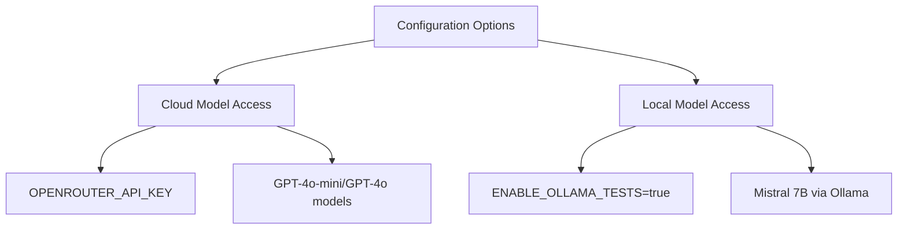
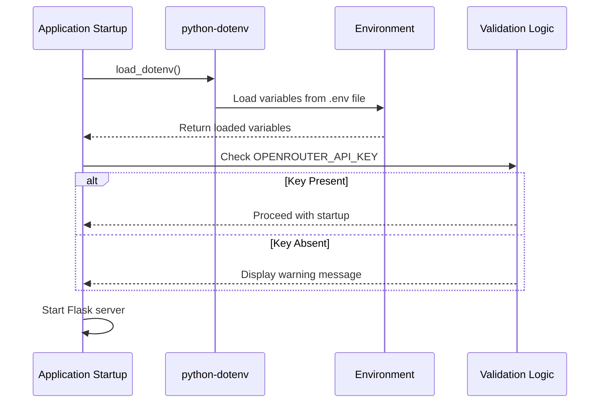
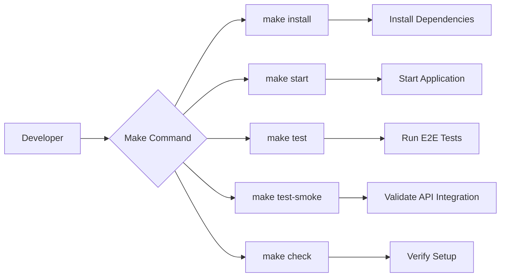

# Configuration Management

<cite>
**Referenced Files in This Document**   
- [backend/.env.example](file://backend/.env.example)
- [backend/app.py](file://backend/app.py)
- [backend/model_client.py](file://backend/model_client.py)
- [Makefile](file://Makefile)
- [README.md](file://README.md)
- [TESTING.md](file://TESTING.md)
- [e2e/tests/smoke.spec.js](file://e2e/tests/smoke.spec.js)
</cite>

## Table of Contents
1. [Introduction](#introduction)
2. [Environment Variables](#environment-variables)
3. [Configuration Loading and Validation](#configuration-loading-and-validation)
4. [Makefile Variables and Development Workflows](#makefile-variables-and-development-workflows)
5. [Development vs Production Setup](#development-vs-production-setup)
6. [Security Best Practices](#security-best-practices)
7. [Troubleshooting Common Issues](#troubleshooting-common-issues)
8. [Conclusion](#conclusion)

## Introduction
The Quiz Generator application provides a flexible configuration system that supports both cloud-based and local AI model processing. This document details the comprehensive configuration management approach, covering environment variables, configuration loading mechanisms, development workflows, and security considerations. The system is designed to be accessible for developers while maintaining robust security practices for sensitive data.

**Section sources**
- [README.md](file://README.md#L1-L161)

## Environment Variables
The application uses environment variables as the primary configuration mechanism, following the 12-factor app methodology. The key configuration parameters are defined in the `.env.example` file located in the backend directory, which serves as a template for the actual `.env` file.

The primary environment variables include:

- **OPENROUTER_API_KEY**: This variable contains the API key for accessing cloud-based models through OpenRouter. It's required when using GPT-4o-mini or GPT-4o models for quiz generation. The key must be obtained from [openrouter.ai](https://openrouter.ai) and should be kept confidential.

- **ENABLE_OLLAMA_TESTS**: This boolean flag enables or disables testing with the local Ollama service. When set to `true`, the application can utilize the local Mistral 7B model for quiz generation without requiring an internet connection or API key.

The application supports two model selection options that can be specified at runtime:
- `openrouter`: Uses cloud-based models via the OpenRouter API
- `ollama-mistral`: Uses the local Mistral 7B model via Ollama API



**Diagram sources**
- [backend/.env.example](file://backend/.env.example#L1-L5)
- [backend/model_client.py](file://backend/model_client.py#L263-L271)

**Section sources**
- [backend/.env.example](file://backend/.env.example#L1-L5)
- [README.md](file://README.md#L17-L18)
- [TESTING.md](file://TESTING.md#L37-L40)

## Configuration Loading and Validation
The application implements a robust configuration loading and validation system using the `python-dotenv` package. Configuration values are loaded from environment variables with appropriate validation to ensure application stability.

The configuration loading process begins in the `model_client.py` file, where `load_dotenv()` is called at the module level to load variables from the `.env` file into the environment. This ensures that configuration is available throughout the application lifecycle.

In the Flask application (`app.py`), configuration validation occurs at multiple levels:

1. **Startup validation**: When the application starts, it checks for the presence of the `OPENROUTER_API_KEY` environment variable. If not found, it displays a warning message with setup instructions.

2. **Runtime validation**: The `_validate_quiz_parameters` function validates input parameters such as the number of questions (1-20 range) and model type (must be one of the supported options).

3. **Model-specific validation**: Each model client performs its own validation. The `OpenRouterClient` validates the API key, while the `OllamaClient` checks server availability.



**Diagram sources**
- [backend/app.py](file://backend/app.py#L166-L172)
- [backend/model_client.py](file://backend/model_client.py#L10)

**Section sources**
- [backend/app.py](file://backend/app.py#L166-L172)
- [backend/model_client.py](file://backend/model_client.py#L10)
- [backend/model_client.py](file://backend/model_client.py#L26-L37)

## Makefile Variables and Development Workflows
The Makefile provides a comprehensive set of commands that streamline development workflows and enforce consistent practices across the team. These commands abstract complex operations into simple, memorable tasks.

Key Makefile targets include:

- **install**: Installs all dependencies for both backend and frontend
- **start**: Starts the complete application (backend and frontend)
- **test**: Runs end-to-end tests
- **test-smoke**: Executes smoke tests that validate integration with external services
- **check**: Verifies that all dependencies are properly installed
- **clean**: Removes temporary files and logs

The `test-smoke` target is particularly important for configuration management as it automatically reads configuration values from the `backend/.env` file and sets appropriate environment variables for testing. This target validates both the presence of required configuration and the proper functioning of the configured services.



**Diagram sources**
- [Makefile](file://Makefile#L1-L94)

**Section sources**
- [Makefile](file://Makefile#L1-L94)
- [README.md](file://README.md#L93-L95)

## Development vs Production Setup
The application supports different configuration approaches for development and production environments, allowing developers to work efficiently while maintaining security in production.

For **local development**, developers should:

1. Create a `backend/.env` file based on the `.env.example` template
2. Add the `OPENROUTER_API_KEY` if using cloud models, or set `ENABLE_OLLAMA_TESTS=true` for local model testing
3. Use the Makefile commands for consistent workflow execution

For **production deployment**, additional considerations include:

- Using environment-specific configuration files
- Implementing secure secret management (e.g., environment variables injected by the deployment platform)
- Validating configuration before application startup
- Monitoring for configuration-related errors

The application is designed to function without an API key when using the local Ollama service, providing flexibility for environments where cloud access is restricted.

**Section sources**
- [README.md](file://README.md#L48-L51)
- [TESTING.md](file://TESTING.md#L274-L282)

## Security Best Practices
The application follows security best practices for handling sensitive configuration data:

1. **Environment variable isolation**: Sensitive data like API keys are stored in environment variables rather than in code.
2. **Git ignore configuration**: The `.env` file is excluded from version control via `.gitignore`, preventing accidental exposure of secrets.
3. **Template-based setup**: The `.env.example` file provides a template without actual values, guiding users on what configuration is needed.
4. **Runtime validation**: Configuration values are validated at runtime to prevent usage of invalid or missing credentials.
5. **Error handling**: The application provides clear error messages without exposing sensitive information in responses.

When handling API keys and sensitive data, developers should:
- Never commit `.env` files to version control
- Use strong, unique API keys
- Rotate keys periodically
- Restrict key permissions to the minimum required scope
- Monitor key usage for suspicious activity

**Section sources**
- [backend/.env.example](file://backend/.env.example#L1-L5)
- [README.md](file://README.md#L49-L50)

## Troubleshooting Common Issues
This section addresses common configuration issues and their solutions.

### Invalid API Keys
**Symptoms**: Authentication errors, "401 Unauthorized" responses, or explicit error messages about invalid credentials.

**Solutions**:
- Verify the API key format and ensure no extra spaces
- Check that the key has not expired or been revoked
- Confirm the key has the necessary permissions
- Regenerate the key if necessary

### Incorrect Model Paths
**Symptoms**: "Model not found" errors, connection timeouts, or service unavailable messages.

**Solutions**:
- Verify Ollama is running and accessible at `http://localhost:11434`
- Ensure the Mistral model is downloaded (`ollama pull mistral`)
- Check network connectivity and firewall settings
- Validate the model name in the configuration

### Environment Variable Loading Failures
**Symptoms**: Missing configuration warnings, default values not being overridden, or configuration-related errors.

**Solutions**:
- Ensure the `.env` file is in the correct location (`backend/.env`)
- Verify file permissions allow reading
- Check for syntax errors in the `.env` file (correct key=value format)
- Restart the application after configuration changes
- Use `make check` to verify the setup

Example of a properly configured `.env` file:
```
OPENROUTER_API_KEY=sk-or-v1-xxxxxxxxxxxxxxxxxxxxxxxxxxxxxxxxxxxxxxxxxxxxxxxxxxxxxxxxxxxx
```

Or for local Ollama testing:
```
ENABLE_OLLAMA_TESTS=true
```

Common validation error messages include:
- "OPENROUTER_API_KEY не установлен в переменных окружения" (OpenRouter API key not set)
- "Ollama сервер недоступен по адресу {base_url}" (Ollama server unavailable)
- "Модель {model_name} не найдена в Ollama" (Model not found in Ollama)

**Section sources**
- [backend/app.py](file://backend/app.py#L168-L170)
- [backend/model_client.py](file://backend/model_client.py#L67-L68)
- [backend/model_client.py](file://backend/model_client.py#L175-L178)
- [backend/model_client.py](file://backend/model_client.py#L256-L259)
- [e2e/tests/smoke.spec.js](file://e2e/tests/smoke.spec.js#L17-L18)

## Conclusion
The Quiz Generator application's configuration management system provides a flexible and secure approach to handling application settings. By using environment variables as the primary configuration mechanism, the system supports both cloud-based and local AI model processing while maintaining security best practices. The combination of the `.env` file system, Makefile automation, and comprehensive validation ensures that developers can easily configure the application for their specific needs while avoiding common configuration pitfalls. The clear separation between development and production considerations, along with detailed troubleshooting guidance, makes the system accessible to developers of all experience levels.