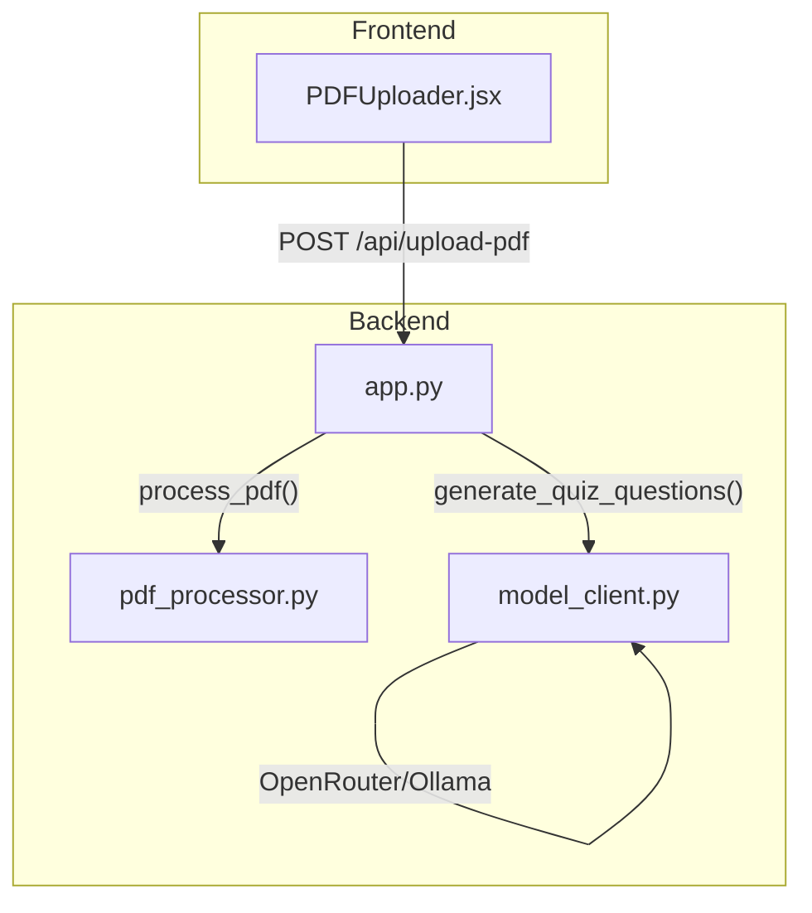
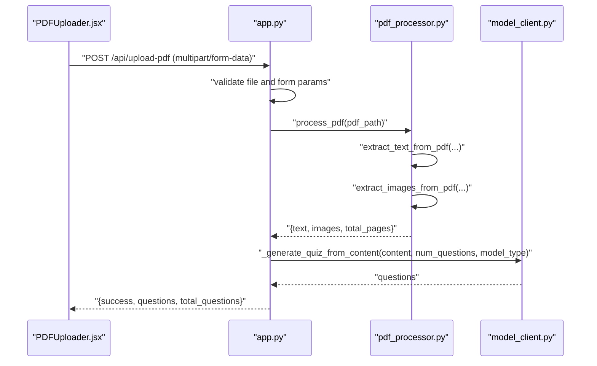
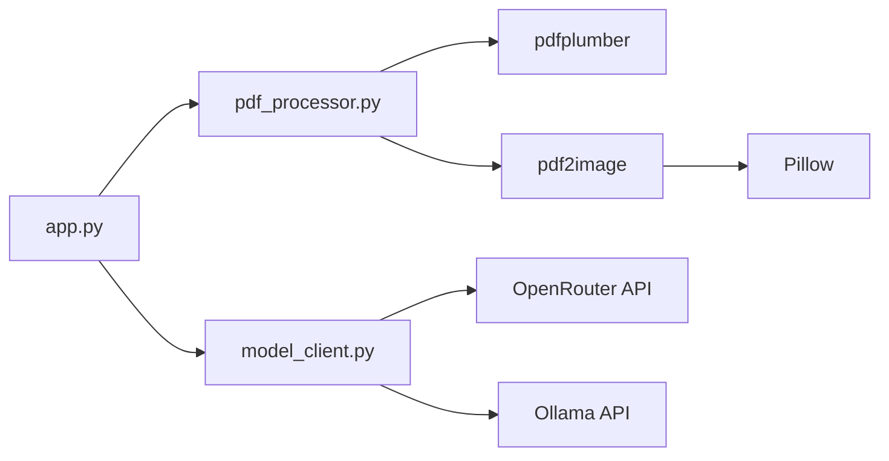

# PDF Processing

<cite>
**Referenced Files in This Document**
- [pdf_processor.py](file://backend/pdf_processor.py)
- [app.py](file://backend/app.py)
- [PDFUploader.jsx](file://frontend/src/components/PDFUploader.jsx)
- [model_client.py](file://backend/model_client.py)
- [README.md](file://README.md)
- [requirements.txt](file://backend/requirements.txt)
</cite>

## Table of Contents
1. [Introduction](#introduction)
2. [Project Structure](#project-structure)
3. [Core Components](#core-components)
4. [Architecture Overview](#architecture-overview)
5. [Detailed Component Analysis](#detailed-component-analysis)
6. [Dependency Analysis](#dependency-analysis)
7. [Performance Considerations](#performance-considerations)
8. [Troubleshooting Guide](#troubleshooting-guide)
9. [Conclusion](#conclusion)

## Introduction
This document explains the PDF Processing sub-component of the Data Processing Pipeline. It focuses on how the backend extracts text and images from PDFs, how page markers are inserted, how images are encoded, and how the resulting data is integrated into the AI quiz generation flow. It also covers error handling strategies for corrupted PDFs, performance considerations for large documents, and integration points with the frontend upload flow and backend AI processing.

## Project Structure
The PDF processing logic resides in the backend under a dedicated module and is orchestrated by the Flask application. The frontend provides a user interface for uploading PDFs and submitting parameters for quiz generation.

**Diagram sources**
- [PDFUploader.jsx](file://frontend/src/components/PDFUploader.jsx#L50-L110)
- [app.py](file://backend/app.py#L59-L118)
- [pdf_processor.py](file://backend/pdf_processor.py#L64-L77)
- [model_client.py](file://backend/model_client.py#L53-L152)

**Section sources**
- [README.md](file://README.md#L97-L129)
- [requirements.txt](file://backend/requirements.txt#L1-L9)

## Core Components
- extract_text_from_pdf(pdf_path, include_page_markers): Extracts text page by page using pdfplumber, optionally inserting explicit page markers.
- extract_images_from_pdf(pdf_path): Converts PDF pages to PNG images and encodes them in base64.
- process_pdf(pdf_path, include_page_markers): Orchestrates text and image extraction and returns a structured dictionary with text, images, and total page count.

Key behaviors:
- Page marker insertion: When enabled, a header is added before each page’s text to improve structure.
- Image encoding: Each page is saved to a PNG buffer and encoded to base64; metadata includes page number and format.
- Output structure: A dictionary containing text, images (each with page, base64, format), and total_pages equal to the number of images.

**Section sources**
- [pdf_processor.py](file://backend/pdf_processor.py#L8-L37)
- [pdf_processor.py](file://backend/pdf_processor.py#L39-L61)
- [pdf_processor.py](file://backend/pdf_processor.py#L64-L77)

## Architecture Overview
The end-to-end flow integrates frontend upload, backend processing, and AI model generation.

**Diagram sources**
- [PDFUploader.jsx](file://frontend/src/components/PDFUploader.jsx#L74-L109)
- [app.py](file://backend/app.py#L59-L118)
- [pdf_processor.py](file://backend/pdf_processor.py#L64-L77)
- [model_client.py](file://backend/model_client.py#L41-L51)

## Detailed Component Analysis

### Text Extraction: extract_text_from_pdf
Behavior:
- Opens the PDF using pdfplumber and iterates pages.
- Extracts raw text per page.
- Optionally prepends a page marker header before each page’s text.
- Joins pages with appropriate separators depending on whether page markers are included.

Page marker insertion:
- When include_page_markers is true, a header is inserted before each page’s text to visually separate pages in the final concatenated string.

Output:
- Concatenated text string with optional page markers.

Error handling:
- Wraps extraction errors in a raised exception with a descriptive message.

Performance note:
- Iterates pages sequentially; for very large documents, consider enabling page markers only when needed to reduce overhead.

**Section sources**
- [pdf_processor.py](file://backend/pdf_processor.py#L8-L37)

### Image Extraction: extract_images_from_pdf
Behavior:
- Converts each PDF page to a PIL Image at a fixed DPI.
- Saves each image to an in-memory buffer in PNG format.
- Encodes the buffer to base64 and stores it in a dictionary with page number and format.

Output:
- List of dictionaries, each with keys: page, base64, format.

Error handling:
- Wraps conversion errors in a raised exception with a descriptive message.

Performance note:
- DPI setting affects memory usage and image quality. Higher DPI increases memory footprint and processing time.

**Section sources**
- [pdf_processor.py](file://backend/pdf_processor.py#L39-L61)

### Orchestration: process_pdf
Behavior:
- Calls extract_text_from_pdf and extract_images_from_pdf.
- Returns a dictionary with:
  - text: the extracted text
  - images: the list of image dictionaries
  - total_pages: the number of images (equal to the number of pages)

Integration:
- The Flask endpoint /api/upload-pdf invokes this function and forwards the result to the AI model client.

**Section sources**
- [pdf_processor.py](file://backend/pdf_processor.py#L64-L77)
- [app.py](file://backend/app.py#L88-L107)

### Frontend Upload Flow Integration
- The frontend component PDFUploader.jsx constructs a multipart/form-data payload with the PDF file, number of questions, and model type.
- It sends the request to /api/upload-pdf and displays success or error responses.
- On success, it passes the generated questions to the parent container for rendering.

**Section sources**
- [PDFUploader.jsx](file://frontend/src/components/PDFUploader.jsx#L74-L109)
- [app.py](file://backend/app.py#L59-L118)

### Backend AI Processing Integration
- After successful PDF processing, the backend calls the model client to generate quiz questions.
- The OpenRouter client sends up to two images (base64-encoded) along with a truncated text excerpt.
- The Ollama client accepts a larger text excerpt and generates questions locally.

**Section sources**
- [app.py](file://backend/app.py#L88-L107)
- [model_client.py](file://backend/model_client.py#L76-L152)
- [model_client.py](file://backend/model_client.py#L170-L261)

## Dependency Analysis
External libraries and their roles:
- pdfplumber: Extracts text from PDF pages.
- pdf2image: Converts PDF pages to images for OCR-ready scenarios.
- Pillow: Provides the PIL Image used for saving images to buffers.
- OpenRouter API and Ollama: Provide the AI model generation service.

**Diagram sources**
- [requirements.txt](file://backend/requirements.txt#L1-L9)
- [pdf_processor.py](file://backend/pdf_processor.py#L1-L3)
- [model_client.py](file://backend/model_client.py#L62-L152)

**Section sources**
- [requirements.txt](file://backend/requirements.txt#L1-L9)

## Performance Considerations
- Memory usage during image conversion:
  - The image extraction function converts each page to a PNG and encodes it to base64. This can consume significant memory for large documents. Consider reducing DPI or limiting the number of pages sent to the AI model.
- Page markers:
  - Enabling page markers adds extra text and separators. Disable them for very large documents to reduce memory and processing time.
- Truncated content:
  - The OpenRouter client truncates text to a fixed length and limits images to two. The Ollama client allows a larger text window. Tune these limits based on your content size and model capabilities.
- Large documents:
  - For extremely large PDFs, consider splitting the document or processing in chunks. Alternatively, disable image extraction or reduce DPI to mitigate memory pressure.

[No sources needed since this section provides general guidance]

## Troubleshooting Guide
Common issues and strategies:
- Corrupted or unreadable PDFs:
  - Both text and image extraction functions raise exceptions on failure. Catch and display user-friendly messages in the frontend. Ensure the PDF is valid and accessible.
- Missing text in scanned PDFs:
  - pdfplumber relies on embedded text. Scanned PDFs without OCR will yield little or no text. Consider adding an OCR step (outside this module) before text extraction.
- Excessive memory usage:
  - Reduce DPI in image extraction or limit the number of pages forwarded to the AI model. Monitor total_pages and adjust accordingly.
- Backend errors:
  - The Flask endpoint handles validation errors and general exceptions, returning JSON with an error message. Ensure the frontend displays these messages clearly.
- Poppler dependency:
  - pdf2image depends on poppler utilities. Install poppler according to platform-specific instructions to avoid conversion failures.

**Section sources**
- [pdf_processor.py](file://backend/pdf_processor.py#L20-L33)
- [pdf_processor.py](file://backend/pdf_processor.py#L43-L60)
- [app.py](file://backend/app.py#L88-L118)
- [README.md](file://README.md#L49-L52)

## Conclusion
The PDF Processing sub-component provides robust text and image extraction from PDFs, with optional page markers and base64-encoded images. Its orchestration function returns a structured dictionary suitable for downstream AI processing. By tuning DPI, disabling page markers, and truncating content, you can balance quality and performance. Integrations with the frontend and AI clients are straightforward, enabling seamless quiz generation from uploaded PDFs.