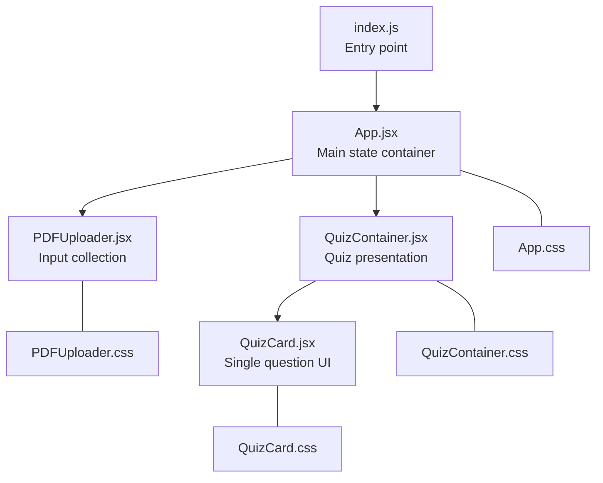
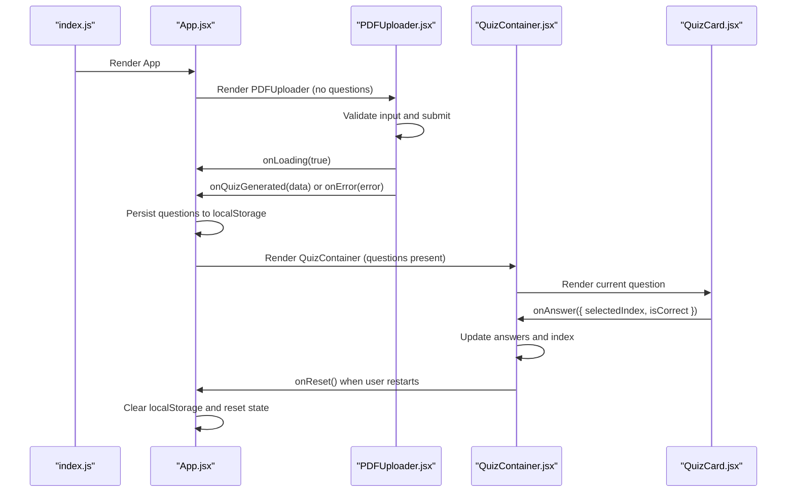
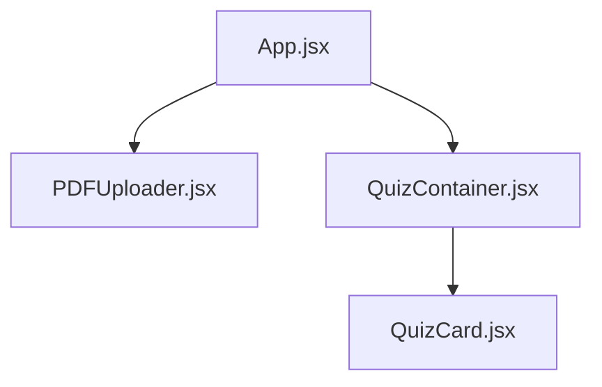
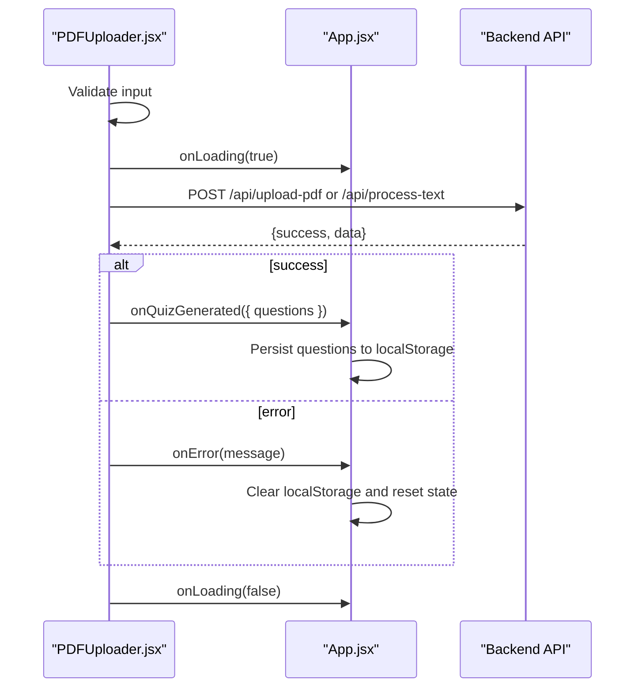
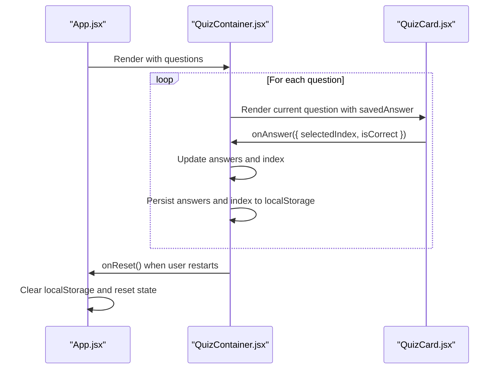
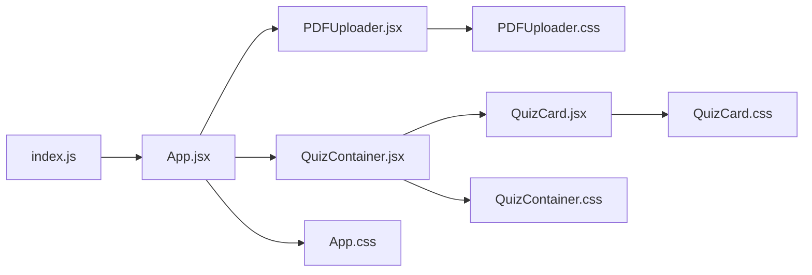

# Component Hierarchy

<cite>
**Referenced Files in This Document**
- [index.js](file://frontend/src/index.js)
- [App.jsx](file://frontend/src/App.jsx)
- [PDFUploader.jsx](file://frontend/src/components/PDFUploader.jsx)
- [QuizContainer.jsx](file://frontend/src/components/QuizContainer.jsx)
- [QuizCard.jsx](file://frontend/src/components/QuizCard.jsx)
- [App.css](file://frontend/src/App.css)
- [PDFUploader.css](file://frontend/src/components/PDFUploader.css)
- [QuizContainer.css](file://frontend/src/components/QuizContainer.css)
- [QuizCard.css](file://frontend/src/components/QuizCard.css)
</cite>

## Table of Contents
1. [Introduction](#introduction)
2. [Project Structure](#project-structure)
3. [Core Components](#core-components)
4. [Architecture Overview](#architecture-overview)
5. [Detailed Component Analysis](#detailed-component-analysis)
6. [Dependency Analysis](#dependency-analysis)
7. [Performance Considerations](#performance-considerations)
8. [Troubleshooting Guide](#troubleshooting-guide)
9. [Conclusion](#conclusion)

## Introduction
This document explains the React component hierarchy of the Quiz Generator application. It starts at the entry point that renders the App component, details how App manages global state and localStorage persistence, and documents how App conditionally renders either the PDFUploader for input collection or the QuizContainer for quiz presentation. It also covers the parent-child relationships among components and how props like onQuizGenerated, onError, onLoading, and onReset synchronize state across the hierarchy. Finally, it provides diagrams illustrating the component tree and data flow, along with best practices for maintaining clean component boundaries.

## Project Structure
The frontend is organized around a small set of React components and a minimal CSS layer. The entry point initializes the React root and mounts the top-level App component. App orchestrates two major screens: input collection (PDFUploader) and quiz presentation (QuizContainer), which in turn composes QuizCard to render individual questions.

**Diagram sources**
- [index.js](file://frontend/src/index.js#L1-L12)
- [App.jsx](file://frontend/src/App.jsx#L1-L90)
- [PDFUploader.jsx](file://frontend/src/components/PDFUploader.jsx#L1-L323)
- [QuizContainer.jsx](file://frontend/src/components/QuizContainer.jsx#L1-L164)
- [QuizCard.jsx](file://frontend/src/components/QuizCard.jsx#L1-L101)
- [App.css](file://frontend/src/App.css#L1-L61)
- [PDFUploader.css](file://frontend/src/components/PDFUploader.css#L1-L376)
- [QuizContainer.css](file://frontend/src/components/QuizContainer.css#L1-L177)
- [QuizCard.css](file://frontend/src/components/QuizCard.css#L1-L162)

**Section sources**
- [index.js](file://frontend/src/index.js#L1-L12)
- [App.jsx](file://frontend/src/App.jsx#L1-L90)

## Core Components
- index.js: Creates the React root and renders the App component.
- App.jsx: Central state container holding questions, loading, and error state; persists questions to localStorage; conditionally renders PDFUploader or QuizContainer; passes callbacks to children.
- PDFUploader.jsx: Handles PDF/text input modes, drag-and-drop, validation, and submission; emits onQuizGenerated, onError, onLoading to App.
- QuizContainer.jsx: Manages quiz progress, answers, and results; persists current index, answers, and visibility flag to localStorage; renders QuizCard and navigation controls; triggers onReset.
- QuizCard.jsx: Renders a single question and its options; tracks selection and correctness; notifies parent via onAnswer; respects savedAnswer for continuity.

Key implementation references:
- Entry point mounting: [index.js](file://frontend/src/index.js#L1-L12)
- App state and localStorage integration: [App.jsx](file://frontend/src/App.jsx#L1-L90)
- Conditional rendering and prop passing: [App.jsx](file://frontend/src/App.jsx#L61-L84)
- PDFUploader form handling and API calls: [PDFUploader.jsx](file://frontend/src/components/PDFUploader.jsx#L50-L110)
- QuizContainer state and localStorage persistence: [QuizContainer.jsx](file://frontend/src/components/QuizContainer.jsx#L9-L52)
- QuizCard answer handling and result display: [QuizCard.jsx](file://frontend/src/components/QuizCard.jsx#L20-L33)

**Section sources**
- [index.js](file://frontend/src/index.js#L1-L12)
- [App.jsx](file://frontend/src/App.jsx#L1-L90)
- [PDFUploader.jsx](file://frontend/src/components/PDFUploader.jsx#L1-L323)
- [QuizContainer.jsx](file://frontend/src/components/QuizContainer.jsx#L1-L164)
- [QuizCard.jsx](file://frontend/src/components/QuizCard.jsx#L1-L101)

## Architecture Overview
The application follows a unidirectional data flow:
- App holds global state and decides which screen to render.
- PDFUploader collects input and communicates with App via callbacks.
- QuizContainer manages quiz lifecycle and user interactions, delegating question rendering to QuizCard.
- All components rely on props and callback functions to communicate upward, avoiding tight coupling.

**Diagram sources**
- [index.js](file://frontend/src/index.js#L1-L12)
- [App.jsx](file://frontend/src/App.jsx#L27-L52)
- [PDFUploader.jsx](file://frontend/src/components/PDFUploader.jsx#L70-L110)
- [QuizContainer.jsx](file://frontend/src/components/QuizContainer.jsx#L54-L106)
- [QuizCard.jsx](file://frontend/src/components/QuizCard.jsx#L20-L33)

## Detailed Component Analysis

### App.jsx: Main State Container
Responsibilities:
- Holds and updates questions, loading, and error state.
- Restores questions from localStorage on mount.
- Persists questions to localStorage upon successful generation.
- Clears localStorage and resets state on reset.
- Conditionally renders PDFUploader or QuizContainer based on presence of questions.
- Passes callbacks to children: onQuizGenerated, onError, onLoading, onReset.

Notable patterns:
- useState for local state.
- useEffect for initial localStorage restoration and cleanup.
- Conditional rendering based on questions presence.
- Prop drilling for callbacks and loading state.

Code example references:
- LocalStorage restore on mount: [App.jsx](file://frontend/src/App.jsx#L13-L25)
- Persisting questions on success: [App.jsx](file://frontend/src/App.jsx#L30-L32)
- Resetting and clearing localStorage: [App.jsx](file://frontend/src/App.jsx#L44-L52)
- Conditional rendering and prop passing: [App.jsx](file://frontend/src/App.jsx#L61-L84)

**Section sources**
- [App.jsx](file://frontend/src/App.jsx#L1-L90)

### PDFUploader.jsx: Input Collection
Responsibilities:
- Supports two input modes: PDF upload and text input.
- Handles drag-and-drop and file selection.
- Validates inputs (file presence, text presence, question count range).
- Calls onLoading, onQuizGenerated, and onError callbacks.
- Integrates with backend endpoints for PDF and text processing.

Key behaviors:
- Form submission dispatches either PDF upload or text processing depending on mode.
- Loading state disables interactive controls.
- Error messages are surfaced via onError.

Code example references:
- Drag-and-drop handlers: [PDFUploader.jsx](file://frontend/src/components/PDFUploader.jsx#L14-L37)
- File selection handler: [PDFUploader.jsx](file://frontend/src/components/PDFUploader.jsx#L39-L48)
- Submission and API calls: [PDFUploader.jsx](file://frontend/src/components/PDFUploader.jsx#L50-L110)
- Loading toggling: [PDFUploader.jsx](file://frontend/src/components/PDFUploader.jsx#L70-L109)

**Section sources**
- [PDFUploader.jsx](file://frontend/src/components/PDFUploader.jsx#L1-L323)

### QuizContainer.jsx: Quiz Presentation
Responsibilities:
- Manages current question index, answers array, and results visibility.
- Restores and persists state to localStorage across sessions.
- Navigates between questions and displays results when finished.
- Calculates and presents scores.

Important logic:
- Uses localStorage keys for index, answers, and showResults.
- Resets index if questions change length.
- Disables Next until an answer is selected.

Code example references:
- Initial localStorage restoration: [QuizContainer.jsx](file://frontend/src/components/QuizContainer.jsx#L11-L27)
- Persistence on state changes: [QuizContainer.jsx](file://frontend/src/components/QuizContainer.jsx#L39-L52)
- Navigation and results: [QuizContainer.jsx](file://frontend/src/components/QuizContainer.jsx#L62-L106)
- Current question rendering and props: [QuizContainer.jsx](file://frontend/src/components/QuizContainer.jsx#L108-L137)

**Section sources**
- [QuizContainer.jsx](file://frontend/src/components/QuizContainer.jsx#L1-L164)

### QuizCard.jsx: Single Question UI
Responsibilities:
- Renders a single question and its options.
- Tracks selected answer and whether the result is shown.
- Computes correctness and notifies parent via onAnswer.
- Applies visual feedback for correct/incorrect answers.

Code example references:
- Answer selection and correctness: [QuizCard.jsx](file://frontend/src/components/QuizCard.jsx#L20-L33)
- Visual classes and result messaging: [QuizCard.jsx](file://frontend/src/components/QuizCard.jsx#L35-L49)

**Section sources**
- [QuizCard.jsx](file://frontend/src/components/QuizCard.jsx#L1-L101)

### Component Tree and Data Flow Diagrams

#### Component Tree

**Diagram sources**
- [App.jsx](file://frontend/src/App.jsx#L1-L90)
- [PDFUploader.jsx](file://frontend/src/components/PDFUploader.jsx#L1-L323)
- [QuizContainer.jsx](file://frontend/src/components/QuizContainer.jsx#L1-L164)
- [QuizCard.jsx](file://frontend/src/components/QuizCard.jsx#L1-L101)

#### Data Flow During Quiz Generation

**Diagram sources**
- [PDFUploader.jsx](file://frontend/src/components/PDFUploader.jsx#L70-L110)
- [App.jsx](file://frontend/src/App.jsx#L27-L52)

#### Data Flow During Quiz Taking

**Diagram sources**
- [App.jsx](file://frontend/src/App.jsx#L61-L84)
- [QuizContainer.jsx](file://frontend/src/components/QuizContainer.jsx#L54-L106)
- [QuizCard.jsx](file://frontend/src/components/QuizCard.jsx#L20-L33)

## Dependency Analysis
- index.js depends on App.jsx to render the application.
- App.jsx depends on PDFUploader.jsx and QuizContainer.jsx.
- QuizContainer.jsx depends on QuizCard.jsx.
- All components depend on their respective CSS files for styling.
- App.jsx coordinates localStorage persistence for both input and quiz-taking flows.

**Diagram sources**
- [index.js](file://frontend/src/index.js#L1-L12)
- [App.jsx](file://frontend/src/App.jsx#L1-L90)
- [PDFUploader.jsx](file://frontend/src/components/PDFUploader.jsx#L1-L323)
- [QuizContainer.jsx](file://frontend/src/components/QuizContainer.jsx#L1-L164)
- [QuizCard.jsx](file://frontend/src/components/QuizCard.jsx#L1-L101)
- [App.css](file://frontend/src/App.css#L1-L61)
- [PDFUploader.css](file://frontend/src/components/PDFUploader.css#L1-L376)
- [QuizContainer.css](file://frontend/src/components/QuizContainer.css#L1-L177)
- [QuizCard.css](file://frontend/src/components/QuizCard.css#L1-L162)

**Section sources**
- [index.js](file://frontend/src/index.js#L1-L12)
- [App.jsx](file://frontend/src/App.jsx#L1-L90)
- [PDFUploader.jsx](file://frontend/src/components/PDFUploader.jsx#L1-L323)
- [QuizContainer.jsx](file://frontend/src/components/QuizContainer.jsx#L1-L164)
- [QuizCard.jsx](file://frontend/src/components/QuizCard.jsx#L1-L101)

## Performance Considerations
- Minimize re-renders by keeping state granular and avoiding unnecessary prop drilling beyond the immediate parent-child pairs shown here.
- Debounce or validate inputs early to reduce network requests and UI thrashing.
- Persist only essential state to localStorage to avoid bloating storage and slow parsing.
- Consider memoizing derived values (e.g., score calculation) if performance becomes a concern.

## Troubleshooting Guide
Common issues and remedies:
- State desynchronization after reload:
  - Ensure localStorage keys are consistently used and cleared on reset. See [App.jsx](file://frontend/src/App.jsx#L44-L52) and [QuizContainer.jsx](file://frontend/src/components/QuizContainer.jsx#L39-L52).
- Incorrect index after changing questions:
  - QuizContainer validates and resets index if it exceeds the new length. See [QuizContainer.jsx](file://frontend/src/components/QuizContainer.jsx#L31-L37).
- Disabled controls during loading:
  - PDFUploader disables inputs while onLoading is true. Verify onLoading is toggled correctly. See [PDFUploader.jsx](file://frontend/src/components/PDFUploader.jsx#L70-L109).
- Error messages not clearing:
  - App clears questions and localStorage on error; confirm onError is invoked with a message. See [App.jsx](file://frontend/src/App.jsx#L34-L38).
- Navigation disabled unexpectedly:
  - Next button requires an answer; ensure onAnswer is called from QuizCard. See [QuizCard.jsx](file://frontend/src/components/QuizCard.jsx#L20-L33) and [QuizContainer.jsx](file://frontend/src/components/QuizContainer.jsx#L62-L106).

Best practices:
- Keep component boundaries explicit: pass only required props and callbacks.
- Centralize shared logic in App.jsx for state and persistence.
- Validate inputs early and surface errors via onError to keep UI predictable.
- Avoid mutating state directly; use setState functions and immutable updates.

**Section sources**
- [App.jsx](file://frontend/src/App.jsx#L27-L52)
- [QuizContainer.jsx](file://frontend/src/components/QuizContainer.jsx#L31-L52)
- [PDFUploader.jsx](file://frontend/src/components/PDFUploader.jsx#L70-L110)
- [QuizCard.jsx](file://frontend/src/components/QuizCard.jsx#L20-L33)

## Conclusion
The Quiz Generator’s component hierarchy cleanly separates concerns: App.jsx manages global state and persistence, PDFUploader.jsx handles input collection and API communication, and QuizContainer.jsx plus QuizCard.jsx deliver an interactive quiz experience. Props and callbacks enable controlled data flow upward, while localStorage ensures continuity across sessions. Following the outlined best practices will help maintain a robust, scalable component structure.