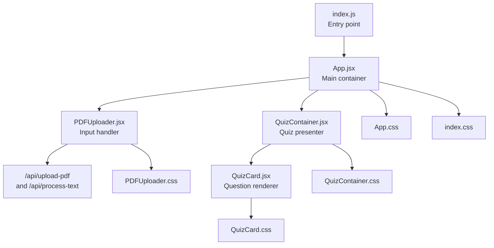
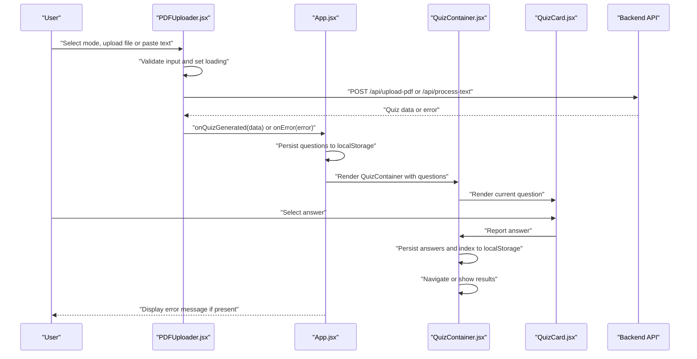
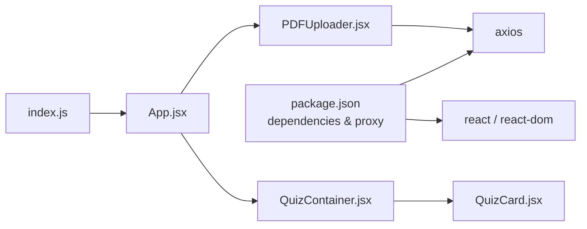

# Frontend Architecture

<cite>
**Referenced Files in This Document**
- [index.js](file://frontend/src/index.js)
- [App.jsx](file://frontend/src/App.jsx)
- [PDFUploader.jsx](file://frontend/src/components/PDFUploader.jsx)
- [QuizContainer.jsx](file://frontend/src/components/QuizContainer.jsx)
- [QuizCard.jsx](file://frontend/src/components/QuizCard.jsx)
- [PDFUploader.css](file://frontend/src/components/PDFUploader.css)
- [QuizContainer.css](file://frontend/src/components/QuizContainer.css)
- [QuizCard.css](file://frontend/src/components/QuizCard.css)
- [App.css](file://frontend/src/App.css)
- [index.css](file://frontend/src/index.css)
- [package.json](file://frontend/package.json)
</cite>

## Table of Contents
1. [Introduction](#introduction)
2. [Project Structure](#project-structure)
3. [Core Components](#core-components)
4. [Architecture Overview](#architecture-overview)
5. [Detailed Component Analysis](#detailed-component-analysis)
6. [Dependency Analysis](#dependency-analysis)
7. [Performance Considerations](#performance-considerations)
8. [Accessibility and Responsiveness](#accessibility-and-responsiveness)
9. [Troubleshooting Guide](#troubleshooting-guide)
10. [Conclusion](#conclusion)

## Introduction
This document describes the frontend architecture of the Quiz Generator application. It focuses on the React-based component hierarchy, state management using React component state and localStorage, styling via CSS modules, and the end-to-end data flow from user input to quiz presentation. It also covers error handling, responsiveness, and accessibility considerations.

## Project Structure
The frontend is organized around a small set of React components and CSS modules:
- Entry point renders the root App component.
- App manages global state and toggles between input and quiz presentation views.
- PDFUploader handles user input (PDF upload or text input) and triggers quiz generation.
- QuizContainer orchestrates quiz navigation and displays results.
- QuizCard renders individual questions and tracks user answers.
- CSS modules provide scoped styling for each component and global base styles.

**Diagram sources**
- [index.js](file://frontend/src/index.js#L1-L12)
- [App.jsx](file://frontend/src/App.jsx#L1-L90)
- [PDFUploader.jsx](file://frontend/src/components/PDFUploader.jsx#L1-L323)
- [QuizContainer.jsx](file://frontend/src/components/QuizContainer.jsx#L1-L164)
- [QuizCard.jsx](file://frontend/src/components/QuizCard.jsx#L1-L101)
- [App.css](file://frontend/src/App.css#L1-L61)
- [index.css](file://frontend/src/index.css#L1-L25)
- [PDFUploader.css](file://frontend/src/components/PDFUploader.css#L1-L376)
- [QuizContainer.css](file://frontend/src/components/QuizContainer.css#L1-L177)
- [QuizCard.css](file://frontend/src/components/QuizCard.css#L1-L162)

**Section sources**
- [index.js](file://frontend/src/index.js#L1-L12)
- [App.jsx](file://frontend/src/App.jsx#L1-L90)

## Core Components
- index.js: Creates the React root and mounts App.
- App.jsx: Central state manager for questions, loading, and errors; persists questions to localStorage; switches between input and quiz views; passes callbacks to child components.
- PDFUploader.jsx: Handles drag-and-drop and file selection, text input, number of questions, model selection, form validation, loading state, and API calls; emits events upward.
- QuizContainer.jsx: Manages current question index, answers, and results visibility; persists state to localStorage; calculates scores; navigates questions.
- QuizCard.jsx: Renders a single question with options, tracks selected answer, shows correctness feedback, and reports back to parent.

**Section sources**
- [index.js](file://frontend/src/index.js#L1-L12)
- [App.jsx](file://frontend/src/App.jsx#L1-L90)
- [PDFUploader.jsx](file://frontend/src/components/PDFUploader.jsx#L1-L323)
- [QuizContainer.jsx](file://frontend/src/components/QuizContainer.jsx#L1-L164)
- [QuizCard.jsx](file://frontend/src/components/QuizCard.jsx#L1-L101)

## Architecture Overview
The frontend follows a unidirectional data flow:
- User interacts with PDFUploader (file/text input, model selection, submit).
- PDFUploader validates input, sets loading, calls backend API, and emits generated quiz data or error messages.
- App receives the emitted data, updates state, persists to localStorage, and switches to QuizContainer.
- QuizContainer restores state from localStorage, renders QuizCard for the current question, collects answers, and shows results when finished.
- Error messages are displayed at the App level.

**Diagram sources**
- [PDFUploader.jsx](file://frontend/src/components/PDFUploader.jsx#L50-L110)
- [App.jsx](file://frontend/src/App.jsx#L27-L52)
- [QuizContainer.jsx](file://frontend/src/components/QuizContainer.jsx#L9-L52)
- [QuizCard.jsx](file://frontend/src/components/QuizCard.jsx#L20-L33)

## Detailed Component Analysis

### App.jsx
Responsibilities:
- Manage global state: questions, loading, error.
- Restore questions from localStorage on mount.
- Expose callbacks to children for quiz generation, error reporting, loading state, and reset.
- Persist questions to localStorage upon generation and clear on reset.
- Render either PDFUploader or QuizContainer based on presence of questions.
- Display error messages.

Key patterns:
- Event handlers passed down as props: onQuizGenerated, onError, onLoading, onReset.
- Local storage persistence for questions and auxiliary keys for quiz state.

**Section sources**
- [App.jsx](file://frontend/src/App.jsx#L1-L90)

### PDFUploader.jsx
Responsibilities:
- Toggle between PDF and text input modes.
- Handle drag-and-drop and file selection for PDF.
- Validate input (presence of file/text, number of questions range).
- Manage model selection (cloud vs local).
- Submit data to backend API depending on mode.
- Emit loading state, success data, and error messages to parent.

Event handling and prop drilling:
- Props received: onQuizGenerated, onError, onLoading, loading.
- Emits events upward to App.jsx to update state and UI.

API interactions:
- POST /api/upload-pdf with multipart/form-data when PDF mode is selected.
- POST /api/process-text with JSON payload when text mode is selected.

**Section sources**
- [PDFUploader.jsx](file://frontend/src/components/PDFUploader.jsx#L1-L323)

### QuizContainer.jsx
Responsibilities:
- Restore and persist quiz state from/to localStorage (current index, answers, showResults).
- Navigate between questions and compute results.
- Calculate score and render results screen.
- Pass current question and saved answer to QuizCard.

State management:
- Uses React state plus localStorage synchronization via useEffect hooks.

**Section sources**
- [QuizContainer.jsx](file://frontend/src/components/QuizContainer.jsx#L1-L164)

### QuizCard.jsx
Responsibilities:
- Render a single question with options.
- Track selected answer and show correctness feedback.
- Report answer back to parent via onAnswer callback.
- Respect saved answers when switching questions.

UI feedback:
- Visual indicators for correct/incorrect/not selected answers.
- Disabled interactions after result is shown.

**Section sources**
- [QuizCard.jsx](file://frontend/src/components/QuizCard.jsx#L1-L101)

### Styling Strategy (CSS Modules)
- Each component has its own CSS module for scoped styles.
- Global base styles in index.css and App.css define typography, layout, and responsive adjustments.
- Component-specific styles encapsulate visuals and interactions.

Responsive design:
- Media queries in component CSS adjust spacing, font sizes, and layout for smaller screens.
- App.css includes responsive tweaks for header and main content.

Accessibility considerations:
- Semantic HTML and labels are used for inputs and buttons.
- Focus states and hover effects improve keyboard and mouse usability.
- Disabled states prevent interaction during loading.

**Section sources**
- [PDFUploader.css](file://frontend/src/components/PDFUploader.css#L1-L376)
- [QuizContainer.css](file://frontend/src/components/QuizContainer.css#L1-L177)
- [QuizCard.css](file://frontend/src/components/QuizCard.css#L1-L162)
- [App.css](file://frontend/src/App.css#L1-L61)
- [index.css](file://frontend/src/index.css#L1-L25)

## Dependency Analysis
External dependencies:
- axios for API requests.
- react and react-dom for rendering.
- react-scripts for build and development.

Internal dependencies:
- index.js imports App.
- App imports PDFUploader and QuizContainer.
- QuizContainer imports QuizCard.

Proxy configuration:
- package.json defines a proxy to the backend server for API calls.

**Diagram sources**
- [package.json](file://frontend/package.json#L1-L50)
- [index.js](file://frontend/src/index.js#L1-L12)
- [App.jsx](file://frontend/src/App.jsx#L1-L90)
- [PDFUploader.jsx](file://frontend/src/components/PDFUploader.jsx#L1-L323)
- [QuizContainer.jsx](file://frontend/src/components/QuizContainer.jsx#L1-L164)
- [QuizCard.jsx](file://frontend/src/components/QuizCard.jsx#L1-L101)

**Section sources**
- [package.json](file://frontend/package.json#L1-L50)

## Performance Considerations
- Avoid unnecessary re-renders by passing stable callbacks and memoizing derived data when appropriate.
- Keep localStorage writes minimal by batching updates in QuizContainer’s effect hooks.
- Debounce or throttle input validation where applicable (already handled via controlled inputs).
- Lazy load heavy assets if needed; current components are lightweight.

## Accessibility and Responsiveness
Accessibility:
- Use semantic labels and roles for inputs and buttons.
- Ensure sufficient color contrast for correctness indicators.
- Provide focus-visible styles and keyboard navigation support.

Responsiveness:
- Component CSS includes media queries for mobile layouts.
- App.css adjusts header and main content padding for smaller screens.

## Troubleshooting Guide
Common UI-layer issues:
- Loading state not resetting: Verify onLoading is called with false in finally blocks in PDFUploader.
- No error display: Ensure onError is invoked with a message string and that App.jsx renders the error container.
- Quiz not resuming from saved state: Confirm QuizContainer persists index, answers, and showResults to localStorage and reads them on mount.
- PDF submission failing: Check network tab for CORS/proxy issues; confirm proxy is configured in package.json.

Error handling patterns:
- PDFUploader catches axios errors and extracts user-friendly messages.
- App.jsx clears questions and removes localStorage entries on error.

**Section sources**
- [PDFUploader.jsx](file://frontend/src/components/PDFUploader.jsx#L100-L110)
- [App.jsx](file://frontend/src/App.jsx#L34-L52)
- [QuizContainer.jsx](file://frontend/src/components/QuizContainer.jsx#L39-L52)

## Conclusion
The Quiz Generator frontend employs a clean, component-based architecture with clear separation of concerns. App.jsx centralizes state and persistence, while specialized components manage input and presentation. CSS modules provide scoped styling, and localStorage ensures continuity across sessions. The data flow is straightforward: user input -> API call -> success/error -> state update -> UI refresh. The design emphasizes responsiveness, basic accessibility, and robust error handling at the UI layer.