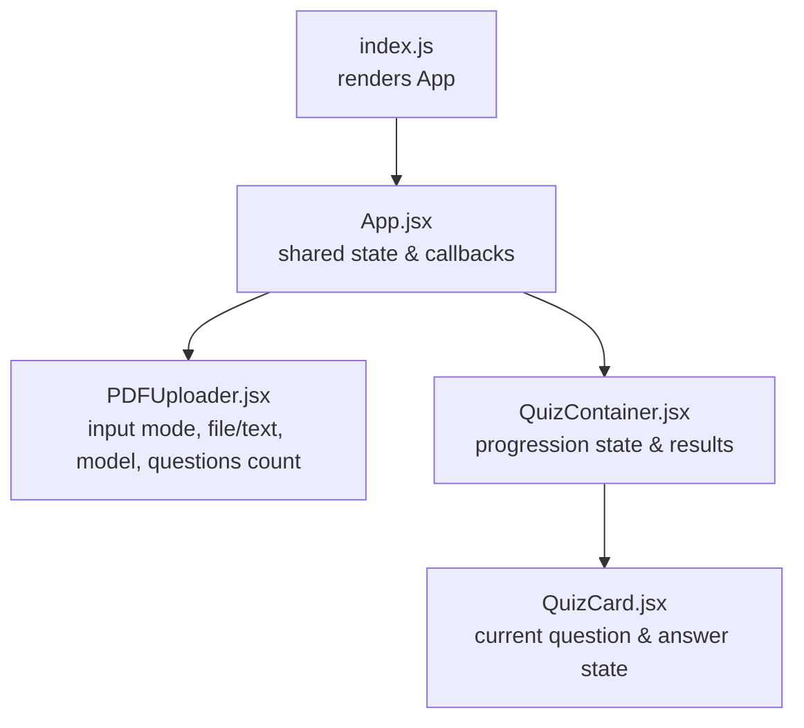
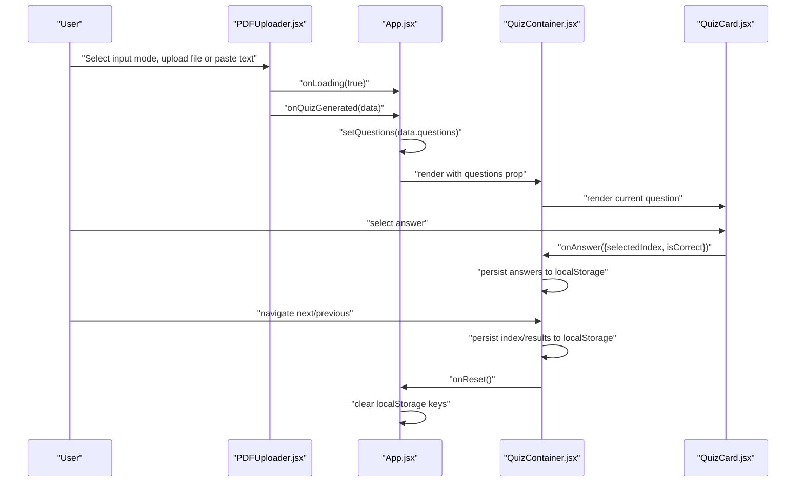
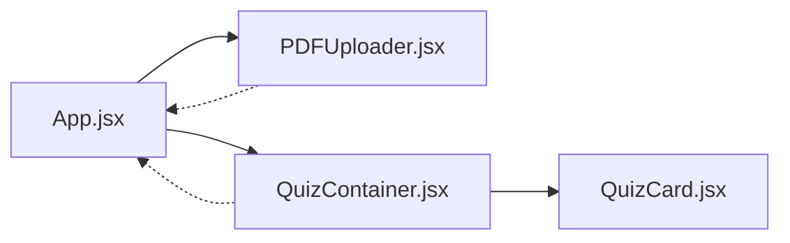

# State Management

<cite>
**Referenced Files in This Document**
- [App.jsx](file://frontend/src/App.jsx)
- [PDFUploader.jsx](file://frontend/src/components/PDFUploader.jsx)
- [QuizContainer.jsx](file://frontend/src/components/QuizContainer.jsx)
- [QuizCard.jsx](file://frontend/src/components/QuizCard.jsx)
- [index.js](file://frontend/src/index.js)
- [package.json](file://frontend/package.json)
</cite>

## Table of Contents
1. [Introduction](#introduction)
2. [Project Structure](#project-structure)
3. [Core Components](#core-components)
4. [Architecture Overview](#architecture-overview)
5. [Detailed Component Analysis](#detailed-component-analysis)
6. [Dependency Analysis](#dependency-analysis)
7. [Performance Considerations](#performance-considerations)
8. [Troubleshooting Guide](#troubleshooting-guide)
9. [Conclusion](#conclusion)

## Introduction
This document explains the state management system used in the frontend application. It focuses on how React’s useState and useEffect hooks are used to manage application state across components, how component-level state is used in PDFUploader, how QuizContainer manages quiz progression state and persists it to localStorage, and how state is lifted in App.jsx to coordinate child components. It also covers state initialization from localStorage, update flows, cleanup logic, re-render triggers, common pitfalls, and performance optimization tips.

## Project Structure
The frontend is organized around a small set of React components and a single entry point. The state lifecycle spans from the top-level App.jsx down to the quiz UI components.

**Diagram sources**
- [index.js](file://frontend/src/index.js#L1-L12)
- [App.jsx](file://frontend/src/App.jsx#L1-L90)
- [PDFUploader.jsx](file://frontend/src/components/PDFUploader.jsx#L1-L323)
- [QuizContainer.jsx](file://frontend/src/components/QuizContainer.jsx#L1-L164)
- [QuizCard.jsx](file://frontend/src/components/QuizCard.jsx#L1-L101)

**Section sources**
- [index.js](file://frontend/src/index.js#L1-L12)
- [package.json](file://frontend/package.json#L1-L50)

## Core Components
- App.jsx: Holds shared state (questions, loading, error) and provides callback handlers to children. It initializes state from localStorage and cleans up on reset.
- PDFUploader.jsx: Manages component-level state for input mode, file selection, text input, question count, and model selection. It validates inputs and triggers loading/error callbacks.
- QuizContainer.jsx: Manages quiz progression state (current index, answers array, results visibility) and persists it to localStorage. It computes results and coordinates navigation.
- QuizCard.jsx: Manages the current question’s selected answer and whether the result is shown. It communicates the answer back to the parent.

**Section sources**
- [App.jsx](file://frontend/src/App.jsx#L1-L90)
- [PDFUploader.jsx](file://frontend/src/components/PDFUploader.jsx#L1-L323)
- [QuizContainer.jsx](file://frontend/src/components/QuizContainer.jsx#L1-L164)
- [QuizCard.jsx](file://frontend/src/components/QuizCard.jsx#L1-L101)

## Architecture Overview
The state management follows a top-down lifting pattern:
- App.jsx holds the canonical state for the quiz data and global flags.
- PDFUploader.jsx is responsible for collecting user inputs and invoking callbacks to update App.jsx state.
- QuizContainer.jsx maintains quiz progression state and persists it to localStorage for resilience.
- QuizCard.jsx reflects the current question and answer state, notifying parents when an answer is selected.

**Diagram sources**
- [App.jsx](file://frontend/src/App.jsx#L1-L90)
- [PDFUploader.jsx](file://frontend/src/components/PDFUploader.jsx#L1-L323)
- [QuizContainer.jsx](file://frontend/src/components/QuizContainer.jsx#L1-L164)
- [QuizCard.jsx](file://frontend/src/components/QuizCard.jsx#L1-L101)

## Detailed Component Analysis

### App.jsx: Shared State and Callbacks
- Shared state:
  - questions: null until generated; persisted to localStorage under a dedicated key.
  - loading: toggled during quiz generation.
  - error: displays error messages and clears persisted questions.
- Initialization from localStorage:
  - On mount, reads the stored questions and parses JSON; on parse failure, logs and removes corrupted data.
- Callbacks provided to children:
  - onQuizGenerated: sets questions and persists them.
  - onError: sets error and clears persisted questions.
  - onLoading: toggles loading flag.
  - onReset: clears questions, error, and all quiz-related localStorage keys.
- Cleanup logic:
  - Removes quiz-related keys when resetting to ensure a clean slate.

Key implementation references:
- State initialization and error handling: [App.jsx](file://frontend/src/App.jsx#L13-L25)
- Persisting questions on generation: [App.jsx](file://frontend/src/App.jsx#L27-L32)
- Error handling and cleanup: [App.jsx](file://frontend/src/App.jsx#L34-L52)
- Reset flow and localStorage cleanup: [App.jsx](file://frontend/src/App.jsx#L44-L52)

**Section sources**
- [App.jsx](file://frontend/src/App.jsx#L1-L90)

### PDFUploader.jsx: Component-Level Inputs and Validation
- Component-level state:
  - inputMode: 'pdf' or 'text'.
  - file: selected PDF file.
  - text: user-entered text.
  - numQuestions: validated numeric count.
  - numQuestionsInput: controlled input value for validation UX.
  - selectedModel: 'openrouter' or 'ollama-mistral'.
  - dragActive: visual feedback for drag-and-drop zone.
- Validation and submission:
  - Validates mode-specific inputs and range for numQuestions.
  - Calls onLoading(true) before network requests and onLoading(false) in finally.
  - Uses axios to post either PDF or text to backend endpoints.
  - Emits onQuizGenerated on success or onError on failures.
- Controlled inputs:
  - numQuestionsInput updates numQuestions with bounds enforcement.
  - Drag-and-drop zone updates dragActive and file state.

Key implementation references:
- State declarations and drag handlers: [PDFUploader.jsx](file://frontend/src/components/PDFUploader.jsx#L1-L37)
- File selection and validation: [PDFUploader.jsx](file://frontend/src/components/PDFUploader.jsx#L39-L48)
- Submission flow and error handling: [PDFUploader.jsx](file://frontend/src/components/PDFUploader.jsx#L50-L110)
- Controlled number input: [PDFUploader.jsx](file://frontend/src/components/PDFUploader.jsx#L221-L249)
- Model selection: [PDFUploader.jsx](file://frontend/src/components/PDFUploader.jsx#L261-L291)
- Loading UI and submit button disabled state: [PDFUploader.jsx](file://frontend/src/components/PDFUploader.jsx#L294-L314)

**Section sources**
- [PDFUploader.jsx](file://frontend/src/components/PDFUploader.jsx#L1-L323)

### QuizContainer.jsx: Progression State and Persistence
- State managed locally:
  - currentQuestionIndex: initialized from localStorage; normalized against questions length.
  - answers: array persisted to localStorage; each element stores { selectedIndex, isCorrect }.
  - showResults: boolean persisted to localStorage; controls results screen rendering.
- Persistence:
  - useEffect writes currentQuestionIndex, answers, and showResults to localStorage on change.
- Navigation and results:
  - handleNext increments index or switches to results when last question is reached.
  - handlePrevious decrements index.
  - Results screen computed from answers and questions.
- Correctness calculation:
  - Filters answers where isCorrect is true and computes percentage.

Key implementation references:
- Initializers from localStorage: [QuizContainer.jsx](file://frontend/src/components/QuizContainer.jsx#L11-L27)
- Index normalization on questions change: [QuizContainer.jsx](file://frontend/src/components/QuizContainer.jsx#L29-L37)
- Persistence effects: [QuizContainer.jsx](file://frontend/src/components/QuizContainer.jsx#L39-L52)
- Answer handling and persistence: [QuizContainer.jsx](file://frontend/src/components/QuizContainer.jsx#L54-L60)
- Navigation handlers: [QuizContainer.jsx](file://frontend/src/components/QuizContainer.jsx#L62-L74)
- Results computation and rendering: [QuizContainer.jsx](file://frontend/src/components/QuizContainer.jsx#L76-L106)
- Current question rendering and props: [QuizContainer.jsx](file://frontend/src/components/QuizContainer.jsx#L108-L157)

**Section sources**
- [QuizContainer.jsx](file://frontend/src/components/QuizContainer.jsx#L1-L164)

### QuizCard.jsx: Current Question and Answer State
- Component-level state:
  - selectedAnswer: index of selected answer or null.
  - showResult: whether the result is displayed (based on savedAnswer presence).
- Synchronization:
  - useEffect updates internal state when savedAnswer changes (e.g., when navigating between questions).
- Interaction:
  - handleAnswerClick disables further changes after result is shown, marks correctness, and calls onAnswer with structured data.
- UI feedback:
  - getAnswerClass applies styles based on correctness and selection.
  - Displays result message and correct mark.

Key implementation references:
- Saved answer synchronization: [QuizCard.jsx](file://frontend/src/components/QuizCard.jsx#L9-L18)
- Answer click handler and onAnswer call: [QuizCard.jsx](file://frontend/src/components/QuizCard.jsx#L20-L33)
- Result styling and correctness logic: [QuizCard.jsx](file://frontend/src/components/QuizCard.jsx#L35-L49)

**Section sources**
- [QuizCard.jsx](file://frontend/src/components/QuizCard.jsx#L1-L101)

## Dependency Analysis
- App.jsx depends on:
  - PDFUploader.jsx for input collection and quiz generation callbacks.
  - QuizContainer.jsx for rendering the quiz once questions are available.
- QuizContainer.jsx depends on:
  - QuizCard.jsx for rendering the current question and receiving answers.
- External dependencies:
  - axios for API calls in PDFUploader.jsx.
  - localStorage for persistence across sessions.

**Diagram sources**
- [App.jsx](file://frontend/src/App.jsx#L1-L90)
- [PDFUploader.jsx](file://frontend/src/components/PDFUploader.jsx#L1-L323)
- [QuizContainer.jsx](file://frontend/src/components/QuizContainer.jsx#L1-L164)
- [QuizCard.jsx](file://frontend/src/components/QuizCard.jsx#L1-L101)

**Section sources**
- [package.json](file://frontend/package.json#L1-L50)

## Performance Considerations
- Memoization opportunities:
  - Consider wrapping QuizCard with React.memo to prevent unnecessary re-renders when props are unchanged.
  - Memoize derived values like the current question and savedAnswer in QuizContainer if props are expensive to compute.
- Batched updates:
  - Group related state updates (e.g., persisting index and answers) into a single effect or minimize redundant localStorage writes.
- Avoid excessive localStorage writes:
  - QuizContainer already persists on change; ensure no additional writes occur inside render-heavy loops.
- Dependency arrays:
  - QuizContainer’s index normalization effect intentionally avoids dependency on answers to prevent cycles; confirm exhaustive-deps linter allows this pattern.
- Re-render triggers:
  - Updates to questions in App.jsx cause QuizContainer to re-render; ensure QuizContainer’s key on QuizCard is stable to avoid unnecessary remounts.

[No sources needed since this section provides general guidance]

## Troubleshooting Guide
Common pitfalls and remedies:
- Stale closures:
  - Ensure callbacks passed to children capture the latest state. Since App.jsx state is lifted and passed as props/callbacks, closures should remain fresh.
- Improper dependency arrays:
  - QuizContainer’s normalization effect intentionally omits answers to avoid cycles; verify this is intentional and documented.
- localStorage serialization issues:
  - App.jsx parses JSON from localStorage and removes corrupted entries on parse failure. QuizContainer persists arrays and booleans; ensure consistent types are stored.
- Submit button disabled states:
  - PDFUploader.jsx disables the submit button when required inputs are missing; verify that controlled inputs (e.g., numQuestionsInput) are properly normalized to avoid disabled states when inputs are valid.

**Section sources**
- [App.jsx](file://frontend/src/App.jsx#L13-L25)
- [PDFUploader.jsx](file://frontend/src/components/PDFUploader.jsx#L221-L249)
- [QuizContainer.jsx](file://frontend/src/components/QuizContainer.jsx#L39-L52)

## Conclusion
The application employs a clear state management pattern:
- App.jsx centralizes shared state and provides callbacks to child components.
- PDFUploader.jsx manages component-level inputs and validation, delegating data to App.jsx.
- QuizContainer.jsx maintains quiz progression state and persists it to localStorage for continuity.
- QuizCard.jsx encapsulates per-question answer state and communicates results upward.
By following the outlined patterns and addressing the pitfalls, the system remains predictable, resilient, and easy to extend.