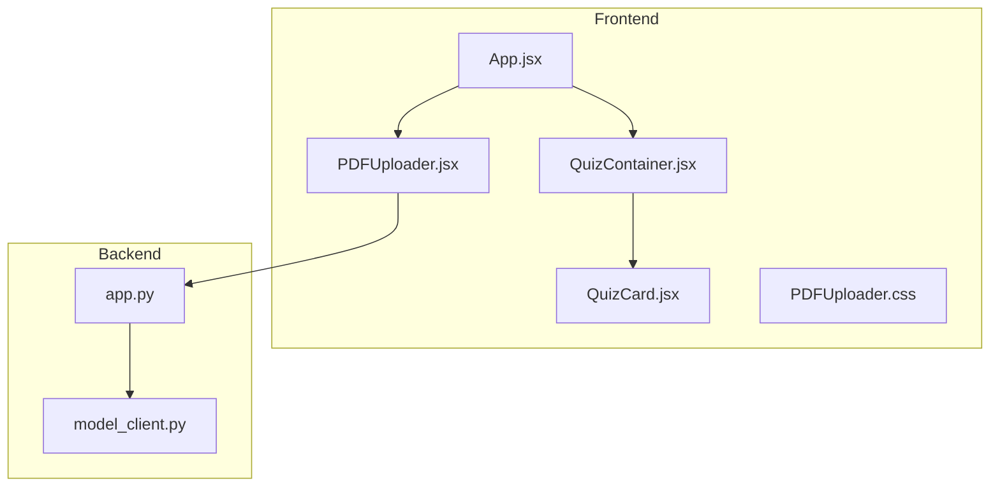
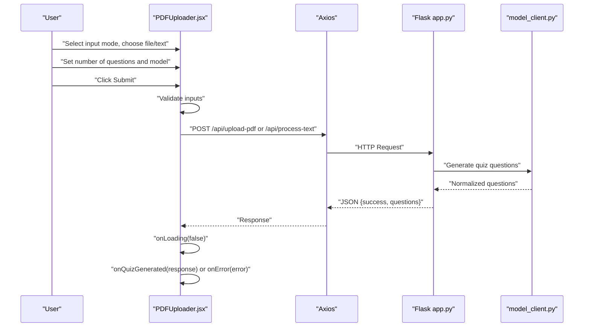
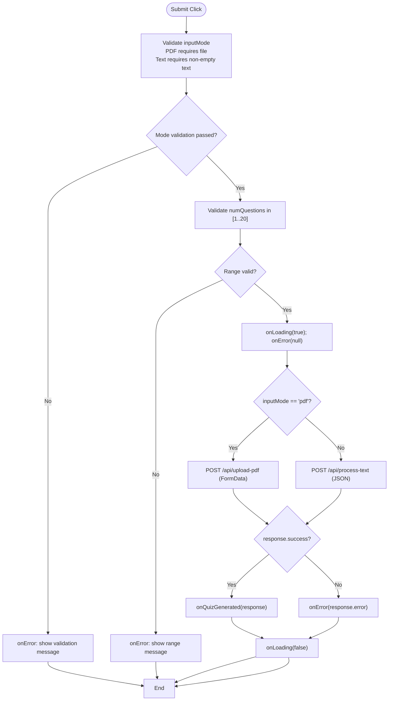
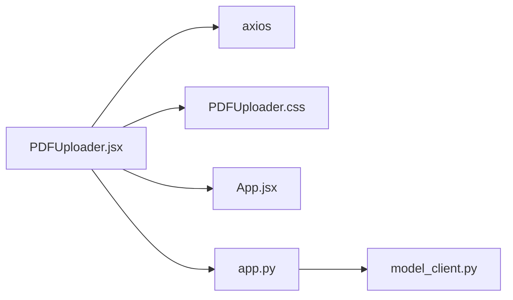

# PDFUploader Component

<cite>
**Referenced Files in This Document**
- [PDFUploader.jsx](file://frontend/src/components/PDFUploader.jsx)
- [PDFUploader.css](file://frontend/src/components/PDFUploader.css)
- [App.jsx](file://frontend/src/App.jsx)
- [QuizContainer.jsx](file://frontend/src/components/QuizContainer.jsx)
- [QuizCard.jsx](file://frontend/src/components/QuizCard.jsx)
- [app.py](file://backend/app.py)
- [model_client.py](file://backend/model_client.py)
- [package.json](file://frontend/package.json)
</cite>

## Table of Contents
1. [Introduction](#introduction)
2. [Project Structure](#project-structure)
3. [Core Components](#core-components)
4. [Architecture Overview](#architecture-overview)
5. [Detailed Component Analysis](#detailed-component-analysis)
6. [Dependency Analysis](#dependency-analysis)
7. [Performance Considerations](#performance-considerations)
8. [Troubleshooting Guide](#troubleshooting-guide)
9. [Conclusion](#conclusion)
10. [Appendices](#appendices)

## Introduction
This document provides comprehensive documentation for the PDFUploader component, the primary input interface of the Quiz Generator application. It explains dual-input functionality supporting PDF file uploads (with drag-and-drop) and direct text input, along with state management, event handlers, UI elements, accessibility attributes, testing identifiers, and integration with the backend via Axios. It also covers configuration options through props, validation and error handling, and common issues such as file type validation, large file handling, and API error recovery.

## Project Structure
The PDFUploader component resides in the frontend under the components directory and is integrated into the main application flow. It communicates with the backend Flask API and delegates quiz rendering to the QuizContainer and QuizCard components.

**Diagram sources**
- [App.jsx](file://frontend/src/App.jsx#L54-L84)
- [PDFUploader.jsx](file://frontend/src/components/PDFUploader.jsx#L112-L317)
- [QuizContainer.jsx](file://frontend/src/components/QuizContainer.jsx#L9-L161)
- [QuizCard.jsx](file://frontend/src/components/QuizCard.jsx#L1-L101)
- [app.py](file://backend/app.py#L59-L164)
- [model_client.py](file://backend/model_client.py#L263-L272)

**Section sources**
- [App.jsx](file://frontend/src/App.jsx#L54-L84)
- [PDFUploader.jsx](file://frontend/src/components/PDFUploader.jsx#L112-L317)
- [QuizContainer.jsx](file://frontend/src/components/QuizContainer.jsx#L9-L161)
- [QuizCard.jsx](file://frontend/src/components/QuizCard.jsx#L1-L101)
- [app.py](file://backend/app.py#L59-L164)
- [model_client.py](file://backend/model_client.py#L263-L272)

## Core Components
- PDFUploader: Manages input modes (PDF vs Text), file drag-and-drop, text input, number of questions, model selection, and submission flow. Emits events to the parent for quiz generation, errors, and loading state.
- App: Orchestrates the application lifecycle, manages loading/error states, and toggles between the uploader and quiz container.
- QuizContainer and QuizCard: Render the generated quiz, track answers, and manage navigation and results.

Key props for PDFUploader:
- onQuizGenerated: Receives quiz data payload from the backend and updates the application state.
- onError: Receives error messages and displays them to the user.
- onLoading: Receives loading state updates to enable/disable UI and show progress.
- loading: Prop passed down to control disabled states and visibility of loading indicators.

**Section sources**
- [PDFUploader.jsx](file://frontend/src/components/PDFUploader.jsx#L5-L111)
- [App.jsx](file://frontend/src/App.jsx#L27-L42)
- [QuizContainer.jsx](file://frontend/src/components/QuizContainer.jsx#L9-L161)
- [QuizCard.jsx](file://frontend/src/components/QuizCard.jsx#L1-L101)

## Architecture Overview
The PDFUploader component integrates with the backend through two endpoints:
- POST /api/upload-pdf: Accepts multipart form data (PDF file) plus parameters for number of questions and model type.
- POST /api/process-text: Accepts JSON payload containing text, number of questions, and model type.

On successful processing, the backend returns a payload with success flag and questions array. The component validates inputs, sets loading state, and forwards results to the parent.

**Diagram sources**
- [PDFUploader.jsx](file://frontend/src/components/PDFUploader.jsx#L50-L110)
- [app.py](file://backend/app.py#L59-L164)
- [model_client.py](file://backend/model_client.py#L263-L272)

## Detailed Component Analysis

### State Management
- inputMode: Tracks whether the user prefers PDF upload or text input. Switching resets file and text fields.
- file: Stores the selected PDF file object.
- text: Stores the raw text input.
- numQuestions: Numeric value validated to be within 1–20.
- numQuestionsInput: Controlled input field value synchronized with numQuestions.
- selectedModel: Selected model type ("openrouter" or "ollama-mistral").
- dragActive: Boolean indicating drag-and-drop hover state for visual feedback.

Behavior highlights:
- When switching input mode, both file and text are cleared to prevent stale selections.
- Number input uses separate state for controlled input and numeric validation on blur.

**Section sources**
- [PDFUploader.jsx](file://frontend/src/components/PDFUploader.jsx#L5-L11)
- [PDFUploader.jsx](file://frontend/src/components/PDFUploader.jsx#L120-L151)
- [PDFUploader.jsx](file://frontend/src/components/PDFUploader.jsx#L220-L249)

### Event Handlers
- handleDrag: Updates dragActive on dragenter/dragleave/dragover events.
- handleDrop: Validates dropped file type and sets file state; otherwise emits error.
- handleFileChange: Validates selected file type and sets file state; otherwise emits error.
- handleSubmit: 
  - Validates presence of file or text depending on inputMode.
  - Validates numQuestions range.
  - Sets loading state and clears previous errors.
  - Sends request to backend:
    - PDF mode: multipart/form-data with file, num_questions, model_type.
    - Text mode: JSON body with text, num_questions, model_type.
  - On success, calls onQuizGenerated; on error, calls onError; always ends loading.

Accessibility and testing:
- Radio groups for input mode and model selection use proper name attributes and checked state binding.
- All interactive elements include data-testid attributes for reliable e2e testing.
- Disabled states during loading prevent concurrent submissions.

**Section sources**
- [PDFUploader.jsx](file://frontend/src/components/PDFUploader.jsx#L14-L37)
- [PDFUploader.jsx](file://frontend/src/components/PDFUploader.jsx#L39-L48)
- [PDFUploader.jsx](file://frontend/src/components/PDFUploader.jsx#L50-L110)

### UI Elements and Behavior
- Input Mode Selector: Two radio buttons for PDF and Text modes. Switching resets file/text.
- PDF Drop Zone:
  - Drag-and-drop visual feedback via dragActive and has-file classes.
  - Hidden file input bound to label for accessibility.
  - Displays file icon, name, and size when present.
- Text Area: Placeholder text, character counter, and disabled state during loading.
- Number Input:
  - Range 1–20 enforced by validation.
  - Controlled input with onBlur normalization to clamp invalid values.
- Model Selector: Two radio buttons for model selection with descriptive labels.
- Loading Indicator: Appears while requests are pending with animated progress bar.
- Submit Button: Enabled only when required inputs are valid; disabled during loading.

Responsive Design:
- Drop zone padding and typography adjust at smaller screens.
- Input mode selector stacks vertically on narrow screens.

**Section sources**
- [PDFUploader.jsx](file://frontend/src/components/PDFUploader.jsx#L112-L317)
- [PDFUploader.css](file://frontend/src/components/PDFUploader.css#L1-L376)

### Backend Integration
- PDF Upload Endpoint: /api/upload-pdf accepts multipart/form-data with file, num_questions, model_type.
- Text Processing Endpoint: /api/process-text accepts JSON with text, num_questions, model_type.
- Validation:
  - Backend enforces PDF-only uploads, maximum file size, and question count limits.
  - Model type must be one of supported values.
- Error Responses: Returns structured error messages for client-side display.

**Section sources**
- [PDFUploader.jsx](file://frontend/src/components/PDFUploader.jsx#L76-L97)
- [app.py](file://backend/app.py#L59-L164)
- [package.json](file://frontend/package.json#L45-L45)

### Component Interaction Flow

**Diagram sources**
- [PDFUploader.jsx](file://frontend/src/components/PDFUploader.jsx#L50-L110)
- [app.py](file://backend/app.py#L59-L164)

## Dependency Analysis
- Internal Dependencies:
  - PDFUploader depends on React hooks and axios for HTTP requests.
  - Styles are encapsulated in PDFUploader.css.
- External Dependencies:
  - Axios for HTTP communication.
  - Backend endpoints defined in app.py.
  - Model clients in model_client.py for quiz generation.

**Diagram sources**
- [PDFUploader.jsx](file://frontend/src/components/PDFUploader.jsx#L1-L4)
- [App.jsx](file://frontend/src/App.jsx#L1-L12)
- [app.py](file://backend/app.py#L1-L20)
- [model_client.py](file://backend/model_client.py#L1-L20)

**Section sources**
- [PDFUploader.jsx](file://frontend/src/components/PDFUploader.jsx#L1-L4)
- [package.json](file://frontend/package.json#L1-L16)
- [app.py](file://backend/app.py#L1-L20)
- [model_client.py](file://backend/model_client.py#L1-L20)

## Performance Considerations
- Large PDFs: The backend enforces a maximum file size. Consider chunking or streaming strategies if extending beyond current limits.
- Network latency: Loading indicator improves perceived performance; debouncing repeated submissions prevents redundant requests.
- Local storage: The application persists quiz data and navigation state to reduce reload overhead.
- Model choice: OpenRouter uses cloud resources; local Ollama avoids network latency but requires local setup and sufficient compute.

[No sources needed since this section provides general guidance]

## Troubleshooting Guide
Common issues and resolutions:
- File Type Validation (PDF only): 
  - Frontend checks MIME type and shows error if not PDF.
  - Backend enforces allowed extensions and returns error if mismatch.
- Large Files:
  - Backend enforces a maximum file size; reduce file size or split content.
- API Error Recovery:
  - Frontend catches request errors and displays user-friendly messages.
  - Backend returns structured error payloads; handle gracefully in onError.
- Model Availability:
  - OpenRouter requires API key; ensure environment variable is configured.
  - Ollama requires local service availability and model installation.

**Section sources**
- [PDFUploader.jsx](file://frontend/src/components/PDFUploader.jsx#L31-L36)
- [PDFUploader.jsx](file://frontend/src/components/PDFUploader.jsx#L42-L46)
- [app.py](file://backend/app.py#L13-L19)
- [app.py](file://backend/app.py#L72-L74)
- [model_client.py](file://backend/model_client.py#L63-L75)
- [model_client.py](file://backend/model_client.py#L154-L179)

## Conclusion
The PDFUploader component provides a robust, accessible, and responsive interface for generating quizzes from PDFs or raw text. Its dual-input design, comprehensive validation, and clear error handling integrate seamlessly with the backend’s Flask API and model clients. By leveraging controlled state, data-testid attributes, and loading indicators, it offers a smooth user experience suitable for both cloud and local model execution.

[No sources needed since this section summarizes without analyzing specific files]

## Appendices

### Props Reference
- onQuizGenerated(quizData): Called with success payload containing questions.
- onError(message): Called with error messages for display.
- onLoading(isLoading): Called to toggle loading state.
- loading: Prop controlling disabled states and visibility of loading UI.

**Section sources**
- [PDFUploader.jsx](file://frontend/src/components/PDFUploader.jsx#L5-L11)
- [App.jsx](file://frontend/src/App.jsx#L27-L42)

### Backend Endpoints
- POST /api/upload-pdf: Multipart form data with file, num_questions, model_type.
- POST /api/process-text: JSON body with text, num_questions, model_type.

**Section sources**
- [PDFUploader.jsx](file://frontend/src/components/PDFUploader.jsx#L76-L97)
- [app.py](file://backend/app.py#L59-L164)

### Accessibility and Testing Identifiers
- Data-testid attributes for all major UI elements enable reliable e2e tests.
- Radio groups use consistent name attributes for grouping and keyboard navigation.
- Disabled states prevent interaction during loading.

**Section sources**
- [PDFUploader.jsx](file://frontend/src/components/PDFUploader.jsx#L120-L151)
- [PDFUploader.jsx](file://frontend/src/components/PDFUploader.jsx#L168-L194)
- [PDFUploader.jsx](file://frontend/src/components/PDFUploader.jsx#L200-L214)
- [PDFUploader.jsx](file://frontend/src/components/PDFUploader.jsx#L220-L249)
- [PDFUploader.jsx](file://frontend/src/components/PDFUploader.jsx#L260-L291)
- [PDFUploader.jsx](file://frontend/src/components/PDFUploader.jsx#L306-L314)