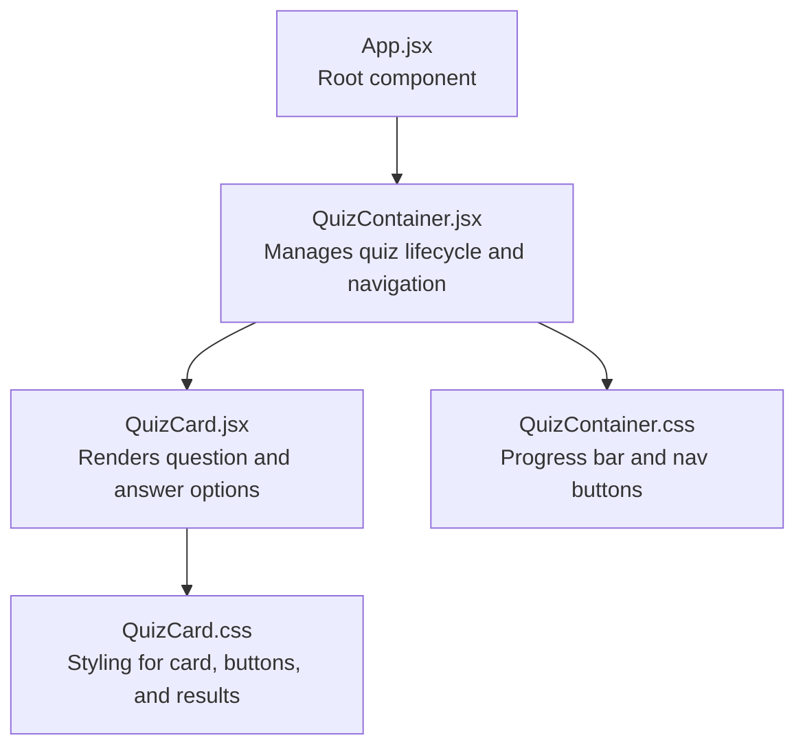
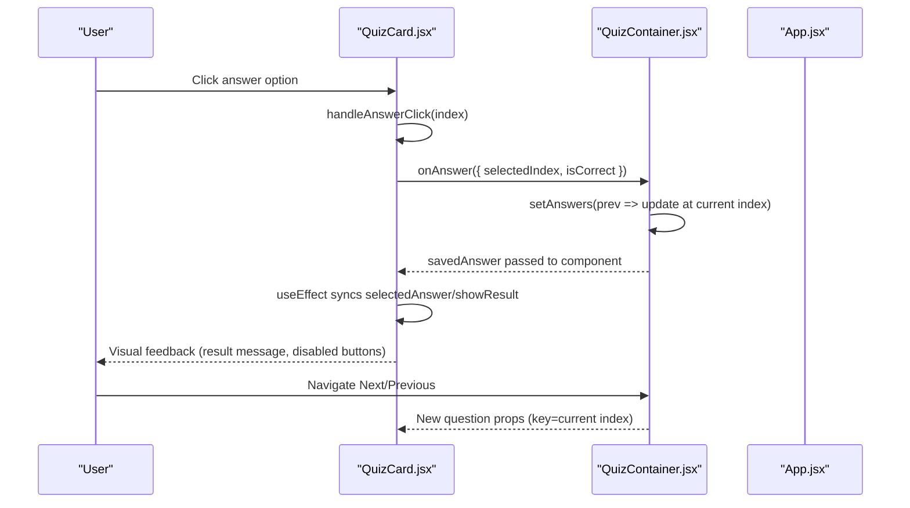
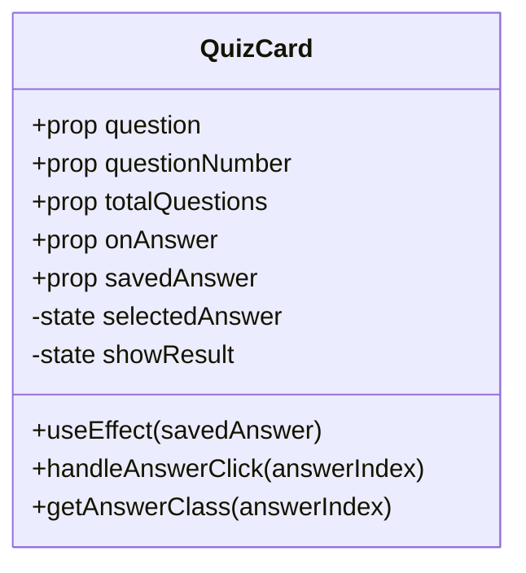
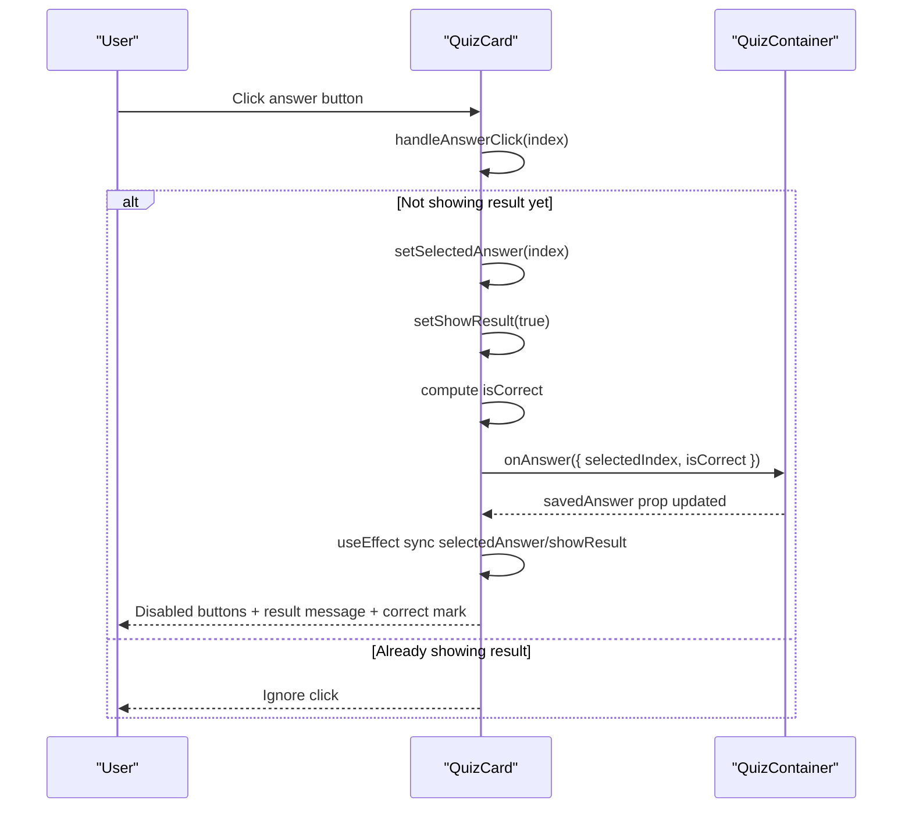
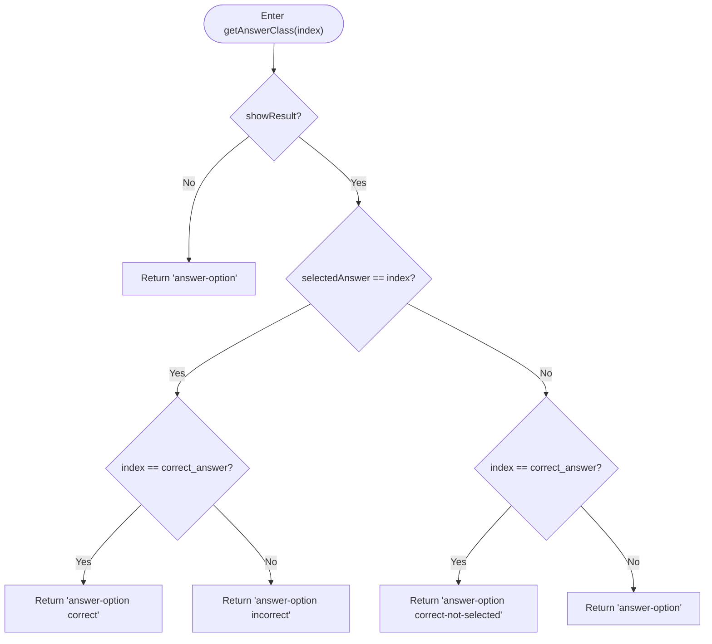
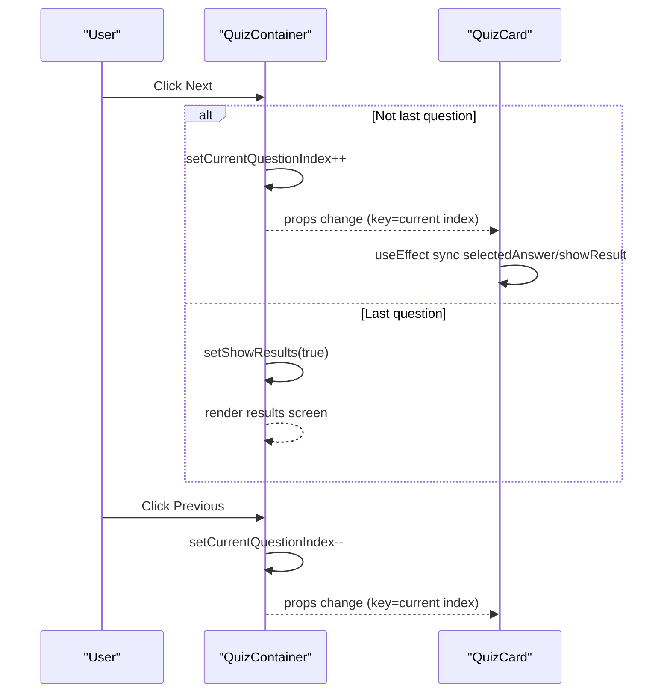
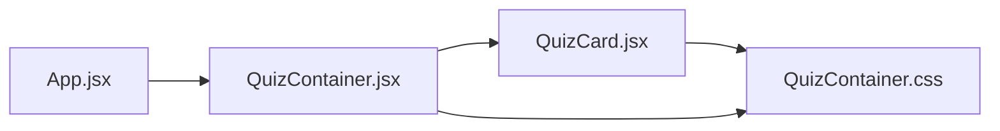

# QuizCard Component

<cite>
**Referenced Files in This Document**
- [QuizCard.jsx](file://frontend/src/components/QuizCard.jsx)
- [QuizCard.css](file://frontend/src/components/QuizCard.css)
- [QuizContainer.jsx](file://frontend/src/components/QuizContainer.jsx)
- [QuizContainer.css](file://frontend/src/components/QuizContainer.css)
- [App.jsx](file://frontend/src/App.jsx)
- [quiz-flow.spec.js](file://e2e/tests/quiz-flow.spec.js)
- [test-helpers.js](file://e2e/utils/test-helpers.js)
</cite>

## Table of Contents
1. [Introduction](#introduction)
2. [Project Structure](#project-structure)
3. [Core Components](#core-components)
4. [Architecture Overview](#architecture-overview)
5. [Detailed Component Analysis](#detailed-component-analysis)
6. [Dependency Analysis](#dependency-analysis)
7. [Performance Considerations](#performance-considerations)
8. [Troubleshooting Guide](#troubleshooting-guide)
9. [Conclusion](#conclusion)
10. [Appendices](#appendices)

## Introduction
This document provides comprehensive documentation for the QuizCard component, which renders individual quiz questions and manages user interactions. It explains how QuizCard displays question text, answer options, progress indicators, and result feedback. It documents state management with selectedAnswer and showResult, synchronized with savedAnswer from the parent via useEffect. It describes handleAnswerClick for capturing user responses, validating against the correct answer, and notifying the parent via onAnswer with selectedIndex and isCorrect. It covers getAnswerClass for determining visual styling based on selection and correctness states. The UI elements include question header with numbering, question text display, answer buttons with letter prefixes (A–D), and result messaging with emoji indicators. Accessibility considerations, data-testid attributes for testing, and responsive design are included. Examples of usage within QuizContainer and customization options are provided, along with guidance on preventing answer changes after submission and handling edge cases in state synchronization.

## Project Structure
QuizCard resides in the frontend/src/components directory alongside QuizContainer and shared styles. The component integrates with QuizContainer for navigation and state persistence, and with App for lifecycle and storage management.

**Diagram sources**
- [App.jsx](file://frontend/src/App.jsx#L1-L90)
- [QuizContainer.jsx](file://frontend/src/components/QuizContainer.jsx#L1-L164)
- [QuizCard.jsx](file://frontend/src/components/QuizCard.jsx#L1-L101)
- [QuizCard.css](file://frontend/src/components/QuizCard.css#L1-L162)
- [QuizContainer.css](file://frontend/src/components/QuizContainer.css#L1-L177)

**Section sources**
- [QuizCard.jsx](file://frontend/src/components/QuizCard.jsx#L1-L101)
- [QuizContainer.jsx](file://frontend/src/components/QuizContainer.jsx#L1-L164)
- [QuizCard.css](file://frontend/src/components/QuizCard.css#L1-L162)
- [QuizContainer.css](file://frontend/src/components/QuizContainer.css#L1-L177)
- [App.jsx](file://frontend/src/App.jsx#L1-L90)

## Core Components
- QuizCard: Renders a single question with numbered header, question text, answer options, and result feedback. Manages local state for selected answer and whether the result is shown. Synchronizes with parent via useEffect and notifies parent on answer submission.
- QuizContainer: Orchestrates quiz navigation, persists state to localStorage, and passes current question and saved answer to QuizCard. Provides onAnswer handler to update answers array and controls next/previous navigation.
- App: Hosts the application, manages questions lifecycle, and clears localStorage on reset.

Key responsibilities:
- QuizCard: UI rendering, user interaction handling, visual feedback, and parent communication.
- QuizContainer: State orchestration, persistence, navigation, and scoring.
- App: Application bootstrap and cleanup.

**Section sources**
- [QuizCard.jsx](file://frontend/src/components/QuizCard.jsx#L1-L101)
- [QuizContainer.jsx](file://frontend/src/components/QuizContainer.jsx#L1-L164)
- [App.jsx](file://frontend/src/App.jsx#L1-L90)

## Architecture Overview
The quiz flow is a unidirectional data flow: App provides questions; QuizContainer selects the current question and maintains answers; QuizCard renders the current question and communicates user selections to QuizContainer via onAnswer.

**Diagram sources**
- [QuizCard.jsx](file://frontend/src/components/QuizCard.jsx#L1-L101)
- [QuizContainer.jsx](file://frontend/src/components/QuizContainer.jsx#L1-L164)
- [App.jsx](file://frontend/src/App.jsx#L1-L90)

## Detailed Component Analysis

### QuizCard Component
QuizCard is a functional React component that:
- Receives question, questionNumber, totalQuestions, onAnswer, and savedAnswer from the parent.
- Initializes selectedAnswer and showResult from savedAnswer.
- Synchronizes internal state with savedAnswer via useEffect.
- Handles answer clicks, disables further interaction after result is shown, and notifies parent with selection and correctness.
- Computes answer button classes via getAnswerClass for visual feedback.
- Renders question header, question text, answer options with letter prefixes, and a result message with emoji.

State and synchronization:
- selectedAnswer: Tracks the user’s current selection.
- showResult: Controls whether to display correctness feedback and disable further answers.
- useEffect: Resets selectedAnswer and showResult when savedAnswer changes (e.g., navigating between questions).

Interaction flow:
- handleAnswerClick(index):
  - Prevents changing answers after result is shown.
  - Sets selectedAnswer and showResult.
  - Computes isCorrect based on index vs. question.correct_answer.
  - Calls onAnswer with { selectedIndex, isCorrect }.
- getAnswerClass(index):
  - Returns base class when not showing result.
  - Returns correct, incorrect, or correct-not-selected when result is shown, depending on selection and correctness.

UI elements:
- Question header: Displays questionNumber and totalQuestions.
- Question text: Shows the current question content.
- Answer buttons: Render letter prefix (A–D) and option text; disabled when result is shown; show correct mark for correct answer.
- Result message: Displays emoji and text indicating correctness.

Accessibility and testing:
- data-testid attributes on key elements enable reliable end-to-end testing.
- Buttons are disabled after submission to prevent re-selection.
- Visual feedback uses distinct colors and a correct mark for clarity.

Customization:
- Styling is controlled via QuizCard.css; you can adjust colors, spacing, and typography.
- The component expects question.correct_answer to be a numeric index aligned with options.

Common issues and edge cases:
- Preventing answer changes after submission: handled by disabling buttons and early return in handleAnswerClick when showResult is true.
- State synchronization: useEffect ensures selectedAnswer reflects savedAnswer when switching questions.
- Navigation: QuizContainer passes a key based on currentQuestionIndex to force remounting QuizCard when moving between questions.

**Section sources**
- [QuizCard.jsx](file://frontend/src/components/QuizCard.jsx#L1-L101)
- [QuizCard.css](file://frontend/src/components/QuizCard.css#L1-L162)

#### Class Diagram

**Diagram sources**
- [QuizCard.jsx](file://frontend/src/components/QuizCard.jsx#L1-L101)

#### Sequence Diagram: Answer Submission

**Diagram sources**
- [QuizCard.jsx](file://frontend/src/components/QuizCard.jsx#L1-L101)
- [QuizContainer.jsx](file://frontend/src/components/QuizContainer.jsx#L1-L164)

#### Flowchart: getAnswerClass Logic

**Diagram sources**
- [QuizCard.jsx](file://frontend/src/components/QuizCard.jsx#L1-L101)

### QuizContainer Integration
QuizContainer:
- Persists currentQuestionIndex, answers, and showResults to localStorage.
- Passes current question and savedAnswer to QuizCard.
- Provides handleAnswer to update answers at the current index.
- Controls navigation (previous/next) and transitions to results screen when appropriate.
- Supplies questionNumber and totalQuestions to QuizCard.

Usage example within QuizContainer:
- QuizCard receives question, questionNumber, totalQuestions, onAnswer, and savedAnswer.
- QuizContainer updates answers array and navigates between questions.

**Section sources**
- [QuizContainer.jsx](file://frontend/src/components/QuizContainer.jsx#L1-L164)
- [QuizContainer.css](file://frontend/src/components/QuizContainer.css#L1-L177)

#### Sequence Diagram: Navigation and State Persistence

**Diagram sources**
- [QuizContainer.jsx](file://frontend/src/components/QuizContainer.jsx#L1-L164)
- [QuizCard.jsx](file://frontend/src/components/QuizCard.jsx#L1-L101)

### App Lifecycle and Reset
App:
- Restores questions from localStorage on mount.
- Clears all quiz-related localStorage keys on reset.
- Renders either PDFUploader or QuizContainer based on presence of questions.

**Section sources**
- [App.jsx](file://frontend/src/App.jsx#L1-L90)

## Dependency Analysis
- QuizCard depends on:
  - Props from QuizContainer: question, questionNumber, totalQuestions, onAnswer, savedAnswer.
  - Local state and effects for synchronization and interaction.
- QuizContainer depends on:
  - localStorage for persistence.
  - QuizCard for rendering and interaction.
- App depends on:
  - QuizContainer for quiz UI.
  - localStorage for restoring state.

**Diagram sources**
- [App.jsx](file://frontend/src/App.jsx#L1-L90)
- [QuizContainer.jsx](file://frontend/src/components/QuizContainer.jsx#L1-L164)
- [QuizCard.jsx](file://frontend/src/components/QuizCard.jsx#L1-L101)
- [QuizCard.css](file://frontend/src/components/QuizCard.css#L1-L162)
- [QuizContainer.css](file://frontend/src/components/QuizContainer.css#L1-L177)

**Section sources**
- [App.jsx](file://frontend/src/App.jsx#L1-L90)
- [QuizContainer.jsx](file://frontend/src/components/QuizContainer.jsx#L1-L164)
- [QuizCard.jsx](file://frontend/src/components/QuizCard.jsx#L1-L101)

## Performance Considerations
- Efficient rendering: QuizCard uses a simple map over options and minimal state updates.
- No heavy computations: Styling and feedback are computed per render; acceptable for small option sets.
- Avoid unnecessary re-renders: QuizContainer passes a key based on current index to force remounting QuizCard when navigating, ensuring clean state resets.
- CSS transitions: Hover and transform effects are lightweight and enhance UX without performance cost.

[No sources needed since this section provides general guidance]

## Troubleshooting Guide
Common issues and resolutions:
- Answer cannot be changed after submission:
  - Cause: Buttons are disabled and handleAnswerClick returns early when showResult is true.
  - Resolution: Wait until navigating to a new question to select a different answer.
- Visual feedback not appearing:
  - Cause: showResult must be true to display result message and correct mark.
  - Resolution: Ensure onAnswer is called and savedAnswer is passed to QuizCard.
- Incorrect styling:
  - Cause: getAnswerClass depends on selectedAnswer and correct_answer alignment.
  - Resolution: Verify question.correct_answer is a valid index within options length.
- State desynchronization:
  - Cause: savedAnswer changes when navigating between questions.
  - Resolution: useEffect synchronizes selectedAnswer and showResult with savedAnswer.
- Navigation disabled:
  - Cause: Next button is disabled until an answer is given.
  - Resolution: Select an answer before proceeding.

Testing references:
- E2E tests demonstrate answer submission, result visibility, and navigation behavior.
- Test helpers provide utilities to answer questions and navigate between them.

**Section sources**
- [QuizCard.jsx](file://frontend/src/components/QuizCard.jsx#L1-L101)
- [QuizContainer.jsx](file://frontend/src/components/QuizContainer.jsx#L1-L164)
- [quiz-flow.spec.js](file://e2e/tests/quiz-flow.spec.js#L1-L229)
- [test-helpers.js](file://e2e/utils/test-helpers.js#L1-L289)

## Conclusion
QuizCard is a focused, accessible component that renders quiz questions and manages user interactions with clear visual feedback. Its state synchronization with the parent via useEffect and the onAnswer callback ensures consistent behavior across navigation. The component’s styling and responsive design provide a good user experience, while data-testid attributes facilitate reliable testing. By following the documented patterns and addressing the troubleshooting tips, developers can customize QuizCard for various quiz scenarios while maintaining correctness and usability.

[No sources needed since this section summarizes without analyzing specific files]

## Appendices

### Accessibility Considerations
- Keyboard navigation: Buttons are focusable and actionable; ensure keyboard users can tab through options.
- Screen readers: Use descriptive aria-labels if extending the component; current implementation relies on visible text and emojis.
- Focus management: After submission, focus remains on the selected button; consider programmatically focusing the result message for improved accessibility.
- Color contrast: Ensure sufficient contrast for correct/incorrect states; current styles meet basic contrast guidelines.

[No sources needed since this section provides general guidance]

### Testing References
- E2E tests validate answer submission, result display, and navigation.
- Test helpers encapsulate common actions for answering questions and navigating between them.

**Section sources**
- [quiz-flow.spec.js](file://e2e/tests/quiz-flow.spec.js#L1-L229)
- [test-helpers.js](file://e2e/utils/test-helpers.js#L1-L289)

### Example Usage Within QuizContainer
- QuizContainer passes:
  - question: Current question object.
  - questionNumber: Index + 1 for display.
  - totalQuestions: Total count for progress.
  - onAnswer: Handler to update answers array.
  - savedAnswer: Current answer state for synchronization.
- QuizContainer controls:
  - Navigation (previous/next) and transitions to results.
  - Persistence of index, answers, and showResults.

**Section sources**
- [QuizContainer.jsx](file://frontend/src/components/QuizContainer.jsx#L1-L164)
- [QuizCard.jsx](file://frontend/src/components/QuizCard.jsx#L1-L101)

### Customization Options
- Styling:
  - Modify QuizCard.css to adjust colors, spacing, typography, and responsive breakpoints.
  - Extend QuizContainer.css for progress bar and navigation button styles.
- Behavior:
  - Adjust getAnswerClass to introduce additional states (e.g., hover-only feedback).
  - Add aria-live regions for dynamic result announcements.
- Data model:
  - Ensure question.correct_answer is a valid index aligned with options length.

**Section sources**
- [QuizCard.css](file://frontend/src/components/QuizCard.css#L1-L162)
- [QuizContainer.css](file://frontend/src/components/QuizContainer.css#L1-L177)
- [QuizCard.jsx](file://frontend/src/components/QuizCard.jsx#L1-L101)