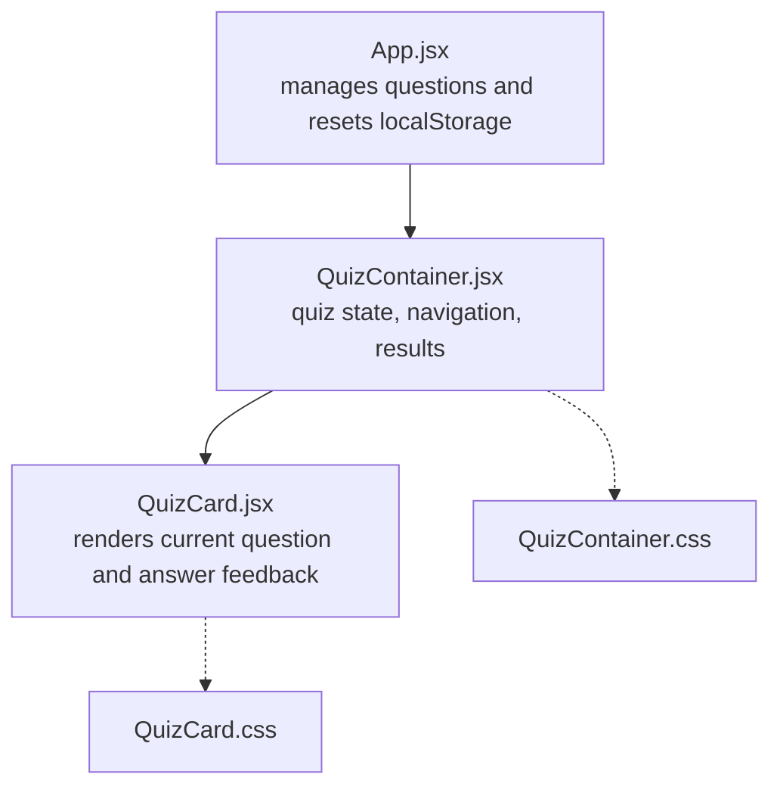
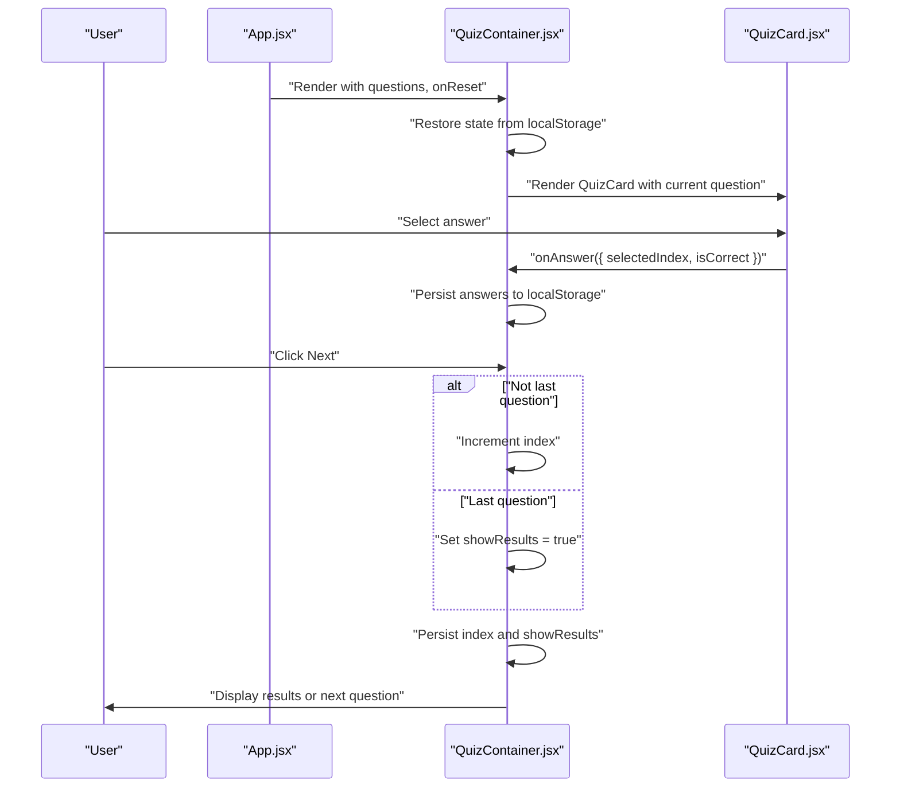
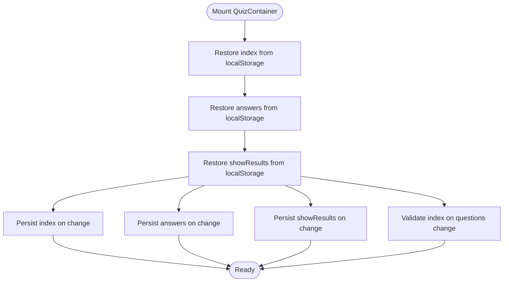
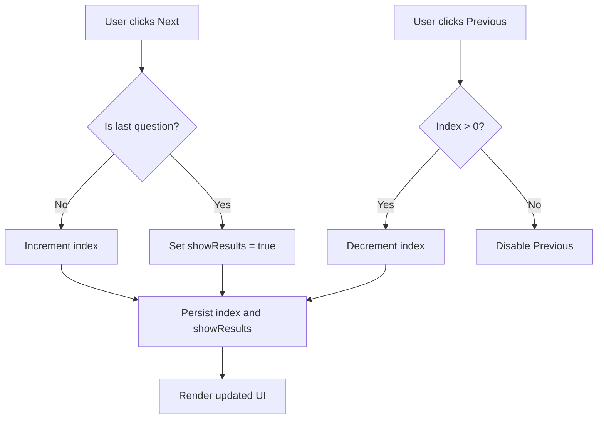
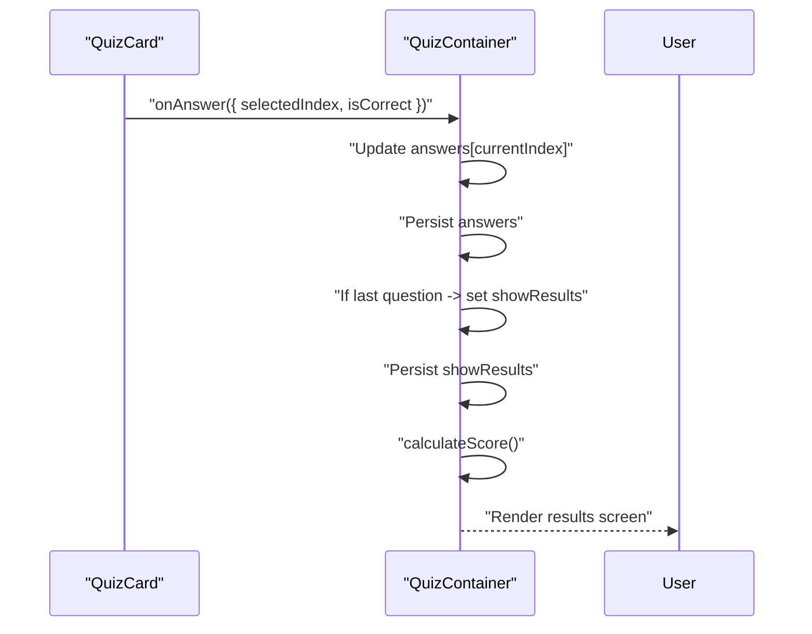
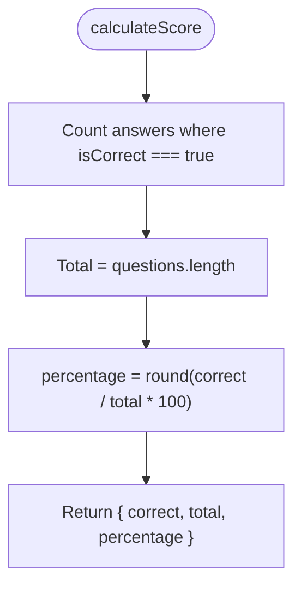
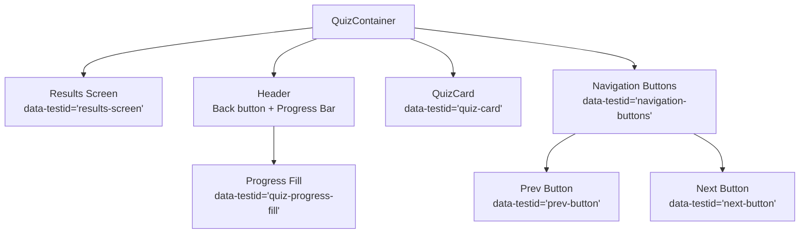
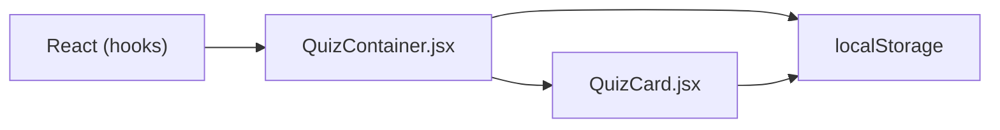

# QuizContainer Component

<cite>
**Referenced Files in This Document**
- [QuizContainer.jsx](file://frontend/src/components/QuizContainer.jsx)
- [QuizContainer.css](file://frontend/src/components/QuizContainer.css)
- [QuizCard.jsx](file://frontend/src/components/QuizCard.jsx)
- [QuizCard.css](file://frontend/src/components/QuizCard.css)
- [App.jsx](file://frontend/src/App.jsx)
- [README.md](file://README.md)
- [TESTING.md](file://TESTING.md)
</cite>

## Table of Contents
1. [Introduction](#introduction)
2. [Project Structure](#project-structure)
3. [Core Components](#core-components)
4. [Architecture Overview](#architecture-overview)
5. [Detailed Component Analysis](#detailed-component-analysis)
6. [Dependency Analysis](#dependency-analysis)
7. [Performance Considerations](#performance-considerations)
8. [Troubleshooting Guide](#troubleshooting-guide)
9. [Conclusion](#conclusion)
10. [Appendices](#appendices)

## Introduction
This document provides comprehensive documentation for the QuizContainer component, which orchestrates the interactive quiz experience after questions are generated. It explains how QuizContainer maintains quiz state (current question index, user answers, and results visibility) using React useState and persists it to localStorage. It also details the synchronization with localStorage via useEffect hooks, navigation logic (handleNext and handlePrevious), automatic results display upon completing the quiz, scoring calculation, rendering logic (results vs. current question), progress visualization, props contract, accessibility attributes and test IDs, responsive layout, integration patterns with QuizCard, and edge cases such as question array changes and localStorage quota considerations.

## Project Structure
The QuizContainer component resides in the frontend/src/components directory alongside QuizCard and their respective stylesheets. App.jsx integrates QuizContainer into the application lifecycle, managing question data and clearing localStorage on reset.

**Diagram sources**
- [App.jsx](file://frontend/src/App.jsx#L1-L90)
- [QuizContainer.jsx](file://frontend/src/components/QuizContainer.jsx#L1-L164)
- [QuizCard.jsx](file://frontend/src/components/QuizCard.jsx#L1-L101)
- [QuizContainer.css](file://frontend/src/components/QuizContainer.css#L1-L177)
- [QuizCard.css](file://frontend/src/components/QuizCard.css#L1-L162)

**Section sources**
- [App.jsx](file://frontend/src/App.jsx#L1-L90)
- [QuizContainer.jsx](file://frontend/src/components/QuizContainer.jsx#L1-L164)
- [QuizCard.jsx](file://frontend/src/components/QuizCard.jsx#L1-L101)
- [QuizContainer.css](file://frontend/src/components/QuizContainer.css#L1-L177)
- [QuizCard.css](file://frontend/src/components/QuizCard.css#L1-L162)

## Core Components
- QuizContainer: Central quiz controller that:
  - Initializes state from localStorage on mount
  - Synchronizes state to localStorage on updates
  - Validates and normalizes currentQuestionIndex when questions change
  - Manages navigation between questions and triggers results display
  - Computes scores and renders either results or the current question via QuizCard
  - Visualizes progress based on current position
- QuizCard: Renders a single question with options, answer selection, correctness feedback, and result messaging.

Key responsibilities:
- State management: currentQuestionIndex, answers[], showResults
- Persistence: localStorage keys for index, answers, and results flag
- Navigation: handleNext, handlePrevious
- Scoring: calculateScore
- Rendering: results screen or QuizCard with progress bar and nav buttons

**Section sources**
- [QuizContainer.jsx](file://frontend/src/components/QuizContainer.jsx#L1-L164)
- [QuizCard.jsx](file://frontend/src/components/QuizCard.jsx#L1-L101)

## Architecture Overview
The quiz flow is a unidirectional data flow:
- App.jsx provides questions and onReset callback
- QuizContainer holds and persists quiz state
- QuizCard renders the current question and reports user selections upward via onAnswer
- QuizContainer aggregates answers and controls navigation and results

**Diagram sources**
- [App.jsx](file://frontend/src/App.jsx#L44-L52)
- [QuizContainer.jsx](file://frontend/src/components/QuizContainer.jsx#L54-L158)
- [QuizCard.jsx](file://frontend/src/components/QuizCard.jsx#L20-L33)

## Detailed Component Analysis

### QuizContainer State and Lifecycle
- Initial state restoration:
  - currentQuestionIndex: restored from localStorage with bounds check against questions length
  - answers: restored from localStorage; defaults to empty array
  - showResults: restored from localStorage; defaults to false
- Synchronization with localStorage:
  - useEffect persists currentQuestionIndex
  - useEffect persists answers
  - useEffect persists showResults
- Question array change handling:
  - useEffect ensures currentQuestionIndex is valid when questions change

**Diagram sources**
- [QuizContainer.jsx](file://frontend/src/components/QuizContainer.jsx#L11-L52)
- [QuizContainer.jsx](file://frontend/src/components/QuizContainer.jsx#L29-L37)

**Section sources**
- [QuizContainer.jsx](file://frontend/src/components/QuizContainer.jsx#L11-L52)
- [QuizContainer.jsx](file://frontend/src/components/QuizContainer.jsx#L29-L37)

### Navigation Logic
- handleNext:
  - If not the last question, increments currentQuestionIndex
  - Otherwise sets showResults to true to display results
- handlePrevious:
  - Decrements currentQuestionIndex if not at the first question
- Button states:
  - Previous button disabled at index 0
  - Next button disabled until the current question is answered

**Diagram sources**
- [QuizContainer.jsx](file://frontend/src/components/QuizContainer.jsx#L62-L74)
- [QuizContainer.jsx](file://frontend/src/components/QuizContainer.jsx#L139-L155)

**Section sources**
- [QuizContainer.jsx](file://frontend/src/components/QuizContainer.jsx#L62-L74)
- [QuizContainer.jsx](file://frontend/src/components/QuizContainer.jsx#L139-L155)

### Answer Handling and Results Display
- handleAnswer:
  - Updates answers array at currentQuestionIndex with answerData
- Results screen:
  - When showResults is true, calculates score and renders results with onReset trigger
- Progress bar:
  - Visualized as a scaled X transform based on (currentQuestionIndex + 1) / questions.length

**Diagram sources**
- [QuizContainer.jsx](file://frontend/src/components/QuizContainer.jsx#L54-L60)
- [QuizContainer.jsx](file://frontend/src/components/QuizContainer.jsx#L62-L68)
- [QuizContainer.jsx](file://frontend/src/components/QuizContainer.jsx#L76-L83)
- [QuizContainer.jsx](file://frontend/src/components/QuizContainer.jsx#L120-L126)

**Section sources**
- [QuizContainer.jsx](file://frontend/src/components/QuizContainer.jsx#L54-L60)
- [QuizContainer.jsx](file://frontend/src/components/QuizContainer.jsx#L62-L68)
- [QuizContainer.jsx](file://frontend/src/components/QuizContainer.jsx#L76-L83)
- [QuizContainer.jsx](file://frontend/src/components/QuizContainer.jsx#L120-L126)

### Scoring Calculation
- calculateScore:
  - Counts correct answers from answers array
  - Returns an object with correct count, total questions, and percentage rounded to whole percent

**Diagram sources**
- [QuizContainer.jsx](file://frontend/src/components/QuizContainer.jsx#L76-L83)

**Section sources**
- [QuizContainer.jsx](file://frontend/src/components/QuizContainer.jsx#L76-L83)

### Rendering Logic and Progress Visualization
- Results screen:
  - When showResults is true, displays score circle, details, and reset button
- Current question:
  - Renders QuizCard with current question, question number, total questions, and savedAnswer
  - Progress bar scale based on current position
- Accessibility and test IDs:
  - data-testid attributes on container, results, progress bar, buttons, and card elements
  - Buttons disabled states reflect enabled/disabled conditions

**Diagram sources**
- [QuizContainer.jsx](file://frontend/src/components/QuizContainer.jsx#L85-L106)
- [QuizContainer.jsx](file://frontend/src/components/QuizContainer.jsx#L114-L157)
- [QuizContainer.jsx](file://frontend/src/components/QuizContainer.jsx#L120-L126)
- [QuizCard.jsx](file://frontend/src/components/QuizCard.jsx#L51-L94)

**Section sources**
- [QuizContainer.jsx](file://frontend/src/components/QuizContainer.jsx#L85-L106)
- [QuizContainer.jsx](file://frontend/src/components/QuizContainer.jsx#L114-L157)
- [QuizContainer.jsx](file://frontend/src/components/QuizContainer.jsx#L120-L126)
- [QuizCard.jsx](file://frontend/src/components/QuizCard.jsx#L51-L94)

### Props Contract
- questions: Array of question objects passed from App.jsx
- onReset: Callback invoked to reset the quiz and clear localStorage

Integration pattern:
- App.jsx sets questions and onReset, passing them down to QuizContainer

**Section sources**
- [App.jsx](file://frontend/src/App.jsx#L64-L74)
- [QuizContainer.jsx](file://frontend/src/components/QuizContainer.jsx#L9-L9)

### Accessibility Features, Test IDs, and Responsive Layout
- Accessibility:
  - Buttons disabled when not applicable (previous at index 0, next when not answered)
  - Clear visual feedback for correct/incorrect answers in QuizCard
- Test IDs:
  - Container: "quiz-container"
  - Results: "results-screen", "score-display", "reset-button"
  - Progress: "quiz-progress-bar", "quiz-progress-fill"
  - Navigation: "navigation-buttons", "prev-button", "next-button"
  - QuizCard: "quiz-card", "question-number", "question-text", "answers-container", "result-message"
  - Answer options: "answer-option-0", "answer-option-1", etc.
- Responsive layout:
  - Navigation buttons stack vertically on small screens
  - Results screen and card adapt to smaller widths

**Section sources**
- [QuizContainer.jsx](file://frontend/src/components/QuizContainer.jsx#L88-L106)
- [QuizContainer.jsx](file://frontend/src/components/QuizContainer.jsx#L114-L157)
- [QuizContainer.css](file://frontend/src/components/QuizContainer.css#L157-L177)
- [QuizCard.jsx](file://frontend/src/components/QuizCard.jsx#L51-L94)
- [QuizCard.css](file://frontend/src/components/QuizCard.css#L144-L161)

### Integration Patterns with QuizCard
- QuizContainer passes:
  - question: current question object
  - questionNumber: current index + 1
  - totalQuestions: questions.length
  - onAnswer: handler to update answers
  - savedAnswer: previously selected answer for the current question
- QuizCard:
  - Restores savedAnswer on mount and toggles result visibility
  - Disables options after result is shown
  - Calls onAnswer with answer metadata

**Section sources**
- [QuizContainer.jsx](file://frontend/src/components/QuizContainer.jsx#L129-L136)
- [QuizCard.jsx](file://frontend/src/components/QuizCard.jsx#L4-L18)
- [QuizCard.jsx](file://frontend/src/components/QuizCard.jsx#L20-L33)

### Edge Cases and Mitigations
- Question array changes during session:
  - useEffect validates currentQuestionIndex against new questions length and resets to 0 if out of bounds
- localStorage quota limitations:
  - QuizContainer stores small arrays and booleans; typical usage should not exceed quotas
  - App.jsx clears all quiz-related localStorage entries on reset
- Answer persistence across reloads:
  - State is restored from localStorage on mount and persisted on changes

**Section sources**
- [QuizContainer.jsx](file://frontend/src/components/QuizContainer.jsx#L29-L37)
- [App.jsx](file://frontend/src/App.jsx#L44-L52)

## Dependency Analysis
- Internal dependencies:
  - QuizContainer depends on QuizCard for rendering the current question
  - Both components depend on shared CSS for consistent styling
- External dependencies:
  - React hooks (useState, useEffect) for state and side effects
  - localStorage for persistence

**Diagram sources**
- [QuizContainer.jsx](file://frontend/src/components/QuizContainer.jsx#L1-L10)
- [QuizCard.jsx](file://frontend/src/components/QuizCard.jsx#L1-L4)

**Section sources**
- [QuizContainer.jsx](file://frontend/src/components/QuizContainer.jsx#L1-L10)
- [QuizCard.jsx](file://frontend/src/components/QuizCard.jsx#L1-L4)

## Performance Considerations
- State updates are minimal and localized to currentQuestionIndex and answers array
- useEffect runs only when tracked dependencies change, avoiding unnecessary writes
- Rendering is efficient: QuizCard re-renders only when props change; QuizContainer re-renders on state changes or when switching to results

[No sources needed since this section provides general guidance]

## Troubleshooting Guide
- State not restoring after reload:
  - Verify localStorage keys exist and are valid JSON
  - Confirm QuizContainer mounts before QuizCard to ensure index alignment
- Navigation disabled unexpectedly:
  - Ensure an answer is selected for the current question so Next is enabled
  - Previous is disabled at index 0 by design
- Results not showing:
  - Complete the last question; Next transitions to results automatically
- Reset not clearing state:
  - App.jsx removes all quiz-related localStorage keys on reset

**Section sources**
- [QuizContainer.jsx](file://frontend/src/components/QuizContainer.jsx#L11-L27)
- [QuizContainer.jsx](file://frontend/src/components/QuizContainer.jsx#L62-L74)
- [QuizContainer.jsx](file://frontend/src/components/QuizContainer.jsx#L85-L106)
- [App.jsx](file://frontend/src/App.jsx#L44-L52)

## Conclusion
QuizContainer centralizes quiz state management, persistence, and navigation while delegating question rendering to QuizCard. Its design ensures robust state restoration, intuitive navigation, and clear results presentation. The component’s integration with localStorage and QuizCard enables a seamless, responsive quiz experience with accessible UI and comprehensive test coverage.

[No sources needed since this section summarizes without analyzing specific files]

## Appendices

### Props Reference
- questions: Array of question objects
- onReset: Function to reset quiz and clear localStorage

**Section sources**
- [App.jsx](file://frontend/src/App.jsx#L64-L74)
- [QuizContainer.jsx](file://frontend/src/components/QuizContainer.jsx#L9-L9)

### Example: State Persistence Across Reloads
- On mount, QuizContainer restores currentQuestionIndex, answers, and showResults from localStorage
- On subsequent changes, QuizContainer persists these values back to localStorage
- App.jsx clears all quiz-related localStorage keys on reset

**Section sources**
- [QuizContainer.jsx](file://frontend/src/components/QuizContainer.jsx#L11-L27)
- [QuizContainer.jsx](file://frontend/src/components/QuizContainer.jsx#L39-L52)
- [App.jsx](file://frontend/src/App.jsx#L44-L52)

### Accessibility and Testing Notes
- QuizContainer and QuizCard include data-testid attributes for automated testing
- Tests in the repository cover navigation, localStorage persistence, and quiz flow

**Section sources**
- [QuizContainer.jsx](file://frontend/src/components/QuizContainer.jsx#L88-L106)
- [QuizContainer.jsx](file://frontend/src/components/QuizContainer.jsx#L114-L157)
- [QuizCard.jsx](file://frontend/src/components/QuizCard.jsx#L51-L94)
- [TESTING.md](file://TESTING.md#L1-L337)