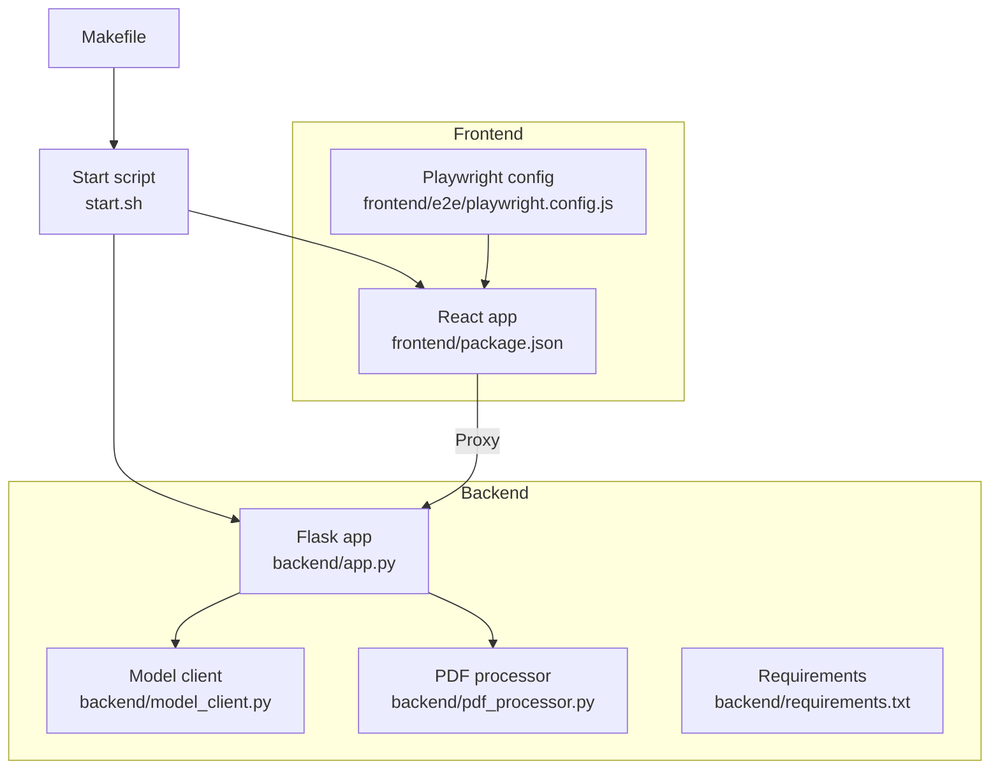
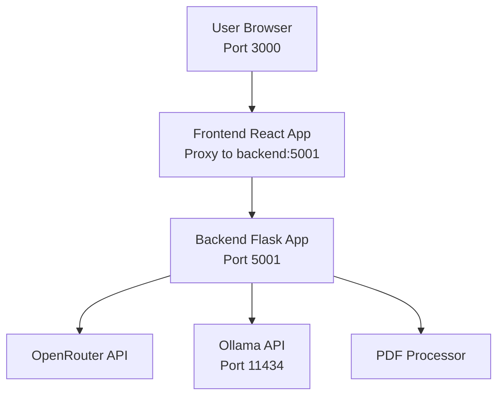
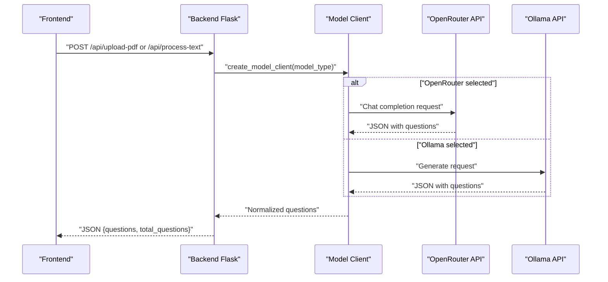
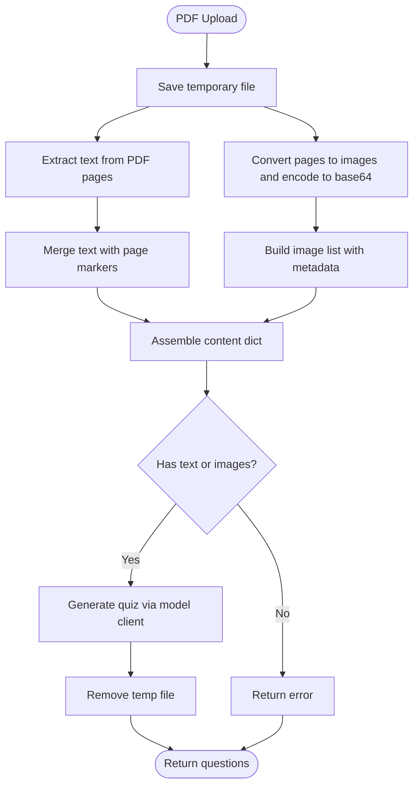
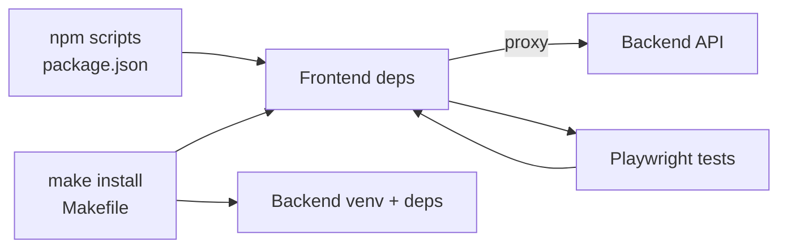

# Getting Started

<cite>
**Referenced Files in This Document**
- [README.md](file://README.md)
- [Makefile](file://Makefile)
- [start.sh](file://start.sh)
- [package.json](file://package.json)
- [backend/.env.example](file://backend/.env.example)
- [backend/requirements.txt](file://backend/requirements.txt)
- [backend/app.py](file://backend/app.py)
- [backend/model_client.py](file://backend/model_client.py)
- [backend/pdf_processor.py](file://backend/pdf_processor.py)
- [frontend/package.json](file://frontend/package.json)
- [frontend/e2e/playwright.config.js](file://frontend/e2e/playwright.config.js)
</cite>

## Table of Contents
1. [Introduction](#introduction)
2. [Project Structure](#project-structure)
3. [Core Components](#core-components)
4. [Architecture Overview](#architecture-overview)
5. [Detailed Component Analysis](#detailed-component-analysis)
6. [Dependency Analysis](#dependency-analysis)
7. [Performance Considerations](#performance-considerations)
8. [Troubleshooting Guide](#troubleshooting-guide)
9. [Conclusion](#conclusion)
10. [Appendices](#appendices)

## Introduction
This guide helps you set up and run the Quiz Generator application locally. It covers installing prerequisites, configuring environment variables, preparing dependencies, and launching the app. You will learn how to generate quizzes from PDFs or raw text using either cloud models (via OpenRouter) or a local model (via Ollama), and how to troubleshoot common setup issues.

## Project Structure
The project is organized into two main parts:
- backend: Python Flask server that processes PDFs and interacts with AI models
- frontend: React application that provides the user interface and integrates with the backend

Key files and roles:
- Makefile: Provides convenient commands for installation, startup, testing, and maintenance
- start.sh: A script to launch backend, frontend, and optionally Ollama automatically
- backend/app.py: Flask API endpoints for uploading PDFs, processing text, and returning generated quizzes
- backend/model_client.py: Abstraction layer for OpenRouter and Ollama clients
- backend/pdf_processor.py: Extracts text and images from PDFs
- frontend/package.json: React app scripts and proxy configuration
- frontend/e2e/playwright.config.js: E2E test configuration pointing to the frontend port

**Diagram sources**
- [Makefile](file://Makefile#L1-L94)
- [start.sh](file://start.sh#L1-L213)
- [backend/app.py](file://backend/app.py#L1-L176)
- [backend/model_client.py](file://backend/model_client.py#L1-L272)
- [backend/pdf_processor.py](file://backend/pdf_processor.py#L1-L77)
- [frontend/package.json](file://frontend/package.json#L1-L50)
- [frontend/e2e/playwright.config.js](file://frontend/e2e/playwright.config.js#L1-L77)

**Section sources**
- [README.md](file://README.md#L97-L128)
- [Makefile](file://Makefile#L1-L94)
- [start.sh](file://start.sh#L1-L213)
- [package.json](file://package.json#L1-L28)

## Core Components
- Backend (Python 3.8+): Flask server with CORS support, PDF processing utilities, and model clients for OpenRouter and Ollama
- Frontend (Node.js 16+): React app with proxy to backend and Playwright-based E2E tests
- Environment configuration: OPENROUTER_API_KEY for cloud models; optional Ollama setup for local models
- Poppler: Required for extracting images from PDFs

Prerequisites and verification:
- Python 3.8+: Verified by running the Python interpreter
- Node.js 16+: Verified by running the Node.js runtime
- OpenRouter API key: Optional; required for cloud model usage
- Ollama: Optional; required for local Mistral 7B usage
- Poppler: Required for image extraction from PDFs

**Section sources**
- [README.md](file://README.md#L13-L36)
- [README.md](file://README.md#L48-L59)
- [backend/requirements.txt](file://backend/requirements.txt#L1-L9)
- [backend/app.py](file://backend/app.py#L166-L173)

## Architecture Overview
The application consists of:
- Frontend React app running on port 3000
- Backend Flask app running on port 5001
- Optional Ollama service running on port 11434
- Proxy configured in the frontend to forward API requests to the backend

**Diagram sources**
- [frontend/package.json](file://frontend/package.json#L45-L46)
- [backend/app.py](file://backend/app.py#L1-L176)
- [backend/model_client.py](file://backend/model_client.py#L154-L261)
- [backend/pdf_processor.py](file://backend/pdf_processor.py#L1-L77)
- [start.sh](file://start.sh#L183-L204)

## Detailed Component Analysis

### Setting Up the Development Environment
Follow these steps to prepare your environment:

1. Install Python 3.8+
   - macOS: brew install python3 or download from python.org
   - Linux: sudo apt install python3 python3-pip (Ubuntu/Debian) or sudo yum install python3 python3-pip (CentOS/RHEL)
   - Windows: download installer from python.org
   - Verify: python3 --version

2. Install Node.js 16+
   - macOS: brew install node or download from nodejs.org
   - Linux: sudo apt install nodejs npm (Ubuntu/Debian) or use nvm
   - Windows: download installer from nodejs.org
   - Verify: node --version

3. Install system dependencies
   - Poppler (required for image extraction from PDFs)
     - macOS: brew install poppler
     - Linux: install poppler-utils or equivalent
     - Windows: install poppler binaries

4. Install project dependencies
   - From the repository root, run the installation command defined in the Makefile and package scripts:
     - make install
     - Alternatively, use npm run install:all

5. Configure environment variables
   - Create backend/.env with OPENROUTER_API_KEY=your_key (optional for cloud models)
   - For local Mistral 7B, install Ollama and pull the model:
     - Install Ollama from ollama.ai
     - Pull Mistral: ollama pull mistral
   - Optionally enable Ollama tests by setting ENABLE_OLLAMA_TESTS=true in backend/.env

6. Start the application
   - Option A: Use the Makefile command
     - make start
   - Option B: Use the convenience script
     - ./start.sh
   - Access the app at http://localhost:3000

7. Verify installation
   - make check
   - Run smoke tests to validate cloud or local model availability:
     - make test-smoke

**Section sources**
- [README.md](file://README.md#L13-L36)
- [README.md](file://README.md#L48-L59)
- [Makefile](file://Makefile#L14-L20)
- [Makefile](file://Makefile#L21-L28)
- [Makefile](file://Makefile#L37-L74)
- [package.json](file://package.json#L1-L28)
- [backend/.env.example](file://backend/.env.example#L1-L5)
- [start.sh](file://start.sh#L65-L164)

### Quick Start Example
Complete flow from cloning to running your first quiz:
1. Clone the repository and navigate to the project root
2. Install dependencies
   - make install
3. Configure environment
   - Create backend/.env with OPENROUTER_API_KEY=your_key (cloud) or install Ollama and pull Mistral (local)
   - Install poppler for image extraction
4. Start the app
   - make start
5. Open http://localhost:3000 in your browser
6. Upload a PDF or paste text, select number of questions (1–20), choose model (OpenRouter or Mistral 7B), and generate your quiz

**Section sources**
- [README.md](file://README.md#L38-L59)
- [Makefile](file://Makefile#L21-L28)
- [start.sh](file://start.sh#L183-L204)

### Backend API Workflow
The backend exposes endpoints for quiz generation:
- Upload PDF and generate quiz
- Process raw text and generate quiz
- Health check endpoint

**Diagram sources**
- [backend/app.py](file://backend/app.py#L59-L118)
- [backend/app.py](file://backend/app.py#L120-L164)
- [backend/model_client.py](file://backend/model_client.py#L62-L152)
- [backend/model_client.py](file://backend/model_client.py#L154-L261)

**Section sources**
- [backend/app.py](file://backend/app.py#L53-L164)
- [backend/model_client.py](file://backend/model_client.py#L263-L272)

### PDF Processing Logic
The backend extracts text and images from PDFs for quiz generation.

**Diagram sources**
- [backend/app.py](file://backend/app.py#L59-L118)
- [backend/pdf_processor.py](file://backend/pdf_processor.py#L1-L77)

**Section sources**
- [backend/pdf_processor.py](file://backend/pdf_processor.py#L1-L77)
- [backend/app.py](file://backend/app.py#L88-L107)

## Dependency Analysis
- Backend dependencies are defined in backend/requirements.txt and installed via the Makefile or package scripts
- Frontend dependencies are managed by npm and configured in frontend/package.json
- The frontend proxies API requests to the backend on port 5001
- E2E tests rely on Playwright and run against the frontend at port 3000

**Diagram sources**
- [package.json](file://package.json#L1-L28)
- [Makefile](file://Makefile#L21-L28)
- [frontend/package.json](file://frontend/package.json#L16-L27)
- [frontend/e2e/playwright.config.js](file://frontend/e2e/playwright.config.js#L27-L36)

**Section sources**
- [backend/requirements.txt](file://backend/requirements.txt#L1-L9)
- [frontend/package.json](file://frontend/package.json#L16-L27)
- [frontend/e2e/playwright.config.js](file://frontend/e2e/playwright.config.js#L27-L36)

## Performance Considerations
- Limit the number of questions to reduce token usage and generation time
- For OpenRouter, the backend sends a subset of text and images to optimize costs and latency
- For Ollama, ensure sufficient system resources; reduce question count if timeouts occur
- Use the proxy configuration to minimize cross-origin overhead during development

[No sources needed since this section provides general guidance]

## Troubleshooting Guide
Common setup issues and resolutions:

- Port conflicts
  - Backend runs on port 5001; frontend runs on port 3000
  - If ports are busy, stop conflicting services or adjust ports accordingly
  - Logs indicate which ports are used when starting via the script

- Missing dependencies
  - Python virtual environment not created: run make install or npm run install:backend
  - Node modules missing: run make install or npm run install:frontend
  - Poppler not installed: install poppler (brew install poppler on macOS)

- OpenRouter API key errors
  - Ensure backend/.env contains OPENROUTER_API_KEY
  - The backend warns if the key is missing at startup
  - Reduce question count or top up credits if you receive credit-related errors

- Ollama not available
  - Ensure Ollama is installed and running
  - Confirm the Ollama service is reachable on port 11434
  - Pull the Mistral model if not present
  - The script attempts to start Ollama automatically and logs any failures

- Smoke tests failing
  - Ensure backend is running before running smoke tests
  - Verify backend/.env contains either OPENROUTER_API_KEY or ENABLE_OLLAMA_TESTS=true
  - The Makefile smoke test reads these variables and passes them to Playwright

- PDF processing errors
  - Large PDFs or unsupported formats may cause extraction failures
  - Ensure the PDF contains text or images; otherwise, the backend returns an error

**Section sources**
- [Makefile](file://Makefile#L37-L74)
- [start.sh](file://start.sh#L106-L164)
- [backend/app.py](file://backend/app.py#L166-L173)
- [backend/model_client.py](file://backend/model_client.py#L154-L261)
- [frontend/e2e/playwright.config.js](file://frontend/e2e/playwright.config.js#L27-L36)

## Conclusion
You now have the essential steps to install prerequisites, configure environment variables, install dependencies, and run the Quiz Generator application. Use the Makefile for streamlined commands and the start.sh script for automatic orchestration of backend, frontend, and Ollama. If you encounter issues, consult the troubleshooting section and verify your environment variables and service availability.

[No sources needed since this section summarizes without analyzing specific files]

## Appendices

### Appendix A: Commands Reference
- Install all dependencies: make install
- Start the app: make start
- Check dependencies: make check
- Run smoke tests: make test-smoke
- Generate a test PDF: make generate-test-pdf
- Clean logs and caches: make clean
- Setup Git hooks: make setup-hooks

**Section sources**
- [Makefile](file://Makefile#L14-L94)

### Appendix B: Ports and Services
- Backend: http://localhost:5001
- Frontend: http://localhost:3000
- Ollama: http://localhost:11434

**Section sources**
- [start.sh](file://start.sh#L183-L204)
- [frontend/package.json](file://frontend/package.json#L45-L46)