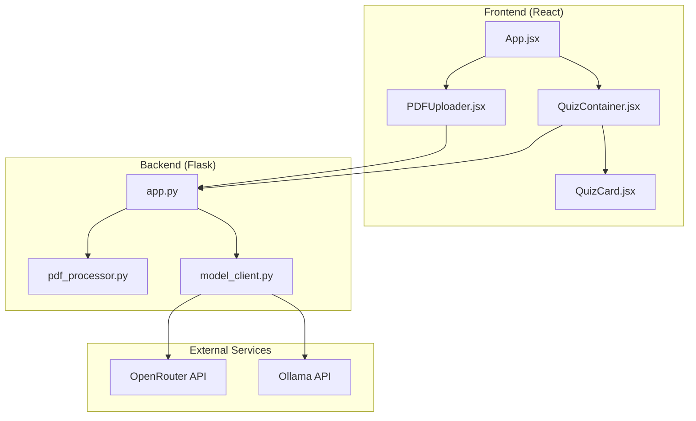
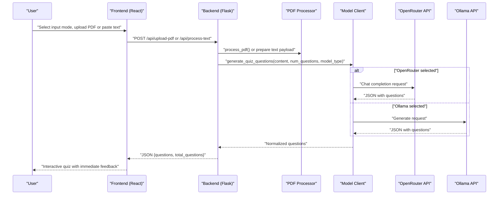
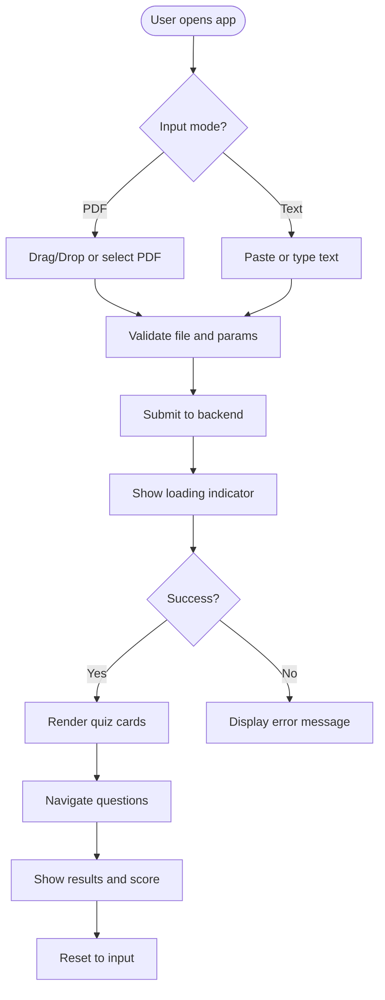
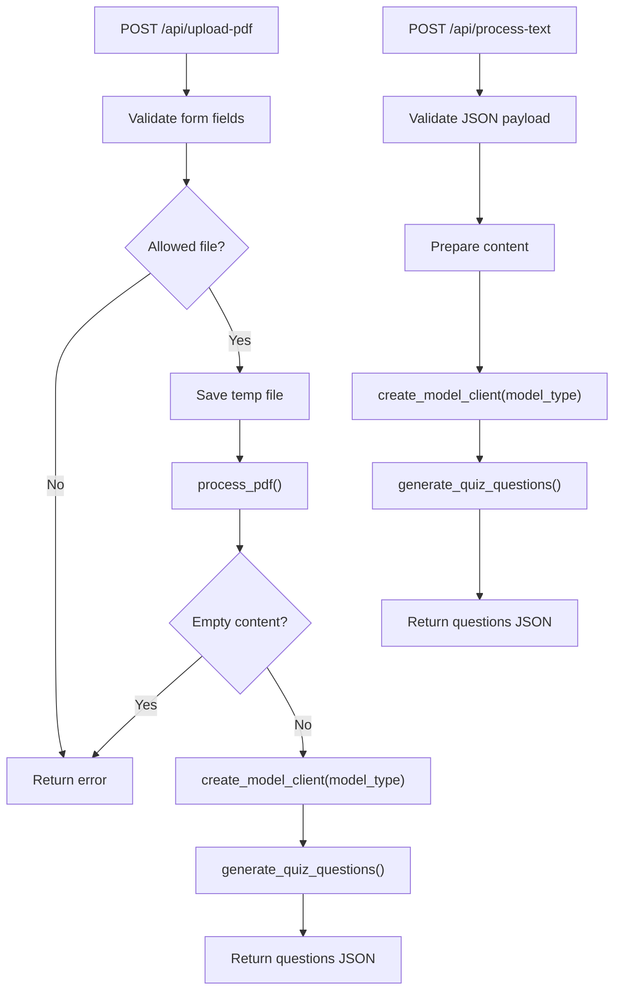
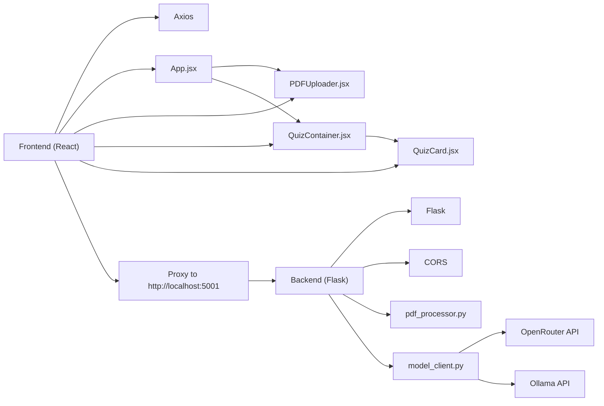

# System Overview

<cite>
**Referenced Files in This Document**
- [README.md](file://README.md)
- [Makefile](file://Makefile)
- [start.sh](file://start.sh)
- [backend/app.py](file://backend/app.py)
- [backend/pdf_processor.py](file://backend/pdf_processor.py)
- [backend/model_client.py](file://backend/model_client.py)
- [backend/requirements.txt](file://backend/requirements.txt)
- [backend/.env.example](file://backend/.env.example)
- [frontend/src/App.jsx](file://frontend/src/App.jsx)
- [frontend/src/components/PDFUploader.jsx](file://frontend/src/components/PDFUploader.jsx)
- [frontend/src/components/QuizContainer.jsx](file://frontend/src/components/QuizContainer.jsx)
- [frontend/src/components/QuizCard.jsx](file://frontend/src/components/QuizCard.jsx)
- [frontend/package.json](file://frontend/package.json)
</cite>

## Table of Contents
1. [Introduction](#introduction)
2. [Project Structure](#project-structure)
3. [Core Components](#core-components)
4. [Architecture Overview](#architecture-overview)
5. [Detailed Component Analysis](#detailed-component-analysis)
6. [Dependency Analysis](#dependency-analysis)
7. [Performance Considerations](#performance-considerations)
8. [Troubleshooting Guide](#troubleshooting-guide)
9. [Conclusion](#conclusion)
10. [Appendices](#appendices)

## Introduction
The Quiz Generator is a full-stack web application designed to help educators, students, and trainers quickly create interactive quizzes from PDF documents or raw text input. It integrates AI-powered question generation using two distinct model backends:
- OpenRouter API (cloud-based GPT-4o-mini/GPT-4o) for fast, scalable generation with image support
- Local Mistral 7B via Ollama for privacy-first, offline generation

Key capabilities include:
- Drag-and-drop PDF upload and text input modes
- Dual AI model selection within the UI
- Interactive quiz interface with immediate feedback and scoring
- Persistent state via local storage for a seamless user experience

Primary use cases:
- Educators: Generate assessments from lecture slides or research papers
- Students: Practice with personalized quizzes derived from study materials
- Trainers: Rapidly prototype knowledge checks for workshops or courses

## Project Structure
The project follows a clear separation of concerns:
- Frontend (React): Handles user interaction, state management, and quiz presentation
- Backend (Flask): Provides REST endpoints for PDF/text processing and AI model orchestration
- Shared workflows: PDF parsing, model abstraction, and standardized question normalization



**Diagram sources**
- [frontend/src/App.jsx](file://frontend/src/App.jsx#L1-L90)
- [frontend/src/components/PDFUploader.jsx](file://frontend/src/components/PDFUploader.jsx#L1-L323)
- [frontend/src/components/QuizContainer.jsx](file://frontend/src/components/QuizContainer.jsx#L1-L164)
- [frontend/src/components/QuizCard.jsx](file://frontend/src/components/QuizCard.jsx#L1-L101)
- [backend/app.py](file://backend/app.py#L1-L176)
- [backend/pdf_processor.py](file://backend/pdf_processor.py#L1-L77)
- [backend/model_client.py](file://backend/model_client.py#L1-L272)

**Section sources**
- [README.md](file://README.md#L97-L129)
- [frontend/package.json](file://frontend/package.json#L45-L46)
- [backend/requirements.txt](file://backend/requirements.txt#L1-L9)

## Core Components
- Frontend entry and routing:
  - App orchestrates state (questions, loading, errors) and toggles between input and quiz views
  - PDFUploader manages input modes (PDF vs text), validation, and API submission
  - QuizContainer coordinates navigation, persistence, and results display
  - QuizCard renders individual questions, tracks answers, and shows correctness feedback

- Backend endpoints:
  - Health check endpoint for service readiness
  - PDF upload endpoint: validates file, extracts text/images, and delegates to model client
  - Text processing endpoint: accepts raw text, validates parameters, and delegates to model client

- Model abstraction:
  - OpenRouterClient: uses OpenRouter API with GPT-4o-mini/GPT-4o depending on image presence
  - OllamaClient: uses local Mistral 7B via Ollama API with robust error handling
  - Normalization: ensures consistent question format and correct-answer indexing

- PDF processing:
  - Extracts text with page markers and converts pages to images for multimodal prompts
  - Returns structured content to the model client

**Section sources**
- [frontend/src/App.jsx](file://frontend/src/App.jsx#L1-L90)
- [frontend/src/components/PDFUploader.jsx](file://frontend/src/components/PDFUploader.jsx#L1-L323)
- [frontend/src/components/QuizContainer.jsx](file://frontend/src/components/QuizContainer.jsx#L1-L164)
- [frontend/src/components/QuizCard.jsx](file://frontend/src/components/QuizCard.jsx#L1-L101)
- [backend/app.py](file://backend/app.py#L53-L164)
- [backend/pdf_processor.py](file://backend/pdf_processor.py#L1-L77)
- [backend/model_client.py](file://backend/model_client.py#L1-L272)

## Architecture Overview
The system is API-driven and stateless at the backend:
- Frontend sends requests to /api/upload-pdf or /api/process-text
- Backend validates inputs, processes PDFs or text, and delegates to the appropriate model client
- Model clients communicate with external AI services and return normalized questions
- Frontend persists quiz state locally and renders an interactive quiz experience



**Diagram sources**
- [frontend/src/components/PDFUploader.jsx](file://frontend/src/components/PDFUploader.jsx#L50-L110)
- [backend/app.py](file://backend/app.py#L59-L164)
- [backend/pdf_processor.py](file://backend/pdf_processor.py#L64-L77)
- [backend/model_client.py](file://backend/model_client.py#L62-L152)
- [backend/model_client.py](file://backend/model_client.py#L154-L261)

## Detailed Component Analysis

### Frontend: App and Input Flow
- App manages:
  - Loading/error states
  - Persistence of questions and quiz progress
  - Resetting state and clearing local storage
- PDFUploader handles:
  - Mode switching (PDF/text)
  - Drag-and-drop and file selection
  - Validation for question count and model selection
  - Submission to backend endpoints
- QuizContainer and QuizCard manage:
  - Navigation and progress
  - Answer persistence and correctness display
  - Results screen with score calculation



**Diagram sources**
- [frontend/src/components/PDFUploader.jsx](file://frontend/src/components/PDFUploader.jsx#L1-L323)
- [frontend/src/components/QuizContainer.jsx](file://frontend/src/components/QuizContainer.jsx#L1-L164)
- [frontend/src/components/QuizCard.jsx](file://frontend/src/components/QuizCard.jsx#L1-L101)

**Section sources**
- [frontend/src/App.jsx](file://frontend/src/App.jsx#L1-L90)
- [frontend/src/components/PDFUploader.jsx](file://frontend/src/components/PDFUploader.jsx#L1-L323)
- [frontend/src/components/QuizContainer.jsx](file://frontend/src/components/QuizContainer.jsx#L1-L164)
- [frontend/src/components/QuizCard.jsx](file://frontend/src/components/QuizCard.jsx#L1-L101)

### Backend: Endpoints and Processing Pipeline
- Health check endpoint confirms service availability
- PDF upload endpoint:
  - Validates file type and size
  - Saves temporary file, processes PDF, validates content, and generates questions
- Text processing endpoint:
  - Validates JSON payload, prepares content, and generates questions
- Parameter validation enforces:
  - Positive number of questions up to a configured maximum
  - Supported model types



**Diagram sources**
- [backend/app.py](file://backend/app.py#L59-L164)
- [backend/pdf_processor.py](file://backend/pdf_processor.py#L64-L77)
- [backend/model_client.py](file://backend/model_client.py#L263-L271)

**Section sources**
- [backend/app.py](file://backend/app.py#L53-L164)
- [backend/pdf_processor.py](file://backend/pdf_processor.py#L1-L77)
- [backend/model_client.py](file://backend/model_client.py#L1-L272)

### Model Abstraction: OpenRouter and Ollama Clients
- OpenRouterClient:
  - Uses OpenRouter API with GPT-4o-mini when text only, GPT-4o when images present
  - Applies prompt constraints and token limits
  - Extracts and parses JSON from model responses
- OllamaClient:
  - Validates Ollama availability and model presence
  - Sends prompts with controlled token limits
  - Robust error handling for timeouts, missing models, and parsing failures
- Both clients normalize questions to a consistent format and ensure correct-answer indices

```mermaid
classDiagram
class ModelClient {
+generate_quiz_questions(pdf_content, num_questions) Dict[]
}
class OpenRouterClient {
+generate_quiz_questions(pdf_content, num_questions) Dict[]
}
class OllamaClient {
+generate_quiz_questions(pdf_content, num_questions) Dict[]
-_check_ollama_available() bool
}
class create_model_client(model_type) ModelClient
ModelClient <|-- OpenRouterClient
ModelClient <|-- OllamaClient
create_model_client --> OpenRouterClient : "openrouter"
create_model_client --> OllamaClient : "ollama-mistral"
```

**Diagram sources**
- [backend/model_client.py](file://backend/model_client.py#L53-L152)
- [backend/model_client.py](file://backend/model_client.py#L154-L261)
- [backend/model_client.py](file://backend/model_client.py#L263-L271)

**Section sources**
- [backend/model_client.py](file://backend/model_client.py#L1-L272)

## Dependency Analysis
- Frontend depends on:
  - Axios for HTTP requests to the backend proxy
  - React for component rendering and state management
  - Playwright for E2E testing (dev)
- Backend depends on:
  - Flask for routing and CORS
  - pdfplumber and pdf2image for PDF parsing and image extraction
  - OpenAI client for OpenRouter API
  - httpx for Ollama API calls
  - python-dotenv for environment configuration



**Diagram sources**
- [frontend/package.json](file://frontend/package.json#L45-L46)
- [frontend/src/App.jsx](file://frontend/src/App.jsx#L1-L90)
- [frontend/src/components/PDFUploader.jsx](file://frontend/src/components/PDFUploader.jsx#L1-L323)
- [frontend/src/components/QuizContainer.jsx](file://frontend/src/components/QuizContainer.jsx#L1-L164)
- [frontend/src/components/QuizCard.jsx](file://frontend/src/components/QuizCard.jsx#L1-L101)
- [backend/app.py](file://backend/app.py#L1-L176)
- [backend/pdf_processor.py](file://backend/pdf_processor.py#L1-L77)
- [backend/model_client.py](file://backend/model_client.py#L1-L272)

**Section sources**
- [frontend/package.json](file://frontend/package.json#L1-L50)
- [backend/requirements.txt](file://backend/requirements.txt#L1-L9)

## Performance Considerations
- PDF processing:
  - Text extraction and image conversion can be memory-intensive for large documents
  - Image payload is limited for cloud models to reduce token usage
- Model selection:
  - OpenRouter: smaller context windows and token limits; suitable for quick generation
  - Ollama: larger text capacity; may require more time for longer inputs
- Frontend UX:
  - Local storage reduces reload latency
  - Progress bar and immediate feedback improve perceived performance

[No sources needed since this section provides general guidance]

## Troubleshooting Guide
Common issues and resolutions:
- Missing environment variables:
  - Ensure backend .env contains the OpenRouter API key when using cloud models
- Ollama not available:
  - Verify Ollama server is running and the Mistral model is pulled
- PDF processing errors:
  - Confirm poppler installation for image extraction
- Backend startup warnings:
  - The backend prints a warning if the OpenRouter API key is not set; local model mode still works
- Makefile smoke tests:
  - Ensure backend/.env contains either the OpenRouter API key or the Ollama enable flag for E2E smoke tests

**Section sources**
- [backend/app.py](file://backend/app.py#L166-L172)
- [Makefile](file://Makefile#L37-L74)
- [README.md](file://README.md#L48-L57)

## Conclusion
The Quiz Generator delivers a streamlined, API-driven solution for creating interactive quizzes from PDFs or text. Its modular architecture separates frontend UX from backend processing, while the model abstraction cleanly supports both cloud and local AI backends. Beginners can start quickly using the provided Makefile and start.sh scripts, and advanced users can customize environment variables and deployment configurations.

[No sources needed since this section summarizes without analyzing specific files]

## Appendices

### Technology Stack and Deployment Workflow
- Frontend: React, Axios, Playwright (E2E)
- Backend: Flask, pdfplumber, pdf2image, OpenAI client, httpx, python-dotenv
- Dev tools: Makefile, Git hooks, GitHub Actions
- Deployment:
  - Use Makefile targets for installation, start, test, and cleanup
  - Use start.sh to launch Ollama (if available), backend, and frontend concurrently

**Section sources**
- [README.md](file://README.md#L131-L149)
- [Makefile](file://Makefile#L1-L94)
- [start.sh](file://start.sh#L1-L213)
- [backend/requirements.txt](file://backend/requirements.txt#L1-L9)
- [frontend/package.json](file://frontend/package.json#L1-L50)

### Setup Instructions for Beginners
- Install prerequisites:
  - Python 3.8+, Node.js 16+
  - Optional: OpenRouter API key, Ollama, poppler
- Install dependencies:
  - Run the Makefile install target from the repository root
- Configure environment:
  - Create backend/.env with the OpenRouter API key if using cloud models
  - For local Mistral, install Ollama and pull the Mistral model
- Run the application:
  - Use the Makefile start target or the start.sh script
  - Access the app at http://localhost:3000

**Section sources**
- [README.md](file://README.md#L13-L26)
- [README.md](file://README.md#L48-L60)
- [Makefile](file://Makefile#L21-L28)
- [start.sh](file://start.sh#L65-L164)